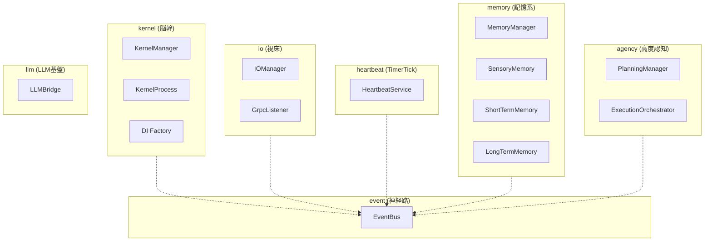
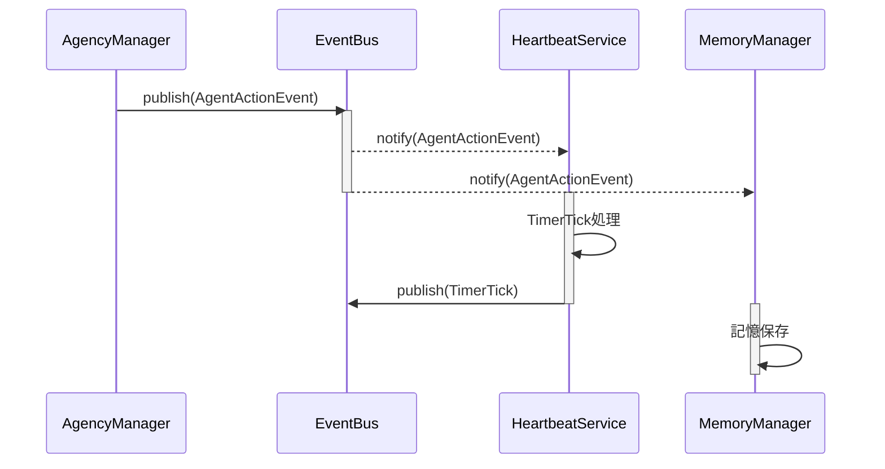

# Iris Visualize Skill

Irisの層アーキテクチャやEventBusによる疎結合設計を正しく表現し、Mermaidの構文チェックおよびレンダリングを行う。

---

## 1. Mermaidシンタックス検証方法

記述したMermaidコードに構文エラーがないか検証する。

### A. CLIによる検証 (最速・推奨)
`npx` を使って構文エラーがないかを検証する（Windows環境では `NUL` 出力先を使用して画像出力をスキップする）。
```powershell
npx -y @mermaid-js/mermaid-cli -i <対象ファイル.mmd> -o temp.svg
# 検証完了後に生成された temp.svg は削除してよい。
```
*※ 正常終了（終了コード0）なら構文は正しい。エラーがある場合はエラー箇所と詳細が出力される。*

### B. レンダリングによる検証
既存のレンダリングスクリプトを実行し、エラーが発生しないか確認する。
```powershell
node scripts/render.mjs --input <対象ファイル.mmd>
```

---

## 2. レンダリングコマンド

### SVGレンダリング (ドキュメント用)
```powershell
node scripts/render.mjs --input diagram.mmd --output diagram.svg --theme tokyo-night
```
- **推奨テーマ**: `tokyo-night` (ダークモード用), `github-light` (ライトモード用)

### ASCIIレンダリング (README・ターミナル表示用)
```powershell
node scripts/render.mjs --input diagram.mmd --format ascii --use-ascii
```

---

## 3. Iris特化型 Mermaid テンプレート

### A. 層アーキテクチャ図 (flowchart)
各層の境界と、EventBusを介した疎結合な関係性を示すための標準構成。



### B. EventBus 連携シーケンス図 (sequenceDiagram)
イベント発行と各層の並列処理を示すための標準構成。



---

## 4. トラブルシューティング

- **Syntax Errorでビルド失敗**:
  - `A --> B` などの矢印の間にスペースがあるか確認。
  - クラス図の型指定で `<` や `>` などの特殊文字を使用する場合はエンコードするか、ダブルクォーテーションで囲む。
- **beautiful-mermaid モジュールエラー**:
  - `.agents/skills/iris-visualize/` ディレクトリ内で `npm install` を実行する。
