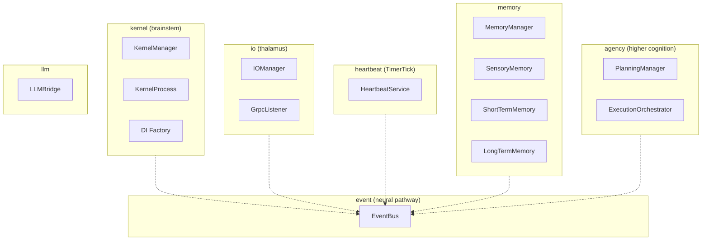
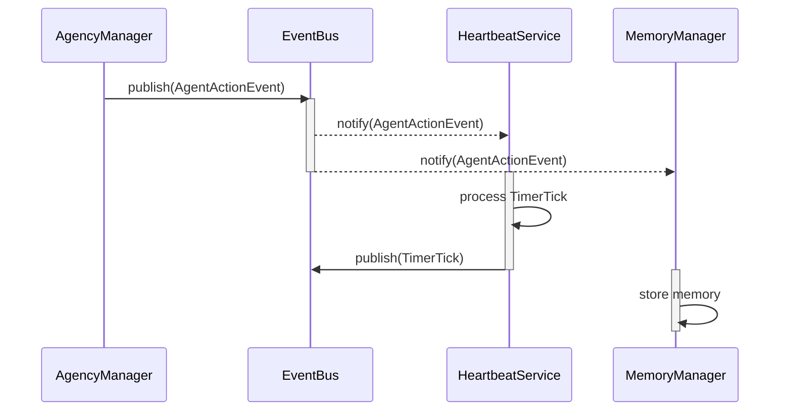

# Iris Visualize Skill

Represent Iris layer architecture and the loosely coupled EventBus design accurately, then validate and render Mermaid syntax.

---

## 1. Mermaid Syntax Validation

Validate Mermaid code for syntax errors.

### A. CLI validation, fastest and recommended

Use `npx` to check for syntax errors. On Windows, use a `NUL` output destination when you want to skip image output.

```powershell
npx -y @mermaid-js/mermaid-cli -i <target-file.mmd> -o temp.svg
# Delete generated temp.svg after validation if it is not needed.
```

A successful exit code `0` means the syntax is valid. If errors exist, the command prints the location and details.

### B. Validation by rendering

Run the existing render script and confirm that no error occurs.

```powershell
node scripts/render.mjs --input <target-file.mmd>
```

---

## 2. Rendering Commands

### SVG rendering for documentation

```powershell
node scripts/render.mjs --input diagram.mmd --output diagram.svg --theme tokyo-night
```

- Recommended themes: `tokyo-night` for dark mode, `github-light` for light mode.

### ASCII rendering for README / terminal output

```powershell
node scripts/render.mjs --input diagram.mmd --format ascii --use-ascii
```

---

## 3. Iris-specific Mermaid Templates

### A. Layer architecture diagram, flowchart

Standard structure for showing layer boundaries and loosely coupled relationships through EventBus.


```mermaid
flowchart TB
    subgraph KernelLayer["kernel (brainstem)"]
        manager["KernelManager"]
        process["KernelProcess"]
        factory["DI Factory"]
    end
    subgraph IoLayer["io (thalamus)"]
        io_mgr["IOManager"]
        grpc["GrpcListener"]
    end
    subgraph EventLayer["event (neural pathway)"]
        bus["EventBus"]
    end
    subgraph HeartbeatLayer["heartbeat (TimerTick)"]
        hb_svc["HeartbeatService"]
    end
    subgraph MemoryLayer["memory"]
        mem_mgr["MemoryManager"]
        sensory["SensoryMemory"]
        stm["ShortTermMemory"]
        ltm["LongTermMemory"]
    end
    subgraph AgencyLayer["agency (higher cognition)"]
        planning["PlanningManager"]
        execution["ExecutionOrchestrator"]
    end
    subgraph LlmLayer["llm"]
        bridge["LLMBridge"]
    end

    %% Dependencies through EventBus for loose coupling
    KernelLayer -.-> bus
    IoLayer -.-> bus
    HeartbeatLayer -.-> bus
    MemoryLayer -.-> bus
    AgencyLayer -.-> bus
```

### B. EventBus integration sequence diagram

Standard structure for showing event publication and parallel processing by layers.


```mermaid
sequenceDiagram
    participant A as AgencyManager
    participant E as EventBus
    participant H as HeartbeatService
    participant M as MemoryManager

    A->>E: publish(AgentActionEvent)
    activate E
    E-->>H: notify(AgentActionEvent)
    E-->>M: notify(AgentActionEvent)
    deactivate E

    activate H
    H->>H: process TimerTick
    H->>E: publish(TimerTick)
    deactivate H

    activate M
    M->>M: store memory
    deactivate M
```

---

## 4. Troubleshooting

- **Build fails with Syntax Error**:
  - Check whether arrows have proper spacing, such as `A --> B`.
  - When using special characters such as `<` or `>` in class diagram type annotations, encode them or wrap them in double quotes.
- **beautiful-mermaid module error**:
  - Run `npm install` inside `.agents/skills/iris-visualize/`.
