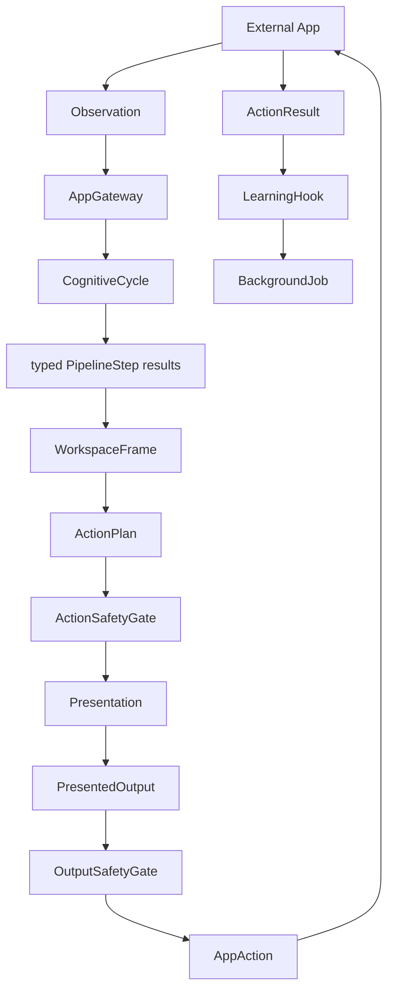
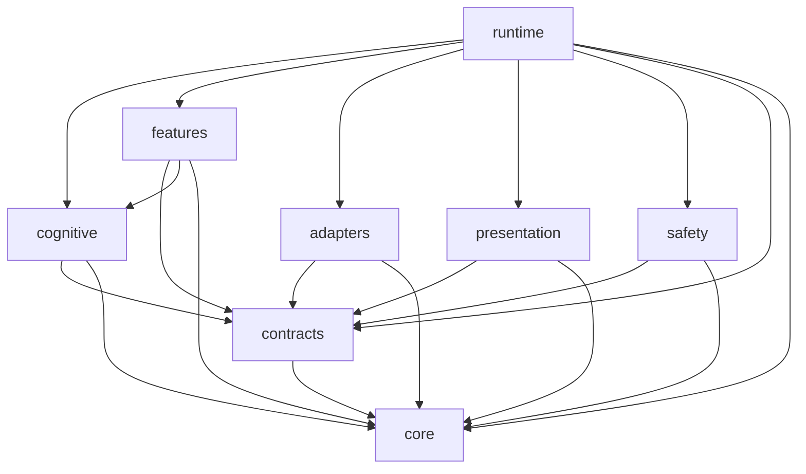

# Iris Visualize Skill

Represent Iris diagrams according to the relevant architecture source of truth. For v1.2.1 migration diagrams, use `docs/architecture/cognitive-runtime-v1.2.1.md` and show Cognitive Runtime flow instead of the old EventBus-centered layout.

---

## 1. Mermaid Syntax Validation

Validate Mermaid code for syntax errors.

### A. CLI validation, fastest and recommended

Use `npx` to check for syntax errors. On Windows, use a `NUL` output destination when you want to skip image output.

```powershell
npx -y @mermaid-js/mermaid-cli -i <target-file.mmd> -o temp.svg
# Delete generated temp.svg after validation if it is not needed.
```

A successful exit code `0` means the syntax is valid. If errors exist, the command prints the location and details.

### B. Validation by rendering

Run the existing render script and confirm that no error occurs.

```powershell
node scripts/render.mjs --input <target-file.mmd>
```

---

## 2. Rendering Commands

### SVG rendering for documentation

```powershell
node scripts/render.mjs --input diagram.mmd --output diagram.svg --theme tokyo-night
```

- Recommended themes: `tokyo-night` for dark mode, `github-light` for light mode.

### ASCII rendering for README / terminal output

```powershell
node scripts/render.mjs --input diagram.mmd --format ascii --use-ascii
```

---

## 3. Iris-specific Mermaid Templates

### A. Cognitive Runtime flow, v1.2.1

Use this for the target migration architecture.


```mermaid
flowchart TB
    ext["External App"]
    obs["Observation"]
    gateway["AppGateway"]
    cycle["CognitiveCycle"]
    results["typed PipelineStep results"]
    frame["WorkspaceFrame"]
    plan["ActionPlan"]
    action_gate["ActionSafetyGate"]
    presenter["Presentation"]
    output["PresentedOutput"]
    output_gate["OutputSafetyGate"]
    app_action["AppAction"]
    action_result["ActionResult"]
    learning["LearningHook"]
    jobs["BackgroundJob"]

    ext --> obs --> gateway --> cycle --> results --> frame --> plan
    plan --> action_gate --> presenter --> output --> output_gate --> app_action --> ext
    ext --> action_result --> learning --> jobs
```

### B. Target layer dependency diagram, v1.2.1


```mermaid
flowchart TB
    core["core"]
    contracts["contracts"]
    cognitive["cognitive"]
    presentation["presentation"]
    safety["safety"]
    adapters["adapters"]
    features["features"]
    runtime["runtime"]

    contracts --> core
    cognitive --> contracts
    cognitive --> core
    presentation --> contracts
    presentation --> core
    safety --> contracts
    safety --> core
    adapters --> contracts
    adapters --> core
    features --> contracts
    features --> cognitive
    features --> core
    runtime --> cognitive
    runtime --> features
    runtime --> adapters
    runtime --> presentation
    runtime --> safety
    runtime --> contracts
    runtime --> core
```

### C. Legacy EventBus diagrams

Use old EventBus-centered diagrams only when the user explicitly asks for legacy architecture documentation or pre-migration behavior. Do not use them to explain the v1.2.1 target architecture.

---

## 4. Troubleshooting

- **Build fails with Syntax Error**:
  - Check whether arrows have proper spacing, such as `A --> B`.
  - When using special characters such as `<` or `>` in class diagram type annotations, encode them or wrap them in double quotes.
- **beautiful-mermaid module error**:
  - Run `npm install` inside `.agents/skills/iris-visualize/`.
