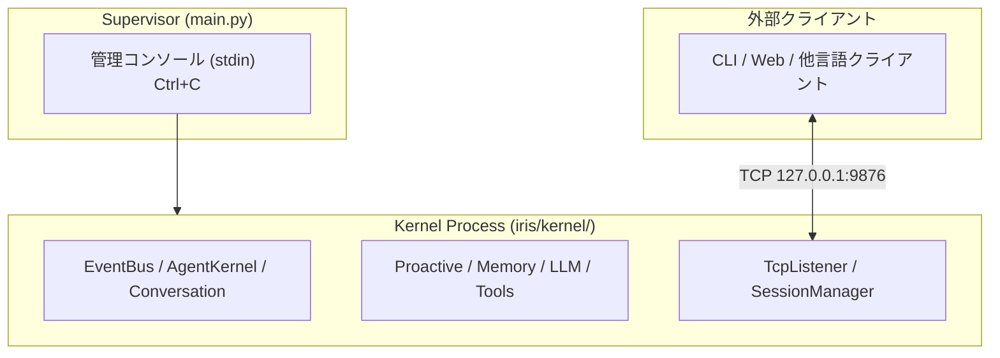

# Iris — Autonomous AI Assistant

Iris は自律的に行動・進化できるAIアシスタントです。Python 製で Ollama または OpenRouter 上で動作し、Reflexion ループによる自己改善、ツール基盤による動的機能拡張、3層ガバナンスによる自律発話を特徴とします。

## アーキテクチャ

Iris は **Supervisor** と **Kernel Process** の2層構成です。



- **Supervisor** — Kernel プロセスの起動・監視・管理コンソール (`main.py`)
- **Kernel Process** — 自律エージェントのビジネスロジック (`iris/kernel/`)
- **TCP** — 外部クライアントから Kernel を制御する公開インターフェース。認証・入力・出力を1ポートで多重化

シャットダウンは Supervisor の管理コンソール (`/shutdown`) または Ctrl+C で行う。
TCP 経由でも `/shutdown` コマンドを送信可能。

詳細な設計は [`docs/`](./docs/README.md) を参照。

## 機能

- **LLM 会話** — Ollama / OpenRouter 経由でローカルまたはクラウド LLM と会話
- **自律発話 (ProactiveEngine)** — 3層ガバナンス (Tier1 自動 / Tier2 LLM自己判断 / Tier3 AgentKernel介入)
- **Reflexion 自己改善** — 会話後に自己反省し、行動を改善
- **動的ツール拡張** — 実行時にツールを追加可能
- **記憶システム** — エピソード記憶 (JSONL)、意味記憶 (ChromaDB + BM25 ハイブリッド検索)、動的パーソナリティ
- **会話履歴圧縮** — ContextManager が token window 超過時に自動要約
- **スラッシュコマンド** — `/help`, `/sleep`, `/wakeup`, `/compact`, `/clear`, `/status`, `/reflect`
- **シングル / マルチモデルモード** — 設定したモデル数に応じて自動切替

## クイックスタート

### 必要条件

- Python 3.13+
- Ollama (ローカル LLM 利用時) — `qwen3.5:9b` 等のモデルを事前に pull
- OpenRouter API Key (OpenRouter 利用時)

### インストール

```powershell
# リポジトリをクローン
git clone https://github.com/your-org/iris-kernel.git
cd iris-kernel

# 仮想環境を作成
python -m venv .venv
.venv\Scripts\Activate.ps1

# 依存関係をインストール
pip install -e .
pip install -e ".[dev]"   # 開発用依存 (ruff, mypy, pytest...)
```

### 設定

1. `config.yaml` でプロバイダーとモデルを設定

```yaml
model:
  provider: ollama              # "ollama" or "openrouter"
  base_url: http://localhost:11434
  models:
    - name: qwen3.5:9b
      roles: [default]
session:
  host: 127.0.0.1
  port: 9876
  access_token: ""              # 空文字の場合は検証スキップ
```

2. OpenRouter 利用時は `.env` ファイルを作成

```env
OPENROUTER_API_KEY=sk-or-...
```

### 起動

```powershell
python main.py                          # Supervisor 起動
python main.py --verbose                # 診断ログを stderr に出力
```

## プロジェクト構成

```
iris-kernel/
├── .agents/                     # コーディングエージェント用導線・Skills
├── .iris/                       # 設定・データ
│   ├── config/personality_default.md
│   └── data/                    # 記憶データ (runtime generated)
├── docs/                        # 設計ドキュメント
│   └── adr/                     # Architecture Decision Records
├── iris/                        # アプリケーションコア
│   ├── kernel/                  # ドメイン層
│   │   ├── core/                # AgentKernel, KernelProcess, Factory
│   │   ├── event/               # EventBus
│   │   ├── io/                  # TcpListener, SessionManager, Authenticator, models
│   │   └── services/            # Conversation, Proactive, LLMPipeline, Reflexion, etc.
│   ├── llm/                     # LLM通信 (LLMBridge, OllamaProvider, OpenRouterProvider)
│   ├── memory/                  # 記憶管理 (stores, vector_store, persona)
│   ├── tools/                   # @tool, ToolRegistry, ビルトイン実装
│   ├── commands/                # スラッシュコマンド処理
│   └── personality/             # プロンプト管理
├── tests/                       # テストスイート (249 tests, ~8秒)
├── config.yaml                  # Iris 設定ファイル
└── main.py                      # Supervisor エントリーポイント
```

## 開発

### lint / typecheck / test

```powershell
ruff check .                          # lint
ruff format --check .                 # format check
mypy .                                # type check
pytest tests/                         # 全テスト実行
```

### Capability 追加

1. `iris/tools/builtins/<name>/server.py` に配置
2. `@tool()` デコレータでツール定義（型ヒント→JSON Schema 自動生成）
3. `register(registry)` 関数で `registry.register_decorated(fn)` をエクスポート
4. `.iris/data/iris_profile.md` の `My Capabilities` を更新

詳細は `.agents/skills/capability-pattern/SKILL.md` を参照。

## ドキュメント

設計ドキュメントは [`docs/README.md`](./docs/README.md) から参照できます。

| ドキュメント | 内容 |
|---|---|
| [architecture.md](./docs/architecture.md) | v2 全体アーキテクチャ — 脳科学ベース層分割 |
| [agency-layer.md](./docs/agency-layer.md) | Agency 層 — 意思決定と行動実行 |
| [io-layer.md](./docs/io-layer.md) | IO 層 — TCP入出力・セッション管理 |
| [kernel-layer.md](./docs/kernel-layer.md) | Kernel 層 — プロセス管理・DI |
| [memory-layer.md](./docs/memory-layer.md) | Memory 層 — 感覚野+海馬+皮質記憶 |
| [config.md](./docs/config.md) | Config 設定一覧 |
| [ipc-spec.md](./docs/ipc-spec.md) | IPC プロトコル仕様 (TCP) |
| [adr/001-3-process-architecture.md](./docs/adr/001-3-process-architecture.md) | 3-Process分解の決定記録 |

## 技術スタック

- **言語**: Python 3.13+
- **LLM**: Ollama / OpenRouter (Qwen3.5:9b 他)
- **ベクトル検索**: ChromaDB + ONNX MiniLM-L6-v2
- **IPC**: TCP/IP (`AF_INET`) — 1ポート多重
- **UI**: Rich (TUI), prompt_toolkit
- **テスト**: pytest, mypy, ruff

## ライセンス

MIT
