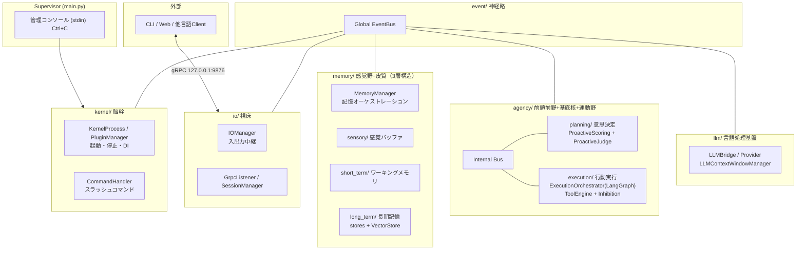
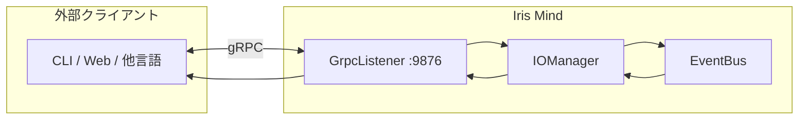

# Iris — Autonomous AI Assistant _(iris-kernel)_

自律的に行動・進化できるAIアシスタント

Iris は自律的に行動・進化できるAIアシスタント。Python 製で Ollama または OpenRouter 上で動作する。脳科学・神経科学の構造を参考にした層分割アーキテクチャを採用する。

## Table of Contents

- [Background](#background)
- [Install](#install)
- [Usage](#usage)
- [Architecture](#architecture)
- [Client Guide](#client-guide)
- [Features](#features)
- [Project Structure](#project-structure)
- [Development](#development)
- [Documentation](#documentation)
- [API](#api)
- [Tech Stack](#tech-stack)
- [Maintainers](#maintainers)
- [Contributing](#contributing)
- [License](#license)

## Background

脳科学・神経科学の構造を参考にした層分割アーキテクチャを採用する（詳細は [`docs/`](./docs/README.md)）。

> **注記**: 脳科学マッピングは AI による文献調査を参考にした設計指針であり、厳密な解剖学的正確性を保証するものではありません。

## Install

### Prerequisites

- Python 3.13+
- Ollama（ローカル LLM 利用時）— `qwen3.5:9b` 等のモデルを事前に pull
- OpenRouter API Key（OpenRouter 利用時）

### Setup

```powershell
git clone https://github.com/your-org/iris-mind.git
cd iris-mind

uv venv
uv sync
```

## Usage

### Configuration

`config.yaml` でプロバイダーとモデルを設定:

```yaml
model:
  provider: ollama
  base_url: http://localhost:11434
  models:
    - name: qwen3.5:9b
      roles: default
session:
  host: 127.0.0.1
  port: 9876
  access_token: ""
```

OpenRouter 利用時は `.env` ファイルを作成:

```env
OPENROUTER_API_KEY=sk-or-...
```

### Starting Iris

```powershell
uv run python main.py
uv run python main.py --verbose
```

### Slash Commands

| コマンド | 説明 |
|---|---|
| `/help` | ヘルプ表示 |
| `/status` | カーネル状態表示 |
| `/shutdown` | グレースフルシャットダウン |
| `/compact` | コンテキスト圧縮 |
| `/memory recent [n]` | 直近のエピソード記憶を n 件表示 |
| `/memory search <q>` | 意味記憶を検索 |
| `/memory clear [type]` | 記憶を消去（episodic/semantic） |
| `/sessions` | アクティブセッション一覧 |
| `/ping` | LLM ヘルスチェック |
| `/tools` | 登録ツール一覧 |
| `/llm` | LLM 設定情報 |
| `/state [path] [--history] [--json]` | システム状態クエリ |
| `/events [n] [--type=TYPE]` | 最近のイベント一覧 |
| `/health` | ヘルスチェック |
| `/report` | デバッグレポート出力 |
| `/debug help` | デバッグサブコマンド一覧 |
| `/debug on\|off` | LLM 入出力キャプチャ切替 |
| `/debug list\|last` | 直近の LLM キャプチャ |
| `/debug show <id>` | 特定キャプチャ表示 |
| `/debug dump` | 全キャプチャをファイル出力 |

## Architecture



- **Supervisor** — Kernel プロセスの起動・監視・管理コンソール（`main.py`）
- **Kernel 層** — 脳幹。プロセス管理、PluginManager（DI+ライフサイクル）、スラッシュコマンド、TimerTick(5秒) 発行
- **IO 層** — 視床。gRPC入出力、セッション管理、認証
- **Memory 層** — 感覚野+皮質。感覚バッファ、短期/長期記憶（エピソード+意味+ベクトルハイブリッド検索）
- **Agency 層** — 前頭前野+基底核+運動野。PFC評価（ProactiveScoring）+意思決定、基底核抑制（Striatum+Gate）、行動実行（LangGraph状態マシン）
- **LLM 層** — 言語処理基盤。LLM接続（マルチプロバイダ）、ContextWindow圧縮
- **Event 層** — 神経路。全層を疎結合するグローバルEventBus

## Client Guide

Iris に gRPC 接続して会話するクライアントを開発する場合:

1. **[Client Guide](./docs/client-guide.md)** — 応答パターン・自発発話・コマンド・期待される動作
2. **[IPC Protocol Spec](./docs/ipc-spec.md)** — ワイヤー形式・認証・メッセージ構造・実装例
3. 実装例: [Python (生ソケット)](./docs/ipc-spec.md#91-最小クライアントpython--生ソケット版) / [C#](./docs/ipc-spec.md#93-c--net) / [Rust](./docs/ipc-spec.md#94-rust) / [Node.js](./docs/ipc-spec.md#95-nodejs)



## Features

- **LLM 会話** — Ollama / OpenRouter / Google 等のマルチプロバイダ経由で会話
- **自律発話 (Proactive)** — PFCスコアリング（時間×記憶×文脈）＋基底核抑制制御で適切なタイミングに自発発話
- **記憶システム** — 感覚バッファ→短期記憶→長期記憶の3層。エピソード記憶 (JSONL)、意味記憶 (ChromaDB + BM25 ハイブリッド検索)、GoalStore長期目標管理
- **会話履歴圧縮** — LLMContextWindowManager が token window 超過時に自動要約
- **動的ツール拡張** — `@tool()` デコレータで実行時ツール追加
- **シングル / マルチモデルモード** — 設定したモデル数・ロールに応じて自動切替（low/medium/highロール別ルーティング）
- **LangGraph 実行パイプライン** — ExecutionOrchestrator によるLLM+ツールループの状態機械制御
- **抑制制御 (Inhibition)** — Striatum+Gate による実行権管理・クールダウン・プロアクティブ抑制

## Project Structure

```
iris-mind/
├── .agents/                     # コーディングエージェント用導線・Skills
├── .iris/                       # 設定・データ
│   ├── config/
│   │   └── system_prompt.md
│   └── data/                    # 記憶データ (runtime generated)
├── docs/                        # 設計ドキュメント
│   ├── how-it-works/            # 動作原理の詳細解説（6ファイル）
│   ├── architecture.md          # 全体アーキテクチャ
│   ├── agency-layer.md          # Agency 層設計
│   ├── memory-layer.md          # Memory 層設計
│   ├── io-layer.md              # IO 層設計
│   ├── kernel-layer.md          # Kernel 層設計
│   ├── config.md                # Config 設定一覧
│   ├── ipc-spec.md              # IPC プロトコル仕様
│   └── client-guide.md          # クライアント開発ガイド
├── iris/                        # アプリケーションコア
│   ├── agency/                  # 前頭前野+基底核+運動野
│   │   ├── planning/            # PFC: 意思決定・ProactiveScoring・Judge
│   │   ├── execution/           # 基底核+運動野: LangGraph状態マシン・ToolEngine
│   │   └── inhibition/          # 基底核: Striatum+Gate による実行権制御
│   ├── event/                   # 神経路: グローバル EventBus
│   ├── io/                      # 視床: TCP入出力・セッション・認証
│   ├── kernel/                  # 脳幹: プロセス管理・DI・コマンド
│   ├── llm/                     # LLM接続・ContextWindow管理
│   ├── memory/                  # 感覚野+皮質記憶（3層構造）
│   │   ├── sensory/             # 感覚バッファ（断片+raw入力 2系統）
│   │   ├── short_term/          # ワーキングメモリ
│   │   └── long_term/           # 長期記憶（EpisodicStore + SemanticStore + VectorStore + GoalStore）
│   └── tools/                   # @tool, ToolRegistry, ビルトイン
├── tests/                       # テストスイート
├── config.yaml                  # Iris 設定ファイル
└── main.py                      # Supervisor エントリーポイント
```

## Development

### Lint / Typecheck / Test

```powershell
uv run ruff check .                   # lint
uv run ruff format --check .          # format check
uv run ruff check --fix .             # lint + auto-fix
uv run mypy .                         # type check
uv run pytest tests/                  # 全テスト実行
```

### Capability Additions

1. `iris/tools/builtins/<name>/server.py` に配置
2. `@tool()` デコレータでツール定義（型ヒント→JSON Schema 自動生成）
3. `register(registry)` 関数で `registry.register_decorated(fn)` をエクスポート
4. `.iris/config/iris_profile.md` の該当セクションを更新

詳細は `.agents/skills/capability-pattern/SKILL.md` を参照。

## Documentation

設計ドキュメントは [`docs/README.md`](./docs/README.md) から参照できます。

| ドキュメント | 内容 |
|---|---|
| [architecture.md](./docs/architecture.md) | 全体アーキテクチャ — 脳科学ベース層分割 |
| [agency-layer.md](./docs/agency-layer.md) | Agency 層 — 意思決定と行動実行 |
| [io-layer.md](./docs/io-layer.md) | IO 層 — gRPC入出力・セッション管理 |
| [kernel-layer.md](./docs/kernel-layer.md) | Kernel 層 — プロセス管理・PluginManager |
| [memory-layer.md](./docs/memory-layer.md) | Memory 層 — 感覚野+皮質記憶（3層） |
| [config.md](./docs/config.md) | Config 設定一覧 |
| [ipc-spec.md](./docs/ipc-spec.md) | IPC プロトコル仕様 (gRPC) |
| [client-guide.md](./docs/client-guide.md) | クライアント開発ガイド |
| [how-it-works/](./docs/how-it-works/) | 動作原理の詳細 — 計算式・条件分岐・Mermaid図を網羅（6ファイル） |

## API

外部 Client は gRPC（127.0.0.1:9876）で Iris に接続する。プロトコル仕様は [IPC Protocol Spec](./docs/ipc-spec.md) を参照。

各層の内部インターフェースについては設計ドキュメントを参照。

## Tech Stack

- **言語**: Python 3.13+
- **LLM**: Ollama / OpenRouter / Google AI（マルチプロバイダ）
- **ベクトル検索**: ChromaDB + ONNX MiniLM-L6-v2 + BM25 ハイブリッド
- **IPC**: gRPC（HTTP/2, 双方向ストリーミング）
- **UI**: Rich（TUI）, prompt_toolkit
- **LangGraph**: ExecutionOrchestrator 実行パイプライン
- **テスト**: pytest, ruff, mypy, pyright（`uv run` 経由）
- **パッケージ管理**: uv

## Contributing

PR 歓迎。 [Issues](https://github.com/your-org/iris-mind/issues) で提案してからお送りください。

## License

[MIT](./LICENSE) © ibuibu
