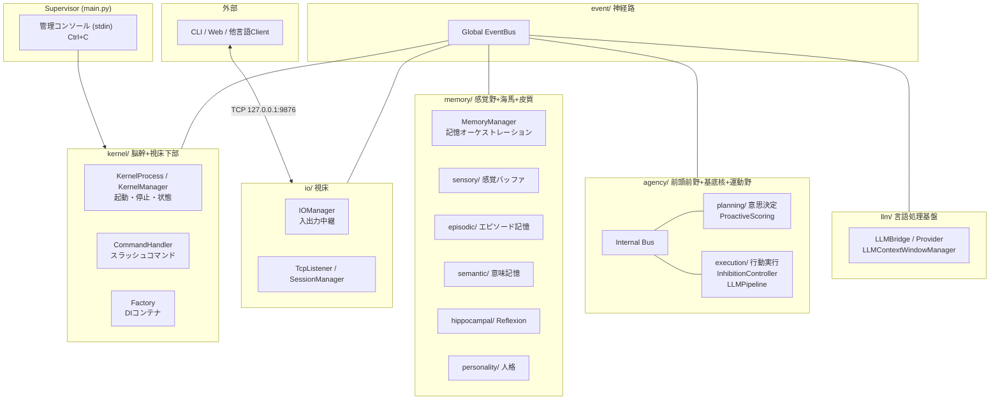

# Iris — Autonomous AI Assistant

Iris は自律的に行動・進化できるAIアシスタント。Python 製で Ollama または OpenRouter 上で動作する。

脳科学・神経科学の構造を参考にした層分割アーキテクチャを採用する（詳細は [`docs/`](./docs/README.md)）。

## アーキテクチャ



- **Supervisor** — Kernel プロセスの起動・監視・管理コンソール (`main.py`)
- **Kernel 層** — 脳幹+視床下部。プロセス管理、DIコンテナ、スラッシュコマンド。TimerTick(5秒) 発行
- **IO 層** — 視床。TCP入出力、セッション管理
- **Memory 層** — 感覚野+海馬+皮質。断片的入力の統合、エピソード/意味記憶、Reflexion、人格
- **Agency 層** — 前頭前野+基底核+運動野。PFC評価（ProactiveScoring）、意思決定、基底核抑制、行動実行
- **LLM 層** — 言語処理基盤。LLM接続、ContextWindow圧縮
- **Event 層** — 神経路。全層を疎結合するグローバルEventBus

シャットダウンは Supervisor の管理コンソール (`/shutdown`) または Ctrl+C で行う。
TCP 経由でも `/shutdown` コマンドを送信可能。

詳細な設計は [`docs/`](./docs/README.md) を参照。

## 機能

- **LLM 会話** — Ollama / OpenRouter 経由でローカルまたはクラウド LLM と会話
- **自律発話 (Proactive)** — PFCスコアリング（時間×記憶×文脈×感情）＋基底核抑制制御で適切なタイミングに自発発話
- **Reflexion 自己改善** — 会話後に自己反省し、話し方・性格・教訓を記憶に統合
- **動的ツール拡張** — 実行時にツールを追加可能
- **記憶システム** — エピソード記憶 (JSONL)、意味記憶 (ChromaDB + BM25 ハイブリッド検索)、動的パーソナリティ
- **会話履歴圧縮** — LLMContextWindowManager が token window 超過時に自動要約
- **スラッシュコマンド** — `/help`, `/sleep`, `/wakeup`, `/compact`, `/clear`, `/status`, `/reflect`
- **シングル / マルチモデルモード** — 設定したモデル数に応じて自動切替

## クイックスタート

### 必要条件

- Python 3.13+
- Ollama (ローカル LLM 利用時) — `qwen3.5:9b` 等のモデルを事前に pull
- OpenRouter API Key (OpenRouter 利用時)

### インストール

```powershell
# リポジトリをクローン
git clone https://github.com/your-org/iris-kernel.git
cd iris-kernel

# 仮想環境を作成
python -m venv .venv
.venv\Scripts\Activate.ps1

# 依存関係をインストール
pip install -e .
pip install -e ".[dev]"   # 開発用依存 (ruff, mypy, pytest...)
```

### 設定

1. `config.yaml` でプロバイダーとモデルを設定

```yaml
model:
  provider: ollama              # "ollama" or "openrouter"
  base_url: http://localhost:11434
  models:
    - name: qwen3.5:9b
      roles: [default]
session:
  host: 127.0.0.1
  port: 9876
  access_token: ""              # 空文字の場合は検証スキップ
```

2. OpenRouter 利用時は `.env` ファイルを作成

```env
OPENROUTER_API_KEY=sk-or-...
```

### 起動

```powershell
python main.py                          # Supervisor 起動
python main.py --verbose                # 診断ログを stderr に出力
```

## プロジェクト構成

```
iris-kernel/
├── .agents/                     # コーディングエージェント用導線・Skills
├── .iris/                       # 設定・データ
│   ├── config/
│   │   └── personality_default.md
│   └── data/                    # 記憶データ (runtime generated)
├── docs/                        # 設計ドキュメント
│   ├── adr/                     # Architecture Decision Records
│   ├── architecture.md          # 全体アーキテクチャ
│   ├── agency-layer.md          # Agency 層設計
│   ├── memory-layer.md          # Memory 層設計
│   ├── io-layer.md              # IO 層設計
│   ├── kernel-layer.md          # Kernel 層設計
│   └── ipc-spec.md              # IPC プロトコル仕様
├── iris/                        # アプリケーションコア
│   ├── agency/                  # 前頭前野+基底核+運動野
│   │   ├── planning/            # PFC: 意思決定・スコアリング
│   │   └── execution/           # 基底核+運動野: 行動実行・抑制制御
│   ├── event/                   # 神経路: グローバル EventBus
│   ├── io/                      # 視床: TCP入出力・セッション・認証
│   │   ├── transport/
│   │   ├── session/
│   │   └── auth/
│   ├── kernel/                  # 脳幹: プロセス管理・DI・コマンド
│   │   └── commands/
│   ├── llm/                     # LLM接続・ContextWindow管理
│   ├── memory/                  # 感覚野+海馬+皮質記憶
│   │   ├── sensory/             # 感覚バッファ
│   │   ├── episodic/            # エピソード記憶 (stores.py)
│   │   ├── semantic/            # 意味記憶 (stores.py)
│   │   ├── hippocampal/         # 海馬: Reflexion
│   │   ├── personality/         # 人格
│   │   └── vector/              # ベクトル検索 (vector_store.py)
│   └── tools/                   # @tool, ToolRegistry, ビルトイン
│       └── builtins/
├── tests/                       # テストスイート (138 tests, ~3秒)
├── config.yaml                  # Iris 設定ファイル
└── main.py                      # Supervisor エントリーポイント
```

## 開発

### lint / typecheck / test

```powershell
ruff check .                          # lint
ruff format --check .                 # format check
ruff check --fix .                    # lint + auto-fix
mypy .                                # type check
pytest tests/                         # 全テスト実行
```

### Capability 追加

1. `iris/tools/builtins/<name>/server.py` に配置
2. `@tool()` デコレータでツール定義（型ヒント→JSON Schema 自動生成）
3. `register(registry)` 関数で `registry.register_decorated(fn)` をエクスポート
4. `.iris/data/iris_profile.md` の `My Capabilities` を更新

詳細は `.agents/skills/capability-pattern/SKILL.md` を参照。

## ドキュメント

設計ドキュメントは [`docs/README.md`](./docs/README.md) から参照できます。

| ドキュメント | 内容 |
|---|---|
| [architecture.md](./docs/architecture.md) | v2 全体アーキテクチャ — 脳科学ベース層分割 |
| [agency-layer.md](./docs/agency-layer.md) | Agency 層 — 意思決定と行動実行 |
| [io-layer.md](./docs/io-layer.md) | IO 層 — TCP入出力・セッション管理 |
| [kernel-layer.md](./docs/kernel-layer.md) | Kernel 層 — プロセス管理・DI |
| [memory-layer.md](./docs/memory-layer.md) | Memory 層 — 感覚野+海馬+皮質記憶 |
| [config.md](./docs/config.md) | Config 設定一覧 |
| [ipc-spec.md](./docs/ipc-spec.md) | IPC プロトコル仕様 (TCP) |
| [adr/002-agency-layer-architecture.md](./docs/adr/002-agency-layer-architecture.md) | Agency層分割の決定記録 |

## 技術スタック

- **言語**: Python 3.13+
- **LLM**: Ollama / OpenRouter (Qwen3.5:9b 他)
- **ベクトル検索**: ChromaDB + ONNX MiniLM-L6-v2
- **IPC**: TCP/IP (`AF_INET`) — 1ポート多重
- **UI**: Rich (TUI), prompt_toolkit
- **テスト**: pytest (138 tests), ruff, mypy

## ライセンス

MIT
