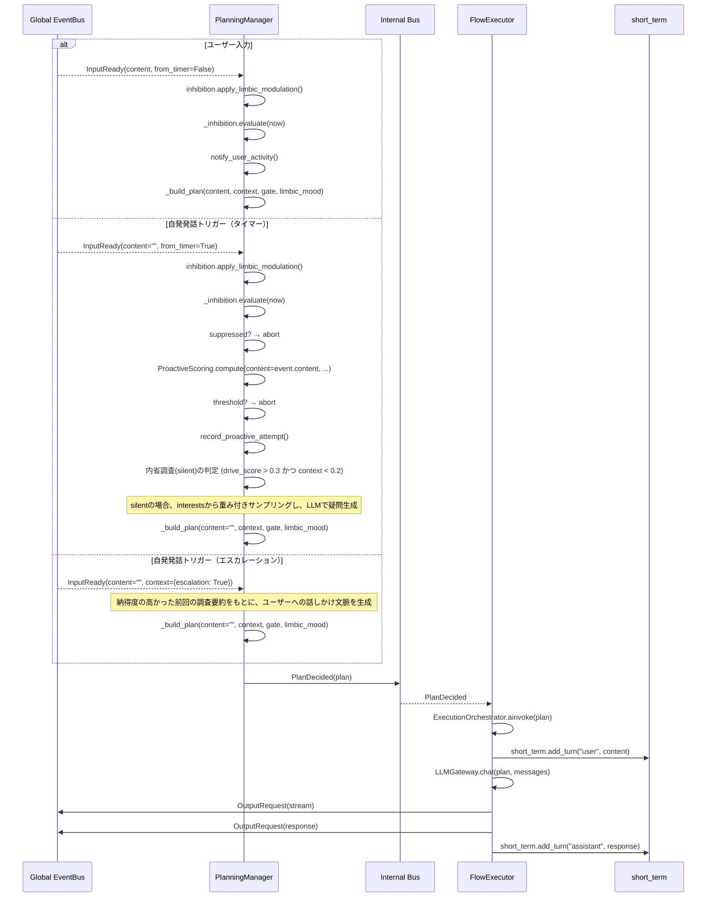
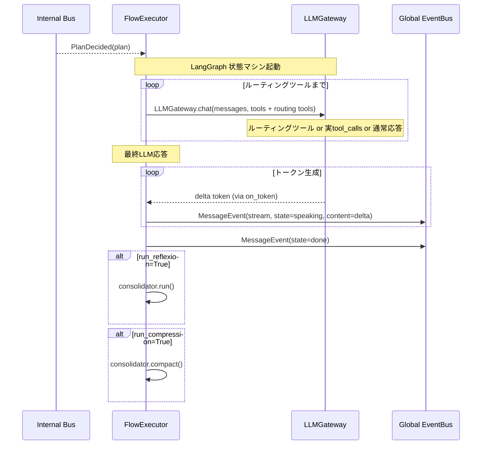

# Iris Agency 層

> **注記**: 脳科学・神経科学の用語との対応付けは設計指針であり、厳密な解剖学的正確性を保証するものではありません。

**脳科学対応**: 前頭前野（PFC）+ 大脳基底核（BG）+ 運動野

## 責務

- **PlanningManager** がグローバル EventBus から `InputReady` を直接購読（AgencyManager は中継しない）
- 意思決定（planning）: PFC が入力に対して何を行うか決定する
- PFC スコアリング（ProactiveScoring）: 自発発話の価値を時間・記憶・文脈・感情・緊急性・システムイベントで評価
- 基底核抑制（InhibitionController）: 行動の抑制を mood / confirmation / cooldown / **generating（生成中）** / **limbic 変調** で制御
- 行動実行（execution）: 決定された計画を LLM・Tool を用いて実行する

## Internal Bus

`iris/agency/bus.py` で planning → execution 間の専用 EventBus を提供する。

```python
# iris/agency/bus.py

@dataclass
class PlanDecided:
    plan: dict          # plan は dict で、action フィールドは持たない
```

## AgencyManager

```python
class AgencyManager:
    """Agency 層の外から呼ばれる操作を中継する。
    現在は compact_context の中継のみ。InputReady は PlanningManager が直接購読する。
    """
```

AgencyManager は現在最小限の役割のみ持つ。global EventBus の `InputReady` は PlanningManager が直接購読するため、AgencyManager を経由しない。

## 処理フロー（統合後）



## PlanningManager

```python
class PlanningManager:
    """前頭前野（PFC）: 意思決定。
    グローバル EventBus の InputReady を直接購読し、「何をするか」を決定する。
    ProactiveScoring と InhibitionController を統合して plan を生成する。
    """

    # subscribe: InputReady (global EventBus を直接購読)

    def _on_input_ready(self, event: InputReady) -> None
        # 1. inhibition.apply_limbic_modulation(emotion) → 感情変調
        # 2. gate = inhibition.evaluate(now)
        # 3. context.escalation → エスカレーション用の話しかけプラン (silent=False) → PlanDecided
        # 4. from_timer → scoring + threshold → abort or plan (silent判定時は興味サンプリング + 疑問生成)
        # 5. !from_timer → notify_user_activity()
        # 6. _build_plan(content, context, gate, limbic_mood) → PlanDecided

```

### ProactiveScoring（PFC スコアリング）

`agency/planning/scoring.py` — PFC が自発発話の価値を評価する。

```python
class ProactiveScoring:
    """因子を重み付け統合:
    - time: 前回の行動からの経過時間
    - memory: 長期記憶との関連性（最近の話題 + 意味検索）
    - context: 直近会話の文脈的一貫性（+ short_termターン数で補正）
    - mood: 感情状態（limbic_mood dict: valence/arousal/dominance → PAD加重スコア）
    - urgency: 入力内容の緊急性（疑問・緊急語・長文・!!）
    - system_event: クライアント接続等のシステムイベント発生時に優先度を大きく上方補正

    sensory/short_termは個別に算出され、totalを上方補正する。
    """
    def compute(
        self,
        now: float,
        last_proactive_time: float,
        last_user_activity: float,
        negative_mood_score: float,
        limbic_mood: EmotionState | None = None,
        limbic_drive: DriveState | None = None,
        content: str = "",
        context: dict[str, Any] | None = None,
        ignore_count: int = 0,
    ) -> tuple[float, dict[str, float]]:
        # limbic_mood あり → PAD 3次元の重み付きスコアリング
        # limbic_mood なし → 従来の negative_mood_score ベース
        # limbic_drive  → Drive蓄積による欲求スコア
        # content が空以外 → content_urgency で上方補正
        # context に "system_event" = "connected" がある場合 → 閾値を超えるようブースト
        # ignore_count → 無視回数によるペナルティ
```

### Plan 定義と TaskLevel

plan は dict で表現される。`task_level`（文字列）が動作の基本設定を決定し、`overrides` で一部上書き可能。

**TaskLevel**（`iris/agency/task_level.py`）:

| レベル | model_role | max_tokens | priority | 用途 |
|--------|-----------|-----------|----------|------|
| `chat` | `low` | 80 | 0 | 最短応答（talkative抑制時） |
| `light` | `low` | 256 | 0 | 簡易会話（ツール制限あり） |
| `normal` | `medium` | 0 | 0 | 通常会話 |
| `deep` | `medium` | 4096 | 1 | 深い調査・タスク |
| `research` | `high` | 8192 | 2 | 高負荷リサーチ |

- `resolve_level(task_level_str, overrides)` → dict に展開
- `model_role` は `low` / `medium` / `high` の3段階。`ModelConfig.get_model(role)` で解決、未知なら `models[0]` にフォールバック

**plan の主要フィールド**:

| 属性 | 型 | 意味 |
|------|-----|------|
| `content` | str | ユーザー入力内容（proactive時は空文字） |
| `task_level` | str | TaskLevel名（"chat" / "light" / "normal" / "deep" / "research"） |
| `model_role` | str | 解決済みモデルロール（"low" / "medium" / "high"） → 上書き可 |
| `silent` | bool | サイレント（内部思考/調査）モード |
| `reason` | PlanReason | 発動理由 |
| `context_hint` | str | LLMへの文脈ヒント |
| `overrides` | dict | レベルプロファイルの上書き値 |

**感情による動的調整**: `EmotionTemperatureModulator.apply_execution_params()` が
`overrides.max_tokens` をPAD感情に応じて制限する。
例: valence < -0.3 → max_tokens ≤ 256、arousal > 0.6 → max_tokens ≤ 256。

## FlowExecutor

```python
class FlowExecutor:
    """大脳基底核 + 運動野: 行動実行。
    PlanDecided を受け取り、ExecutionOrchestrator (LangGraph) に委譲する。
    """

    # subscribe: PlanDecided (internal bus)

    def _on_plan(self, event: PlanDecided) -> None
        self._graph.ainvoke(state)  # LangGraph 状態マシン

    # グラフノード内で:
    #   SetupNode: メッセージ設定, ストリーミングコールバック, THINKING publish
    #   GeneralChatNode / GeneralTaskNode: LLMGateway.chat() 呼出 + on_token ストリーム
    #   ToolRunNode: ToolEngine.run_tool_calls() 実行
    #   FinalizeNode: memory保存, monitor記録, フィードバック, DONE publish
    #   PostProcessNode: reflexion / context compression
```

### InhibitionController 補足: トピックベースクールダウン

```python
def record_topic(self, topic: str, duration_sec: float = 3600.0) -> None
    # 話題単位のクールダウン設定。1時間（デフォルト）は同一話題で自発発話しない。
def is_topic_suppressed(self, topic: str, now: float) -> bool
    # 指定話題がクールダウン中か判定。`_state.topic_cooldowns` で管理。
```

### 実行ルート

| 条件 | エントリノード | ルーティング |
|------|--------------|-------------|
| plan.task_level="chat" / "light" | GeneralChatNode | 軽量system prompt + ルーティングツール |
| plan.task_level="normal" / "deep" / "research" | GeneralChatNode（固定） → 必要時GeneralTaskNodeへ切替 | ルーティングツールで制御 |
| Routing: general_chat | chain_depth+1, 同一ノード継続 | 同一レベル連続呼出（最大chain_depth回） |
| Routing: general_task | chain_depth=0, GeneralTaskNodeに切替, entry_levelから開始 | 通常タスクモード |
| Routing: deep_task | level_idx+1, 同一ノード継続 | より深い推論レベルへ |
| Routing: finish | 即座にFinalizeNodeへ | 実行完了 |

全ノードは `on_token` コールバック経由でストリーミング出力を行う（`MessageEvent(state=SPEAKING, content=delta)`）。
最終出力は `FinalizeNode` が `MessageEvent(state=DONE)` を発行して完了を通知する。

`model_role` → `ModelConfig.get_model(role)` → config.yaml のモデル名。
FlowExecutor は圧縮実行時に `get_effective_context_window(role)` でper-modelの閾値を使用する。

### ExecutionOrchestrator（LangGraph 状態マシン）

`agency/execution/orchestrator.py` — LangGraph StateGraph を利用した LLM + ツールループ。
ルーティングツール（general_chat / general_task / deep_task / finish）でノード遷移を制御。

```python
# グラフトポロジ:
# START → prepare_context → general_chat (fixed entry)
#   ├─ルーティングツール→ general_chat / general_task (switch)
#   ├─実ツールtool_calls→ ToolRunNode → 元ノード復帰
#   └─no tools → finalize → post_process (optional) → END

# 各ノード:
#   SetupNode:         メッセージ設定, ストリーミングコールバック
#   GeneralChatNode:   LLMGateway.chat()（chat/light レベル, 短いsystem prompt）
#   GeneralTaskNode:   LLMGateway.chat()（normal/deep/research レベル, デフォルトprompt）
#   ToolRunNode:       ToolEngine.run_tool_calls() 実行, 結果truncate
#   FinalizeNode:      memory保存, monitor記録, フィードバック, DONE publish
#   PostProcessNode:   reflexion / context compression
```


