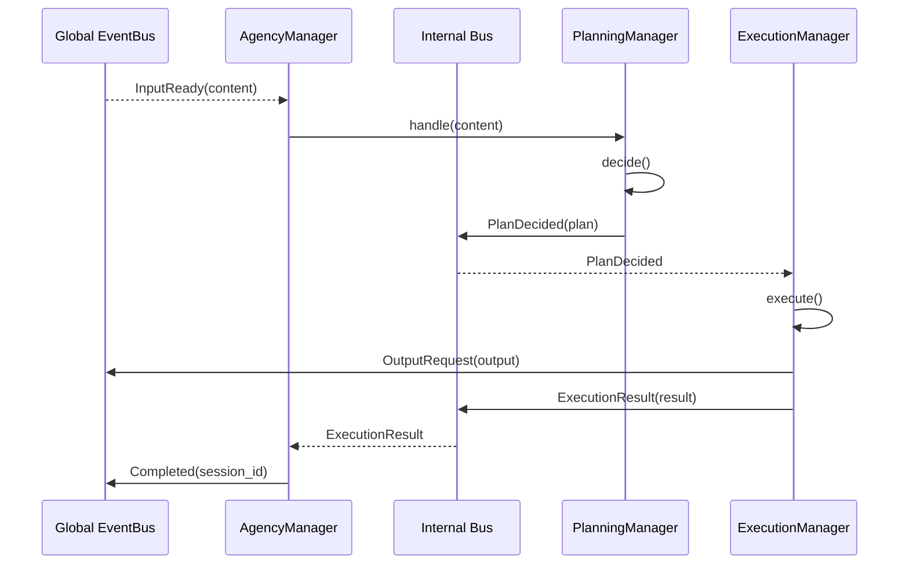
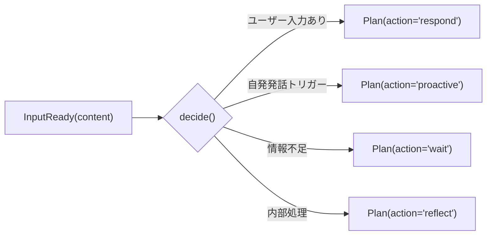
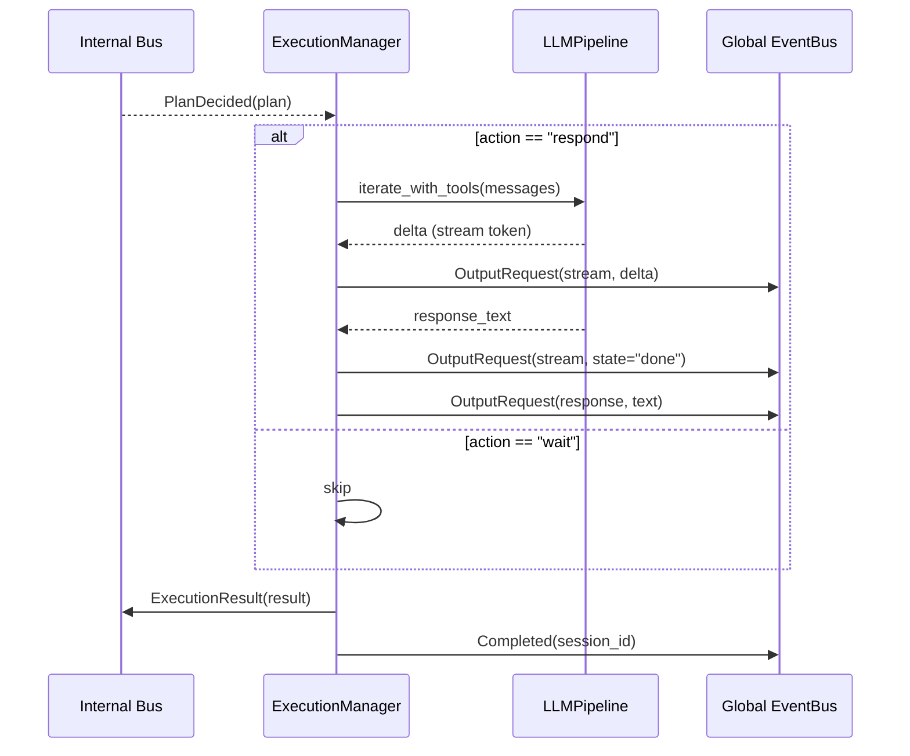

# Iris v2 Agency 層

**脳科学対応**: 前頭前野（PFC）+ 大脳基底核（BG）+ 運動野

## 責務

- グローバル EventBus と内部 Bus の橋渡し
- 意思決定（planning）: 入力に対して何を行うか決定する
- 行動実行（execution）: 決定された計画を LLM・Tool を用いて実行する
- 実行結果のフィードバック: execution → planning に結果を戻す

## Internal Bus

`iris/agency/bus.py` で planning ↔ execution 間の専用 EventBus を提供する。

```python
# iris/agency/bus.py

@dataclass
class PlanDecided:
    plan: Plan

@dataclass
class ExecutionResult:
    session_id: str
    success: bool
    summary: str
    messages: list[dict]

@dataclass
class ExecutionFeedback:
    session_id: str
    query: str
    context: dict
```

## AgencyManager（橋渡し）

```python
class AgencyManager:
    """グローバル EventBus と内部 Bus の橋渡し。
    層間イベントの受付と、planning/execution へのディスパッチのみ行う。
    """

    # subscribe: InputReady (global)
    #   → PlanningManager.handle(content)

    # internal subscribe: ExecutionResult
    #   → 必要なら PlanningManager にフィードバック
    #   → publish: Completed (global) → Memory
```



## PlanningManager

```python
class PlanningManager:
    """前頭前野（PFC）: 意思決定。
    InputReady を受け取り「何をするか」を決定する。
    """

    # subscribe: InputReady (via AgencyManager)
    # subscribe: ExecutionFeedback (internal bus)

    def handle(self, content: str, context: dict) -> None
        # 1. memory から関連記憶を取得
        # 2. 行動を決定（respond / reflect / wait / ...）
        # 3. Plan を作成して internal bus に publish

    # 抑制制御: ProactiveEngine の「発話するか」判断はここに統合予定
```

### Plan 定義

```python
@dataclass
class Plan:
    action: str          # "respond" | "reflect" | "wait" | "proactive"
    session_id: str
    content: str         # 入力内容
    context: dict        # Memory から取得したコンテキスト
    metadata: dict       # 拡張用
```



## ExecutionManager

```python
class ExecutionManager:
    """大脳基底核 + 運動野: 行動実行。
    PlanDecided を受け取り、実際の行動を実行する。
    """

    # subscribe: PlanDecided (internal bus)

    def execute(self, plan: Plan) -> None
        # 1. action に応じた実行ルートを選択
        # 2. respond → LLMPipeline.call / iterate_with_tools
        # 3. ストリーミング出力 → OutputRequest
        # 4. 実行結果を ExecutionResult として publish
        # 5. 完了後、OutputRequest(state="done") + publish Completed

    # SubAgent: 複雑タスク分割（将来）
    # 大脳基底核の並列/逐次行動シーケンス制御に相当
```

### 実行ルート

| action | 実行内容 |
|--------|----------|
| `respond` | LLMPipeline: system prompt 構築 → LLM呼出 → ツールループ → 出力 |
| `reflect` | (Memory層の hippocampal に委譲。Agency では Plan 作成まで) |
| `proactive` | 自発発話内容生成 → 出力（将来実装） |
| `wait` | 何もしない（スキップ） |



## v0.3 からの変更点

| v0.3 | v2 |
|------|----|
| ConversationService | 解体 → PlanningManager + ExecutionManager |
| LLMPipeline (services/) | execution/pipeline.py に移動 |
| ProactiveEngine（一部） | "発話するか"判断 → planning/ |
| ProactiveEngine（一部） | "発話内容生成" → execution/（将来） |
| ToolExecutionEngine (services/) | execution/ 配下に移動 |
| -- (新規) | Internal Bus (agency/bus.py) |
| -- (新規) | AgencyManager（橋渡し） |
| ReflexionManager (services/) | memory/hippocampal/ に移動 |
| ContextManager (services/) | memory/hippocampal/ に移動 |
