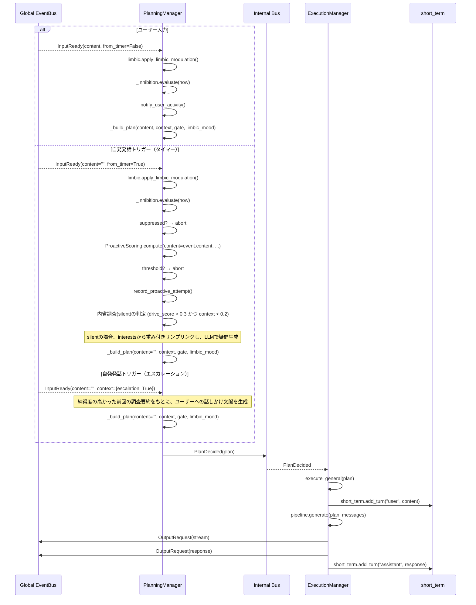
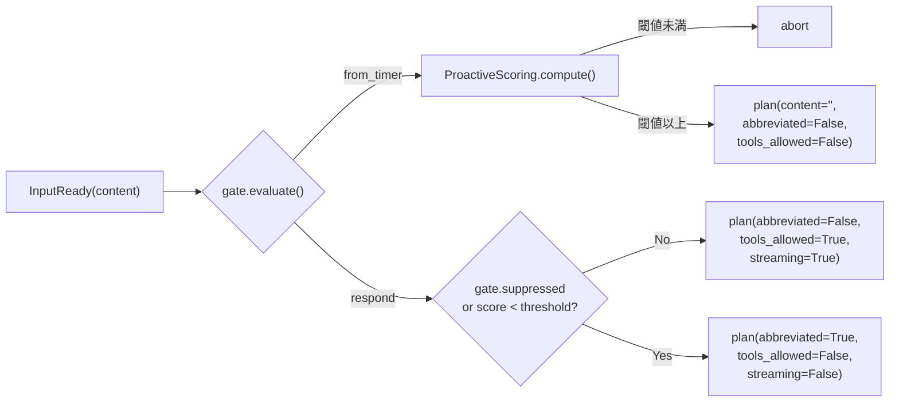
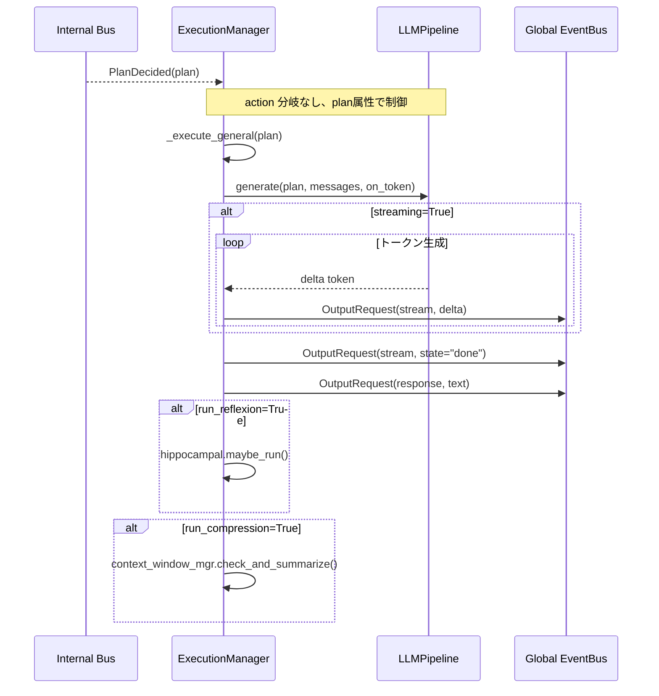

# Iris Agency 層

> **注記**: 脳科学・神経科学の用語との対応付けは設計指針であり、厳密な解剖学的正確性を保証するものではありません。

**脳科学対応**: 前頭前野（PFC）+ 大脳基底核（BG）+ 運動野

## 責務

- **PlanningManager** がグローバル EventBus から `InputReady` を直接購読（AgencyManager は中継しない）
- 意思決定（planning）: PFC が入力に対して何を行うか決定する
- PFC スコアリング（ProactiveScoring）: 自発発話の価値を時間・記憶・文脈・感情・緊急性・システムイベントで評価
- 基底核抑制（InhibitionController）: 行動の抑制を mood / confirmation / cooldown / **generating（生成中）** / **limbic 変調** で制御
- 行動実行（execution）: 決定された計画を LLM・Tool を用いて実行する

## Internal Bus

`iris/agency/bus.py` で planning → execution 間の専用 EventBus を提供する。

```python
# iris/agency/bus.py

@dataclass
class PlanDecided:
    plan: dict          # plan は dict で、action フィールドは持たない
```

## AgencyManager

```python
class AgencyManager:
    """Agency 層の外から呼ばれる操作を中継する。
    現在は compact_context の中継のみ。InputReady は PlanningManager が直接購読する。
    """
```

AgencyManager は現在最小限の役割のみ持つ。global EventBus の `InputReady` は PlanningManager が直接購読するため、AgencyManager を経由しない。

## 処理フロー（統合後）



## PlanningManager

```python
class PlanningManager:
    """前頭前野（PFC）: 意思決定。
    グローバル EventBus の InputReady を直接購読し、「何をするか」を決定する。
    ProactiveScoring と InhibitionController を統合して plan を生成する。
    """

    # subscribe: InputReady (global EventBus を直接購読)

    def _on_input_ready(self, event: InputReady) -> None
        # 1. limbic.apply_limbic_modulation(emotion) → 感情変調 (Phase 4)
        # 2. gate = inhibition.evaluate(now)
        # 3. context.escalation → エスカレーション用の話しかけプラン (silent=False) → PlanDecided
        # 4. from_timer → scoring + threshold → abort or plan (silent判定時は興味サンプリング + 疑問生成)
        # 5. !from_timer → notify_user_activity()
        # 6. _build_plan(content, context, gate, limbic_mood) → PlanDecided

```

### ProactiveScoring（PFC スコアリング）

`agency/planning/scoring.py` — PFC が自発発話の価値を評価する。

```python
class ProactiveScoring:
    """因子を重み付け統合:
    - time: 前回の行動からの経過時間
    - memory: 長期記憶との関連性（最近の話題 + 意味検索）
    - context: 直近会話の文脈的一貫性（+ short_termターン数で補正）
    - mood: 感情状態（limbic_mood dict: valence/arousal/dominance → PAD加重スコア）
    - urgency: 入力内容の緊急性（疑問・緊急語・長文・!!）
    - system_event: クライアント接続等のシステムイベント発生時に優先度を大きく上方補正

    sensory/short_termは個別に算出され、totalを上方補正する。
    """
    def compute(self, now, last_proactive_time, last_user_activity, negative_mood_score,
                limbic_mood: dict | None = None, content: str = "", context: dict | None = None) -> tuple[float, dict]:
        # limbic_mood あり → PAD 3次元の重み付きスコアリング
        # limbic_mood なし → 従来の negative_mood_score ベース
        # content が空以外 → content_urgency で上方補正
        # context に "system_event" = "connected" がある場合 → 閾値を超えるようブースト
```

### Plan 定義

plan は dict で表現され、`action` フィールドを持たない。動作の振り分けは以下の属性で制御する:

| 属性 | 型 | 意味 |
|------|-----|------|
| `content` | str | ユーザー入力内容（proactive時は空文字） |
| `model_role` | str | 使用モデルのロール（"default" / "fast"）。abbreviated時は"fast" |
| `abbreviated` | bool | 抑制時・閾値未満 → 短縮応答 |
| `tools_allowed` | bool | ツール利用の可否 |
| `streaming` | bool | ストリーミング出力の有無 |
| `short_prompt` | str | 短縮応答時用 system prompt（proactive用） |
| `short_user_message` | str | 短縮応答時用 user message（proactive用） |
| `run_reflexion` | bool | 実行後のReflexionの有無 |
| `run_compression` | bool | 実行後のContextWindow圧縮の有無 |
| `record_history` | bool | 会話履歴への保存の有無 |
| `max_tokens` | int | 最大出力トークン数 |
| `temperature` | float | 生成温度 |

**感情による動的調整 (Phase 4)**: `PlanningManager._apply_emotion_to_plan()` が
PAD 感情状態に応じて temperature/max_tokens/abbreviated/tools_allowed を上書きする。
例: valence < -0.3 → 短文+高温度（ぶっきらぼう）、arousal > 0.6 → 低温度+短文（興奮）。



## ExecutionManager

```python
class ExecutionManager:
    """大脳基底核 + 運動野: 行動実行。
    PlanDecided を受け取り、action の種別に関わらず _execute_general(plan) を実行する。
    """

    # subscribe: PlanDecided (internal bus)

    def _on_plan(self, event: PlanDecided) -> None
        self._execute_general(event.plan)  # action 分岐なし

    def _execute_general(self, plan: dict) -> None
        # 1. plan 属性（abbreviated / tools_allowed / streaming / ...）を取得
        # 2. short_term.add_turn("user", content) — Plan決定後に追加
        # 3. pipeline.generate(plan, messages, on_token) を呼ぶ
        # 4. ストリーミング出力 → OutputRequest(stream)
        # 5. 出力完了 → OutputRequest(stream, state="done")
        # 6. 応答 → OutputRequest(response, text) + add_turn("assistant")
        # 7. 必要に応じて reflexion / context compression
```

### 実行ルート

| 条件 | 実行内容 |
|------|----------|
| plan.abbreviated=False | LLMPipeline.generate: 通常 system prompt + ツールループ有効 |
| plan.abbreviated=True | LLMPipeline.generate: plan.short_prompt 使用、ツールループ無効、streaming無効 |
| plan.from_timer=True | 同上（abbreviated=False固定、tools_allowed=False） |
| plan.model_role="fast" | 軽量モデルで短縮応答。abbreviated時に自動設定 |
| plan.model_role="default" | 標準モデルで応答 |

LLMPipeline は `plan.model_role` に従って `ModelConfig.get_model(role)` で使用モデルを決定する。
ExecutionManager は圧縮実行時に `get_effective_context_window(role)` でper-modelの閾値を使用する。


