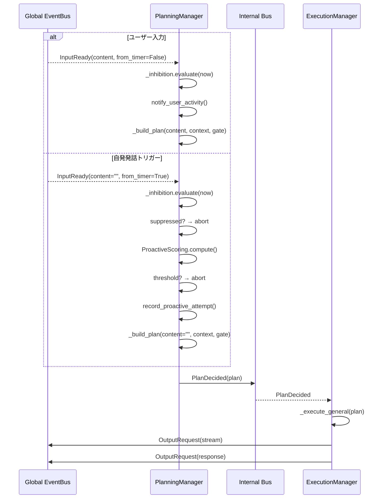
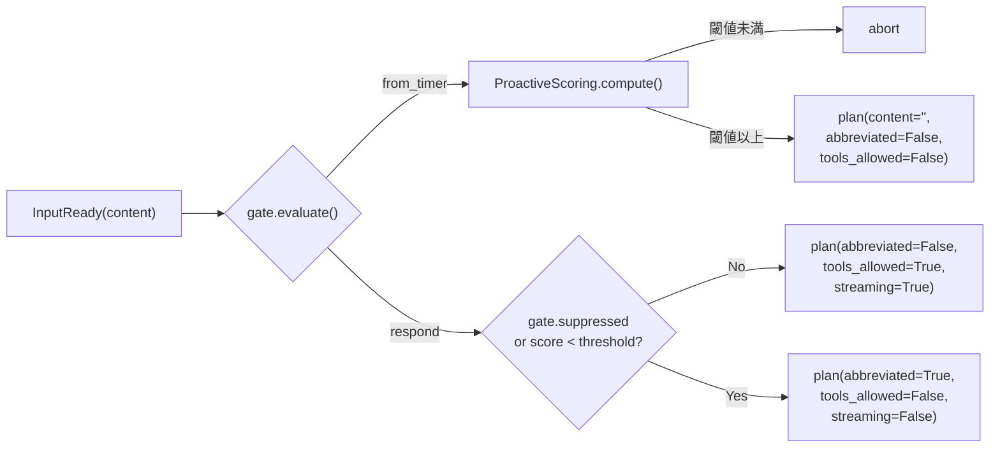
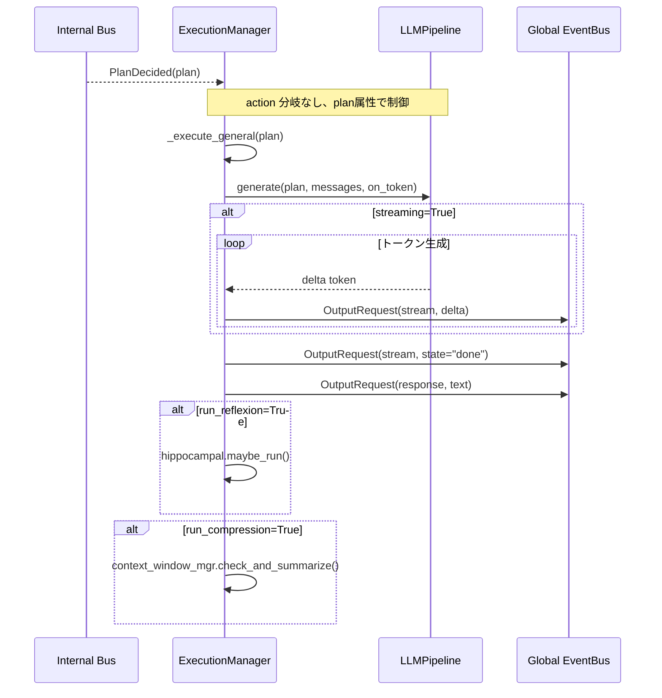

# Iris Agency 層

> **注記**: 脳科学・神経科学の用語との対応付けは設計指針であり、厳密な解剖学的正確性を保証するものではありません。

**脳科学対応**: 前頭前野（PFC）+ 大脳基底核（BG）+ 運動野

## 責務

- **PlanningManager** がグローバル EventBus から `InputReady` を直接購読（AgencyManager は中継しない）
- 意思決定（planning）: PFC が入力に対して何を行うか決定する
- PFC スコアリング（ProactiveScoring）: 自発発話の価値を時間・記憶・文脈・感情の4因子で評価
- 基底核抑制（InhibitionController）: 行動の抑制を mood / confirmation / cooldown で制御
- 行動実行（execution）: 決定された計画を LLM・Tool を用いて実行する

## Internal Bus

`iris/agency/bus.py` で planning → execution 間の専用 EventBus を提供する。

```python
# iris/agency/bus.py

@dataclass
class PlanDecided:
    plan: dict          # plan は dict で、action フィールドは持たない
```

## AgencyManager

```python
class AgencyManager:
    """Agency 層の外から呼ばれる操作を中継する。
    現在は compact_context の中継のみ。InputReady は PlanningManager が直接購読する。
    """
```

AgencyManager は現在最小限の役割のみ持つ。global EventBus の `InputReady` は PlanningManager が直接購読するため、AgencyManager を経由しない。

## 処理フロー（統合後）



## PlanningManager

```python
class PlanningManager:
    """前頭前野（PFC）: 意思決定。
    グローバル EventBus の InputReady を直接購読し、「何をするか」を決定する。
    ProactiveScoring と InhibitionController を統合して plan を生成する。
    """

    # subscribe: InputReady (global EventBus を直接購読)

    def _on_input_ready(self, event: InputReady) -> None
        # 1. gate = inhibition.evaluate(now)
        # 2. from_timer → scoring + threshold → abort or plan
        # 3. !from_timer → notify_user_activity()
        # 4. _build_plan(content, context, gate) → PlanDecided
```

### ProactiveScoring（PFC スコアリング）

`agency/planning/scoring.py` — PFC が自発発話の価値を評価する。

```python
class ProactiveScoring:
    """4因子を重み付け統合:
    - time: 前回の行動からの経過時間
    - memory: 長期記憶との関連性
    - context: 直近会話の文脈的一貫性
    - mood: 感情状態
    """
    def compute(self, now, last_proactive_time, last_user_activity, negative_mood_score) -> tuple[float, dict]:
        # 重み付き統合スコア ＋ 各因子の内訳
```

### Plan 定義

plan は dict で表現され、`action` フィールドを持たない。動作の振り分けは以下の属性で制御する:

| 属性 | 型 | 意味 |
|------|-----|------|
| `content` | str | ユーザー入力内容（proactive時は空文字） |
| `abbreviated` | bool | 抑制時・閾値未満 → 短縮応答 |
| `tools_allowed` | bool | ツール利用の可否 |
| `streaming` | bool | ストリーミング出力の有無 |
| `short_prompt` | str | 短縮応答時用 system prompt（proactive用） |
| `short_user_message` | str | 短縮応答時用 user message（proactive用） |
| `run_reflexion` | bool | 実行後のReflexionの有無 |
| `run_compression` | bool | 実行後のContextWindow圧縮の有無 |
| `record_history` | bool | 会話履歴への保存の有無 |
| `max_tokens` | int | 最大出力トークン数 |
| `temperature` | float | 生成温度 |



## ExecutionManager

```python
class ExecutionManager:
    """大脳基底核 + 運動野: 行動実行。
    PlanDecided を受け取り、action の種別に関わらず _execute_general(plan) を実行する。
    """

    # subscribe: PlanDecided (internal bus)

    def _on_plan(self, event: PlanDecided) -> None
        self._execute_general(event.plan)  # action 分岐なし

    def _execute_general(self, plan: dict) -> None
        # 1. plan 属性（abbreviated / tools_allowed / streaming / ...）を取得
        # 2. pipeline.generate(plan, messages, on_token) を呼ぶ
        # 3. ストリーミング出力 → OutputRequest(stream)
        # 4. 出力完了 → OutputRequest(stream, state="done")
        # 5. 応答 → OutputRequest(response, text)
        # 6. 必要に応じて reflexion / context compression
```

### 実行ルート

| 条件 | 実行内容 |
|------|----------|
| plan.abbreviated=False | LLMPipeline.generate: 通常 system prompt + ツールループ有効 |
| plan.abbreviated=True | LLMPipeline.generate: plan.short_prompt 使用、ツールループ無効、streaming無効 |
| plan.from_timer=True | 同上（abbreviated=False固定、tools_allowed=False） |




