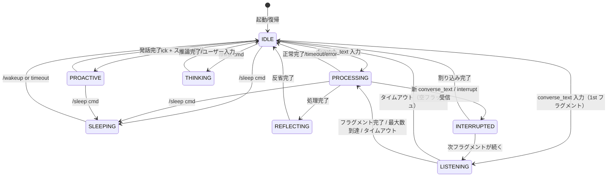

# AgentState 状態遷移設計書

## 状態一覧

| 状態 | 定数値 | 説明 |
|------|--------|------|
| IDLE | `idle` | 待機中。トリガー監視・自発発話の起点 |
| LISTENING | `listening` | フラグメント受信中。quasi-sync 入力のバッファリング中 |
| PROCESSING | `processing` | ユーザー入力を処理中。LLM応答・Tool呼び出し・ストリーミング |
| INTERRUPTED | `interrupted` | 処理中に新入力で割り込み発生。即座に IDLE または LISTENING へ遷移 |
| PROACTIVE | `proactive` | 自発発話を実行中。抑制ロジックのクールダウン開始 |
| REFLECTING | `reflecting` | Reflexionによる自己反省処理中。PersonaProfile更新 |
| THINKING | `thinking` | 思考モード（Chain-of-Thought）推論中 |
| SLEEPING | `sleeping` | 一時休止。全イベント抑制（緊急イベントを除く） |

## 状態遷移図



## 遷移テーブル

| From \ To | IDLE | LISTENING | PROCESSING | INTERRUPTED | PROACTIVE | REFLECTING | THINKING | SLEEPING |
|-----------|------|----------|-----------|------------|-----------|-----------|---------|---------|
| **IDLE** | ○ | ○ | ○ | × | ○ | × | ○ | ○ |
| **LISTENING** | ○ | ○ | ○ | × | × | × | × | ○ |
| **PROCESSING** | ○ | × | ○ | ○ | × | ○ | × | ○ |
| **INTERRUPTED** | ○ | ○ | ○ | ○ | × | × | × | × |
| **PROACTIVE** | ○ | × | × | × | ○ | × | × | ○ |
| **REFLECTING** | ○ | × | ○ | × | × | ○ | × | × |
| **THINKING** | ○ | × | ○ | × | × | × | ○ | × |
| **SLEEPING** | ○ | × | × | × | × | × | × | ○ |

※ ○ = 許可, × = 禁止

## 各状態の詳細

### IDLE（待機中）
```
入口アクション:
  - ProactiveEngine のトリガー監視を開始
  - TimerTick リスナーをアクティブ化

イベント処理:
  - TimerTick → ProactiveEngine.check_trigger()
    → スコア >= threshold → PROACTIVE 遷移
  - dispatch_text InputMessage → PROCESSING 遷移
  - converse_text InputMessage（1st フラグメント）→ LISTENING 遷移
  - /sleep → SLEEPING 遷移
  - /think → THINKING 遷移

出口条件:
  - 上記イベントのいずれかを受信
```

### LISTENING（フラグメント受信中）
```
入口アクション:
  - InputBuffer でタイムアウト計測開始（デフォルト 800ms）
  - フラグメント蓄積

イベント処理:
  - フラグメント追加 → InputBuffer.add_fragment()
  - is_final=true or タイムアウト or max_fragments 到達
    → PROCESSING 遷移（フラッシュ）
  - /sleep → SLEEPING 遷移

出口条件:
  - フラッシュ → PROCESSING
  - 空フラッシュ or interrupt → IDLE
```

### PROCESSING（処理中）
```
入口アクション:
  - タイムアウト計測開始（デフォルト 60秒）
  - LLM応答生成開始

イベント処理:
  - 正常完了 → IDLE 遷移、応答イベント発行
  - 割り込み（新 converse_text / interrupt）→ INTERRUPTED 遷移
  - Quick Reflection 条件達成 → REFLECTING 遷移
  - /sleep → SLEEPING 遷移（処理中断）

タイムアウト:
  - 60秒超過 → エラー応答 → IDLE 遷移
```

### INTERRUPTED（割り込み発生）
```
入口アクション:
  - LLM ストリーム中断（InterruptToken.cancel()）
  - "interrupted" state の OutputMessage 送信

イベント処理:
  - 割り込み完了 → IDLE 遷移（割り込んだ側が直後に処理開始）
  - 次フラグメントが到着 → LISTENING 遷移

出口条件:
  - IDLE または LISTENING へ即座に遷移（滞留なし）
```

### PROACTIVE（自発発話中）
```
入口アクション:
  - クールダウンタイマー開始
  - 無視検出カウンターリセット

イベント処理:
  - 発話完了 → 3秒クールダウン → IDLE 遷移
  - ユーザー発話検出 → 即座に IDLE 遷移（発話中断）
  - ユーザー無反応（30秒、タイムアウト）→ IDLE 遷移

クールダウン:
  - 発話後 min_interval_sec (30秒) は再発話しない
```

### REFLECTING（自己反省中）
```
入口アクション:
  - 会話履歴スナップショット取得

イベント処理:
  - Reflexion 完了 → IDLE 遷移
  - 高優先度ユーザー入力 → 一時中断 → PROCESSING → 終了後に再開
```

### THINKING（思考モード）
```
入口アクション:
  - CoT 推論開始

イベント処理:
  - 推論完了 → 結果通知（任意）→ IDLE
  - ユーザー入力 → PROCESSING（推論結果を活用）
```

### SLEEPING（一時休止）
```
入口アクション:
  - cooldown_expiry = now + cooldown_duration
  - 全イベントバッファリング開始
  - ProactiveEngine 完全停止

イベント処理:
  - 全イベント → バッファに保持（処理しない）
  - cooldown 経過 → IDLE 遷移、バッファ処理再開
  - /wakeup → 即座に IDLE 遷移
  - 緊急イベント（内部エラー等）→ 一時復帰 → IDLE
```

## タイムアウト設定

| 状態 | タイムアウト | 動作 |
|------|------------|------|
| LISTENING | 30秒 | 空フラッシュ → IDLE |
| PROCESSING | 60秒 | エラー応答 → IDLE |
| INTERRUPTED | 5秒 | 強制終了 → IDLE |
| PROACTIVE | 30秒 | 強制終了 → IDLE |
| REFLECTING | 15秒 | 中断 → IDLE |
| THINKING | 120秒 | 中断 → IDLE |
| SLEEPING | ∞ | /wakeup or cooldown 終了のみ |
| IDLE | ∞ | TimerTick によるトリガーのみ |

## 優先度ルール（イベント競合解決）

同時に複数イベントが到着した場合の処理優先順位：

1. **InputMessage** (ユーザー入力) — 最優先、常に即処理
2. **システムコマンド**（/sleep, /wakeup 等）— 即時処理
3. **TimerTick** — 状態が IDLE の場合のみ評価
4. **ProactiveEngine 発話** — PROCESSING/PROACTIVE 中はキューイング
