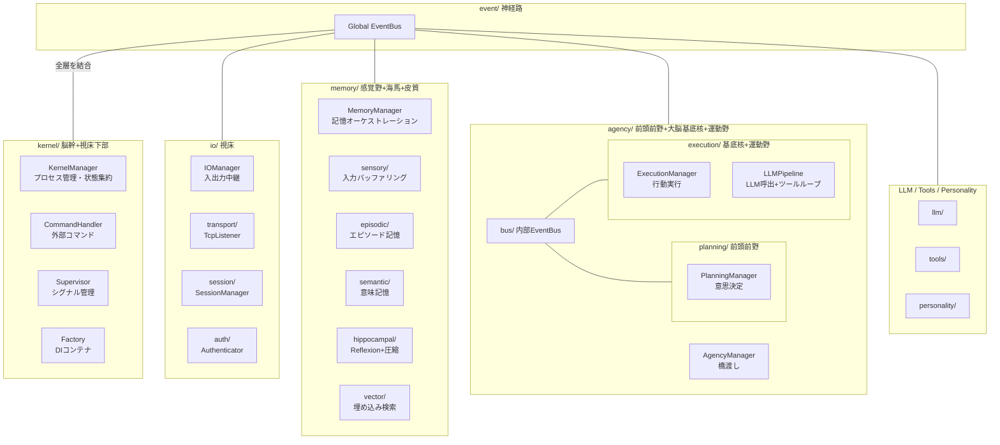
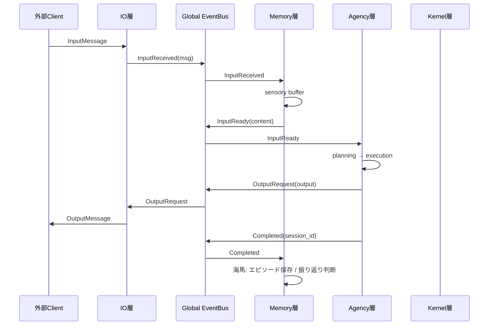
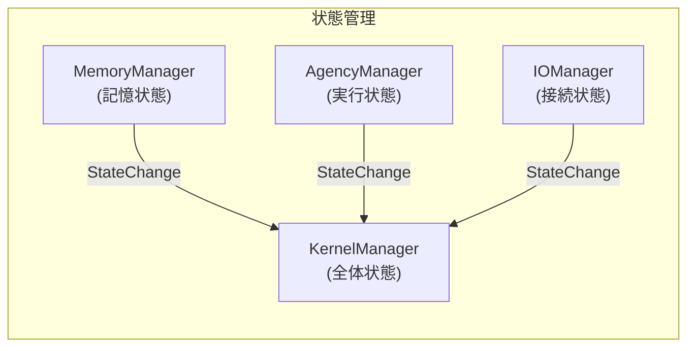
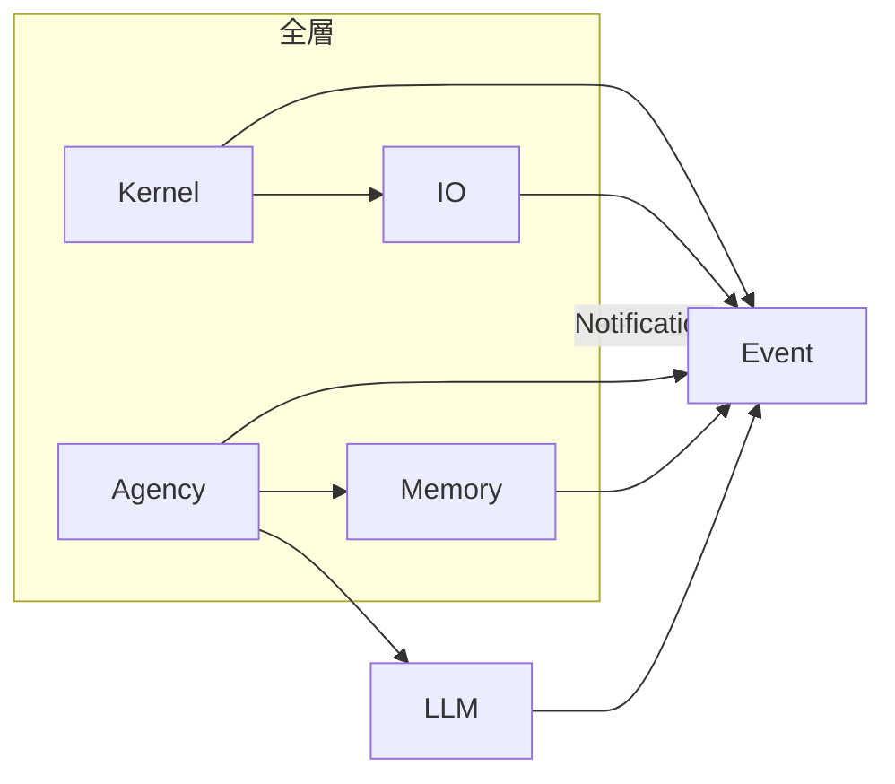

# Iris v2 アーキテクチャ設計書

## 1. 全体像

Iris v2 は脳科学・神経科学の構造を参考にした層分割アーキテクチャを採用する。



## 2. 層間イベントフロー（基本ループ）



## 3. ディレクトリ構成

```
iris/
├── __init__.py
│
├── kernel/                    # 脳幹: プロセス管理 + DI + コマンド
│   ├── __init__.py
│   ├── manager.py             KernelManager（lifecycle, health, state）
│   ├── process.py             KernelProcess（起動・停止）
│   ├── supervisor.py          Supervisor（シグナル・コンソール）
│   ├── factory.py             DIコンテナ（全層の構築）
│   └── commands/
│       ├── __init__.py
│       └── handler.py         CommandHandler（/shutdown, /status ...）
│
├── io/                        # 視床: 入出力中継
│   ├── __init__.py
│   ├── manager.py             IOManager
│   ├── models.py              InputMessage, OutputMessage ...
│   ├── transport/
│   │   ├── __init__.py
│   │   └── tcp_listener.py    TcpListener
│   ├── session/
│   │   ├── __init__.py
│   │   └── manager.py         SessionManager
│   └── auth/
│       ├── __init__.py
│       └── authenticator.py   Authenticator
│
├── event/                     # 神経路: グローバルEventBus
│   ├── __init__.py
│   ├── bus.py                 EventBus
│   └── events.py              イベント型定義
│
├── memory/                    # 記憶系: 感覚野 + 海馬 + 皮質
│   ├── __init__.py
│   ├── manager.py             MemoryManager（EventBus連携 + plugin呼出）
│   ├── sensory/
│   │   ├── __init__.py
│   │   └── buffer.py          InputBuffer（断片的入力保持）
│   ├── episodic/
│   │   ├── __init__.py
│   │   └── store.py           EpisodicStore（JSONL）
│   ├── semantic/
│   │   ├── __init__.py
│   │   └── store.py           SemanticStore（JSONL + ChromaDB）
│   ├── hippocampal/
│   │   ├── __init__.py
│   │   ├── reflexion.py       Reflexion（LLM分析）
│   │   └── compression.py     ContextManager（会話要約）
│   ├── personality/            # 人格: 性格特性・話し方（記憶から形成）
│   │   ├── __init__.py
│   │   ├── personality.py     Personality（システムプロンプト構築）
│   │   ├── persona_data.py    PersonaData（動的管理）
│   │   └── persona_profile.py PersonaProfile（話し方・性格）
│   └── vector/
│       ├── __init__.py
│       └── store.py           VectorStore（ONNX埋め込み）
│
├── agency/                    # 高度認知: PFC + 基底核 + 運動野
│   ├── __init__.py
│   ├── manager.py             AgencyManager（global↔internal橋渡し）
│   ├── bus.py                 Internal EventBus
│   ├── planning/
│   │   ├── __init__.py
│   │   └── manager.py         PlanningManager（意思決定）
│   └── execution/
│       ├── __init__.py
│       ├── manager.py         ExecutionManager（行動実行）
│       └── pipeline.py        LLMPipeline（LLM呼出 + ツールループ）
│
├── llm/                       # LLM インフラ（変更なし）
│   ├── __init__.py
│   ├── llm_bridge.py
│   ├── provider.py
│   ├── ollama_provider.py
│   ├── openrouter_provider.py
│   └── capability_checker.py
│
├── tools/                     # @tool, ToolRegistry, ビルトイン
    │   ├── __init__.py
    │   ├── decorator.py
    │   ├── models.py
    │   ├── registry.py
    │   └── builtins/              # ツール実装
    │       ├── file_ops/
    │       ├── code_exec/
    │       └── self_mod/
    │
    └── commands/                  # 削除（kernel/commands/ に移動）
```

## 4. グローバル EventBus 定義

```python
# iris/event/events.py

@dataclass
class InputReceived:
    message: InputMessage

@dataclass
class InputReady:
    session_id: str
    content: str
    context: dict

@dataclass
class OutputRequest:
    session_id: str
    message: OutputMessage

@dataclass
class OutputSent:
    session_id: str
    message_id: str

@dataclass
class Completed:
    session_id: str
    summary: str

@dataclass
class TimerTick:
    timestamp: datetime

@dataclass
class CommandRequest:
    command: str
    args: str
    session_id: str
```

## 5. 状態管理（統合）

`KernelManager` が全体状態を集約する。各層の Manager は自己状態を `StateChange` イベントで Kernel に通知する。



状態の種類と責任層:

| 状態 | 管理層 | 説明 |
|------|--------|------|
| `IDLE` | Kernel | システム全体が待機中 |
| `SENSING` | Memory | 入力をバッファリング中 |
| `DECIDING` | Agency/Planning | 意思決定中 |
| `EXECUTING` | Agency/Execution | LLM/Tool 実行中 |
| `CONSOLIDATING` | Memory/Hippocampal | 記憶整理中 |
| `INTERRUPTED` | Agency | 中断中 |
| `SLEEPING` | Kernel | 省電力モード |

## 6. 層間依存ルール



- 各層は直接の依存を持たず、EventBus を介して通信する
- ただし Factory（DI コンテナ）は全層のインスタンスを生成するため、kernel/factory.py に集約
- Agency の planning → execution は内部 EventBus を介する
- IO 層は TCP への依存を持つが、`io/transport/` に閉じる

## 7. 旧 v0.3 からの変更点一覧

| 項目 | v0.3 | v2 |
|------|------|----|
| kernel/services/ | 13ファイル全て | 解体、各層に分散 |
| kernel/event/ | kernel 内 | iris/event/ に分離 |
| kernel/io/ | kernel 内 | iris/io/ に分離 |
| ConversationService | 中央集権 | planning + execution に分散 |
| ProactiveEngine | 単一サービス | planning + execution に分割予定 |
| Reflexion | kernel/services/ | memory/hippocampal/ |
| ContextManager | kernel/services/ | memory/hippocampal/ |
| InputBuffer | kernel/io/ | memory/sensory/ |
| CommandHandler | iris/commands/ | kernel/commands/ |
