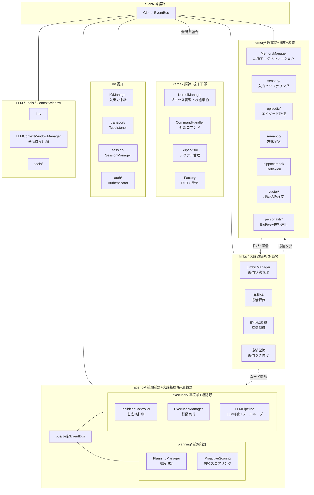
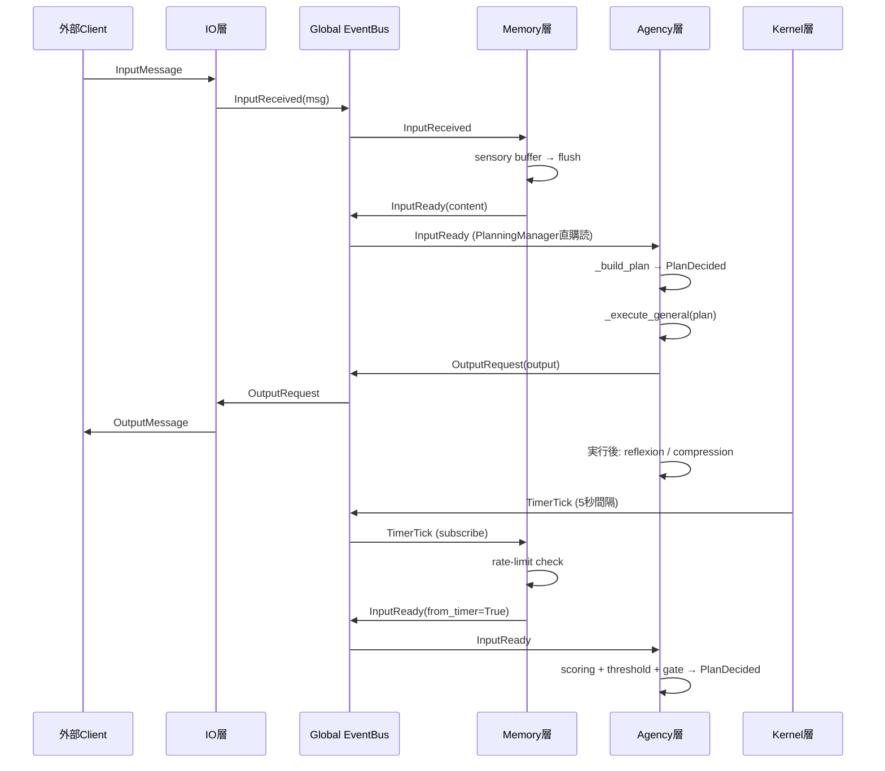
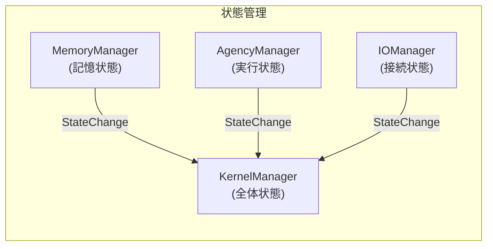
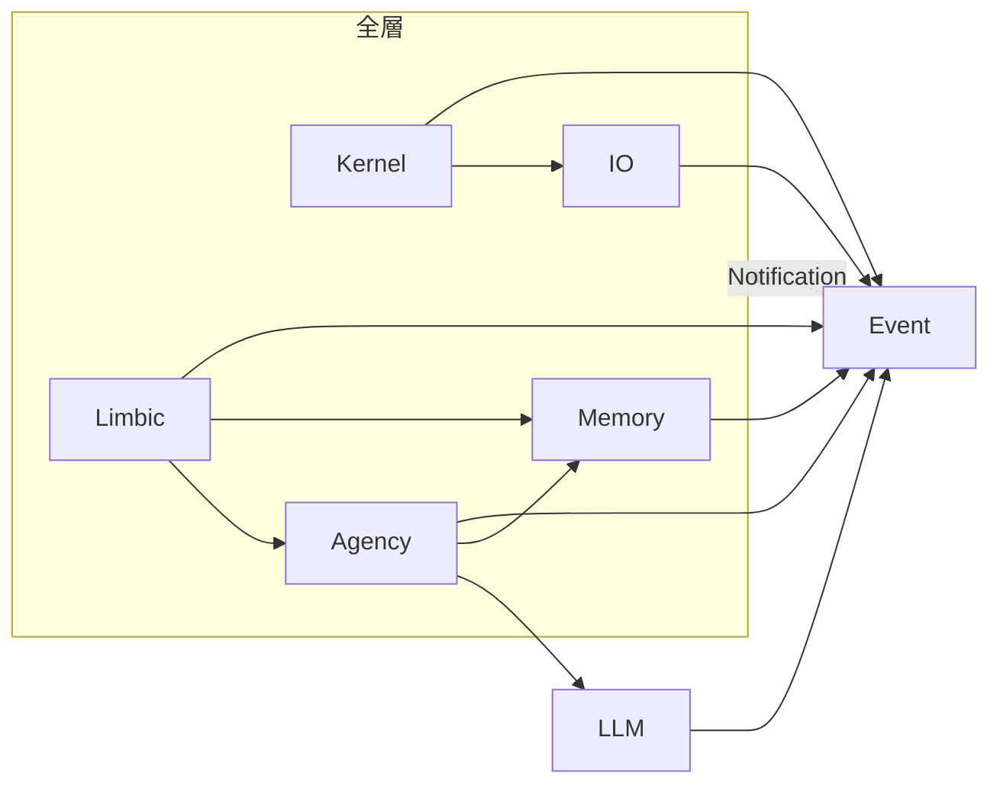

# Iris アーキテクチャ設計書

> **注記**: 本ドキュメントにおける脳科学・神経科学の用語と層分割の対応付けは、AI による文献調査を参考にした設計指針です。厳密な解剖学的・神経科学的正確性を保証するものではありません。

## 1. 全体像

Iris は脳科学・神経科学の構造を参考にした層分割アーキテクチャを採用する。



## 2. 層間イベントフロー（基本ループ）



## 3. ディレクトリ構成

```
iris/
├── __init__.py
│
├── kernel/                    # 脳幹: プロセス管理 + DI + コマンド
│   ├── __init__.py
│   ├── manager.py             KernelManager（lifecycle, health, state）
│   ├── process.py             KernelProcess（起動・停止, TimerTick発行）
│   ├── supervisor.py          Supervisor（シグナル・コンソール）
│   ├── factory.py             DIコンテナ（全層の構築）
│   └── commands/
│       ├── __init__.py
│       └── handler.py         CommandHandler（/shutdown, /status ...）
│
├── io/                        # 視床: 入出力中継
│   ├── __init__.py
│   ├── manager.py             IOManager
│   ├── models.py              InputMessage, OutputMessage ...
│   ├── transport/
│   │   ├── __init__.py
│   │   └── tcp_listener.py    TcpListener
│   ├── session/
│   │   ├── __init__.py
│   │   └── manager.py         SessionManager
│   └── auth/
│       ├── __init__.py
│       └── authenticator.py   Authenticator
│
├── event/                     # 神経路: グローバルEventBus
│   ├── __init__.py
│   ├── bus.py                 EventBus
│   └── event_types.py         イベント型定義
│
├── limbic/                    # 大脳辺縁系: 感情処理 (NEW)
│   ├── __init__.py
│   ├── manager.py             LimbicManager（感情状態管理, EventBus連携）
│   ├── models.py              EmotionState（PAD 3次元モデル）
│   ├── amygdala.py            扁桃体（感情評価・価値判断）
│   ├── acc.py                 前帯状皮質（感情制御・葛藤調整）
│   └── emotional_memory.py    扁桃体-海馬相互作用（感情タグ付け）
│
├── memory/                    # 記憶系: 感覚野 + 海馬 + 皮質
│   ├── __init__.py
│   ├── manager.py             MemoryManager（EventBus連携, TimerTick rate-limit）
│   ├── stores.py              EpisodicStore + SemanticStore（統合）
│   ├── vector_store.py        VectorStore（ONNX埋め込み）
│   ├── sensory/
│   │   ├── __init__.py
│   │   ├── buffer.py          InputBuffer（断片的入力保持）
│   │   └── readiness.py       ReadinessEvaluator
│   ├── hippocampal/
│   │   ├── __init__.py
│   │   └── reflexion.py       Reflexion, HippocampalManager
│   └── personality/            # 人格: 性格特性・話し方（記憶から形成）
│       ├── __init__.py
│       ├── personality.py     Personality（システムプロンプト構築）
│       ├── persona_data.py    PersonaData（動的管理）
│       ├── persona_profile.py PersonaProfile（話し方・性格）
│       └── big_five.py        BigFiveProfile + 性格進化 (NEW)
│
├── agency/                    # 高度認知: PFC + 基底核 + 運動野
│   ├── __init__.py
│   ├── manager.py             AgencyManager（compact_contextの中継のみ）
│   ├── bus.py                 Internal EventBus
│   ├── planning/
│   │   ├── __init__.py
│   │   ├── manager.py         PlanningManager（意思決定, InputReady購読）
│   │   └── scoring.py         ProactiveScoring（PFCスコアリング）
│   └── execution/
│       ├── __init__.py
│       ├── manager.py         ExecutionManager（行動実行, _execute_general統一）
│       ├── pipeline.py        LLMPipeline（generate + ツールループ）
│       ├── inhibition.py      InhibitionController（基底核抑制, GateVerdict）
│       ├── monitor.py         OutputMonitor（発話頻度監視）
│       ├── tool_executor.py   ToolExecutionEngine
│       └── interrupt_token.py InterruptToken
│
├── llm/                       # LLM 基盤
│   ├── __init__.py
│   ├── llm_bridge.py
│   ├── provider.py
│   ├── ollama_provider.py
│   ├── openrouter_provider.py
│   ├── capability_checker.py
│   └── context_window.py      LLMContextWindowManager（会話履歴圧縮）
│
└── tools/                     # @tool, ToolRegistry, ビルトイン
    ├── __init__.py
    ├── decorator.py
    ├── models.py
    ├── registry.py
    └── builtins/              # ツール実装
        ├── file_ops/
        ├── code_exec/
        ├── output/
        └── self_mod/
```

## 4. グローバル EventBus 定義

```python
# iris/event/event_types.py

@dataclass
class InputReceived:
    timestamp: float | None
    source: str
    session_id: str
    content: str
    msg_type: str
    is_final: bool

@dataclass
class InputReady:
    timestamp: float | None
    source: str
    session_id: str
    content: str
    context: dict | None

@dataclass
class OutputRequest:
    session_id: str
    message_type: str     # "stream" | "response"
    content: str
    state: str | None     # "thinking" | "speaking" | "done"

@dataclass
class TimerTick:
    timestamp: float
```

## 5. 状態管理（統合）

`KernelManager` が全体状態を集約する。各層の Manager は自己状態を `StateChange` イベントで Kernel に通知する。



状態の種類と責任層:

| 状態 | 管理層 | 説明 |
|------|--------|------|
| `IDLE` | Kernel | システム全体が待機中 |
| `SENSING` | Memory | 入力をバッファリング中 |
| `DECIDING` | Agency/Planning | 意思決定中 |
| `EXECUTING` | Agency/Execution | LLM/Tool 実行中 |
| `CONSOLIDATING` | Memory/Hippocampal | 記憶整理中 |
| `INTERRUPTED` | Agency | 中断中 |
| `SLEEPING` | Kernel | 省電力モード |

## 6. 層間依存ルール



- 各層は直接の依存を持たず、EventBus を介して通信する
- ただし Factory（DI コンテナ）は全層のインスタンスを生成するため、kernel/factory.py に集約
- Agency の planning → execution は内部 EventBus を介する
- IO 層は TCP への依存を持つが、`io/transport/` に閉じる
- Limbic 層は以下のインターフェースで他層と統合する:
  - `build_mood_description()` → LLMPipeline がシステムプロンプトに注入
  - `apply_limbic_modulation(emotion)` → InhibitionController が感情による抑制変調に利用 (inhibition.py)
  - `tag_recent_memory()` → EmotionalMemory が EpisodicStore に感情タグを付与
  - `current_emotion()` → ProactiveScoring が自発発話スコアリングの mood 因子として利用


