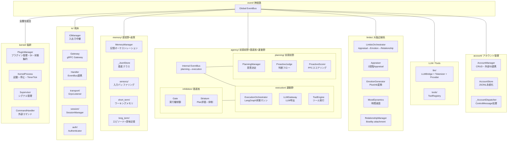
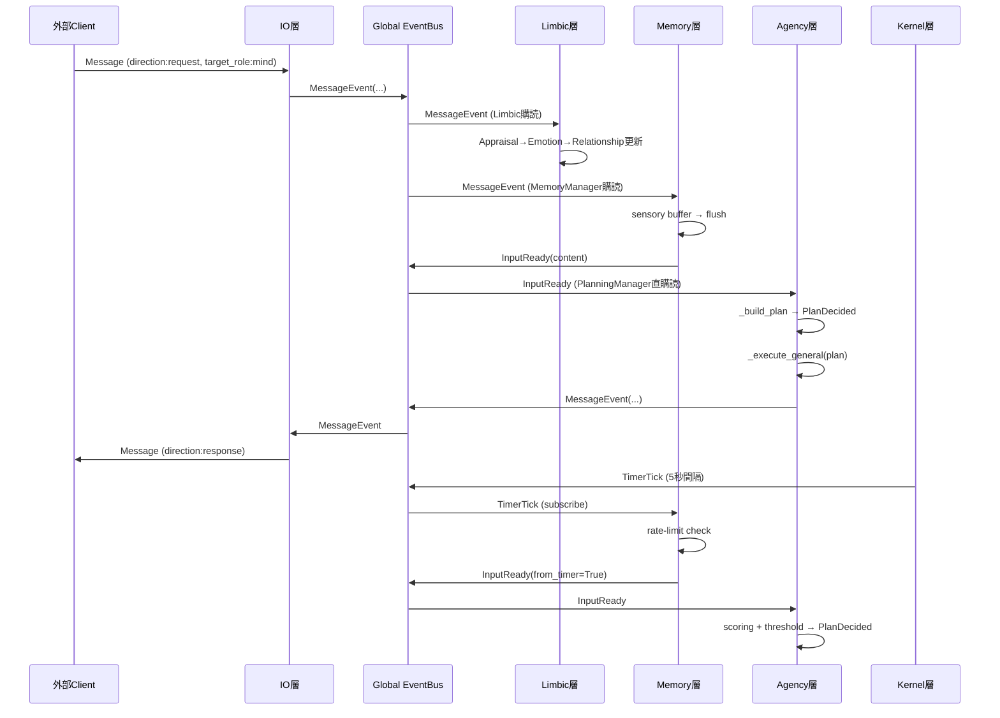
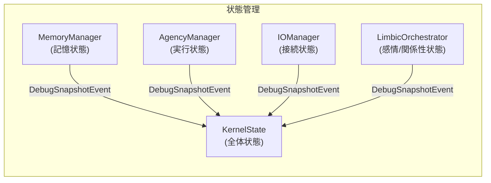
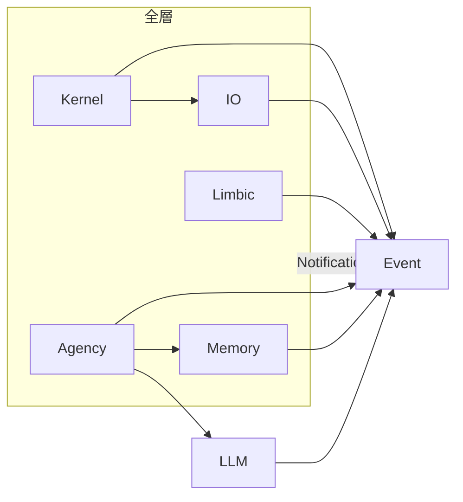

# Iris アーキテクチャ設計書

> **注記**: 本ドキュメントにおける脳科学・神経科学の用語と層分割の対応付けは、AI による文献調査を参考にした設計指針です。厳密な解剖学的・神経科学的正確性を保証するものではありません。

## 1. 全体像

Iris は脳科学・神経科学の構造を参考にした層分割アーキテクチャを採用する。



## 2. 層間イベントフロー（基本ループ）



## 3. ディレクトリ構成

```
iris/
├── __init__.py
│
├── kernel/                    # 脳幹: プロセス管理 + Pluginシステム + コマンド
│   ├── __init__.py
│   ├── manager.py             PluginManager（全Plugin指揮 + DI + 状態集約）
│   ├── process.py             KernelProcess（起動・停止, TimerTick発行）
│   ├── supervisor.py          Supervisor（シグナル管理）
│   ├── config.py              KernelConfig
│   ├── capture_formatter.py   DebugCapture出力整形
│   ├── debug_capture.py       DebugCapture（キャプチャ管理）
│   ├── diagnostics.py         SystemDiagnostics（状態診断）
│   ├── logging.py             Logging設定
│   ├── plugin/                # プラグインシステム
│   │   ├── manifest.py
│   │   ├── protocol.py
│   │   ├── lifecycle.py
│   │   ├── service_container.py
│   │   ├── kernel_state.py
│   │   ├── hook_points.py
│   │   ├── hooks.py
│   │   └── loader.py
│   └── commands/
│       ├── __init__.py
│       ├── handler.py         CommandHandler（/shutdown, /status ...）
│       ├── debug_commands.py  デバッグコマンド
│       ├── info_commands.py   情報表示コマンド
│       ├── memory_commands.py 記憶操作コマンド
│       └── state_utils.py     状態ユーティリティ
│
├── io/                        # 視床: 入出力中継
│   ├── __init__.py
│   ├── manager.py             IOManager
│   ├── models.py              Message, CommandInput, CommandOutput ...
│   ├── hooks.py               Hook登録
│   ├── gateway.py             gRPC Gateway
│   ├── handler.py             IO Handler（EventBus連携）
│   ├── transport/
│   │   ├── __init__.py
│   │   ├── iris_service.proto     gRPC Proto定義
│   │   ├── grpc_service_pb2.py    自動生成Protobuf
│   │   ├── grpc_service_pb2_grpc.py 自動生成gRPCスタブ
│   │   ├── grpc_server.py        GrpcServer
│   │   └── grpc_listener.py      GrpcListener
│   ├── session/
│   │   ├── __init__.py
│   │   ├── manager.py         SessionManager
│   │   ├── config.py          SessionConfig
│   │   └── permissions.py     Permission管理
│   └── auth/
│       ├── __init__.py
│       └── authenticator.py   Authenticator
│
├── event/                     # 神経路: グローバルEventBus
│   ├── __init__.py
│   ├── event_bus.py           EventBus
│   ├── event_types.py         イベント型定義
│   └── tracer.py              EventTracer
│
├── account/                   # アカウント管理: ユーザー識別・外部ID連携
│   ├── __init__.py            AccountPlugin (STORE phase)
│   ├── models.py              Account, SessionBinding
│   ├── store.py               AccountStore（JSONL永続化）
│   ├── manager.py             AccountManager（コアサービス）
│   ├── events.py              AccountCreated/Updated/SessionBound/Unbound
│   ├── dispatcher.py          _AccountDispatcher（ControlMessage処理）
│   └── hooks.py               EventBus Hook登録
│
├── heartbeat/                 # TimerTick heartbeat Plugin
│   ├── __init__.py
│   └── service.py             HeartbeatService
│
├── memory/                    # 記憶系: 感覚野 + 皮質（3層構造）
│   ├── __init__.py
│   ├── manager.py             MemoryManager（EventBus連携, ディスパッチャ）
│   ├── protocol.py            MemoryManagerProtocol
│   ├── handler.py             イベントハンドラ
│   ├── dispatcher.py          store/retrieve/search ディスパッチ
│   ├── builder.py             コンポーネント組立
│   ├── hooks.py               Plugin Hook登録
│   ├── base.py                _JsonlStore 基底
│   ├── models.py              ContentBlock等 共通型定義
│   ├── sensory/               # 感覚記憶: 生入力の一時保持
│   │   ├── __init__.py
│   │   ├── manager.py         SensoryMemoryManager（断片入力 + raw入力 2系統）
│   │   └── readiness.py       ReadinessEvaluator
│   ├── short_term/            # 短期記憶（ワーキングメモリ）
│   │   ├── __init__.py
│   │   ├── manager.py         ShortTermMemoryManager
│   │   ├── models.py          TurnData, SearchResult
│   │   ├── scorer.py          重要度スコアリング
│   │   ├── extractor.py       エンティティ抽出
│   │   └── renderer.py        コンテキストレンダリング
│   └── long_term/             # 長期記憶
│       ├── __init__.py
│       ├── manager.py         LongTermMemoryManager
│       ├── stores.py          EpisodicStore + SemanticStore + AgentsMdStore
│       ├── protocols.py       Store プロトコル定義
│       ├── goal_store.py      GoalStore（長期目標管理）
│       └── vector_store.py    VectorStore（ChromaDB + BM25 ハイブリッド）
│
├── agency/                    # 高度認知: PFC + 基底核 + 運動野
│   ├── __init__.py
│   ├── task_level.py           TaskLevel定義 + resolve_level()
│   ├── manager.py             AgencyManager
│   ├── internal_bus.py        Internal EventBus（planning→execution）
│   ├── builder.py             コンポーネント組み立て
│   ├── hooks.py               Plugin Hook登録
│   ├── modulation.py          Agency変調（感情→意思決定への影響）
│   ├── inhibition/            # 基底核: 抑制制御（Striatum+Gate）
│   │   ├── __init__.py
│   │   ├── manager.py         InhibitionManager
│   │   ├── handler.py         抑制ハンドラ
│   │   ├── gate.py            Gate（実行権制御）
│   │   ├── striatum.py        Striatum（Plan評価）
│   │   └── models.py          GateDecision
│   ├── planning/              # 前頭前野: 意思決定
│   │   ├── __init__.py
│   │   ├── manager.py         PlanningManager
│   │   ├── models.py          Plan, PlanReason
│   │   ├── handler.py         Planning Handler（EventBus連携）
│   │   ├── context_hint_builder.py  ContextHintBuilder
│   │   ├── question_generator.py    質問生成
│   │   ├── task_content.py          is_task_content
│   │   ├── utils.py                 Utilities
│   │   ├── decisions/         # プロアクティブ判断
│   │   │   ├── __init__.py
│   │   │   ├── judge.py       ProactiveJudge
│   │   │   └── scorer.py      ProactiveScorer
│   │   └── strategies/        # 計画構築ストラテジ
│   │       ├── __init__.py
│   │       ├── response.py    ResponsePlanStrategy
│   │       └── proactive.py   ProactivePlanStrategy
│   └── execution/             # 基底核+運動野: 行動実行
│       ├── __init__.py
│       ├── orchestrator.py         ExecutionOrchestrator（LangGraph）
│       ├── router.py               LLM応答後ルーティング
│       ├── executor.py             FlowExecutor（Plan購読→グラフ起動）
│       ├── models.py               ExecutionState + DynamicState
│       ├── engine.py               ToolEngine
│       ├── builder.py              ノード・グラフ組立
│       ├── node_type.py            ノード種別定義
│       ├── worker.py               バックグラウンドワーカー
│       ├── handler.py              実行イベントハンドラ
│       ├── llm/
│       │   ├── __init__.py
│       │   ├── gateway.py          LLMGateway
│       │   ├── prompt_builder.py   SystemPromptBuilder
│       │   ├── node_prompt_factory.py  ノード別プロンプト
│       │   ├── profile_builder.py      プロファイル構築
│       │   └── capture.py              LLM入出力キャプチャ
│       ├── nodes/                  # LangGraph ノード
│       │   ├── __init__.py
│       │   ├── base.py             BaseLLMNode
│       │   ├── general_chat.py     GeneralChatNode
│       │   ├── general_task.py     GeneralTaskNode
│       │   ├── setup.py            SetupNode
│       │   ├── tool_run.py         ToolRunNode
│       │   └── finalize.py         FinalizeNode
│       └── regulation/
│           └── consolidator.py     Context圧縮
│
├── limbic/                    # 辺縁系: 感情・関係性 (階段整合
│   ├── __init__.py            LimbicPlugin (LAYER/phase=20)
│   ├── models.py              データ型定義
│   ├── appraiser.py           2段階Appraisal (Lazarus)
│   ├── generator.py           Appraisal→Emotion (Plutchik)
│   ├── mood.py                Mood dynamics
│   ├── relationship.py        Bowlby attachment + 3段階関係性
│   ├── state.py               状態統合
│   ├── orchestrator.py        パイプライン統合
│   └── hooks.py               EventBus購読
│
│   ├── llm/                       # LLM 基盤
│   │   ├── __init__.py
│   │   ├── bridge.py              LLMBridge（マルチプロバイダルーター）
│   │   ├── capability.py          CapabilityChecker
│   │   ├── context.py             LLMContextWindowManager
│   │   ├── hooks.py               Plugin Hook登録
│   │   ├── interrupt_token.py     InterruptToken
│   │   ├── model_factory.py       ChatModelファクトリ
│   │   ├── priority_lock.py       PriorityLock
│   │   ├── prompt.py              Personality（システムプロンプト構築）
│   │   ├── repetition.py          繰り返し検出
│   │   ├── token_utils.py         トークン推定ユーティリティ
│   │   ├── tokenizer.py           TokenizerManager
│   │   └── providers/
│   │       ├── __init__.py
│   │       ├── base.py            Provider基底
│   │       ├── ollama.py          Ollamaプロバイダ
│   │       └── openai_compatible.py  OpenAI互換プロバイダ
│
├── tools/                     # @tool, ToolRegistry
│   ├── __init__.py
│   ├── decorator.py           @tool デコレータ
│   ├── models.py              ToolDef, ToolCall
│   ├── registry.py            ToolRegistry
│   └── builtins/              組み込みツール
│
└── admin/                     # CLI管理
    ├── __init__.py
    └── __main__.py            CLIエントリポイント
```

## 4. グローバル EventBus 定義

全イベントは `Event` 基底クラスを継承する（`kw_only=True`、`timestamp`/`source`/`trace_id` を持つ）。
イベント型名は自動レジストリ（`_type_registry`）で管理され、`to_dict()` / `from_dict()` でシリアライズ可能。

```python
# iris/event/event_types.py

@dataclass(kw_only=True)
class Event:
    timestamp: datetime | None
    source: str
    trace_id: str = ""
    # _type_registry, to_dict(), from_dict()

@dataclass
class TimerTick(Event):
    tick_count: int = 0

@dataclass
class AgentStateChangeEvent(Event):
    previous_state: str | None
    new_state: str | None

@dataclass
class MemoryUpdateEvent(Event):
    entry_type: str
    content: str

@dataclass
class AgentAnomalyEvent(Event):
    anomaly_type: str
    severity: str
    detail: str

@dataclass
class MessageEvent(Event):
    session_id: str = ""
    source_role: str = ""
    target_role: str = ""
    account_id: str = ""
    room_id: str = ""
    direction: str = ""      # "request" | "response" | "stream" | "event"
    msg_type: str = ""       # "chat" | "system" | "stream" | "response" | ...
    content: str = ""
    state: str | None = None
    correlation_id: str | None = None

@dataclass
class InputReady(Event):
    session_id: str = ""
    content: str = ""
    account_id: str = ""
    room_id: str = ""
    context: dict | None = None

@dataclass
class ClientSessionEvent(Event):
    session_id: str = ""
    action: str = ""         # "connected" | "disconnected"
    role: str = ""
    session_tag: str = ""
    offline_duration: str = ""

@dataclass
class DebugSnapshotEvent(Event):
    category: str = ""
    data: dict | None = None
    trigger: str = ""

@dataclass
class InterruptEvent(Event):
    session_id: str = ""
```

## 5. 状態管理（統合）

`KernelState`（`iris/kernel/plugin/kernel_state.py`）が全体状態を集約する。
各層の Manager は自己状態を `DebugSnapshotEvent` で通知する。SystemDiagnostics が `get_state()` 命名規約で自動発見する。



状態の種類と責任層:

| 状態 | 管理層 | 説明 |
|------|--------|------|
| `IDLE` | Kernel | システム全体が待機中 |
| `SENSING` | Memory | 入力をバッファリング中 |
| `DECIDING` | Agency/Planning | 意思決定中 |
| `EXECUTING` | Agency/Execution | LLM/Tool 実行中 |
| `INTERRUPTED` | Agency | 中断中 |
| `SLEEPING` | Kernel | 省電力モード |

## 6. 層間依存ルール



- 各層は直接の依存を持たず、EventBus を介して通信する
- PluginManager が全層の構築、DI、ライフサイクル管理を行う（`kernel/manager.py`）
- Agency の planning → execution は内部 EventBus を介する
- IO 層は gRPC への依存を持つが、`io/transport/` に閉じる
- 全Pluginの依存は `PluginManifest.dependencies` に宣言、PluginManagerがトポロジカルソートで解決
