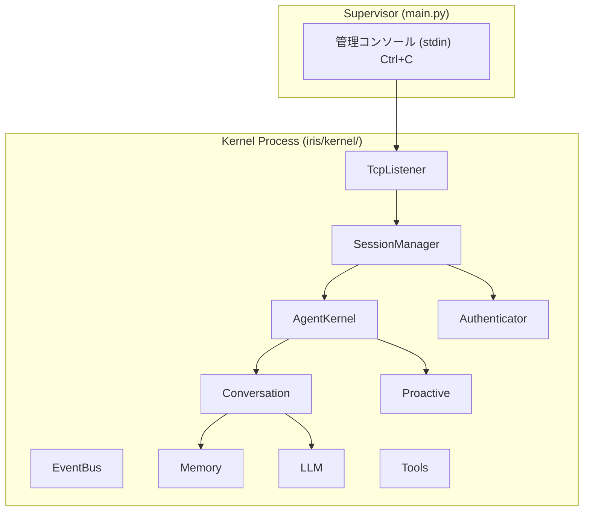
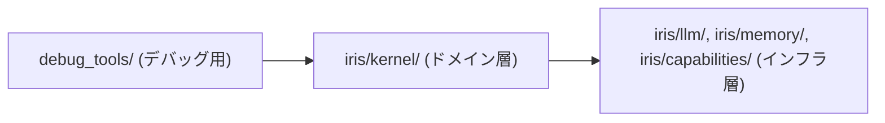
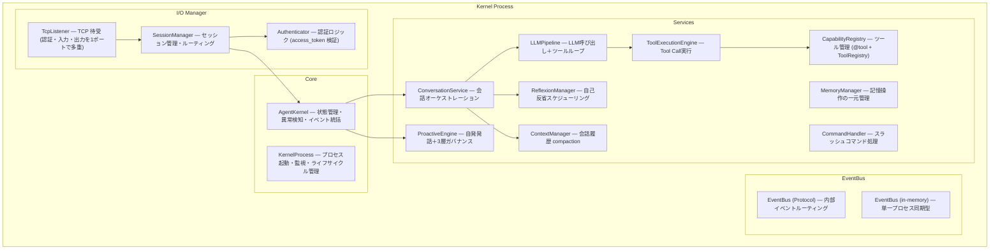
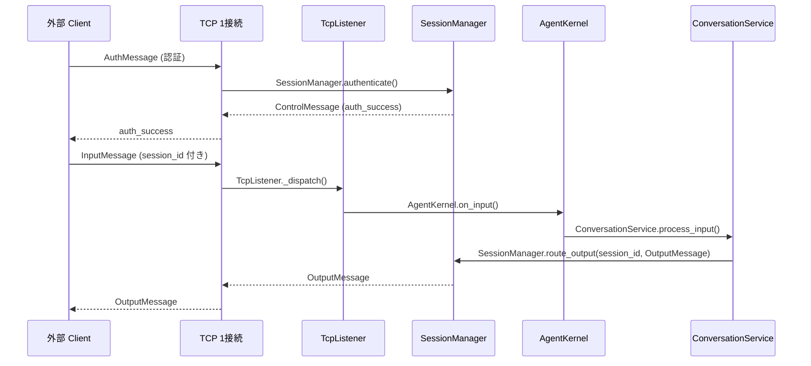
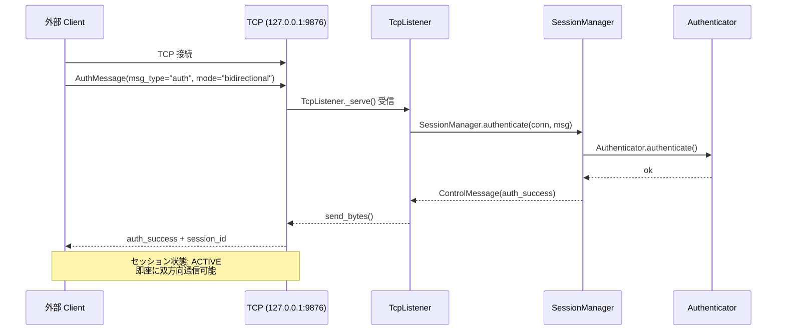
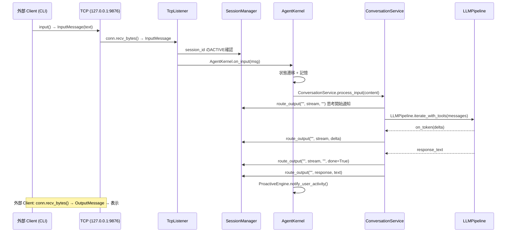

# Iris アーキテクチャ設計書 — Kernel-only

## 1. 全体像

このリポジトリは Iris Kernel 本体のみを提供する。UI 層（CLI 等）は別プロジェクトが担当する。
Kernel は Supervisor (main.py) により管理され、TCP で外部プロセスからの制御を受け付ける。



Kernel は TcpListener が1ポートで全接続を受け付け、認証・入力・出力を単一の TCP 接続で多重化する。
認証は接続確立後の最初のメッセージとして行い、成功後は同一接続で双方向通信を行う。
UI 層（CLI 等）はこのリポジトリの管轄外とし、TCP を介して別プロジェクトから接続する。

## 2. レイヤードアーキテクチャ（v0.2 からの継承）

### 依存方向



- v0.2 のヘキサゴナルアーキテクチャを継承
- `iris/kernel/` はドメイン層として変化しない
- Kernel は TCP で公開インターフェースを提供するが、UI層はこのリポジトリの管轄外

### コンポーネントマップ（Kernel Process 内部）



## 3. イベント駆動設計

### EventBus Protocol

```python
class EventBusProtocol(Protocol):
    def publish(self, event: Event) -> None: ...
    def subscribe(self, event_type: str, handler: Callable) -> None: ...
    def unsubscribe(self, event_type: str, handler: Callable) -> None: ...
```

### イベント種別

内部イベント（EventBus 経由）:

| イベント | 説明 | 送信元 → 送信先 |
|----------|------|----------------|
| `TimerTick` | 定期タイマー | Kernel (内部) |
| `AgentStateChangeEvent` | 状態遷移 | Kernel (内部) |
| `MemoryUpdateEvent` | 記憶更新 | Kernel (内部) |
| `AgentAnomalyEvent` | 異常検知 | Kernel → Output |

### I/O Message モデル

プロセス間通信は Event ではなく Pydantic モデル（`InputMessage` / `OutputMessage`）を使用する。
EventBus は Kernel 内部のイベントルーティングに限定され、プロセス間は Pipe 経由の JSON メッセージでやり取りする。

```python
# iris/kernel/io/models.py
class ConnectionMode(Enum):
    INPUT_ONLY = "input_only"
    OUTPUT_ONLY = "output_only"
    BIDIRECTIONAL = "bidirectional"

class SessionState(Enum):
    ACTIVE = "active"
    CLOSED = "closed"

class AuthMessage(BaseModel):
    msg_type: str = "auth"
    access_token: str | None = None
    mode: ConnectionMode = ConnectionMode.BIDIRECTIONAL

class ControlMessage(BaseModel):
    msg_type: str  # "auth_success", "auth_failure", "error"
    session_id: str | None = None
    error_message: str | None = None

class InputMessage(BaseModel):
    id: str           # uuid4 hex (12桁)
    session_id: str   # セッション識別子
    source: str       # "cli", "tcp", ...
    msg_type: str     # "text", "command", ...
    content: str      # メッセージ本文
    content_type: str # "text/plain" (default)
    metadata: dict    # 拡張用

class OutputMessage(BaseModel):
    id: str
    session_id: str   # セッション識別子
    correlation_id: str | None  # 対応する入力のID
    msg_type: str     # "response", "stream", "proactive", "anomaly", ...
    content: str      # メッセージ本文
    content_type: str # "text/plain", "text/markdown", ...
    destinations: list[str] | None  # 出力先フィルタ
    metadata: dict

class SessionInfo(BaseModel):
    session_id: str
    state: SessionState
    mode: ConnectionMode
    conn: Any | None
    created_at: datetime
    last_activity: datetime
```

**データフロー:**



### 認証・セッション管理フロー



### イベントフロー例



## 4. 3層ガバナンス（v0.2 から継承）

| Tier | 方式 | 例 |
|------|------|-----|
| Tier 1 | ルールベース自動許可 | 挨拶・定型確認 |
| Tier 2 | LLM自己判断 | 話題提案・気遣い |
| Tier 3 | AgentKernel介入 | 異常検知・過剰発話抑制 |

詳細は `docs/proactive-engine.md` を参照。

## 5. 状態遷移（v0.2 から継承）

`AgentStateManager` が管理する6状態：
IDLE / PROCESSING / PROACTIVE / REFLECTING / THINKING / SLEEPING

詳細は `docs/agent-state.md` を参照。

## 6. 記憶システム（v0.2 から継承）

| 記憶種別 | 技術 | 上限 |
|----------|------|------|
| EpisodicStore | JSONL | 30エントリ |
| SemanticStore | ChromaDB + BM25 | 100エントリ |
| PersonaProfile | JSON | 動的 |

詳細は `docs/memory-manager.md` を参照。

## 7. フォルダ構成（v0.3 現在）

```
iris-kernel/
├── .iris/                    # 設定・データ
│   ├── config/
│   └── data/
├── debug_tools/              # デバッグ用
├── docs/
│   └── adr/
├── iris/
│   ├── kernel/               # ドメイン層
│   │   ├── core/             # AgentKernel, KernelProcess, Factory
│   │   ├── event/            # EventBus
│   │   ├── io/               # TcpListener, SessionManager, Authenticator, models
│   │   └── services/         # Conversation, Proactive, Memory, LLMPipeline, Reflexion, ToolExec
│   ├── llm/                  # LLM通信
│   ├── memory/               # 記憶管理
│   ├── capabilities/         # ツール実装
│   ├── tools/                # ToolRegistry, @tool
│   ├── commands/
│   └── personality/
├── main.py
└── config.yaml
```
