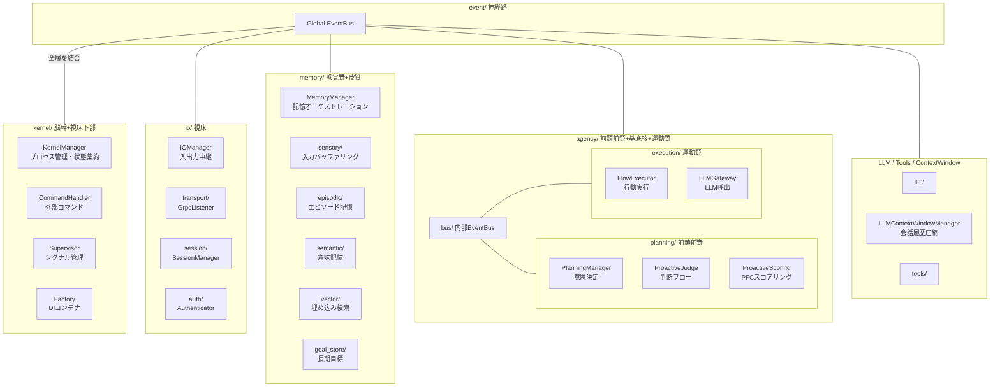
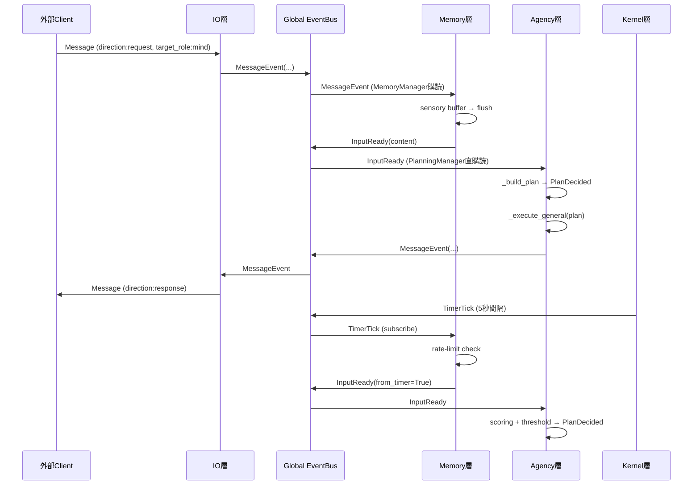
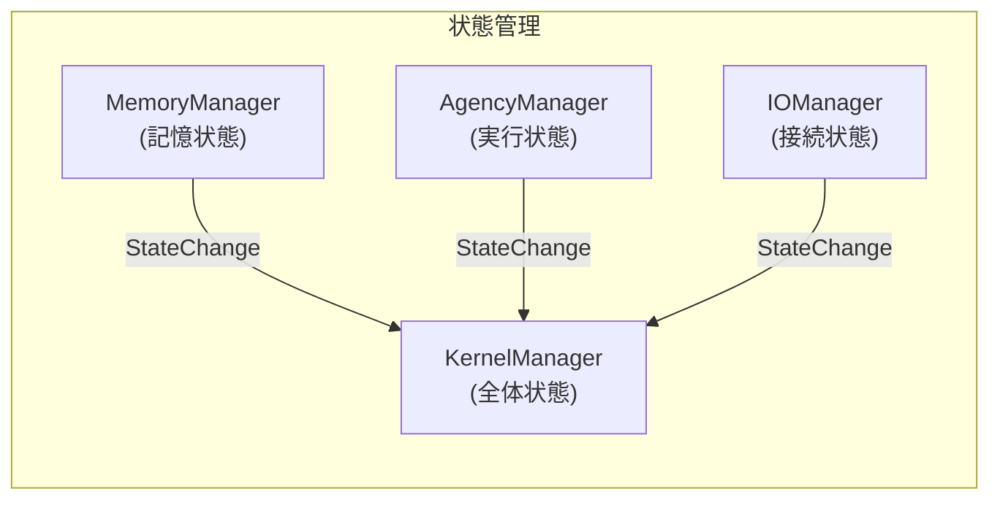
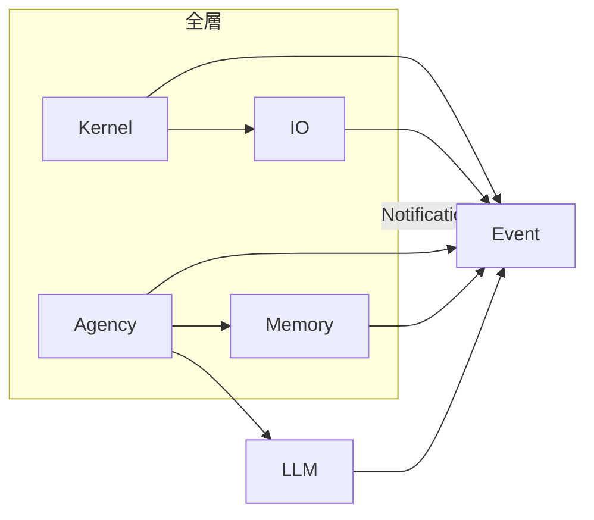

# Iris アーキテクチャ設計書

> **注記**: 本ドキュメントにおける脳科学・神経科学の用語と層分割の対応付けは、AI による文献調査を参考にした設計指針です。厳密な解剖学的・神経科学的正確性を保証するものではありません。

## 1. 全体像

Iris は脳科学・神経科学の構造を参考にした層分割アーキテクチャを採用する。



## 2. 層間イベントフロー（基本ループ）



## 3. ディレクトリ構成

```
iris/
├── __init__.py
│
├── kernel/                    # 脳幹: プロセス管理 + DI + コマンド
│   ├── __init__.py
│   ├── manager.py             KernelManager（lifecycle, health, state）
│   ├── process.py             KernelProcess（起動・停止, TimerTick発行）
│   ├── supervisor.py          Supervisor（シグナル・コンソール）
│   ├── factory.py             DIコンテナ（全層の構築）
│   └── commands/
│       ├── __init__.py
│       └── handler.py         CommandHandler（/shutdown, /status ...）
│
├── io/                        # 視床: 入出力中継
│   ├── __init__.py
│   ├── manager.py             IOManager
│   ├── models.py              InputMessage, OutputMessage ...
│   ├── transport/
│   │   ├── __init__.py
│   │   ├── iris_service.proto     gRPC Proto定義 (proto/iris/io/)
│   │   ├── grpc_service_pb2.py    自動生成Protobuf
│   │   ├── grpc_service_pb2_grpc.py 自動生成gRPCスタブ
│   │   └── grpc_server.py        GrpcListener / GrpcServer
│   ├── session/
│   │   ├── __init__.py
│   │   └── manager.py         SessionManager
│   └── auth/
│       ├── __init__.py
│       └── authenticator.py   Authenticator
│
├── event/                     # 神経路: グローバルEventBus
│   ├── __init__.py
│   ├── bus.py                 EventBus
│   └── event_types.py         イベント型定義
│
├── memory/                    # 記憶系: 感覚野 + 皮質（3層構造）
│   ├── __init__.py
│   ├── manager.py             MemoryManager（EventBus連携, TimerTick rate-limit, ディスパッチャ）
│   ├── sensory/               # 感覚記憶: 生入力の一時保持
│   │   ├── __init__.py
│   │   ├── manager.py         SensoryMemoryManager（断片入力 + raw入力 2系統）
│   │   └── readiness.py       ReadinessEvaluator
│   ├── short_term/            # 短期記憶（ワーキングメモリ）
│   │   ├── __init__.py
│   │   └── manager.py         ShortTermMemoryManager（ターン管理, 検索, エンティティ抽出）
│   ├── long_term/             # 長期記憶: エピソード記憶 + 意味記憶
│   │   ├── __init__.py
│   │   ├── manager.py         LongTermMemoryManager（統合IF）
│   │   ├── stores.py          EpisodicStore + SemanticStore
│   │   └── vector_store.py    VectorStore（ChromaDB + BM25 ハイブリッド）
│   ├── goal_store.py          GoalStore（長期目標管理）
│
├── agency/                    # 高度認知: PFC + 運動野
│   ├── __init__.py
│   ├── task_level.py           TaskLevel定義 + resolve_level()
│   ├── manager.py             AgencyManager
│   ├── bus.py                 Internal EventBus（planning→execution）
│   ├── planning/              # 前頭前野: 意思決定
│   │   ├── __init__.py
│   │   ├── manager.py         PlanningManager（意思決定, InputReady購読）
│   │   ├── context_hint_builder.py  ContextHintBuilder（文脈ヒント構築）
│   │   ├── task_content.py          is_task_content（タスク判定）
│   │   ├── decisions/         # プロアクティブ判断サブパッケージ
│   │   │   ├── __init__.py    ProactiveJudge, ProactiveScoring を公開
│   │   │   ├── judge.py       ProactiveJudge（判断フロー）
│   │   │   └── scoring.py     ProactiveScoring（PFCスコアリング）
│   │   └── strategies/        # 計画構築ストラテジ
│   │       ├── __init__.py
│   │       ├── response.py    ResponsePlanStrategy（応答計画）
│   │       └── proactive.py   ProactivePlanStrategy（自発発話計画）
│   └── execution/             # 運動野: 行動実行
│       ├── __init__.py
│       ├── orchestrator.py         ExecutionOrchestrator（LangGraph グラフ）
│       ├── executor.py             FlowExecutor（入口, Plan購読）
│       ├── state.py                ExecutionState + DynamicState
│       ├── engine.py               ToolEngine（ツール実行）
│       ├── llm/
│       │   ├── __init__.py
│       │   ├── gateway.py          LLMGateway（LLM呼出）
│       │   └── prompt_builder.py   SystemPromptBuilder
│       ├── nodes/                  # LangGraph ノード
│       │   ├── __init__.py
│       │   ├── base.py             BaseLLMNode（抽象基底クラス）
│       │   ├── general_chat.py     GeneralChatNode（低レベル簡易応答）
│       │   ├── general_task.py     GeneralTaskNode（高レベルタスク実行）
│       │   ├── setup.py            SetupNode（初期化）
│       │   ├── tool_run.py         ToolRunNode（ツール実行）
│       │   └── finalize.py         FinalizeNode（完了処理）
│       └── regulation/             # 後処理
│           └── consolidator.py     Consolidator（Context圧縮）
│
├── llm/                       # LLM 基盤
│   ├── __init__.py
│   ├── llm_bridge.py          LLMBridge（マルチプロバイダルーター）
│   ├── provider.py            LLMProvider / ProviderFactory Protocol
│   ├── ollama_provider.py     Ollamaプロバイダ
│   ├── openai_compatible_provider.py  OpenAI互換REST API共通基底（OpenRouter/Googleが継承）
│   ├── openrouter_provider.py OpenRouterプロバイダ
│   ├── google_provider.py     Googleプロバイダ
│   ├── priority_lock.py       PriorityLock（優先度付き非同期排他ロック）
│   ├── capability_checker.py
│   ├── tokenizer_manager.py   TokenizerManager（tokenizersラッパー）
│   ├── context_window.py      LLMContextWindowManager（会話履歴圧縮）
│   ├── prompt_builder.py      Personality（システムプロンプト構築）
│   └── interrupt_token.py     InterruptToken（LLM生成の中断制御）
│
└── tools/                     # @tool, ToolRegistry, ビルトイン
    ├── __init__.py
    ├── decorator.py
    ├── models.py
    ├── registry.py
    └── builtins/              # (空) ツール実装
```

## 4. グローバル EventBus 定義

全イベントは `Event` 基底クラスを継承する（`kw_only=True`、`timestamp`/`source`/`trace_id` を持つ）。
イベント型名は自動レジストリ（`_type_registry`）で管理され、`to_dict()` / `from_dict()` でシリアライズ可能。

```python
# iris/event/event_types.py

@dataclass(kw_only=True)
class Event:
    timestamp: datetime | None
    source: str
    trace_id: str = ""
    # _type_registry, to_dict(), from_dict()

@dataclass
class TimerTick(Event):
    tick_count: int = 0

@dataclass
class AgentStateChangeEvent(Event):
    previous_state: str | None
    new_state: str | None

@dataclass
class MemoryUpdateEvent(Event):
    entry_type: str
    content: str

@dataclass
class AgentAnomalyEvent(Event):
    anomaly_type: str
    severity: str
    detail: str

@dataclass
class MessageEvent(Event):
    session_id: str
    source_role: str
    target_role: str
    direction: str           # "request" | "response" | "stream" | "event"
    msg_type: str            # "chat" | "system" | "stream" | "response" | ...
    content: str
    state: str | None
    correlation_id: str | None

@dataclass
class InputReady(Event):
    session_id: str
    content: str
    context: dict | None

@dataclass
class ClientSessionEvent(Event):
    session_id: str
    action: str              # "connected" | "disconnected"
    role: str
    identity: str
    offline_duration: str    # 切断されていた期間（例: "3時間20分間"）

@dataclass
class DebugSnapshotEvent(Event):
    category: str
    data: dict | None
    trigger: str

@dataclass
class ProactiveResultEvent(Event):
    topic: str
    success: bool = True
    content: str
```

## 5. 状態管理（統合）

`KernelManager` が全体状態を集約する。各層の Manager は自己状態を `StateChange` イベントで Kernel に通知する。



状態の種類と責任層:

| 状態 | 管理層 | 説明 |
|------|--------|------|
| `IDLE` | Kernel | システム全体が待機中 |
| `SENSING` | Memory | 入力をバッファリング中 |
| `DECIDING` | Agency/Planning | 意思決定中 |
| `EXECUTING` | Agency/Execution | LLM/Tool 実行中 |
| `INTERRUPTED` | Agency | 中断中 |
| `SLEEPING` | Kernel | 省電力モード |

## 6. 層間依存ルール



- 各層は直接の依存を持たず、EventBus を介して通信する
- ただし Factory（DI コンテナ）は全層のインスタンスを生成するため、kernel/factory.py に集約
- Agency の planning → execution は内部 EventBus を介する
- IO 層は gRPC への依存を持つが、`io/transport/` に閉じる
