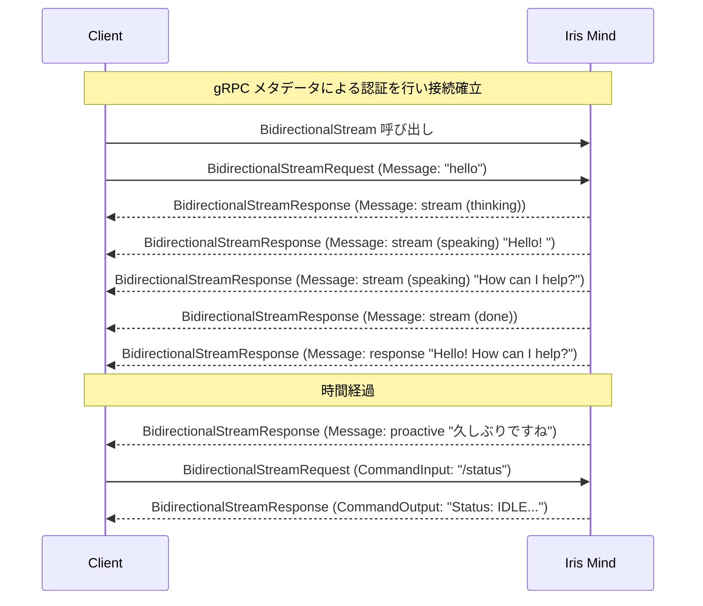
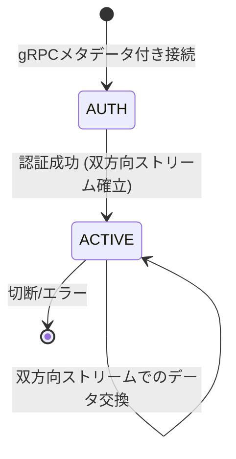
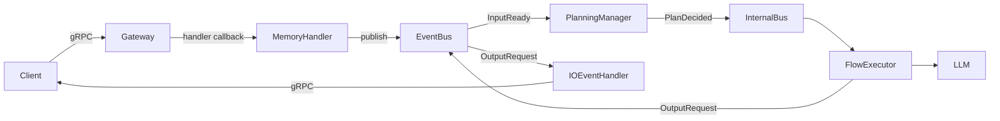

# Iris Client Guide

このドキュメントは Iris Mind に gRPC 接続するクライアント開発者向けに、**Iris の動作**と**期待される入出力**を説明する。

ワイヤー形式・メッセージ構造などは [`ipc-spec.md`](./ipc-spec.md) を参照。

> **前提**: Iris は自律型 AI アシスタント。会話応答に加え、ユーザー入力がなくても自発的に発話する。

---

## 1. 入出力の全体像



---

## 2. 応答の種類

### 2.1 通常の会話応答

テキスト入力 に対する Iris の応答は以下の順序で届く（すべて `BidirectionalStreamResponse.message` として配信）:

| 順 | msg_type | state | content | 意味 |
|----|----------|-------|---------|------|
| 1 | `stream` | `thinking` | `""` | Iris が考え始めた |
| 2 | `stream` | `speaking` | `"Hello"` | 生成途中のトークン（複数回届く） |
| 3 | `stream` | `speaking` | `"! How can I help?"` | 続きのトークン |
| 4 | `stream` | `done` | `""` | ストリーム終了 |
| 5 | `response` | - | `"Hello! How can I help?"` | 完全な応答テキスト |

**クライアント側の実装方針**:
- `state: "thinking"` → UI に思考インジケータを表示
- `state: "speaking"` → content を逐次追加表示（UI に追記）
- `state: "done"` → ストリーム表示を確定。思考インジケータ消去
- `msg_type: "response"` → 全文をログ保存などに利用（表示は既に完了済み）

### 2.2 短縮応答 (abbreviated)

Iris が抑制状態（直近のユーザー活動直後・ネガティブムード等）の場合、**stream を省略**して即座に簡潔な応答を返す:

| 順 | msg_type | content | 意味 |
|----|----------|---------|------|
| 1 | `response` | `"わかりました"` | 短い応答（stream なし） |

`thinking` / `speaking` / `done` の stream は送信されない。応答内容は短く（80トークン以内）、ツールは使用しない。

### 2.3 自発発話 (proactive)

ユーザー入力がない状態で Iris が自発的に発話する:

| 順 | msg_type | content | 意味 |
|----|----------|---------|------|
| 1 | `proactive` | `"そろそろ休憩しませんか？"` | 自発発話 |

- `proactive` は stream を経ずに1メッセージで完了する
- 通常、40文字以内の短いメッセージ
- トリガー条件については「自発発話の動作」を参照

### 2.4 コマンド応答

システムコマンドへの応答（`BidirectionalStreamResponse.command` として配信）:

| 型 | content | 例 |
|----------|---------|-----|
| `CommandOutput` | コマンド結果テキスト | `"Status: IDLE, uptime: 1h"` |

コマンド応答は stream を経ず、1メッセージで完了する。

---

## 3. 自発発話の動作

Iris は以下の条件が揃うと、ユーザー入力なしで `proactive` メッセージを送信する:

### 発話条件
1. **前回のやり取りから一定時間経過**（デフォルト: 30秒〜300秒の間でスコアリング）
2. **記憶との関連性がある**（直近の話題に関連する長期記憶がある）
3. **基底核が許可**（クールダウン中・スリープ中・連続無視検出時は抑制）

### 抑制条件（発話しない条件）
| 状態 | 原因 | 解除方法 |
|------|------|----------|
| クールダウン | 直近で発話した | 300秒経過 |
| スリープ | `/sleep` 実行 | `/wakeup` 実行 |
| 確認モード | 2回連続で無視された | ユーザーが次に応答する |
| 音声録音中 | `voice_indicator:true` 受信 | 録音終了 (`voice_indicator:false`) で自動解除 |

### 設定による制御

`config.yaml` の `proactive` セクションで調整可能:

```yaml
proactive:
  check_interval_sec: 5      # 判定間隔（秒）
  min_interval_sec: 30       # 最低発話間隔（秒）
  active_min_interval_sec: 2 # アクティブ時最低間隔（秒）
  max_interval_sec: 300      # 最大発話間隔（秒）
  speak_threshold: 0.30      # 発話閾値（0.0-1.0、低いほど発話しやすい）
  abbreviated_threshold: 0.25 # 短縮応答切替閾値
  trigger_weights:
    time: 0.40               # 時間経過の重み
    memory: 0.35             # 記憶関連性の重み
    context: 0.15            # 文脈一貫性の重み
```

---

## 4. コマンドリファレンス

すべてのコマンドは `BidirectionalStreamRequest.command` で送信する。content は `/` で始める。

| コマンド | 説明 | 応答例 |
|----------|------|--------|
| `/status` | Iris の状態確認 | `Provider: ollama Model: qwen3.5:4b State: IDLE` |
| `/shutdown` | グレースフルシャットダウン | `Shutting down...` |
| `/help` | コマンド一覧表示 | `Available commands: /status, /shutdown, /help, /compact, /memory, /sessions, /ping, /tools, /llm` |
| `/compact` | 会話履歴を強制圧縮 | `Compacted: 240 chars summary, kept last 6 messages` |
| `/memory recent [n]` | 直近のエピソード記憶を表示 | `Recent 3 episodic memories:\n  1. [2026-05-18T10:00:00] ...` |
| `/memory search <q>` | 意味記憶を検索 | `Search results for 'hello':\n  [0.85] Hello! How can I help?` |
| `/memory clear [type]` | 記憶をクリア | `Cleared all memory` |
| `/sessions` | アクティブセッション一覧 | `Active sessions:\n[conversation_input, conversation_output]` |
| `/ping` | LLM死活確認 | `LLM: OK` |
| `/tools` | 登録ツール一覧 | `Registered tools (3):\n  - web_search: ...\n  - web_fetch: ...` |
| `/llm` | LLM設定情報 | `Provider: ollama\nModel: qwen3.5:4b\nStatus: available` |

---

## 5. 音声連携（Voice連携）

音声クライアントは、録音開始/終了を通知することで録音中の自発発話(proactive)を抑制できる。これにより、ユーザーが話している最中にIrisが割り込むのを防ぐ。

### 必要なPermission

認証メタデータに `send_voice_indicator` を含める:

```
("permissions", "send_chat,receive_chat,send_voice_indicator")
```

### プロトコル

通常の `BidirectionalStreamRequest.message` として送信する。`msg_type` に `voice_indicator` を指定し、録音状態を `content` に設定する。

#### 録音開始
```python
BidirectionalStreamRequest(
    message=Message(
        msg_type="voice_indicator",
        direction="event",
        content="true",         # ← 録音開始
        target_role="mind",
    )
)
```

#### 録音終了
```python
BidirectionalStreamRequest(
    message=Message(
        msg_type="voice_indicator",
        direction="event",
        content="false",        # ← 録音終了
        target_role="mind",
    )
)
```

### 動作フロー

```
Client                         Iris Mind
  │── voice_indicator(true) ──→│  Proactive抑制開始
  │    (録音中...)              │
  │── voice_indicator(false) ──→│  抑制解除
  │── chat("こんにちは") ──────→│  通常応答
  │←──── response ───────────│
```

### 動作仕様

| 状態 | 動作 |
|------|------|
| 録音中 (`voice_indicator:true`) | Irisの自発発話(proactive)が抑制される。通常のメッセージ応答は正常に動作 |
| 録音終了 (`voice_indicator:false`) | 抑制解除。次のTimerTickからproactive判定が再開 |
| 文字起こし完了 | 通常の `chat` メッセージとして送信。pending_input → 応答処理 |
| 切断（録音中に切断） | `_voice_active` が自動クリーンアップされ抑制解除 |

### 注意点

- `voice_indicator` は制御信号であり、会話履歴（sensory memory/pending_input）には保存されない
- 録音中でもテキスト入力があればそちらが優先処理される
- CLI 入力とは完全独立（CLI は stdin 経由のため影響を受けない）

---

## 6. ユーザー管理（SystemMessage）

ユーザーの登録・入退室・改名を `BidirectionalStreamRequest.system` で行う。

### プロトコル

`BidirectionalStreamRequest` の `system` フィールドに `SystemMessage` を格納して送信する。

#### ユーザー登録
```python
BidirectionalStreamRequest(
    system=SystemMessage(
        action="user_register",
        nickname="Bob",           # 任意
    )
)
# → サーバー応答: SystemMessage(action="user_register", user_id="abc123", text="Your user ID: abc123")
```

#### ユーザー入室
```python
BidirectionalStreamRequest(
    system=SystemMessage(
        action="user_entered",
        user_id="abc123",         # 登録済みの user_id
    )
)
# → サーバー応答: SystemMessage(action="user_entered", text="Welcome, Bob")
```

#### ユーザー退室
```python
BidirectionalStreamRequest(
    system=SystemMessage(
        action="user_left",
        user_id="abc123",
    )
)
# → サーバー応答: SystemMessage(action="user_left", text="Goodbye, Bob")
```

#### ニックネーム変更
```python
BidirectionalStreamRequest(
    system=SystemMessage(
        action="nickname_update",
        user_id="abc123",
        nickname="Robert",
    )
)
# → サーバー応答: SystemMessage(action="nickname_update", text="Nickname changed to 'Robert'")
```

### 動作仕様

| アクション | 必須フィールド | サーバー処理 |
|-----------|---------------|-------------|
| `user_register` | `nickname`（任意） | UserStore に登録、user_id を割り当てて返す |
| `user_entered` | `user_id` | ShortTermMemory にユーザー追加、記憶に「入室」を保存 |
| `user_left` | `user_id` | ShortTermMemory からユーザー削除、記憶に「退室」を保存、proactive 抑制解除 |
| `nickname_update` | `user_id`, `nickname` | UserStore のニックネームを更新、ShortTermMemory も更新 |

### セッション切断時の自動処理

クライアントが切断（`user_left` を送信せずに接続断）した場合でも、サーバーは同一セッションに紐づく全ユーザーの退室処理を自動で行う。クライアント側での明示的な `user_left` 送信は推奨されるが、必須ではない。

---

## 7. エラーと注意点

### 7.1 よくあるエラー

| 症状 | 原因 | 対処 |
|------|------|------|
| 接続がすぐ閉じられる | 認証失敗 | メタデータの `access_token` が正しいか確認 |
| 応答が返ってこない | セッションが無効 | メタデータを含めて再接続 |
| メッセージが無視される | 不正な BidirectionalStreamRequest | `BidirectionalStreamRequest` に適切な `message` または `command` を格納しているか確認 |

### 7.2 セッション管理

- メタデータ認証成功後、同一 gRPC ストリームで入出力を行う
- セッションは gRPC 接続断で自動的に削除される
- セッションID は16文字のランダム文字列（サーバー側で採番）
- クライアント送信時の `session_id` は**空文字でよい**（サーバーが自ストリームのIDで上書き）
- サーバー応答の `Message.session_id` からセッションID を取得可能（通常は未使用でも問題ない）
- ACK メカニズム（`metadata.ack_required: true`）で到着確認が可能

### 7.3 制限事項

| 項目 | 制限 |
|------|------|
| 最大メッセージサイズ | gRPC フレームサイズ上限に準拠 (デフォルト 4MB) |
| 同時接続数 | 実質無制限（非同期スレッドベース） |
| 自発発話の最短間隔 | 30秒（`min_interval_sec`） |
| 認証トークン | 設定時は必須。未設定時はスキップ |

---

## 8. クイックリファレンス

### 最小限の接続シーケンス

```
1. gRPC dial (127.0.0.1:9876) に access_token, role 等のメタデータを付与して接続
2. IrisService.BidirectionalStream を呼び出し、双方向ストリームを開く
3. 送信: BidirectionalStreamRequest(message=Message(id="1", msg_type="chat", content="hello"))
4. 受信: BidirectionalStreamResponse(message=Message(msg_type="stream", state="thinking"))
5. 受信: BidirectionalStreamResponse(message=Message(msg_type="stream", state="speaking", content="Hello!"))
6. 受信: BidirectionalStreamResponse(message=Message(msg_type="stream", state="done"))
7. 受信: BidirectionalStreamResponse(message=Message(msg_type="response", content="Hello!"))
```

### セッションライフサイクル



### データフロー（内部）


