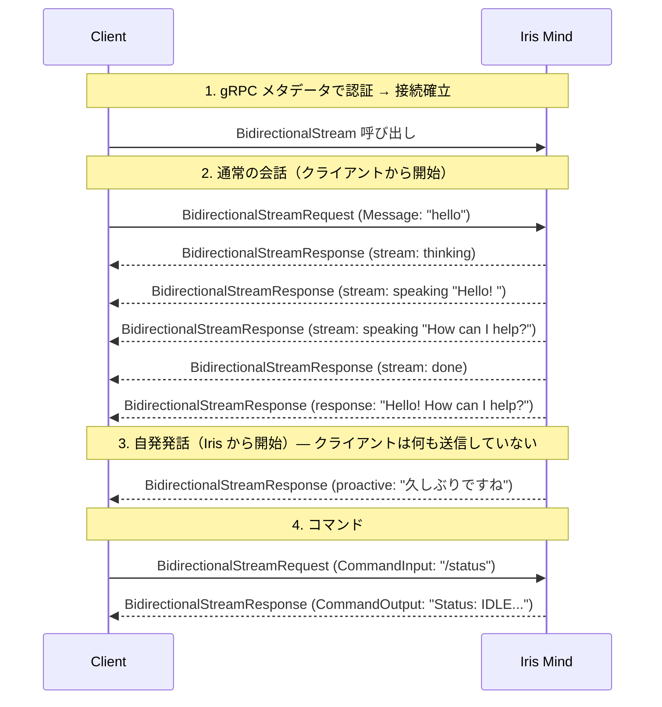
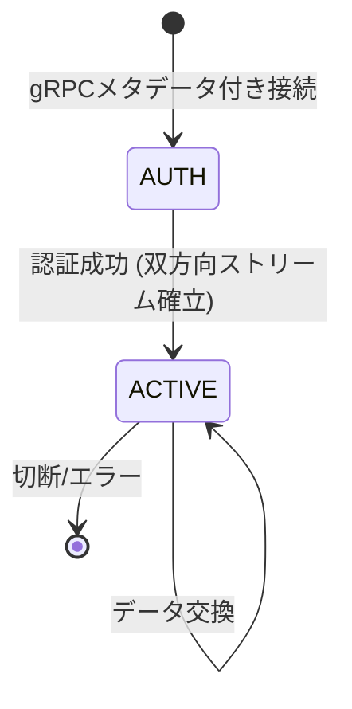
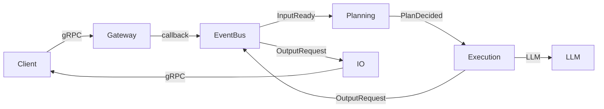

# Iris Client Guide

このドキュメントは **Iris に gRPC で接続するクライアント開発者** 向けに、Iris の動作と正しい連携方法を説明する。

ワイヤー形式・メッセージ構造などは [`ipc-spec.md`](./ipc-spec.md) を参照。

---

## Iris とは

Iris は **自律型 AI アシスタント**。普通のチャットボットとの最大の違いは、**ユーザーが何もしなくても自ら話しかけてくる**ことである。

```
通常のチャットボット:  ユーザー → AI → ユーザー → AI → ...
Iris:                 ユーザー → AI → AI → AI → ... (自発発話)
```

Iris はユーザーの入力を待つだけでなく、記憶や感情に基づいて**自分から話す**。クライアントはこの「自発発話」を受け取る準備が必要である。

---

## 1. 基本動作シーケンス

以下の図は、クライアントが Iris とやり取りする典型的な流れを示す:



**ポイント**: 3番目のように、クライアントが何も送信していないのに Iris からメッセージが届くことがある。これを正しく処理することがクライアント実装の要点である。

---

## 2. メッセージの種類

Iris から届くメッセージは **5種類** がある。

### 2.1 会話応答（stream + response）

テキスト入力に対する通常の応答。**5つのメッセージが順番に届く**:

| 順 | msg_type | state | content | クライアントの動作 |
|----|----------|-------|---------|-------------------|
| 1 | `stream` | `thinking` | `""` | 思考インジケータを表示 |
| 2 | `stream` | `speaking` | `"Hello"` | テキストを追加表示 |
| 3 | `stream` | `speaking` | `"! How can I help?"` | 続きを追加表示 |
| 4 | `stream` | `done` | `""` | 表示確定、インジケータ消去 |
| 5 | `response` | - | `"Hello! How can I help?"` | ログ保存等（表示は既に完了） |

`thinking` → `speaking` → `done` のストリームを **逐次ストリーミング表示** することが期待される。

### 2.2 短縮応答（response のみ）

Iris が抑制状態（直近で応答した直後等）の場合、**stream を省略** して即座に短い応答を返す:

| msg_type | content |
|----------|---------|
| `response` | `"わかりました"` |

stream は送信されない。応答は短く（80トークン以内）、ツールは使用しない。

### 2.3 自発発話（proactive）

**ユーザー入力がない状態で Iris が自発的に発話する**。これが Iris の最大の特徴である:

| msg_type | content |
|----------|---------|
| `proactive` | `"そろそろ休憩しませんか？"` |

- stream を経ずに **1メッセージで届く**
- 通常、40文字以内の短いメッセージ
- トリガー条件は「自発発話の動作」セクションを参照
- クライアントは **常時このメッセージを受け取る準備** が必要

### 2.4 コマンド応答

`/status` 等のコマンドへの応答:

| msg_type | content |
|----------|---------|
| `response` | `"Status: IDLE, uptime: 1h"` |

stream を経らず1メッセージで完了。

---

## 3. 自発発話の動作

Iris は以下の条件が揃うと、ユーザー入力なしで `proactive` メッセージを送信する:

### 発話条件
1. **前回のやり取りから一定時間経過**（30秒〜300秒の間でスコアリング）
2. **記憶との関連性がある**（直近の話題に関連する長期記憶がある）
3. **抑制条件が_NONE**（下記の抑制状態がない）

### 抑制条件（発話しない条件）

| 状態 | 原因 | 解除方法 |
|------|------|----------|
| クールダウン | 直近で発話した | 300秒経過 |
| スリープ | `/sleep` 実行 | `/wakeup` 実行 |
| 確認モード | 2回連続で無視された | ユーザーが次に応答する |
| 音声録音中 | `voice_indicator:true` 受信 | 録音終了で自動解除 |

### 設定による制御

```yaml
proactive:
  check_interval_sec: 5      # 判定間隔（秒）
  min_interval_sec: 30       # 最低発話間隔（秒）
  speak_threshold: 0.30      # 発話閾値（0.0-1.0、低いほど発話しやすい）
```

---

## 4. 音声連携（Voice連携）

音声クライアントは、録音開始/終了を通知することで録音中の自発発話を抑制できる。ユーザーが話している最中に Iris が割り込むのを防ぐ。

### 必要なPermission

```
("permissions", "send_chat,receive_chat,send_voice_indicator")
```

### プロトコル

```python
# 録音開始
BidirectionalStreamRequest(
    message=Message(msg_type="voice_indicator", direction="event", content="true", target_role="mind")
)

# 録音終了
BidirectionalStreamRequest(
    message=Message(msg_type="voice_indicator", direction="event", content="false", target_role="mind")
)
```

### 動作フロー

```
Client                         Iris Mind
  │── voice_indicator(true) ──→│  Proactive抑制開始
  │    (録音中...)              │
  │── voice_indicator(false) ──→│  抑制解除
  │── chat("こんにちは") ──────→│  通常応答
  │←──── response ───────────│
```

| 状態 | 動作 |
|------|------|
| 録音中 | 自発発話が抑制される。通常のメッセージ応答は正常に動作 |
| 録音終了 | 抑制解除。次のTimerTickからproactive判定が再開 |
| 切断（録音中に切断） | 自動クリーンアップされ抑制解除 |

---

## 5. アカウント管理とグループチャット

クライアントは外部世界のIDだけを保持する。Iris内部の `account_id` は永続保存しない。

### 5.1 Discordグループチャット送信

```python
BidirectionalStreamRequest(
    message=Message(
        msg_type="chat",
        direction="request",
        target_role="mind",
        content="こんにちは",
        speaker=Identity(
            provider="discord",
            subject="1234567890",
            display_name="Bob",
            metadata={
                "guild_id": "guild_1",
                "channel_id": "channel_1",
            },
        ),
        room_id="discord:guild_1:channel_1",
    )
)
```

- `speaker.provider + speaker.subject` でアカウントが自動解決される
- 未登録ならアカウントが自動作成される
- `room_id` は返信先ルームとして応答メタデータへ伝搬される
- Discord Bot 1接続で複数ユーザーの発話を送れる

### 5.2 明示入室

```python
BidirectionalStreamRequest(
    control=ControlMessage(
        action="account.join",
        identity=Identity(provider="discord", subject="1234567890", display_name="Bob"),
        room_id="discord:guild_1:channel_1",
    )
)
# → ControlMessage(action="account.joined", account_id="...", room_id="discord:guild_1:channel_1", text="Joined: Bob")
```

明示入室は任意。最初の発話でも自動joinされる。

### 5.3 明示退室

```python
BidirectionalStreamRequest(
    control=ControlMessage(action="account.leave", room_id="discord:guild_1:channel_1")
)
# → ControlMessage(action="account.left", text="Left: Bob")
```

同じgRPC session + room内なら `identity` は省略できる。

### 5.4 アカウント更新

```python
BidirectionalStreamRequest(
    control=ControlMessage(
        action="account.update",
        nickname="Robert",
        profile={"lang": "ja"},
    )
)
```

### 5.5 アカウント操作

```python
# 現セッションのアカウント取得
BidirectionalStreamRequest(control=ControlMessage(action="account.get", room_id="discord:guild_1:channel_1"))

# 別identityを紐付け
BidirectionalStreamRequest(
    control=ControlMessage(
        action="account.link_identity",
        identity=Identity(provider="local", subject="local-user"),
    )
)
```

### 動作仕様

| アクション | 必須フィールド | 処理 |
|-----------|---------------|------|
| `account.join` | `identity.provider`, `identity.subject` | アカウント解決/作成、セッション紐付け |
| `account.leave` | なし | 現セッションの紐付け解除 |
| `account.get` | なし | 現セッションのアカウント情報返却 |
| `account.update` | `nickname` または `profile` | ニックネーム・プロフィール更新 |
| `account.link_identity` | `identity.provider`, `identity.subject` | 現アカウントへ外部ID追加 |

### セッション切断時の自動処理

クライアントが `account.leave` を送信せずに切断しても、サーバーは同一セッションの短期参加者を退室扱いにする。

### Presence通知

アカウントがセッションへ紐付くと、Irisは接続中クライアントへ `ControlMessage` を配信する。

```python
ControlMessage(
    action="presence.joined",
    account_id="abc123",
    nickname="Bob",
    identity=Identity(provider="discord", subject="1234567890"),
)
```

退室時は `action="presence.left"` になる。

### Discord Botフロー

```
1. Discord Bot がIrisへgRPC接続
2. Discord channelの発話を Message(speaker, room_id, content) で送信
3. Iris が speaker からアカウントを自動解決/作成
4. Iris の応答には room_id が含まれる
5. Bot が room_id からDiscord channelへ返信
```

---

## 6. コマンドリファレンス

すべてのコマンドは `BidirectionalStreamRequest.command` で送信する。content は `/` で始める。

| コマンド | 説明 | 応答例 |
|----------|------|--------|
| `/status` | Iris の状態確認 | `Provider: ollama Model: qwen3.5:4b State: IDLE` |
| `/shutdown` | グレースフルシャットダウン | `Shutting down...` |
| `/help` | コマンド一覧 | `Available commands: /status, /shutdown, /help, ...` |
| `/compact` | 会話履歴を強制圧縮 | `Compacted: 240 chars summary, kept last 6 messages` |
| `/memory recent [n]` | 直近のエピソード記憶 | `Recent 3 episodic memories: ...` |
| `/memory search <q>` | 意味記憶を検索 | `Search results for 'hello': ...` |
| `/memory clear [type]` | 記憶をクリア | `Cleared all memory` |
| `/sessions` | アクティブセッション一覧 | `Active sessions: ...` |
| `/ping` | LLM死活確認 | `LLM: OK` |
| `/tools` | 登録ツール一覧 | `Registered tools (3): ...` |
| `/llm` | LLM設定情報 | `Provider: ollama\nModel: qwen3.5:4b\nStatus: available` |

---

## 7. エラーと注意点

### 7.1 よくあるエラー

| 症状 | 原因 | 対処 |
|------|------|------|
| 接続がすぐ閉じられる | 認証失敗 | メタデータの `access_token` が正しいか確認 |
| 応答が返ってこない | セッションが無効 | メタデータを含めて再接続 |
| メッセージが無視される | 不正な BidirectionalStreamRequest | `message` または `command` を適切に格納しているか確認 |

### 7.2 セッション管理

- メタデータ認証成功後、同一 gRPC ストリームで入出力を行う
- セッションは gRPC 接続断で自動的に削除される
- セッションID は16文字のランダム文字列（サーバー側で採番）
- クライアント送信時の `session_id` は**空文字でよい**（サーバーが上書き）
- ACK メカニズム（`metadata.ack_required: true`）で到着確認が可能

### 7.3 制限事項

| 項目 | 制限 |
|------|------|
| 最大メッセージサイズ | gRPC フレームサイズ上限 (デフォルト 4MB) |
| 同時接続数 | 実質無制限（非同期スレッドベース） |
| 自発発話の最短間隔 | 30秒（`min_interval_sec`） |
| 認証トークン | 設定時は必須。未設定時はスキップ |

---

## 8. クイックリファレンス

### 最小限の接続シーケンス

```
1. gRPC dial (127.0.0.1:9876) に access_token, role 等のメタデータを付与して接続
2. IrisService.BidirectionalStream を呼び出し、双方向ストリームを開く
3. 送信: BidirectionalStreamRequest(message=Message(id="1", msg_type="chat", content="hello"))
4. 受信: BidirectionalStreamResponse(message=Message(msg_type="stream", state="thinking"))
5. 受信: BidirectionalStreamResponse(message=Message(msg_type="stream", state="speaking", content="Hello!"))
6. 受信: BidirectionalStreamResponse(message=Message(msg_type="stream", state="done"))
7. 受信: BidirectionalStreamResponse(message=Message(msg_type="response", content="Hello!"))
```

### セッションライフサイクル



### データフロー（内部）


