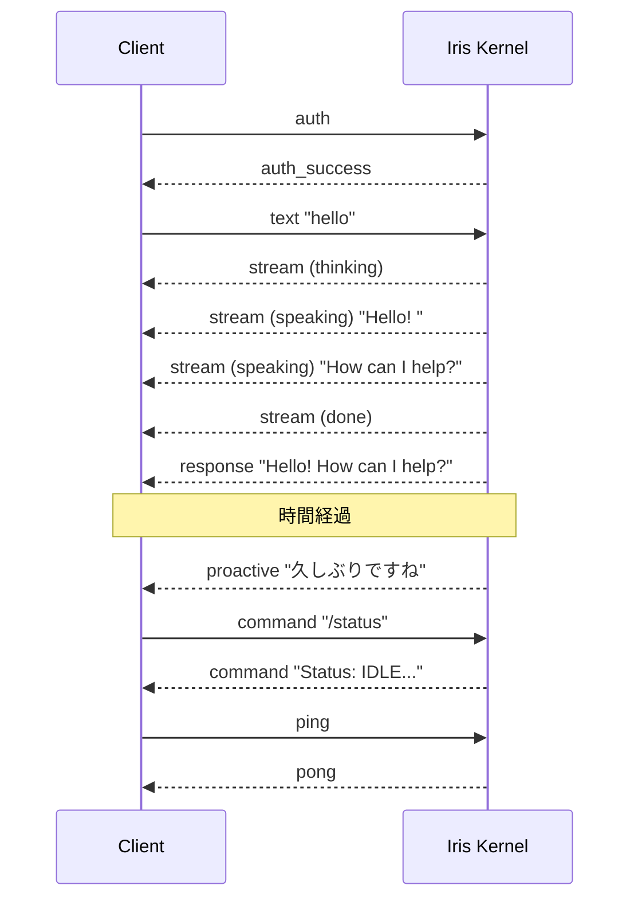
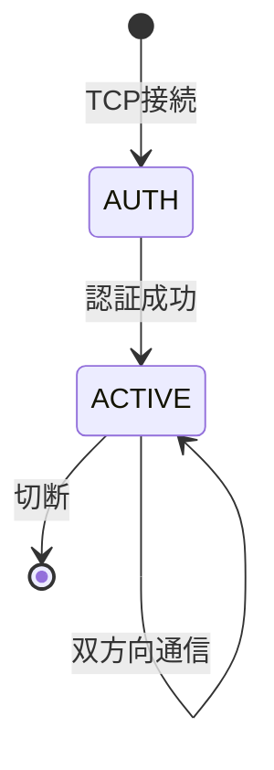
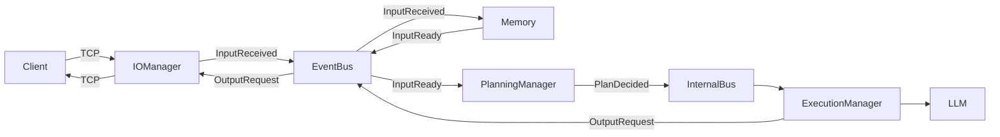

# Iris Client Guide

このドキュメントは Iris Kernel に TCP 接続するクライアント開発者向けに、**Iris の動作**と**期待される入出力**を説明する。

ワイヤー形式・メッセージ構造などは [`ipc-spec.md`](./ipc-spec.md) を参照。

> **前提**: Iris は自律型 AI アシスタント。会話応答に加え、ユーザー入力がなくても自発的に発話する。

---

## 1. 入出力の全体像



---

## 2. 応答の種類

### 2.1 通常の会話応答

テキスト入力 (`msg_type="text"`) に対する Iris の応答は以下の順序で届く:

| 順 | msg_type | state | content | 意味 |
|----|----------|-------|---------|------|
| 1 | `stream` | `thinking` | `""` | Iris が考え始めた |
| 2 | `stream` | `speaking` | `"Hello"` | 生成途中のトークン（複数回届く） |
| 3 | `stream` | `speaking` | `"! How can I help?"` | 続きのトークン |
| 4 | `stream` | `done` | `""` | ストリーム終了 |
| 5 | `response` | - | `"Hello! How can I help?"` | 完全な応答テキスト |

**クライアント側の実装方針**:
- `state: "thinking"` → UI に思考インジケータを表示
- `state: "speaking"` → content を逐次追加表示（UI に追記）
- `state: "done"` → ストリーム表示を確定。思考インジケータ消去
- `msg_type: "response"` → 全文をログ保存などに利用（表示は既に完了済み）

### 2.2 短縮応答 (abbreviated)

Iris が抑制状態（直近のユーザー活動直後・ネガティブムード等）の場合、**stream を省略**して即座に簡潔な応答を返す:

| 順 | msg_type | content | 意味 |
|----|----------|---------|------|
| 1 | `response` | `"わかりました"` | 短い応答（stream なし） |

`thinking` / `speaking` / `done` の stream は送信されない。応答内容は短く（80トークン以内）、ツールは使用しない。

### 2.3 自発発話 (proactive)

ユーザー入力がない状態で Iris が自発的に発話する:

| 順 | msg_type | content | 意味 |
|----|----------|---------|------|
| 1 | `proactive` | `"そろそろ休憩しませんか？"` | 自発発話 |

- `proactive` は stream を経ずに1メッセージで完了する
- 通常、40文字以内の短いメッセージ
- トリガー条件については「自発発話の動作」を参照

### 2.4 コマンド応答

スラッシュコマンド (`msg_type="command"`) への応答:

| msg_type | content | 例 |
|----------|---------|-----|
| `command` | コマンド結果テキスト | `"Status: IDLE, uptime: 1h"` |

コマンド応答は stream を経ず、`command` 1メッセージで完了する。

---

## 3. 自発発話の動作

Iris は以下の条件が揃うと、ユーザー入力なしで `proactive` メッセージを送信する:

### 発話条件
1. **前回のやり取りから一定時間経過**（デフォルト: 60秒〜600秒の間でスコアリング）
2. **記憶との関連性がある**（直近の話題に関連する長期記憶がある）
3. **感情状態が良好**（ネガティブムードが 0.7 未満）
4. **基底核が許可**（クールダウン中・スリープ中・連続無視検出時は抑制）

### 抑制条件（発話しない条件）
| 状態 | 原因 | 解除方法 |
|------|------|----------|
| クールダウン | 直近で発話した | 600秒経過 |
| スリープ | `/sleep` 実行 | `/wakeup` 実行 |
| 確認モード | 2回連続で無視された | ユーザーが次に応答する |
| 感情低下 | ユーザーからの否定応答 | 時間経過 |

### 設定による制御

`config.yaml` の `proactive` セクションで調整可能:

```yaml
proactive:
  enabled: true              # 自発発話の有効/無効
  check_interval_sec: 5      # 判定間隔（秒）
  min_interval_sec: 60       # 最低発話間隔（秒）
  max_interval_sec: 600      # 最大発話間隔（秒）
  speak_threshold: 0.6       # 発話閾値（0.0-1.0、高いほど発話しにくい）
  abbreviated_threshold: 0.25 # 短縮応答閾値
  trigger_weights:
    time: 0.25               # 時間経過の重み
    memory: 0.45             # 記憶関連性の重み
    context: 0.15            # 文脈一貫性の重み
    mood: 0.15               # 感情状態の重み
```

---

## 4. コマンドリファレンス

すべてのコマンドは `msg_type="command"` で送信する。content は `/` で始める。

| コマンド | 説明 | 応答例 |
|----------|------|--------|
| `/status` | Iris の状態確認 | `Status: IDLE, uptime: 1h 23m, messages: 42, proactive: enabled` |
| `/shutdown` | グレースフルシャットダウン | `Shutting down...` |
| `/sleep` | 自発発話を停止 | `Iris is going to sleep. Use /wakeup to resume.` |
| `/wakeup` | 自発発話を再開 | `Iris is awake.` |
| `/help` | コマンド一覧表示 | `Available commands: /status, /shutdown, /sleep, /wakeup, /help, /compact, /clear, /reflect` |
| `/compact` | 会話履歴を強制圧縮 | `Compacted: 240 chars summary, kept last 6 messages` |
| `/clear` | 全記憶消去 | 実行後の応答 |
| `/reflect` | セッション振り返り実行 | 実行後の応答 |

---

## 5. エラーと注意点

### 5.1 よくあるエラー

| 症状 | 原因 | 対処 |
|------|------|------|
| 接続がすぐ閉じられる | 認証失敗 | `access_token` が正しいか確認 |
| 応答が返ってこない | session_id が無効 | 再接続して再認証 |
| メッセージが無視される | 不正な msg_type | `msg_type` を `text` / `command` / `system` のいずれかに |
| `msg_type` が `dispatch_text` や `converse_text` になっている | モデルの msg_type 誤り | `text` に変更（`dispatch_text` / `converse_text` は内部形式） |

### 5.2 セッション管理

- 認証成功後、同一接続で入出力を行う
- セッションは接続断で自動的に削除される
- セッションID は16文字のランダム文字列
- ACK メカニズム（`metadata.ack_required: true`）で到着確認が可能

### 5.3 制限事項

| 項目 | 制限 |
|------|------|
| 最大メッセージサイズ | 32MB（ペイロード長フィールドの上限） |
| 同時接続数 | 実質無制限（スレッドベース） |
| 自発発話の最短間隔 | 60秒（`min_interval_sec`） |
| 認証トークン | 設定時は必須。未設定時はスキップ |

---

## 6. クイックリファレンス

### 最小限の接続シーケンス

```
1. TCP connect (127.0.0.1:9876)
2. 送信: {"msg_type": "auth", "mode": "bidirectional"}
3. 受信: {"msg_type": "auth_success", "session_id": "..."}
4. 送信: {"msg_type": "text", "session_id": "...", "source": "cli", "content": "hello"}
5. 受信: {"msg_type": "stream", "state": "thinking", "content": ""}
6. 受信: {"msg_type": "stream", "state": "speaking", "content": "Hello!"}
7. 受信: {"msg_type": "stream", "state": "done", "content": ""}
8. 受信: {"msg_type": "response", "content": "Hello!"}
```

### セッションライフサイクル



### データフロー（内部）



---

## 7. 参考ドキュメント

| ドキュメント | 内容 |
|-------------|------|
| [`ipc-spec.md`](./ipc-spec.md) | ワイヤー形式・メッセージ構造・認証プロトコル・実装例 |
| [`architecture.md`](./architecture.md) | 内部アーキテクチャ（層分割・イベント駆動） |
| [`config.md`](./config.md) | 全設定項目 |
