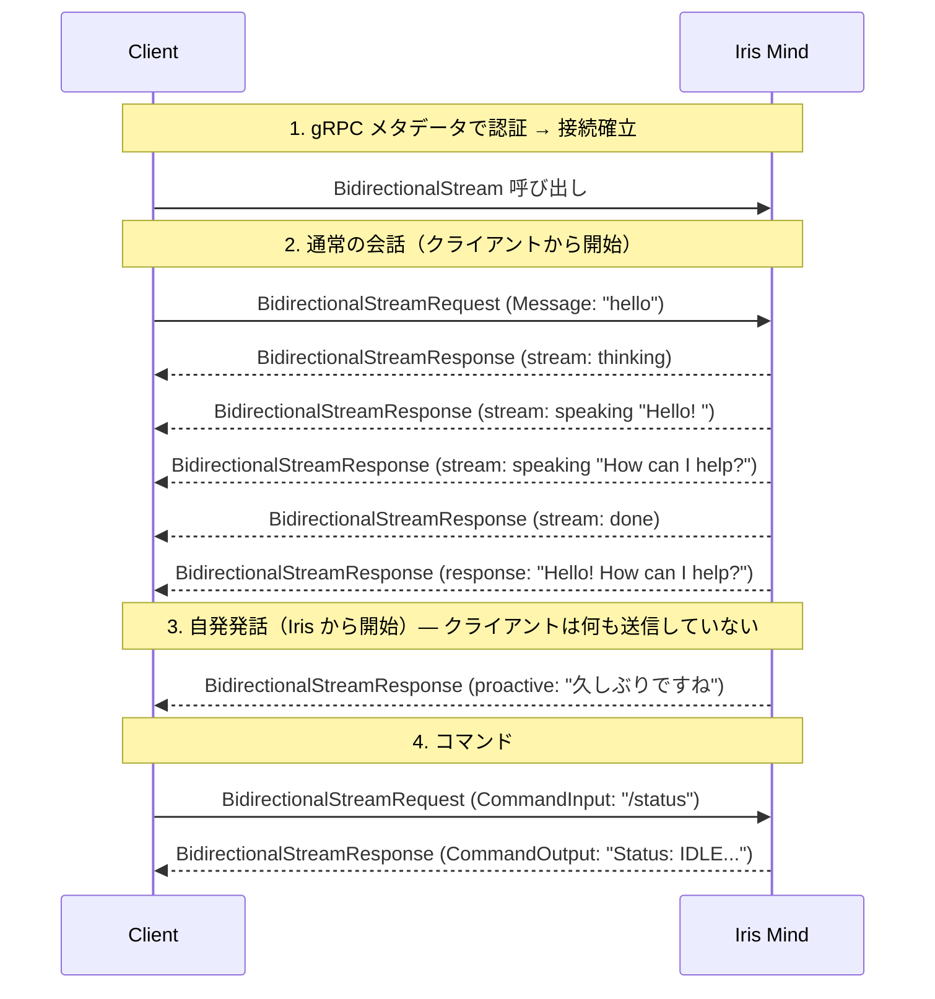
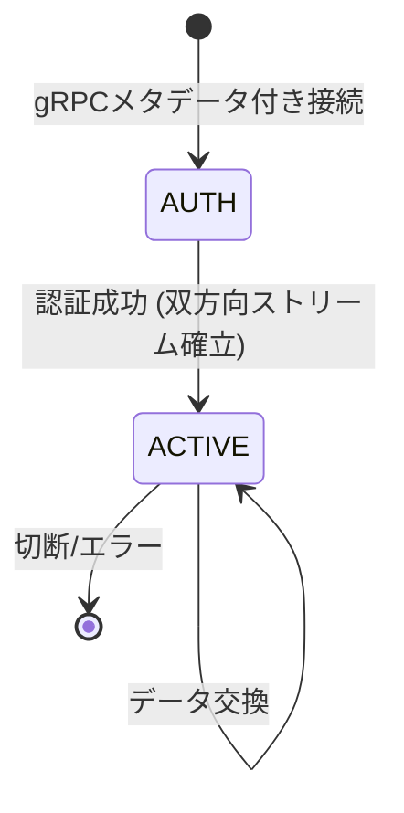
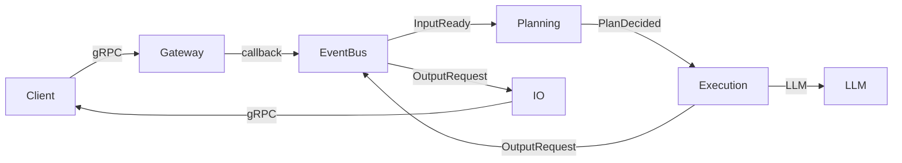

# Iris Client Guide

このドキュメントは **Iris に gRPC で接続するクライアント開発者** 向けに、Iris の動作と正しい連携方法を説明する。

ワイヤー形式・メッセージ構造などは [`protocol-spec.md`](./protocol-spec.md)（[データ型定義](./protocol-types.md)、[接続シーケンス](./protocol-flows.md)）を参照。

---

## Iris とは

Iris は **自律型 AI アシスタント**。普通のチャットボットとの最大の違いは、**ユーザーが何もしなくても自ら話しかけてくる**ことである。

```
通常のチャットボット:  ユーザー → AI → ユーザー → AI → ...
Iris:                 ユーザー → AI → AI → AI → ... (自発発話)
```

Iris はユーザーの入力を待つだけでなく、記憶や感情に基づいて**自分から話す**。クライアントはこの「自発発話」を受け取る準備が必要である。

---

## 1. 基本動作シーケンス

以下の図は、クライアントが Iris とやり取りする典型的な流れを示す:



**ポイント**: 3番目のように、クライアントが何も送信していないのに Iris からメッセージが届くことがある。これを正しく処理することがクライアント実装の要点である。

---

## 2. メッセージの種類

Iris から届くメッセージは **5種類** がある。

### 2.1 会話応答（stream + response）

テキスト入力に対する通常の応答。**5つのメッセージが順番に届く**:

| 順 | msg_type | state | content | クライアントの動作 |
|----|----------|-------|---------|-------------------|
| 1 | `stream` | `thinking` | `""` | 思考インジケータを表示 |
| 2 | `stream` | `speaking` | `"Hello"` | テキストを追加表示 |
| 3 | `stream` | `speaking` | `"! How can I help?"` | 続きを追加表示 |
| 4 | `stream` | `done` | `""` | 表示確定、インジケータ消去 |
| 5 | `response` | - | `"Hello! How can I help?"` | ログ保存等（表示は既に完了） |

`thinking` → `speaking` → `done` のストリームを **逐次ストリーミング表示** することが期待される。

**StreamState の全値**: `thinking`, `speaking`, `done`, `interrupted`（中断時／内部割込みのみ）

`interrupted` は内部的な割込み（別入力到着による応答中断）時にのみ発生する。クライアントからの明示的 `interrupt` 送信による中断は現在非対応。

### 2.2 短縮応答（response のみ）

Iris が抑制状態（直近で応答した直後等）の場合、**stream を省略** して即座に短い応答を返す:

| msg_type | content |
|----------|---------|
| `response` | `"わかりました"` |

stream は送信されない。応答は短く（80トークン以内）、ツールは使用しない。

### 2.3 自発発話（proactive）

**ユーザー入力がない状態で Iris が自発的に発話する**。これが Iris の最大の特徴である:

| msg_type | content |
|----------|---------|
| `proactive` | `"そろそろ休憩しませんか？"` |

- stream を経ずに **1メッセージで届く**
- 通常、40文字以内の短いメッセージ
- トリガー条件は「自発発話の動作」セクションを参照
- クライアントは **常時このメッセージを受け取る準備** が必要

### 2.4 コマンド応答

`/status` 等のコマンドへの応答:

| msg_type | content |
|----------|---------|
| `response` | `"Status: IDLE, uptime: 1h"` |

stream を経らず1メッセージで完了。

> **補足**: `execute` / `execute_result` msg_type は権限マップ上に定義されているが、現在はサーバーサイドですべてのツール実行が完結しているため使用されない。将来のクライアント委譲用に確保された空きスロット。

---

## 3. 自発発話の動作

Iris は以下の条件が揃うと、ユーザー入力なしで `proactive` メッセージを送信する:

### 発話条件

5つの独立したスコア要素を加重合成し、閾値（`speak_threshold`）を超えると発話する:

| 要素 | 説明 | 重み |
|------|------|------|
| `memory_score` | 意味記憶との関連性（セマンティック検索） | 0.55 |
| `context_score` | 直近の会話サマリの類似性（bigram Jaccard） | 0.30 |
| `sensory_score` | 生の感覚入力の有無（ブースト） | — |
| `stm_score` | 短期記憶のターン数 | — |
| `urgency_score` | 緊急度検出（質問、キーワード、長さ等） | — |

- `sensory_score` と `urgency_score` は正のとき加重合成に加わり、スコアをブーストする
- `stm_score` は `context_score` と大きい方を採用する
- `system_event == "connected"` 時は閾値を自動超える
- 重みは `config.trigger_weights` で変更可能

### 抑制条件（発話しない条件）

| 状態 | 原因 | 解除方法 |
|------|------|----------|
| クールダウン | 直近で応答した | 5秒経過（`post_execution_cooldown_sec`） |
| 音声録音中 | `voice_indicator:true` 受信 | 録音終了で自動解除 |

### 設定による制御

```yaml
proactive:
  check_interval_sec: 5      # 判定間隔（秒）
  min_interval_sec: 30       # 最低発話間隔（秒）
  speak_threshold: 0.30      # 発話閾値（0.0-1.0、低いほど発話しやすい）
```

---

## 4. 音声連携（Voice連携）

音声クライアントは、録音開始/終了を通知することで録音中の自発発話を抑制できる。ユーザーが話している最中に Iris が割り込むのを防ぐ。

### 必要なPermission

```
("permissions", "send_chat,receive_chat,send_command,receive_command,receive_log,interrupt,execute_action,send_voice_indicator")
```

### プロトコル

```python
# 録音開始
BidirectionalStreamRequest(
    message=Message(msg_type="voice_indicator", direction="event", content="true", target_role="mind")
)

# 録音終了
BidirectionalStreamRequest(
    message=Message(msg_type="voice_indicator", direction="event", content="false", target_role="mind")
)
```

### 動作フロー

```
Client                         Iris Mind
  │── voice_indicator(true) ──→│  Proactive抑制開始
  │    (録音中...)              │
  │── voice_indicator(false) ──→│  抑制解除
  │── chat("こんにちは") ──────→│  通常応答
  │←──── response ───────────│
```

| 状態 | 動作 |
|------|------|
| 録音中 | 自発発話が抑制される。通常のメッセージ応答は正常に動作 |
| 録音終了 | 抑制解除。次のTimerTickからproactive判定が再開 |
| 切断（録音中に切断） | 自動クリーンアップされ抑制解除 |

---

## 5. アカウント管理とグループチャット

クライアントは外部世界のIDだけを保持する。Iris内部の `account_id` は永続保存しない。

### room_id の扱い

`room.create` を実行すると、サーバーは `uuid4().hex[:16]` による16文字のランダムID（例: `"a1b2c3d4e5f6g78"`）を自動生成する。クライアントはこのIDを保存し、メッセージ送信や `room.join` / `room.leave` で使用する。

以下の例で登場する `"discord:guild_1:channel_1"` はクライアント側のルーティング用ラベルであり、room_id そのものではない。実装時の正しいフロー:

```python
# ① room.create でルーム作成 → UUID が自動生成される
BidirectionalStreamRequest(
    control=ControlMessage(action="room.create", text="discord-guild_1-channel_1"),
)
# → ControlMessage(action="room.created", room_id="a1b2c3d4e5f6g78", ...)

# ② 返却された UUID room_id を保存し、以降の操作で使用する
ROOM_ID = "a1b2c3d4e5f6g78"  # room.create で発行された値

# ③ クライアントは自身のマッピングを管理する（例: discord:guild_1:channel_1 ↔ ROOM_ID）
```

> **注意**: `"discord:guild_1:channel_1"` のような colon 区切り文字列は room_id の形式ではない。room_id は `room.create` が返す16進文字列のみが有効。

### 5.1 Discordグループチャット送信

ルーム作成済みの `ROOM_ID` に対してメッセージを送信する:

```python
BidirectionalStreamRequest(
    message=Message(
        msg_type="chat",
        direction="request",
        target_role="mind",
        content="こんにちは",
        speaker=Identity(
            provider="discord",
            subject="1234567890",
            provider_name="Bob",
            metadata={
                "guild_id": "guild_1",
                "channel_id": "channel_1",
            },
        ),
        room_id=ROOM_ID,  # room.create で発行された UUID
    )
)
```

- `speaker.provider + speaker.subject` でアカウントが自動解決される
- 未登録ならアカウントが自動作成される
- `room_id` は返信先ルームとして応答メタデータへ伝搬される
- Discord Bot 1接続で複数ユーザーの発話を送れる
- `room.members` は退室済みメンバーを含まない

### 5.2 明示入室

```python
BidirectionalStreamRequest(
    control=ControlMessage(
        action="room.join",
        account_id="abc123",
        room_id=ROOM_ID,  # room.create で発行された UUID
    )
)
# → ControlMessage(action="room.joined", room_id="a1b2c3d4e5f6g78", text="Joined room: a1b2c3d4e5f6g78")
```

`account_id` 未指定時は `identity` からアカウントを自動解決/作成する:

```python
BidirectionalStreamRequest(
    control=ControlMessage(
        action="room.join",
        identity=Identity(provider="discord", subject="1234567890", provider_name="Bob"),
        room_id=ROOM_ID,  # room.create で発行された UUID
    )
)
# → ControlMessage(action="room.joined", account_id="abc123", room_id="a1b2c3d4e5f6g78", text="Joined room: a1b2c3d4e5f6g78")
```

明示入室は任意。最初の発話でも自動joinされる。

`room.join` / `room.leave` はアクティブな既存 room のみ受け付ける。

### 5.3 明示退室

退室は `room.leave` で行う:

```python
BidirectionalStreamRequest(
    control=ControlMessage(
        action="room.leave",
        room_id=ROOM_ID,  # room.create で発行された UUID
    )
)
# → ControlMessage(action="room.left", room_id="a1b2c3d4e5f6g78", text="Left room: a1b2c3d4e5f6g78")
```

`account_id` 未指定時は `identity` から自動解決する。

`room.leave` も存在しない room では Error を返す。

### 5.4 アカウント更新

```python
BidirectionalStreamRequest(
    control=ControlMessage(
        action="account.update",
        display_name="Robert",
        profile={"lang": "ja"},
    )
)
```

### 5.5 アカウント操作

```python
# アカウント識別（identity解決/作成、ルーム参加は行わない）
BidirectionalStreamRequest(
    control=ControlMessage(
        action="account.identify",
        identity=Identity(provider="discord", subject="1234567890"),
    )
)
# → ControlMessage(action="account.identified", account_id="abc123", display_name="Bob")

# アカウント情報取得
BidirectionalStreamRequest(control=ControlMessage(action="account.profile"))
# → ControlMessage(action="account.profile", text="{...}")

# 別identityを紐付け
BidirectionalStreamRequest(
    control=ControlMessage(
        action="account.link",
        identity=Identity(provider="local", subject="local-user"),
    )
)
# → ControlMessage(action="account.linked", text="Linked identity: local:local-user")
```

### 動作仕様

| アクション | 必須フィールド | 処理 |
|-----------|---------------|------|
| `account.identify` | `identity.provider`, `identity.subject` | identity解決/作成、アカウント情報返却 |
| `account.profile` | なし | アカウント情報取得 |
| `account.update` | `display_name` または `profile` | 表示名・プロフィール更新 |
| `account.link` | `identity.provider`, `identity.subject` | 現アカウントへ外部ID追加 |
| `room.join` | `room_id`, (`account_id` or `identity`) | ルーム参加（identityからaccount作成も可） |
| `room.leave` | `room_id`, (`account_id` or `identity`) | ルーム退室 |
| `room.create` | `text` (ルーム名) | ルーム作成 |
| `room.list` | なし | ルーム一覧取得 |
| `room.info` | `room_id` | ルーム情報取得 |
| `room.update` | `room_id`, `text` (JSON) | ルーム情報更新 |
| `room.delete` | `room_id` | ルーム削除 |
| `room.members` | `room_id` | ルームメンバー一覧取得 |

### セッション切断時の自動処理

クライアントが切断すると、サーバーは当該セッションを含む全ルームメンバーからセッションIDを除去し、セッションIDが空になったメンバーを自動退室させる。退室時に各ルームに `presence.left` を配信する。1アカウントが複数セッションで同一ルームに参加している場合、他のセッションが生きていれば退室しない。

### Presence通知

アカウントがセッションへ紐付くと、Irisは接続中クライアントへ `ControlMessage` を配信する。

```python
ControlMessage(
    action="presence.joined",
    account_id="abc123",
    display_name="Bob",
    room_id="a1b2c3d4e5f6g78",  # room.create で発行された UUID
)
```

退室時は `action="presence.left"` になる。

> `room_id` の値は `room.create` が返した16進UUID文字列である。`"discord:guild_1:channel_1"` のような colon 区切り文字列は room_id としては使用されない。

### Discord Botフロー

```
1. Discord Bot がIrisへgRPC接続
2. room.create でルーム作成 → UUID room_id を取得し、Discord channelとのマッピングを保持
3. Discord channelの発話を Message(speaker, room_id=UUID, content) で送信
4. Iris が speaker からアカウントを自動解決し、room.join を自動実行
5. Iris の応答には room_id（UUID）が含まれる
6. Bot が UUID → Discord channel のマッピングを逆引きして返信
```

---

## 6. コマンドリファレンス

すべてのコマンドは `BidirectionalStreamRequest.command` で送信する。content は `/` で始める。

| コマンド | 説明 | 応答例 |
|----------|------|--------|
| `/status` | Iris の状態確認 | `Models: ['qwen3.5:4b']` / `Session: 127.0.0.1:9876` / `Memory: episodic=30, semantic=100` |
| `/shutdown` | グレースフルシャットダウン | `Shutting down...` |
| `/help` | コマンド一覧 | `Available commands: /status, /shutdown, /help, ...` |
| `/compact` | 会話履歴を強制圧縮 | `Compacted: 240 chars summary, kept last 6 messages` |
| `/memory recent [n]` | 直近のエピソード記憶 | `Recent 3 episodic memories: ...` |
| `/memory search <q>` | 意味記憶を検索 | `Search results for 'hello': ...` |
| `/memory clear [type]` | 記憶をクリア | `Cleared all memory` |
| `/sessions` | アクティブセッション一覧 | `Active sessions: ...` |
| `/ping` | LLM死活確認 | `LLM: OK` |
| `/tools` | 登録ツール一覧 | `Registered tools (3): ...` |
| `/llm` | LLM設定情報 | `Default model: qwen3.5:4b` / `[ollama:localhost:11434] ctx=8192` / `Status: available` |
| `/state [<path>]` | システム状態確認 | システム内部状態をJSONで返す |
| `/events [n]` | 直近のイベント履歴 | n件の最近のイベントを表示 |
| `/health` | ヘルスチェック | システムの健全性を確認 |
| `/report` | デバッグレポート | 詳細なデバッグ情報を出力 |
| `/debug` | デバッグサブシステム | `/debug help` でサブコマンド一覧 |

---

## 7. エラーと注意点

### 7.1 よくあるエラー

| 症状 | 原因 | 対処 |
|------|------|------|
| 接続がすぐ閉じられる | 認証失敗 | メタデータの `access_token` が正しいか確認 |
| 応答が返ってこない | セッションが無効 | メタデータを含めて再接続 |
| `"room_id is required"` が返る | room_id が空 | 正しい room_id を指定 |
| `"room not found: ..."` が返る | 存在しない room_id | `room.create` で発行された UUID を指定 |
| メッセージが無視される | 不正な BidirectionalStreamRequest | `message` または `command` を適切に格納しているか確認 |

### 7.2 セッション管理

- メタデータ認証成功後、同一 gRPC ストリームで入出力を行う
- セッションは gRPC 接続断で自動的に削除される
- セッションID は16文字のランダム文字列（サーバー側で採番）
- クライアント送信時の `session_id` は**空文字でよい**（サーバーが上書き）
- メッセージID（`Message.id`）も**空文字でよい**。サーバーが自動採番。ACK の相関に使いたい場合は任意のIDを設定
- ACK メカニズム: `metadata.ack_required=true` でサーバーが `msg_type=ack`, `content="ack:{your_msg_id}"` を返送（IPC 仕様 §5.4）
- クライアントが送信する `Message.source_role` は常に認証ロールで上書きされるため、設定しても無視される
- **再接続**: 切断後は新しいセッションとして再接続する。古い session_id は無効。
  - Account / 感情・関係性は永続化されており、再接続後 `account.identify` で復旧可能。Room はインメモリのため再接続後に `room.create` + `room.join` を毎回実行する必要がある
  - 認証メタデータに同じ `session_tag` を設定すると、古いセッションを強制置換して再接続する

### 7.3 制限事項

| 項目 | 制限 |
|------|------|
| 最大メッセージサイズ | gRPC フレームサイズ上限 (デフォルト 4MB) |
| 同時接続数 | 実質無制限（非同期スレッドベース） |
| 自発発話の最短間隔 | 30秒（`min_interval_sec`） |
| クライアント→サーバー interrupt | 現在非対応（権限・msg_type は定義済み） |
| 認証トークン | 設定時は必須。未設定時はスキップ |

---

## 8. クイックリファレンス

### 最小限の接続シーケンス

```
1. gRPC dial (127.0.0.1:9876) に access_token, role 等のメタデータを付与して接続
2. IrisService.BidirectionalStream を呼び出し、双方向ストリームを開く
3. 送信: BidirectionalStreamRequest(message=Message(id="1", msg_type="chat", content="hello"))
4. 受信: BidirectionalStreamResponse(message=Message(msg_type="stream", state="thinking"))
5. 受信: BidirectionalStreamResponse(message=Message(msg_type="stream", state="speaking", content="Hello!"))
6. 受信: BidirectionalStreamResponse(message=Message(msg_type="stream", state="done"))
7. 受信: BidirectionalStreamResponse(message=Message(msg_type="response", content="Hello!"))
```

### セッションライフサイクル



### データフロー（内部）


