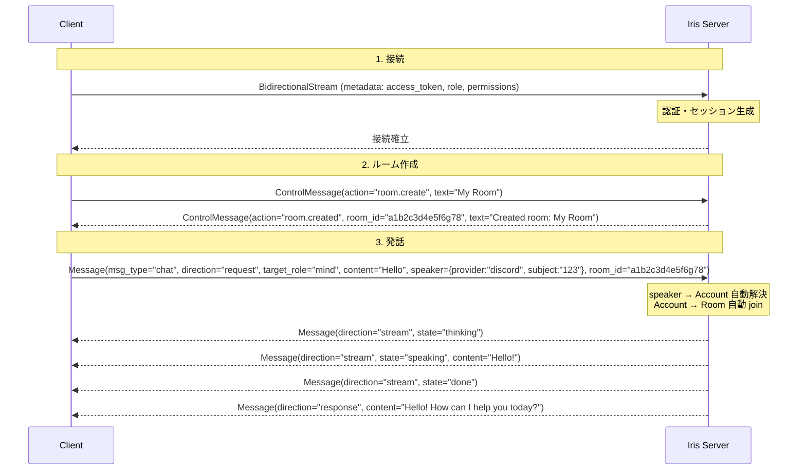
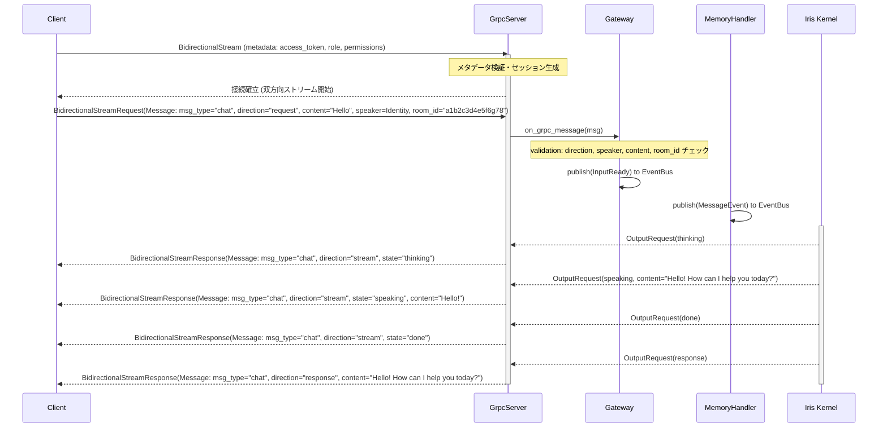
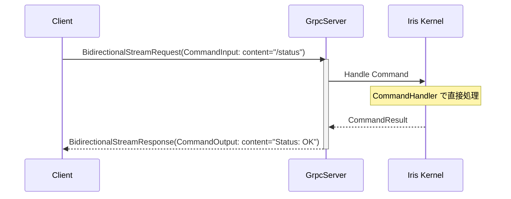
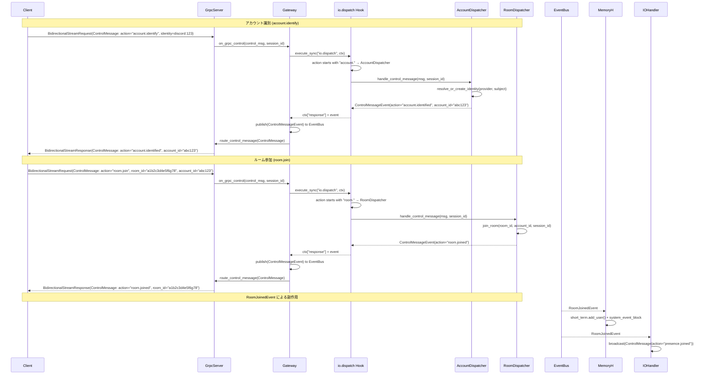
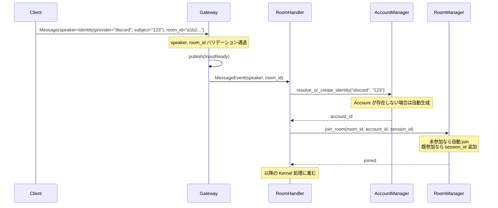
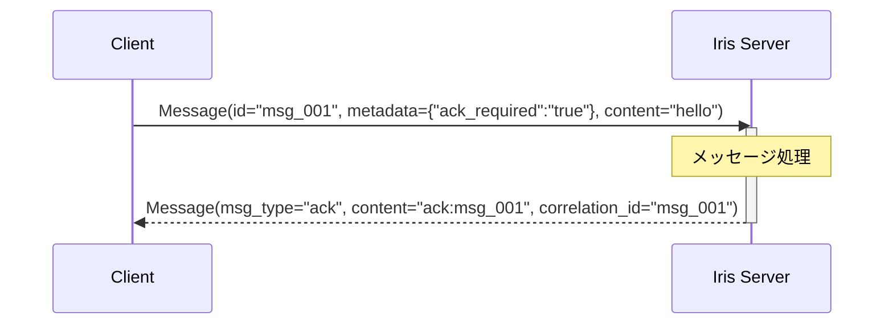

# Iris Mind 通信プロトコル 接続シーケンスと実装例

> 本ファイルは [`protocol-spec.md`](./protocol-spec.md) から分割された接続シーケンス・実装例セクションである。プロトコル全体の概要・通信方式・エラーハンドリングは [`protocol-spec.md`](./protocol-spec.md) を参照。データ型定義は [`protocol-types.md`](./protocol-types.md) を参照。

## 1. クイックスタート — 発話までの最小手順

chat メッセージを Iris に送信するための最小限の手順を示す。

### 1.1 必須前提

Iris に発話を届けるには以下が**すべて**揃っている必要がある：

| 前提 | 提供方法 | 必須/自動 |
|------|---------|----------|
| セッション | 接続時にサーバーが自動生成 | 自動 |
| `target_role="mind"` | 毎 Message の `target_role` に `"mind"` を設定。省略すると Iris が処理しない | **クライアント必須** |
| ルーム | `room.create` でクライアントが作成。存在しない room_id はエラー応答 | **クライアント必須** |
| speaker (Identity) | 毎 Message の `speaker` フィールドに設定 | **クライアント必須** |
| Account | speaker からサーバーが自動解決（`resolve_or_create_identity`） | 自動 |
| ルーム参加 | speaker → Account 解決後、サーバーが自動 join | 自動 |

> **重要**: クライアントは `account.identify` や `room.join` を明示的に呼ぶ必要は**ない**。発話時に speaker と room_id を含めれば、Account 作成と Room 参加はサーバーが自動で行う。

### 1.2 最小シーケンス



### 1.3 欠落時のエラー

必須フィールドが不足している場合、サーバーは以下のエラー応答を返す（`msg_type="response"`, `direction="response"`, `metadata={"error":"true"}`）：

| 不足 | エラーメッセージ |
|------|----------------|
| `direction` が `request` 以外 | `"unexpected direction from client: {direction}. use 'request'"` |
| `target_role` が `"mind"` 以外 | Iris はメッセージを処理せず応答を返さない（セッション間ルーティングに回る）。明示的なエラーは返らないため注意 |
| `speaker` 未設定 | `"speaker is required for inbound messages"` |
| `content` 空 (chat) | `"content is required for chat messages"` |
| `room_id` 空 | `"room_id is required"` |
| 存在しない `room_id` | `"room not found: {room_id}"` |

> **エラー判別**: エラー応答は `msg_type="response"` で届くが、`metadata` に `"error": "true"` が設定される。クライアントは `msg.metadata.get("error") == "true"` でエラーか否かを機械的に判別できる。

### 1.4 永続性と再接続

- **ルーム**: すべてインメモリ管理。Iris プロセスが再起動すると全ルーム・メンバーシップは消滅する。再接続後は `room.create` → `room.join` を毎回実行する必要がある。`room_id` をクライアント側で保存しても再利用できない。
- **Account**: `speaker` の `provider` + `subject` から自動生成された Account は永続化される。同じ `provider` + `subject` を指定すれば同一 Account として認識される。再接続後 `account.identify` で復旧可能。
- **感情・関係性**: 永続化されている。再接続前の状態を引き継ぐ。

---

## 2. 接続シーケンス詳細

### 2.1 通常フロー



### 2.2 コマンドフロー (Fast-Path)



### 2.3 アカウント制御フロー (ControlMessage)



### 2.4 Speaker 自動解決フロー

クライアントが `Message.speaker` に Identity を設定して発話すると、サーバーが以下の処理を自動実行する：



**要点:**
- `speaker` の `provider` + `subject` が Account の識別子になる
- Account は初回発話時に自動生成される（`account.identify` 不要）
- Room 参加も自動（`room.join` 不要）
- `provider_name` は表示名として使用される（任意）
- `metadata` は guild_id/channel_id 等の付加情報（任意、Account には保存されない）

### 2.5 ACK確認応答フロー

クライアントは `Message.metadata` に `ack_required=true` を含めると、サーバーが処理後に確認応答を返送する。



ACK メッセージの仕様:
- `msg_type`: `"ack"`
- `content`: `"ack:{元メッセージのid}"`
- `correlation_id`: 元メッセージの `id`
- サーバー→クライアントの単方向。クライアントは ACK に対して応答しない。

---

## 3. 実装例

### 3.1 Python クライアント例

```python
import json
import grpc
from iris.io.transport import grpc_service_pb2 as pb2
from iris.io.transport import grpc_service_pb2_grpc as pb2_grpc


def run():
    metadata = [
        ("access_token", "your_access_token"),
        ("role", "cli"),
        ("permissions", "send_chat,receive_chat,send_command,receive_command,send_voice_indicator"),
    ]

    with grpc.insecure_channel("localhost:9876") as channel:
        stub = pb2_grpc.IrisServiceStub(channel)

        def messages():
            # Step 1: ルーム作成
            yield pb2.BidirectionalStreamRequest(
                control=pb2.ControlMessage(
                    action="room.create",
                    text="My Room",
                )
            )

            # Step 2: 発話
            yield pb2.BidirectionalStreamRequest(
                message=pb2.Message(
                    id="msg_001",
                    msg_type="chat",
                    direction="request",
                    target_role="mind",
                    content="Hello Iris!",
                    speaker=pb2.Identity(
                        provider="discord",
                        subject="123",
                        provider_name="Alice",
                    ),
                    room_id="<room_id from room.created response>",
                )
            )

        responses = stub.BidirectionalStream(messages(), metadata=metadata)

        room_id = None
        for response in responses:
            if response.HasField("control"):
                ctrl = response.control
                print(f"[Control] action={ctrl.action} text={ctrl.text}")
                if ctrl.action == "room.created":
                    room_id = ctrl.room_id
                    print(f"  -> room_id = {room_id}")
            elif response.HasField("message"):
                msg = response.message
                is_error = msg.metadata.get("error") == "true"
                if msg.direction == "stream":
                    print(f"[{msg.state}] {msg.content}")
                elif msg.direction == "response":
                    prefix = "[Error]" if is_error else "[Final]"
                    print(f"{prefix} {msg.content}")
            elif response.HasField("command"):
                print(f"[Command] {response.command.content}")


if __name__ == "__main__":
    run()
```

### 3.2 Python クライアント例（room_id 事前取得版）

ルーム作成の応答を待ってから発話するより実用的なパターン：

```python
import json
import grpc
import threading
from iris.io.transport import grpc_service_pb2 as pb2
from iris.io.transport import grpc_service_pb2_grpc as pb2_grpc


class IrisClient:
    def __init__(self):
        self._room_id = None
        self._room_ready = threading.Event()

    def _request_stream(self):
        # ルーム作成
        while self._room_id is None:
            yield pb2.BidirectionalStreamRequest(
                control=pb2.ControlMessage(
                    action="room.create",
                    text="My Room",
                )
            )
            self._room_ready.wait(timeout=5)
            self._room_ready.clear()

        # 発話
        yield pb2.BidirectionalStreamRequest(
            message=pb2.Message(
                msg_type="chat",
                direction="request",
                target_role="mind",
                content="Hello Iris!",
                speaker=pb2.Identity(
                    provider="discord",
                    subject="123",
                    provider_name="Alice",
                ),
                room_id=self._room_id,
            )
        )

    def run(self):
        metadata = [
            ("access_token", "your_access_token"),
            ("role", "cli"),
            ("permissions", "send_chat,receive_chat,send_command,receive_command,send_voice_indicator"),
        ]

        with grpc.insecure_channel("localhost:9876") as channel:
            stub = pb2_grpc.IrisServiceStub(channel)
            responses = stub.BidirectionalStream(self._request_stream(), metadata=metadata)

            for response in responses:
                if response.HasField("control"):
                    ctrl = response.control
                    print(f"[Control] action={ctrl.action} text={ctrl.text}")
                    if ctrl.action == "room.created":
                        self._room_id = ctrl.room_id
                        self._room_ready.set()
                elif response.HasField("message"):
                    msg = response.message
                    if msg.direction == "stream":
                        print(f"[{msg.state}] {msg.content}")
                    elif msg.direction == "response":
                        print(f"[Final] {msg.content}")
                elif response.HasField("command"):
                    print(f"[Command] {response.command.content}")


if __name__ == "__main__":
    IrisClient().run()
```

### 3.3 Rust クライアント例 (tonic)

> **注意**: 以下の例では簡略化のため room.create と chat を一括送信しているが、room.create の応答を待たずに chat が到達すると `"room not found"` エラーになる可能性がある。実運用では、Python の「事前取得版」のように `room.create` の応答を受信してから `room_id` を設定して発話すること。

```rust
use iris::io::transport::iris_service_client::IrisServiceClient;
use iris::io::transport::{
    bidirectional_stream_request, bidirectional_stream_response, ControlMessage, Identity, Message,
};
use tonic::metadata::MetadataValue;
use tonic::Request;

pub mod iris {
    pub mod io {
        pub mod transport {
            tonic::include_proto!("iris.io.transport");
        }
    }
}

#[tokio::main]
async fn main() -> Result<(), Box<dyn std::error::Error>> {
    let channel = tonic::transport::Channel::from_static("http://127.0.0.1:9876")
        .connect()
        .await?;

    let token: MetadataValue<_> = "your_access_token".parse()?;
    let role: MetadataValue<_> = "cli".parse()?;
    let permissions: MetadataValue<_> =
        "send_chat,receive_chat,send_command,receive_command,send_voice_indicator".parse()?;

    let mut client = IrisServiceClient::with_interceptor(channel, move |mut req: Request<()>| {
        req.metadata_mut().insert("access_token", token.clone());
        req.metadata_mut().insert("role", role.clone());
        req.metadata_mut().insert("permissions", permissions.clone());
        Ok(req)
    });

    // Step 1: ルーム作成（room.create）
    let outbound = tokio_stream::iter(vec![
        iris::io::transport::BidirectionalStreamRequest {
            frame: Some(bidirectional_stream_request::Frame::Control(ControlMessage {
                action: "room.create".to_string(),
                text: "My Room".to_string(),
                ..Default::default()
            })),
        },
    ]);

    let response = client.bidirectional_stream(outbound).await?;
    let mut inbound = response.into_inner();

    // room.created 応答から room_id を取得
    let mut room_id = String::new();
    while let Some(frame) = inbound.message().await? {
        if let Some(bidirectional_stream_response::Frame::Control(ctrl)) = frame.frame {
            println!("[Control] action={} text={}", ctrl.action, ctrl.text);
            if ctrl.action == "room.created" {
                room_id = ctrl.room_id;
                break;  // room_id 取得後に接続を切る
            }
        }
    }

    // Step 2: 再接続し、取得した room_id で発話
    let channel = tonic::transport::Channel::from_static("http://127.0.0.1:9876")
        .connect()
        .await?;

    let token: MetadataValue<_> = "your_access_token".parse()?;
    let role: MetadataValue<_> = "cli".parse()?;

    let mut client = IrisServiceClient::with_interceptor(channel, move |mut req: Request<()>| {
        req.metadata_mut().insert("access_token", token.clone());
        req.metadata_mut().insert("role", role.clone());
        req.metadata_mut().insert("permissions", permissions.clone());
        Ok(req)
    });

    let outbound = tokio_stream::iter(vec![
        iris::io::transport::BidirectionalStreamRequest {
            frame: Some(bidirectional_stream_request::Frame::Message(Message {
                id: "msg_001".to_string(),
                msg_type: "chat".to_string(),
                session_id: String::new(),
                direction: "request".to_string(),
                source_role: "cli".to_string(),
                target_role: "mind".to_string(),
                content: "Hello Iris!".to_string(),
                speaker: Some(Identity {
                    provider: "discord".to_string(),
                    subject: "123".to_string(),
                    provider_name: "Alice".to_string(),
                    ..Default::default()
                }),
                room_id,
                ..Default::default()
            })),
        },
    ]);

    let response = client.bidirectional_stream(outbound).await?;
    let mut inbound = response.into_inner();

    while let Some(frame) = inbound.message().await? {
        if let Some(f) = frame.frame {
            match f {
                bidirectional_stream_response::Frame::Message(msg) => {
                    // エラー判別: metadata の "error" キーをチェック
                    let is_error = msg.metadata.get("error").map_or(false, |v| v == "true");
                    if is_error {
                        eprintln!("[Error] {}", msg.content);
                    } else if msg.direction == "stream" {
                        println!("[{}] {}", msg.state, msg.content);
                    } else {
                        println!("[Final] {}", msg.content);
                    }
                }
                bidirectional_stream_response::Frame::Command(cmd) => {
                    println!("[Command] {}", cmd.content);
                }
                bidirectional_stream_response::Frame::Control(ctrl) => {
                    println!("[Control] action={} text={}", ctrl.action, ctrl.text);
                }
            }
        }
    }

    Ok(())
}
```
