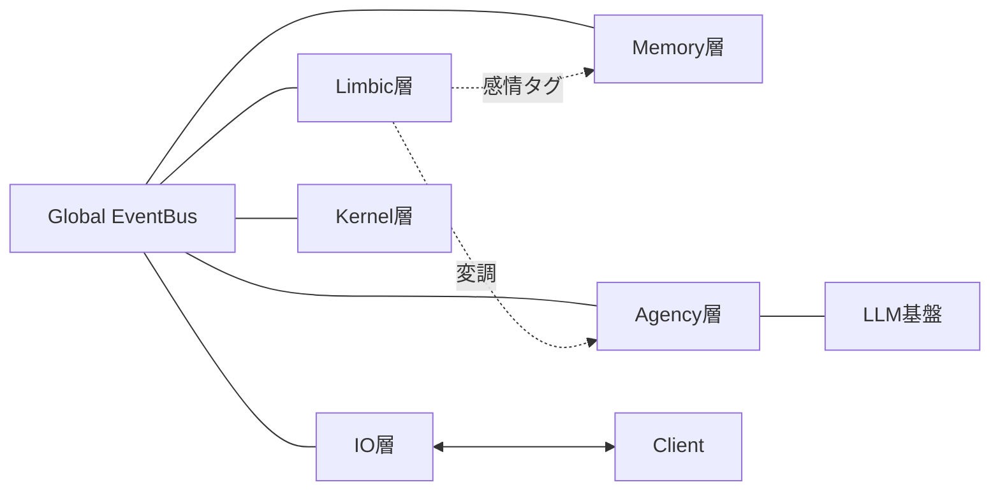

# How Iris Works

> Iris の全機能をコードを交えずに説明する。
> 各機能の詳細は `docs/how-it-works/` 以下の個別文書を参照。

## 文書一覧

| 文書 | 内容 |
|------|------|
| [EventBus / 層間通信](how-it-works/01-eventbus.md) | 購読・発行・シリアライズ・配送保証 |
| [記憶システム](how-it-works/02-memory-system.md) | 感覚→短期→長期、海馬、GoalStore |
| [感情システム](how-it-works/03-emotion-system.md) | PADモデル・Amygdala・ACC・減衰パラメータ |
| [動機づけシステム](how-it-works/04-drive-state.md) | DriveState蓄積/充足アルゴリズム |
| [意思決定](how-it-works/05-decision-making.md) | PlanningManager・InputReady振分・感情変調 |
| [自発発話スコアリング](how-it-works/06-proactive-scoring.md) | 全6因子の計算式と重み |
| [抑制制御](how-it-works/07-inhibition.md) | Gate判定・因子リスト・Go Signal・topic cooldown |
| [実行パイプライン](how-it-works/08-execution-pipeline.md) | ExecutionManager・Workflow・ツールループ |
| [Reflexion / Consolidation](how-it-works/09-reflexion.md) | 海馬・記憶整理・自発調査結果評価 |
| [性格進化](how-it-works/10-personality.md) | Big Five・PEM更新式・変化検出 |
| [モデルルーティング](how-it-works/11-model-routing.md) | LLMBridge・PriorityLock・provider切替 |
