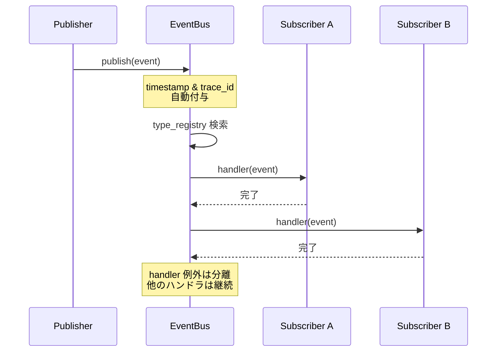
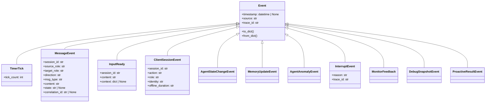

# EventBus: 層間通信の詳細

## アーキテクチャ

Global EventBus は全層間の疎結合通信を実現するシングルインスタンスのイベントバス。
スレッドセーフ（`threading.Lock` 使用）。`EventBusProtocol` で差し替え可能。



## Event 基底クラス

全てのイベントは `@dataclass(kw_only=True)` の `Event` を継承。

```python
@dataclass(kw_only=True)
class Event:
    timestamp: datetime | None   # publish時に自動付与 (UTC)
    source: str                  # 発行元層名
    trace_id: str = ""           # publish時に自動生成 (uuid hex 12桁)
```

### 自動機能

- **timestamp**: publish 時に `datetime.now(UTC)` が自動設定
- **trace_id**: 空文字の場合 `new_trace_id()` (= `uuid.uuid4().hex[:12]`) が自動生成
- **type_registry**: `__init_subclass__` で全サブクラスが自動登録。`from_dict()` で型解決に使う
- **to_dict**: 全フィールドを dict 化。datetime は ISO8601 文字列に変換
- **from_dict**: type キーからクラス解決し各フィールドを再構築

## 配送モデル

- **同期同期的**: publish は全ハンドラが完了するまでブロック
- **at-most-once**: 1度だけ配送。再配送や確認応答機構なし
- **handler 例外は分離**: handler が例外を送出しても publish は継続。ログのみ出力
- **配送順序**: 登録順。同じイベント型の複数ハンドラ間の順序は未保証

## 全イベント型一覧



## 主要イベントの配送パス

| イベント | 発行元 | 購読先 | 条件・周期 | 用途 |
|----------|--------|--------|-----------|------|
| TimerTick | KernelProcess | Memory, Limbic | 5秒ごと、tick_count インクリメント | 鼓動・decayトリガー |
| MessageEvent(request) | IO層 | Memory, Limbic, Agency | direction="request" | 入力の一次受信 |
| InputReady | Memory層 | Agency/Planning | pending pop or timer | 確定入力の通知 |
| PlanDecided | Agency/Planning | Agency/Execution | InternalBus経由 | 計画通知 |
| MessageEvent(stream) | Agency/Execution | IO層 | direction="stream" | トークン逐次出力 |
| MessageEvent(response) | Agency/Execution | IO層 | direction="response" | 応答確定 |
| ClientSessionEvent | IO層 | 全層 | action="connected"/"disconnected" | Client接続状態 |
| InterruptEvent | 任意 | FlowExecutor | InputReady到着時 | LLM生成中断 |
| ProactiveResultEvent | Agency/Execution | Limbic, Memory | 自発調査完了後 | 調査結果 |
| MonitorFeedback | Agency/Execution | Limbic | talkative/flags検出時 | 出力頻度監視 |
| DebugSnapshotEvent | 任意 | EventTracer | Debug有効時 | 状態変化記録 |

## MessageEvent の方向（direction）と状態遷移

```
direction: "request"  → Client → Iris (入力)
direction: "event"    → システム内部通知
direction: "stream"   → Iris → Client (逐次出力)
direction: "response" → Iris → Client (一括応答)

ストリーミング状態遷移 (state):
THINKING → SPEAKING → DONE
```

## Internal Bus（Agency 層内）

Agency 層内の Planning → Execution 間通信は別の `InternalBus` インスタンスを使用。
Global EventBus とは分離しており、`PlanDecided` イベントのみを伝達する。

```python
@dataclass
class PlanDecided:
    plan: dict[str, Any]  # 実行計画（content, model_role, temperature, ...）
```

## EventTracer（デバッグ基盤）

EventBus に tracer を設定すると、全イベントがリングバッファ（500件）に追跡される。
`DebugSnapshotEvent` は category 別インデックス付きで保存され、後続の状態診断に利用される。
