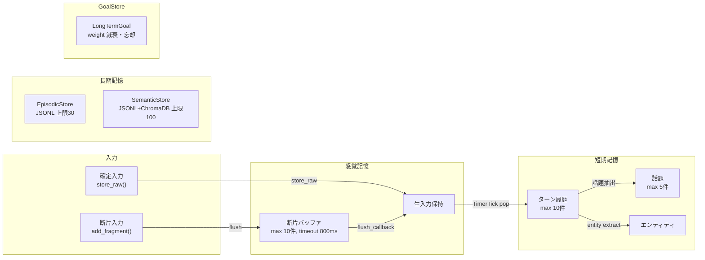

# 記憶システム: 3層構造 + GoalStore



## 感覚記憶 (SensoryMemoryManager)

生入力を処理前に一時保持する。2系統の入力を持つ。

### 系統1: 断片入力 (fragment mode)

`add_fragment(content, is_final)` で逐次的に追加。以下のいずれかでフラッシュされる:

- **final フラグ**: is_final=True で即時 flush
- **タイムアウト**: 800ms 無入力で自動 flush (`_on_timeout`)
- **最大断片数**: 10 断片超で強制 flush
- **Readiness 評価**: `ReadinessEvaluator` が「発話完了」と判断した場合

flush 時は `flush_callback(session_id, content)` が呼ばれる。

### 系統2: 生入力保持 (raw mode)

`store_raw(content)` で完全な入力を保持。`retrieve()` で取得可能。

- `has_pending_raw`: 未処理の raw 入力有無
- MemoryManager の TimerTick 処理で pop され、`InputReady` として再 publish

### 状態管理

| プロパティ | 型 | 意味 |
|-----------|-----|------|
| `fragment_count` | int | 蓄積中の断片数 |
| `accumulated_text` | str | 未 flush の全断片連結 |
| `has_pending_raw` | bool | 未処理 raw 入力あり |
| `raw` / `raw_block` | str / dict | 最新 raw 入力とブロック本体 |
| `raw_timestamp` | str | `store_raw()` 時点の記録時刻 |

## 短期記憶 (ShortTermMemoryManager)

直近の会話履歴をターン単位で保持。

### パラメータ

| パラメータ | デフォルト | 意味 |
|-----------|-----------|------|
| max_turns | 10 | 最大保持ターン数 |
| max_topics | 5 | 最大話題数 |
| _MAX_TURN_LENGTH | 500 | 1ターンの最大文字数 |
| _MAX_CONTEXT_CHARS | 600 | render_context の最大文字数 |

### 1ターンの構造

```python
{
    "role": "user" | "assistant" | "thought",
    "content": str,           # 発話内容 (_MAX_TURN_LENGTHでtruncate)
    "timestamp": str,         # ISO8601
    "consolidated": bool,     # 長期記憶化済みフラグ
    "importance": int,        # 0-5 (DefaultImportanceScorer)
}
```

### 重要度スコアリング

`DefaultImportanceScorer`:
- "important"/"大事"/"覚えて"/"remember"/"critical"/"urgent" を含む → +3
- "please"/"お願い"/"help"/"question"/"質問" を含む → +1
- 3文字以上の大文字連続 → +1
- "!" が2つ以上 → +1
- 上限 5

### エンティティ抽出

`RegexEntityExtractor` で以下を抽出:
- URL (`https?://...`)
- ファイルパス (`/path/to/file`)
- ハッシュタグ (`#word`)
- メンション (`@user`)
- 日本語引用 (`「...」`)
- 英語引用 (`"..."`)
- キャメルケース単語 (`PascalCase`)
- 重複除去、3文字未満除外

### 話題抽出

発話文を `[。！？.!?]` で分割し、文字数 5-80 の文を話題として採用。
上限 max_topics を超えた場合は古いものから削除。

### 検索

`search(query)`:
- query と各ターンの単語集合の Jaccard 類似度で関連度計算
- 関連度 + importance でソート
- 最大 max_results 件返却

`search_entities(entity_name)`:
- エンティティ名を含むターンを検索
- 最新 5 件まで返却

### Context レンダリング

`render_context(query=None)`:
- query 有: `search()` で関連ターン + 直近 4 ターン（重複除外）を表示
- 参照エンティティを表示（最大 5 件、長い順）
- 全体が _MAX_CONTEXT_CHARS を超える場合は切り詰め

## 長期記憶 (LongTermMemory)

### エピソード記憶 (EpisodicStore)

- 保存形式: JSONL (`.iris/data/episodes.jsonl`)
- 上限: 30 エントリ
- 構造: `{"content": str, "kind": str, "timestamp": str}`
- 上限超過時: 古いエントリ同士をマージ圧縮（LLM要約）

### 意味記憶 (SemanticStore + VectorStore)

- 保存形式: JSONL (`.iris/data/semantic.jsonl`) + ChromaDB
- 上限: 100 エントリ
- 保存要素: `{content, type, tags, timestamp, embedding}`

#### ハイブリッド検索スコア

```
統合スコア = vector_score × 0.6 + bm25_score × 0.4
```

vector_score は ChromaDB のコサイン類似度、bm25_score は BM25 アルゴリズムによるキーワード一致度。

Embedding 生成: ONNX MiniLM (`all-MiniLM-L6-v2`) が初回使用時に自動ダウンロード。

## GoalStore: 長期目標管理

`LongTermGoal` はエージェントの持続的な目標を管理する Pydantic モデル。

### データ構造

```yaml
id: str              # UUID自動生成
description: str     # 目標の説明
weight: float        # 重要度 (0.0 ~ 1.0)
created_at: float    # Unix timestamp
updated_at: float    # 最終更新時刻
```

### 主要操作

| 操作 | 効果 |
|------|------|
| add_goal(desc, weight) | 新規目標追加。weight は自動 clamp(0,1) |
| remove_goal(id) | 目標削除 |
| get_goals() | 全目標を weight 降順で返す |
| get_active_goals(threshold=0.3) | weight >= threshold の目標のみ |
| decay_goals(rate, remove_threshold=0.1) | 全目標の weight を一定量減衰。閾値未満は忘却 |

### 減衰アルゴリズム

```
goal.weight = max(0.0, goal.weight - decay_rate)
if goal.weight < remove_threshold (0.1): 削除
```

`decay_goals()` が定期的に呼ばれ不要な目標が忘却される。

### 永続化

インメモリ管理。`save(path)` / `load(path)` で JSON ファイルにダンプ可能。
MemoryManager から定期的に呼ばれる想定。
