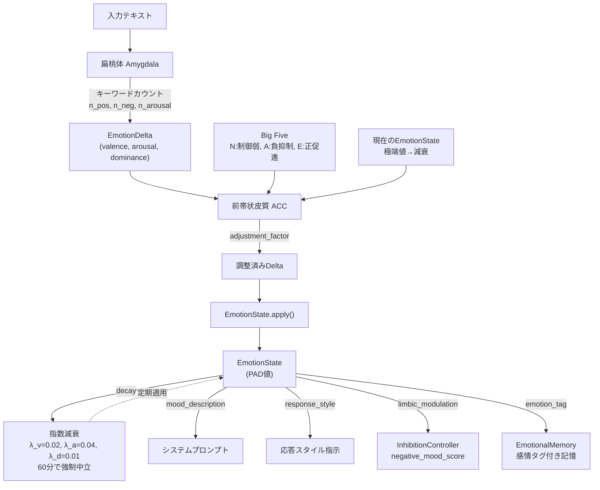

# 感情システム: PADモデルと処理パイプライン



## 全体パイプライン

## PAD 3次元モデル

`EmotionState` は Mehrabian の PAD モデルを実装。

| 次元 | 範囲 | 中立値 | 意味 |
|------|------|--------|------|
| valence (P) | -1.0 ~ 1.0 | 0.0 | 快-不快 |
| arousal (A) | 0.0 ~ 1.0 | 0.0 | 覚醒度 |
| dominance (D) | 0.0 ~ 1.0 | 0.5 | 支配性・制御感 |

### 減衰アルゴリズム

```
minutes = dt / 60.0

if minutes >= 60: 強制中立化
else:
  self.valence   *= exp(-0.02 * minutes)   # 比較的持続
  self.arousal   *= exp(-0.04 * minutes)   # 早く減衰
  self.dominance  = 0.5 + (self.dominance - 0.5) * exp(-0.01 * minutes)

その後 clamp:
  valence: [-1.0, 1.0]
  arousal: [0.0, 1.0]
  dominance: [0.0, 1.0]
```

- **強制中立化**: 60分経過で valence=0.0, arousal=0.0, dominance=0.5 にリセット
- **decay トリガー**: 6 TimerTick ごと（約30秒）に LimbicManager._on_timer_tick から呼ばれる
- **apply()**: EmotionDelta を適用後、updated_at を現在時刻に更新（decay 基準時刻リセット）

## 扁桃体 (Amygdala): 感情評価

キーワードベース（LLM不要）の高速評価。将来の Phase2 で LLM アシストを想定。

### キーワード辞書

| 辞書 | 単語数 | 例 |
|------|--------|----|
| _POSITIVE_WORDS | 30+ | "ありがとう", "嬉しい", "素晴らしい", "thank", "love", "great" |
| _NEGATIVE_WORDS | 30+ | "残念", "つまらない", "悲しい", "hate", "terrible", "bad" |
| _HIGH_AROUSAL_MARKERS | 15+ | "!", "?", "本当", "まじ", "w", "やば" |
| _APPRECIATION_WORDS | 6 | "ありがとう", "感謝", "助かる", "thank", "thanks", "good" |
| _CRITICISM_WORDS | 10+ | "違う", "間違い", "バカ", "wrong", "stupid", "useless" |

### スコア計算

```python
n_pos, n_neg, n_arousal = 該当キーワードの出現数

if n_pos == 0 and n_neg == 0 and n_arousal == 0:
    return EmotionDelta()  # 中立

valence_raw = (n_pos - n_neg) / max(n_pos + n_neg, 1)
arousal_raw = min(n_arousal / 3.0, 1.0)

if len(text) < 10:
    arousal_raw *= 0.5

if n_appreciation > 0: valence_raw += 0.3
if n_criticism > 0:    valence_raw -= 0.4

return EmotionDelta(
    valence = clamp(-1, 1, valence_raw) * 0.8,
    arousal = clamp(0, 1, arousal_raw) * 0.8,
    dominance = dominance_score * 0.6,
)
```

### 支配性推定

テキストの能動性/受動性から支配性変化量を推定:

| パターン | 変化量 |
|---------|--------|
| 「私が/俺/僕/私が」主体 | +0.3 |
| "I"/"I'll"/"I'm"/"let me"/"my" | +0.2 |
| 「やって/実行/作っ/書い」命令形 | +0.2 |
| 「決めた/決めたい/やる/やろう」意志 | +0.3 |
| 「させられる/されてる/やられ」受動 | -0.3 |
| 「わからない/できない/無理」否定 | -0.2 |
| "can't"/"cannot"/"couldn't" | -0.2 |

### 基本感情分類

`evaluate_basic(text)` は EmotionDelta と BASIC_EMOTIONS プリセットの PAD 距離（ユークリッド二乗距離）で最も近い感情ラベルを返す。

```python
BASIC_EMOTIONS = {
    "joy":           EmotionDelta(v= 0.8, a= 0.6, d= 0.5),
    "sadness":       EmotionDelta(v=-0.7, a=-0.4, d=-0.3),
    "anger":         EmotionDelta(v=-0.5, a= 0.8, d= 0.7),
    "fear":          EmotionDelta(v=-0.6, a= 0.7, d=-0.6),
    "surprise":      EmotionDelta(v= 0.0, a= 0.8, d=-0.2),
    "trust":         EmotionDelta(v= 0.7, a=-0.1, d= 0.4),
    "anticipation":  EmotionDelta(v= 0.4, a= 0.6, d= 0.2),
    "calmness":      EmotionDelta(v= 0.3, a=-0.6, d= 0.1),
}
```

## 前帯状皮質 (ACC): 感情制御

扁桃体からの EmotionDelta を現在の感情状態と性格に基づき調整する。

### 制御パラメータ

- `regulation_strength`: 基本制御強度 (default: 0.5)

### 制御則

```python
factor = 1.0

# 1. 現在の感情が極端 → delta を減衰
if abs(current.valence) > 0.7:
    factor *= 1.0 - strength * 0.3
if current.arousal > 0.6:
    factor *= 1.0 - strength * 0.4

# 2. Big Five 相互作用
if big_five が利用可能:
    neuroticism = Nスコア / 100
    strength *= 1.0 - (neuroticism - 0.5) * 0.4   # N高→制御弱
    strength = clamp(0.1, 1.0, strength)

    if delta.valence < 0 and agreeableness > 0.5:
        factor *= 1.0 - (agreeableness - 0.5) * 0.3  # A高→負感情抑制
    if delta.valence > 0 and extraversion > 0.5:
        factor *= 1.0 + (extraversion - 0.5) * 0.2   # E高→正感情促進

factor = max(0.3, factor)
adjusted = delta.scale(factor)
```

- factor は 0.3 未満にならない（最低 30% の変化は通す）
- Neuroticism 50 → 変化なし。100 → strength 20%低下。0 → strength 20%上昇
- Agreeableness > 50 の場合、負の valence 変化を追加抑制
- Extraversion > 50 の場合、正の valence 変化を増幅

## 感情タグと感情記憶 (EmotionalMemory)

`LimbicManager._on_message_event()` で入力評価後、`EmotionalMemory.tag()` が呼ばれる。
現在の EmotionState を要約した感情情報がエピソード記憶に付加される。

`search_by_emotion()` で現在の感情状態に近いタグを持つ記憶を検索可能（距離は PAD ユークリッド距離）。

## 気分記述と応答スタイル

### 気分記述 (`build_mood_description`)

9 段階の気分テキストを PAD 値の条件分岐で選択:

| 条件 | テキスト (short) |
|------|-----------------|
| V>0.5 && A>0.4 | わくわく |
| V>0.3 && A<0.3 | 穏やか |
| V>0.3 | 良い気分 |
| V<-0.5 && A>0.4 | イライラ |
| V<-0.3 && A<0.3 | 沈み気味 |
| V<-0.3 | 不調 |
| A>0.6 | 落ち着かない |
| D>0.5 | 自信満々 |
| D<0.3 | 自信なし |

`is_neutral` (|V|<0.1 && A<0.15 && |D-0.5|<0.1) の場合は空文字を返す。

### 応答スタイル (`build_response_style`)

PAD 値から自然言語の応答スタイル指示を構築。システムプロンプトに注入される。

| 条件 | 指示例 |
|------|--------|
| V > 0.5 | "明るく温かいトーン" + 感嘆詞付与 |
| V > 0.2 | "穏やかで親しみやすいトーン" |
| V < -0.5 | "簡潔に1文以内"、"ぶっきらぼうに" |
| V < -0.2 | "やや控えめに"、"悲しそうに" |
| A > 0.6 | "テンポ良く"、"感嘆符を多めに" |
| A < 0.2 | "ゆったりとしたペース" |
| D > 0.6 | "自信を持って明確に" |
| D < 0.3 | "慎重に、確認しながら" |

## MonitorFeedback による感情変調

OutputMonitor が talkative や frequency_exceeded を検出すると、LimbicManager に `MonitorFeedback` が届く。

| フラグ | Valence | Arousal | Dominance |
|--------|---------|---------|-----------|
| talkative | -0.15 | +0.20 | -0.10 |
| frequency_exceeded | -0.10 | +0.30 | -0.15 |

## ProactiveResultEvent による感情変調

自発調査の成功/失敗に応じて:

| 結果 | Valence | Arousal | Dominance | Drive |
|------|---------|---------|-----------|-------|
| success | +0.20 | -0.10 | +0.10 | curiosity -= 0.3 |
| failure | -0.15 | +0.20 | -0.10 | - |
