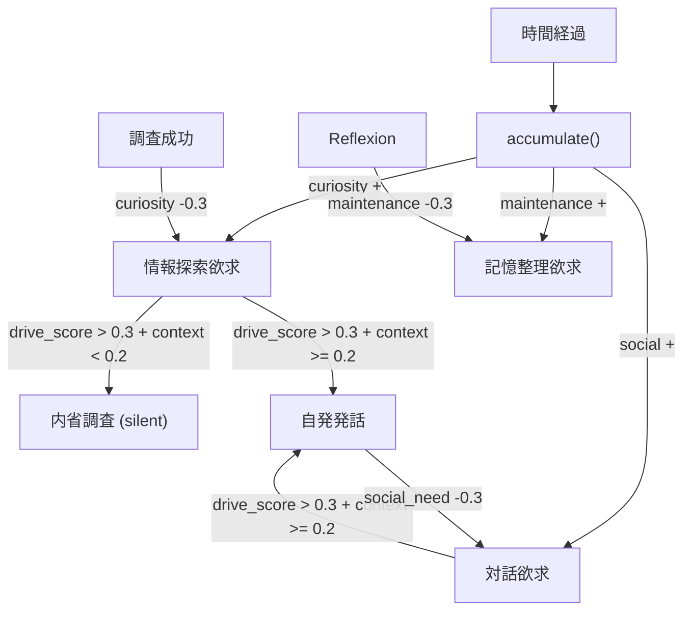

# 動機づけシステム: DriveState

PSI理論に基づく3種類の欲求モデル。時間経過で蓄積し、行動で解消される。

## 3欲求

| 欲求 | 意味 | 蓄積レート (/分) | 充足アクション | 充足量 |
|------|------|-----------------|---------------|--------|
| curiosity | 情報探索・不確実性解消 | 0.015 | 検索・調査成功 | 0.3 (satisfy) |
| social_need | 対話・親和欲求 | 0.01 | ユーザーへの発話 | 0.3 (satisfy) |
| maintenance | 記憶整理・自己保全 | 0.005 | Reflexion | 0.3 (satisfy) |

## 蓄積アルゴリズム

```python
def accumulate(dt):
    minutes = dt / 60.0
    curiosity   += 0.015 * minutes
    social_need += 0.01  * minutes
    maintenance += 0.005 * minutes
    clamp [0.0, 1.0]
```

- `dt`: 前回 `accumulate()` からの経過秒数
- 6 TimerTick ごと（約30秒）に LimbicManager._on_timer_tick から呼ばれる
- 各値は [0.0, 1.0] でクランプ

### 飽和までの時間

| 欲求 | 0→1.0 に達する時間 |
|------|-------------------|
| curiosity | 66.7 分 |
| social_need | 100 分 |
| maintenance | 200 分 |

## 充足アルゴリズム

```python
def satisfy(need_type, amount):
    if need_type == "curiosity":
        curiosity = max(0.0, curiosity - amount)
    elif need_type == "social_need":
        social_need = max(0.0, social_need - amount)
    elif need_type == "maintenance":
        maintenance = max(0.0, maintenance - amount)
    clamp [0.0, 1.0]
```

- デフォルト充足量: 調査成功時 curiosity 0.3。発話時 social_need 0.3
- 充足後 clamp で下限0.0を保証

## 優位欲求の決定

```python
def get_dominant_needs():
    needs = [
        ("curiosity",   curiosity),
        ("social_need", social_need),
        ("maintenance", maintenance),
    ]
    return sorted(needs, key=value, reverse=True)
```

自発発話のトリガー種別選択に使用される（PlanningManager の `_handle_proactive_event`）。

## Interaction 概要



- `silent` 判定: drive_score (= max(curiosity, social_need, maintenance)) > 0.3 かつ context_score < 0.2
- 外部コンテキストが低い場合は内省（調査）に留め、高い場合は発話に出る
