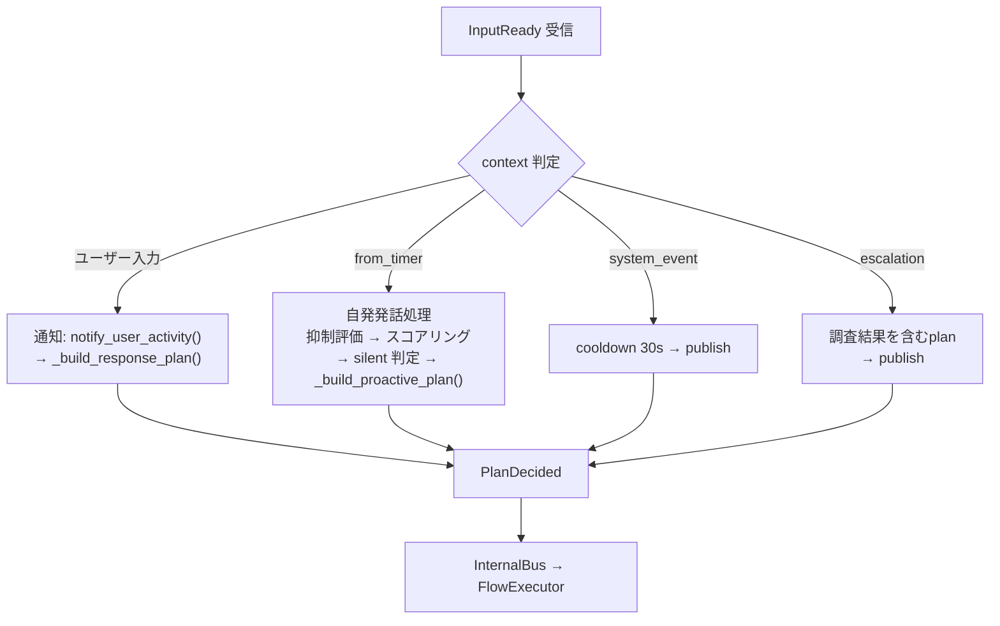

# 意思決定: PlanningManager

PlanningManager は EventBus の `InputReady` を購読し、入力に対する計画（Plan）を決定する。



## InputReady の種類

`InputReady` イベントは `content` と `context` で種類が区別される。

```python
@dataclass
class InputReady(Event):
    session_id: str = ""
    content: str = ""
    context: dict | None = None
```

| 種類 | content | context | 発行元 |
|------|---------|---------|--------|
| ユーザー入力 | テキスト | {} | MemoryManager (pending pop) |
| タイマー自発発話 | "" | {"from_timer": True} | MemoryManager (pending無し) |
| システムイベント | "" | {"system_event": "connected", "role":..., "offline_duration":...} | MemoryManager |
| エスカレーション | "" | {"escalation": True, "topic":..., "summary":...} | HippocampalManager |

## 処理フロー

```
_on_input_ready(event)
├── context に from_timer / system_event / escalation がある?
│   ├── Yes → _handle_proactive_event()
│   └── No  → _handle_user_input()
│
├── _handle_user_input():
│   ├── notify_user_activity() → inhibition 状態リセット
│   ├── _build_response_plan()
│   └── PlanDecided → InternalBus
│
└── _handle_proactive_event():
    ├── escalation? → 調査結果を含む plan を即時 publish
    ├── system_event? → cooldown 30s 設定後 publish
    ├── gate.suppressed? → abort
    ├── ProactiveScoring.compute()
    ├── total < speak_threshold? → abort
    ├── silent 判定 (drive > 0.3 && context < 0.2)
    │   ├── topic cooldown 中? → abort
    │   └── interests サンプリング → LLM疑問生成
    └── PlanDecided → InternalBus
```

## ユーザー入力時の計画構築

`_build_response_plan(content, gate)`:

### abbreviated 判定

```python
abbreviated = gate.suppressed or gate.score < config.abbreviated_threshold
```

抑制時または gate スコアが閾値未満の場合は省略応答。

### Plan 属性

```python
plan = {
    "content": content,
    "model_role": "fast" if abbreviated else "default",
    "context_hint": context_hint,
    "abbreviated": abbreviated,
    "tools_allowed": not abbreviated,
    "streaming": not abbreviated,
    "max_tokens": 80 if abbreviated else (120 if 雑談 else 0),
    "temperature": 0.5 if abbreviated else 0.7,
    "show_thinking": not abbreviated and is_task,
    "run_compression": not abbreviated,
    "record_history": True,
}
```

### タスク判定

`_is_task_content(content)`:
- 100文字以上 → タスク
- "/" で始まる → コマンド
- キーワード含む: `コード, ファイル, 実装, 作成, 修正, テスト, 実行, 設計, ...`

## 自発発話時の計画構築

`_build_proactive_plan(context, gate)`:

| 条件 | silent | tools_allowed | streaming | max_tokens |
|------|--------|---------------|-----------|------------|
| 通常自発発話 | false | false | false | 512 |
| silent 内省 | true | true | false | 512 |
| エスカレーション | false | true | true | 512 |

### Silent 内省時の興味サンプリング

(現在未実装)

## (削除) 感情による温度変調

Limbic層削除に伴い EmotionTemperatureModulator は実装されていません。
