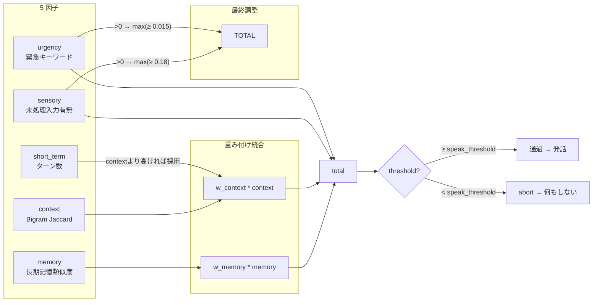

# 自発発話スコアリング: ProactiveScoring

前頭前野 (PFC) が自発行動の価値を評価するスコアリング。
`PlanningManager._on_input_ready()` でタイマー起動時に呼ばれる。



## スコア統合

```python
total = (
    w_memory  * memory_score
    + w_context * context_score
)
# sensory 最低保証
if sensory_score > 0:
    total = max(total, sensory_score * 0.3)
# urgency 最低保証
total = max(total, urgency_score * 0.15)
# システムイベントは強制通過
if system_event == "connected":
    total = max(total, speak_threshold + 0.1)
```

### デフォルト重み

| 重み | デフォルト値 | config キー |
|------|-------------|-------------|
| w_memory | 0.40 | trigger_weights.memory |
| w_context | 0.15 | trigger_weights.context |

## 各因子の計算式

### 1. memory_score

長期記憶との関連性。現在の話題と意味記憶の類似度。

```python
recent = memory.get_recent(3)        # 直近3件のエピソード話題
topic = " ".join(summary)            # 話題連結
results = memory.search_semantic(topic)  # ChromaDB+BM25検索
return max(results.scores)           # 最高類似度
```

- 話題がない場合: 0.0
- 検索失敗: 0.0
- 意味記憶との接続が多いほど高スコア

### 2. context_score

直近会話の文脈的一貫性。文字bigram Jaccard類似度。

```python
recent = memory.get_recent(2)        # 直近2件
if len(recent) < 2: return 0.3       # データ不足→中程度

summaries = [item.summary for item in recent]
if all(len(s) < 10): return 0.7      # 短い話題→高いスコア

bigram_a = char_bigram_set(summaries[0])
bigram_b = char_bigram_set(summaries[1])
jaccard = len(intersection) / len(union)
return min(jaccard + 0.2, 1.0)       # +0.2 バイアス
```

- 短期記憶のターン数に基づく stm_score が context_score より高い場合はそちらを採用

### 3. stm_score (短期記憶追加因子)

```python
turns = memory.short_term.get_recent_turns(2)
if len(turns) >= 2: return 0.5
if len(turns) == 1: return 0.3
return 0.0
```

### 4. sensory_score (感覚記憶追加因子)

```python
sensory = memory.sensory.retrieve()
if "raw" in sensory: return 0.6  # 未処理の生入力あり
return 0.0
```

sensory_score > 0 の場合、`total = max(total, sensory_score * 0.3)` で最低保証。

### 5. urgency_score (緊急性因子)

```python
score = 0.0
if "?"/"？"/"教えて"/"what"/"how"/"why": score += 0.3
if "urgent"/"important"/"急"/"至急"/"help"/"問題": score += 0.3
if len(content) > 100: score += 0.2
if content.count("!") >= 2: score += 0.1
return min(score, 0.8)
```

## 最終調整

### ignore ペナルティ

```python
if ignore_count > 0:
    ignore_penalty = max(0.2, 1.0 - ignore_count * 0.25)
    total *= ignore_penalty
```

| consecutive_ignores | penalty |
|--------------------|---------|
| 0 | 1.0 (影響なし) |
| 1 | 0.75 |
| 2 | 0.50 |
| 3 | 0.25 |
| 4+ | 0.20 (下限) |

### システムイベント

```python
if system_event == "connected":
    total = max(total, speak_threshold + 0.1)
```

### 閾値

- `speak_threshold`: 発話閾値（デフォルト 0.30）。超えれば発話、未満なら abort
- `abbreviated_threshold`: 短縮応答切替閾値（デフォルト 0.25）。speak_threshold 未満でもこの値を超えていれば短縮応答が可能
