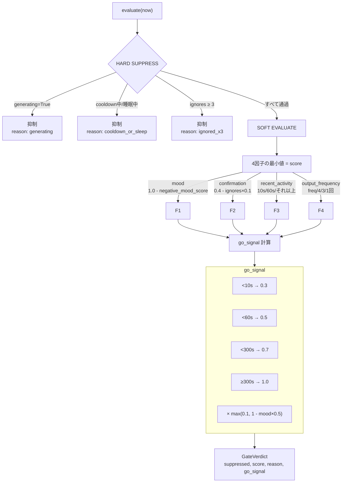

# 抑制制御: InhibitionController

基底核相当の機能。行動の抑制・許可を判断する。



## 状態管理

`_InhibitionState` dataclass が全状態を持つ。

```python
@dataclass
class _InhibitionState:
    last_proactive_time: float       # 前回自発発話時刻
    last_user_activity: float        # 最終ユーザー活動時刻
    consecutive_ignores: int         # 連続無視回数
    confirmation_mode: bool          # 確認モードフラグ
    negative_mood_score: float       # 気分不良スコア [0,1]
    cooldown_until: float            # クールダウン期限
    is_sleeping: bool                # 睡眠フラグ
    ignore_recorded: bool            # 現在の自発発話で無視済みフラグ
    generating: bool                 # LLM生成中フラグ
    outputs_since_input: int         # 今回の入力以降の出力数
    frequency_exceeded: bool         # 出力頻度超過
    topic_cooldowns: dict[str, float] # 話題別クールダウン {topic: until}
```

## Gate 評価 (`evaluate(now)`)

```python
return GateVerdict(suppressed, score, reason, go_signal)
```

### HARD SUPPRESS（即時抑制）

以下の条件のいずれかに該当する場合、`suppressed=True`:

| 条件 | reason | 備考 |
|------|--------|------|
| generating=True | "generating" | LLM 生成中は応答不可 |
| now < cooldown_until or is_sleeping | "cooldown_or_sleep" | クールダウン中または睡眠中 |
| consecutive_ignores >= 3 | "ignored_x3" | 3回以上連続無視 |

### SOFT EVALUATE（因子評価）

hard suppress でない場合、4因子を評価して最小値をスコアとする。

```python
factors = [
    ("mood",              mood_factor),             # 気分状態
    ("confirmation",      confirmation_factor),     # 確認モード
    ("recent_activity",   recent_activity_factor),  # 直近活動
    ("output_frequency",  output_frequency_factor), # 出力頻度
]
score = min(factors.values)
```

`reason` = スコア 0.5 未満の因子名をカンマ区切り。すべて 0.5 以上の場合は "open"。

#### mood_factor

```python
1.0 - negative_mood_score  # [0.0, 1.0]
```

気分不良スコアが高いほど抑制される。

#### confirmation_factor

```python
if confirmation_mode:
    max(0.1, 0.4 - consecutive_ignores * 0.1)
else:
    1.0
```

無視が続くほど確認モードの抑制が強まる。

#### recent_activity_factor（直近活動）

```python
if last_user_activity <= 0: return 0.5
elapsed = now - last_user_activity
if elapsed < 10:  return 1.0   # 10秒以内→抑制
if elapsed < 60:  return 0.8   # 1分以内→やや抑制
return 0.5                     # それ以上→中立
```

#### output_frequency_factor（出力頻度）

```python
if frequency_exceeded:    return 0.3
if outputs_since_input >= 4: return 0.2
if outputs_since_input >= 3: return 0.5
if outputs_since_input >= 1: return 0.8
return 1.0
```

## Go Signal

抑制を通過した場合の積極性スコア [0.0, 1.0]。

```python
if last_user_activity > 0:
    elapsed = now - last_user_activity
    if elapsed < 10:   go = 0.3    # ユーザー直後は控えめ
    elif elapsed < 60: go = 0.5    # 1分未満
    elif elapsed < 300: go = 0.7   # 5分未満
    else: go = 1.0                 # 5分以上→積極的
else:
    go = 0.5

mood_penalty = negative_mood_score * 0.5
go *= max(0.1, 1.0 - mood_penalty)
return round(go, 2)
```

気分不良スコア 1.0 なら go は最大 0.5 低下。下限 0.1。

## ユーザー活動検出

`notify_user_activity()`:
- `last_user_activity` を現在時刻に更新
- `ignore_recorded = False`
- `consecutive_ignores = 0`
- `confirmation_mode = False`

## 無視検出

`check_ignore()`:
- 前回自発発話時刻 > 最終ユーザー活動時刻 かつ 未記録 → 無視カウント
- 2回目の無視で confirmation_mode = True
- 3回目以降は extended ignore ログ

## 頻度ペナルティ

`apply_frequency_penalty(degree)`:

```python
base_cooldown = 600  # 10分
extra = base_cooldown * (2**degree - 1)  # 指数バックオフ
cooldown_until = now + base_cooldown + extra
negative_mood_score += degree * 0.15  # 気分も悪化
```

| degree | total cooldown | mood increase |
|--------|---------------|---------------|
| 1 | 10分 | +0.15 |
| 2 | 30分 | +0.30 |
| 3 | 70分 | +0.45 |
| 4 | 150分 | +0.60 |
| 5 | 310分 | +0.75 |

## トピックベースクールダウン

`record_topic(topic, duration_sec=3600)`:
- 同一話題の連続自発発話を防ぐため、話題単位のクールダウン
- デフォルト 3600秒（1時間）
- `is_topic_suppressed(topic, now)` で判定。topic cooldown 中なら abort

## 感情変調による negative_mood_score

`apply_limbic_modification(emotion: EmotionState)`:

```python
mood = 0.0
if valence < -0.3:      mood += abs(valence) * 0.4
elif valence > 0.3:     mood -= valence * 0.1
if arousal > 0.6:       mood -= arousal * 0.1
elif arousal < 0.2:     mood += 0.1
if dominance < 0.3:     mood += (0.3 - dominance) * 0.3
elif dominance > 0.7:   mood -= dominance * 0.05

if どの条件も発動せず && current > 0:
    decay = max(current * 0.1, 0.02)  # 自然回復
    current -= decay

negative_mood_score = clamp(0, 1, current + mood)
```

| 条件 | mood 変化 |
|------|----------|
| V < -0.3 | +0 ~ +0.4 (V=-0.3→+0.12, V=-1.0→+0.4) |
| V > 0.3 | -0 ~ -0.1 |
| A > 0.6 | -0 ~ -0.1 |
| A < 0.2 | +0.1 |
| D < 0.3 | +0 ~ +0.21 (D=0→+0.09, D=0.3→+0) |
| D > 0.7 | -0 ~ -0.05 |
| 中立状態 | 自然回復 (10% or 0.02) |
