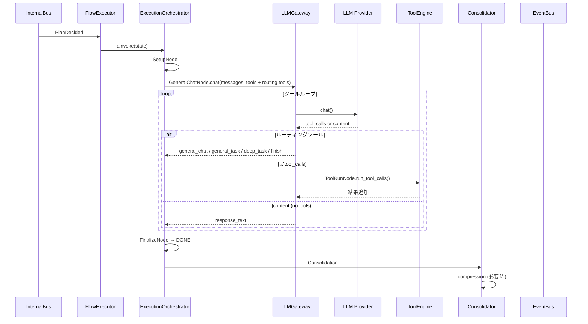

# 実行パイプライン: FlowExecutor + LLMGateway



### InputReady による割込

ユーザー入力が到着した場合、現在実行中の LLM 生成を `InterruptToken.cancel()` で中断する。

### Talkative オーバーライド

OutputTracker が検出した talkative_degree に応じて計画属性を上書き:

| degree | オーバーライド |
|--------|---------------|
| >= 1 | task_level = "chat"（最短応答） |
| >= 2 | max_tokens = min(current, 256) |
| >= 3 | run_compression=False |
| >= 5 | show_thinking=False |

### 自発発話抑制 (talkative)

```python
if content が空 かつ (talkative >= 2 or (frequency_exceeded and talkative >= 1)):
    skip LLM  # 出力しすぎてるので自発発話しない
```

### Silent モード

`silent=True` の plan はユーザーに出力を見せない自律処理:

- show_thinking=False（思考過程非表示）
- allow_side_effects=False（環境変更不可）
- max_tool_iterations=3（上限）
- priority=1（低優先度）
- content が空の場合、自律調査用ベース指示を自動構築
- user ではなく thought ロールでメッセージ記録
- on_token によるストリーミングは通常通り発生
- 完了後 `ProactiveResultEvent` を publish

### 実行フロー

```
FlowExecutor._on_plan(PlanDecided)
├── apply_talkative_overrides()    ← talkative 度に応じて上書き
├── should_skip_proactive()?       ← talkative 抑制
├── ExecutionOrchestrator.ainvoke(state)
│   ├── SetupNode
│   │   ├── messages.append(plan.content)
│   │   ├── short_term.add_turn()
│   │   ├── on_token コールバック設定
│   │   └── show_thinking → MessageEvent(THINKING)
│   ├── GeneralChatNode (fixed entry, chat/light レベル)
│   │   └── LLMGateway.chat() + ルーティングツール
│   ├── GeneralTaskNode (normal/deep/research レベル)
│   │   └── LLMGateway.chat() + ルーティングツール
│   ├── ルーティングツール制御
│   │   ├── general_chat → chain_depth+1, 同一ノード
│   │   ├── general_task → GeneralTaskNode へ切替
│   │   ├── deep_task → level_idx+1
│   │   └── finish → FinalizeNode
│   ├── ToolRunNode (実tool_calls時)
│   │   └── ToolEngine.run_tool_calls()
│   ├── FinalizeNode
│   │   ├── short_term.add_turn()
│   │   ├── on_token によるストリーミング（SetupNode設定）
│   │   ├── OutputTracker / FeedbackCoordinator 記録
│   │   └── MessageEvent(DONE)
    │   └── Consolidation
    │       └── compression (run_compression=True)
```

## LLMGateway

LLM 呼出とツール実行のゲートウェイ。

### SystemPromptBuilder

システムプロンプトは以下の要素を動的に構築:

1. Personality.build_system_prompt() — 基底プロンプト
2. 現在日時
3. 直近の記憶コンテキスト (MemoryManager.get_recent())
4. 会話状態 (short_term.render_context())
5. 会話コンテキスト (context_hint)
6. 状況指示 (proactive 時は自発発話用指示)

### 生成モード

#### ツールなし生成 (abbreviated または tools_allowed=False)

```python
system_prompt = build_full(context_hint, response_style, situation)
messages = [system, ...history..., {"role": "user", "content": content}]
response = await llm.chat(messages, max_tokens=80 or plan.max_tokens, temperature)
```

- 高速・低コスト。streaming 無効
- エラー時は空文字または "…" を返す

#### ツールあり生成（通常応答と silent 内省）

LangGraph 状態マシンを使用:

```
START → SetupNode → GeneralChatNode (fixed entry)
  ├─ routing tools → GeneralChatNode / GeneralTaskNode / deep_task / finish
  ├─ real tool_calls → ToolRunNode → 元ノード復帰（循環）
  └─ no tools → FinalizeNode → PostProcessNode (optional) → END
```

- ルーティングツール（general_chat/general_task/deep_task/finish）でノード遷移を制御
- 各タスクレベルは `TaskLevel` で定義（chat/light/normal/deep/research）
- ツール上限は `max_tool_iterations`（chat: 0回, normal: 3回, deep: 5回, research: 10回）
- side_effect=True のツールは結果を会話に戻さない

### LLM 呼出パラメータ

| パラメータ | ソース |
|-----------|--------|
| model | `ModelConfig.get_model(plan.model_role)` |
| temperature | `ModelConfig.get_effective_temperature(role)` + 感情変調 |
| max_tokens | plan.max_tokens or `get_effective_max_tokens(role)` |
| tools | ToolRegistry.list_tools() |
| on_token | SetupNode 設定（常時有効） |

## OutputTracker

出力頻度を監視し、talkative_degree を算出する。

### 状態遷移

- `record_user_input()`: ユーザー入力時にカウンタリセット
- `record_output()`: 出力後に frequency / talkative を評価。フラグリストを返す
- `set_emotion_state(v, a, d)`: 現在の感情状態を監視に反映

### フラグ

| フラグ | 意味 |
|--------|------|
| talkative | 出力頻度が高い |
| frequency_exceeded | 1入力あたりの許容出力数超過 |

## Consolidator

実行後の後処理（ContextWindow圧縮）を管理:

```python
Consolidator.run():
    context_window.check_and_summarize(messages)
```

- `flush_memory()`: 長期記憶への保存
- `compact_context()`: 会話履歴の圧縮（ContextWindowManager）
