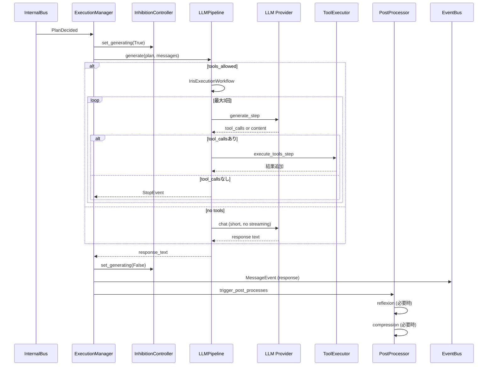

# 実行パイプライン: ExecutionManager + LLMPipeline



### InputReady による割込

ユーザー入力が到着した場合、現在実行中の LLM 生成を `InterruptToken.cancel()` で中断する。

### Talkative オーバーライド

OutputMonitor が検出した talkative_degree に応じて計画属性を上書き:

| degree | オーバーライド |
|--------|---------------|
| >= 1 | abbreviated=True |
| >= 2 | max_tokens = min(current, 256) |
| >= 3 | run_reflexion=False, run_compression=False |
| >= 5 | streaming=False, show_thinking=False |

### 自発発話抑制 (talkative)

```python
if content が空 かつ (talkative >= 2 or (frequency_exceeded and talkative >= 1)):
    skip LLM  # 出力しすぎてるので自発発話しない
```

### Silent モード

`silent=True` の plan はユーザーに出力を見せない自律処理:

- streaming=False, show_thinking=False
- allow_side_effects=False（環境変更不可）
- max_tool_iterations=3（上限）
- priority=1（低優先度）
- content が空の場合、自律調査用ベース指示を自動構築
- user ではなく thought ロールでメッセージ記録
- 完了後 `ProactiveResultEvent` を publish

### 実行フロー

```
_on_plan(PlanDecided)
├── _update_inhibition_state()    ← monitor 状態を inhibition に反映
├── _apply_emotion_to_monitor()   ← emotion を monitor に設定
├── _apply_talkative_overrides()  ← talkative 度に応じて上書き
├── _should_skip_proactive()?     ← talkative 抑制
├── _execute_general(plan)
│   ├── silent mode 設定
│   ├── _prepare_execution_context()
│   │   ├── messages.append(plan.content)
│   │   ├── short_term.add_turn()
│   │   └── show_thinking → MessageEvent(THINKING)
│   ├── _run_llm_generation()
│   │   ├── inhibition.set_generating(True)
│   │   ├── pipeline.generate()
│   │   └── inhibition.set_generating(False)
│   ├── _finalize_execution()
│   │   ├── 応答を messages に追加
│   │   ├── short_term.add_turn()
│   │   ├── ストリーミング中 → MessageEvent(stream)
│   │   └── MessageEvent(response)
│   └── post_process (silent 以外)
│       ├── reflexion (run_reflexion=True)
│       └── compression (run_compression=True)
```

## LLMPipeline

LLM 呼出とツール実行のパイプライン。

### SystemPromptBuilder

システムプロンプトは以下の要素を動的に構築:

1. Personality.build_system_prompt() — 基底プロンプト
2. 現在日時
3. 現在の気分 (limbic.build_mood_description())
4. 自己状態 (persona_profile.get_current_state_section())
5. 会話コンテキスト (context_hint)
6. 状況指示 (proactive 時は自発発話用指示)

### 生成モード

#### ツールなし生成 (abbreviated または tools_allowed=False)

```python
system_prompt = build_full(context_hint, response_style, situation)
messages = [system, ...history..., {"role": "user", "content": content}]
response = await llm.chat(messages, max_tokens=80 or plan.max_tokens, temperature)
```

- 高速・低コスト。streaming 無効
- エラー時は空文字または "…" を返す

#### ツールあり生成 (通常応答と silent 内省)

Workflow を使用:

```
generate_step → (tool_calls あり) → execute_tools_step → generate_step (循環)
             → (tool_calls なし) → StopEvent (終了)
```

- 最大3回のツールイテレーションで打ち切り（`max_tool_iterations=3`）
- 各イテレーションで tool_calls があれば ToolExecutionEngine で実行
- 結果を履歴に追加して次の generate_step へ
- LlamaIndex Workflow でステートマシンとして実装
- side_effect=True のツールは結果を会話に戻さない

### LLM 呼出パラメータ

| パラメータ | ソース |
|-----------|--------|
| model | `ModelConfig.get_model(plan.model_role)` |
| temperature | `ModelConfig.get_effective_temperature(role)` + 感情変調 |
| max_tokens | plan.max_tokens or `get_effective_max_tokens(role)` |
| tools | ToolRegistry.list_tools() |
| on_token | streaming 時のみ設定 |

## OutputMonitor

出力頻度を監視し、talkative_degree を算出する。

### 状態遷移

- `record_user_input()`: ユーザー入力時にカウンタリセット
- `record_output()`: 出力後に frequency / talkative を評価。フラグリストを返す
- `set_emotion_state(v, a, d)`: 現在の感情状態を監視に反映

### フラグ

| フラグ | 意味 |
|--------|------|
| talkative | 出力頻度が高い |
| frequency_exceeded | 1入力あたりの許容出力数超過 |

## PostProcessor

実行後の後処理を管理:

```python
trigger_post_processes(plan, run_reflexion, run_compression):
    if run_reflexion:
        hippocampal.maybe_run(messages, msg_count_since_reflect)
    if run_compression:
        context_window.compact(messages)
```

- `flush_memory()`: 長期記憶への保存
- `compact_context()`: 会話履歴の圧縮（ContextWindowManager）
