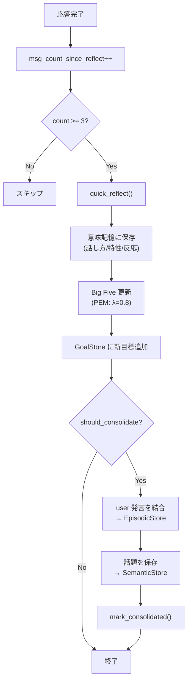

# Reflexion / Consolidation: 海馬の処理

HippocampalManager は短期記憶→長期記憶の定着と自己反省を統括する。

## Consolidation（短期→長期）

### 発火条件

```python
# ShortTermMemoryManager.should_consolidate():
threshold = max(3, max_turns // 2)   # max_turns=10 → threshold=5
return len(turns) >= threshold
```

ターン数が閾値（max 5）を超えると consolidation が実行される。

### Consolidation フロー

```python
_consolidate_short_term(force=False):
    if not force and not short_term.should_consolidate():
        return

    unconsolidated = short_term.get_unconsolidated_turns()
    # 未定着の user 発言を結合
    user_turns = [t for t in unconsolidated if t.role == "user"]
    if user_turns:
        combined = " | ".join(t.content[:100] for t in user_turns[-3:])
        long_term.store_episodic({
            "content": f"[conversation] {combined}",
            "kind": "conversation",
        })

    # 現在の話題を意味記憶に保存
    for topic in short_term.current_topics:
        long_term.store_semantic({
            "content": topic,
            "type": "topic",
            "tags": ["short_term_topic"],
        })

    short_term.mark_consolidated()
```

- user 発言のみエピソード記憶に保存（assistant 発言は除外）
- 最大 3 ターンを連結、各ターン 100 文字まで
- 話題は意味記憶に個別保存
- consolidated マークで重複保存を防止

## Reflexion（自己反省）

### 発火条件 (quick_reflect)

```python
def maybe_run(messages, msg_count_since_reflect):
    if msg_count_since_reflect < reflect_interval:    # interval = 3
        return unchanged
    if len(messages) < 2:
        return unchanged

    _reflect_and_consolidate(messages, force=False)
    return 0  # カウンタリセット
```

reflexion は 3 応答ごとに 1 回実行される。

### quick_reflect で抽出する項目 (`_REFLECTION_MEMORY_KEYS`)

| キー | 保存タイプ | タグ | 意味 |
|------|-----------|------|------|
| speech_style | trait | ["speech_style"] | Iris の話し方 |
| expressed_traits | trait | ["personality_trait"] | 発言から見える性格特性 |
| user_reaction | preference | ["user_reaction"] | ユーザーの反応傾向 |

各項目は `memory.add_semantic_by_type()` で意味記憶に保存。
`"{prefix}: {value}"` 形式で保存。

### Big Five 推定のパース

```python
# quick_reflect で big_five_estimate が JSON 文字列として返る場合がある
bf_raw = result.get("big_five_estimate")
if isinstance(bf_raw, dict):
    estimate = bf_raw
elif isinstance(bf_raw, str):
    estimate = json.loads(bf_raw)  # JSON parse
else:
    estimate = None

if estimate:
    big_five.update_from_estimate(estimate)
```

### 新規目標の追加

```python
new_goals = result.get("new_goals", [])
for goal_desc in new_goals:
    memory.goals.add_goal(description=goal_desc, weight=1.0)
```

Reflexion の結果から新たな長期目標が生成される。

## Session Reflect（会話終了時の全セッション反省）

`run_session(messages, memory)`:
- `reflexion.reflect(messages)` で全セッションを LLM に要約
- 以下を保存:
  - `[session summary]`: エピソード記憶に追加
  - `lesson`: 教訓 → 意味記憶
  - `preference`: 好み → 意味記憶
  - `improvement`: 改善点 → 意味記憶
  - `new_goals`: 新目標 → GoalStore
  - `new_interests`: 新興味 → PersonaData（weight=0.3）

## 自発調査結果の評価 (process_proactive_result)

HippocampalManager が `ProactiveResultEvent` を処理するフロー。

### 納得度評価

```python
if success and reflexion has evaluate_proactive_result:
    eval_res = reflexion.evaluate_proactive_result(topic, content)
    satisfaction = eval_res.get("satisfaction", 0.0)
    summary = eval_res.get("summary", "")
    next_interests = eval_res.get("next_interests", [])
else:
    satisfaction = 0.0
```

### 興味の更新

```python
delta = -0.3 if satisfaction >= 0.7 else 0.1
persona_data.add_interest(topic, delta)

for next_topic in next_interests:
    persona_data.add_interest(next_topic, 0.3)
```

- 納得度 0.7 以上: そのトピックへの興味を減衰（知的好奇心充足）
- 納得度 0.7 未満: 興味を微増（もっと知りたい）
- 次に関連する興味は 0.3 の weight で追加

### エスカレーション発話

```python
if success and satisfaction >= 0.7 and random() < 0.5:
    publish InputReady(
        content="",
        context={
            "escalation": True,
            "topic": topic,
            "summary": summary,
        }
    )
```

50% の確率でエスカレーション。調査で得た知識をユーザーへの自発的な話しかけとして出力する。

### エスカレーション時の plan 属性

```python
plan = {
    "silent": False,
    "content": f"システムからの内部指示: 「{topic}」に関する調査で「{summary}」が分かりました。"
               f"この知見を元に、自発的な話しかけを行ってください。",
    "record_history": True,
    "streaming": True,
}
```

## 図: 全体フロー


