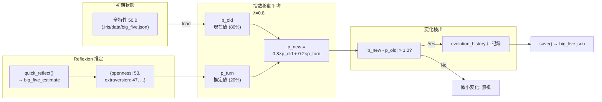

# 性格進化: Big Five

Big Five モデル（OCEAN）で性格を表現し、会話経験によって緩やかに変化させる。



## 5因子

| 因子 | 範囲 | デフォルト | 日本語 |
|------|------|-----------|--------|
| openness | 0-100 | 50 | 開放性 |
| conscientiousness | 0-100 | 50 | 誠実性 |
| extraversion | 0-100 | 50 | 外向性 |
| agreeableness | 0-100 | 50 | 協調性 |
| neuroticism | 0-100 | 50 | 神経症的傾向 |

## PEM: Personality Evolution Mechanism

指数移動平均（Exponentially Weighted Moving Average）で更新。

### 更新式

```python
_PEM_LAMBDA = 0.8    # 更新率
_CHANGE_THRESHOLD = 1.0  # 変化検出閾値

p_new = _PEM_LAMBDA * p_old + (1 - _PEM_LAMBDA) * p_turn
# p_old: 現在の特性値 (0-100)
# p_turn: Reflexion が会話から推定した特性値

setattr(self, trait, clamp(0, 100, round(p_new, 1)))
```

- λ=0.8: 過去の値を 80% 保持、新しい推定値を 20% 反映
- 1 回の Reflexion で最大 20 ポイントの変化（p_turn=0 or 100 の場合）
- 結果は [0, 100] にクランプ

### 変化検出

```python
delta = abs(p_new - p_old)
if delta > _CHANGE_THRESHOLD:  # 1.0 超
    # evolution_history に記録
    evolution_history.append({
        "trait": trait,
        "from": round(p_old, 1),
        "to": round(p_new, 1),
        "delta": round(delta, 1),
        "source": "reflection",
        "timestamp": datetime.now(UTC).isoformat(),
    })
```

0.1 ~ 1.0 の微小変化は無視される（ノイズ除去）。

### 変化イベント記録

複数の特性で変化があった場合、まとめて `personality_change` イベントとして evolution_history に追加。

```python
evolution_history.append({
    "event": "personality_change",
    "changes": ["開放性: 50 → 53 (上昇, delta=3.0)", ...],
    "timestamp": "...",
})
```

維持される履歴: 最大 50 エントリ。

## 永続化

```python
path = ".iris/data/big_five.json"
```

`load(path)`: ファイルが存在すれば読み込み。なければデフォルト値で新規作成。
`save()`: 常に最新状態を overwrite。

### JSON 形式

```json
{
    "openness": 52.3,
    "conscientiousness": 50.0,
    "extraversion": 47.8,
    "agreeableness": 51.2,
    "neuroticism": 48.5,
    "evolution_history": [
        {
            "event": "personality_change",
            "changes": ["外向性: 50 → 47 (下降, delta=3.0)"],
            "timestamp": "2026-05-22T12:34:56"
        }
    ]
}
```

## 性格と感情の相互作用

### Big Five → ACC 感情制御

| 特性 | 影響 |
|------|------|
| Neuroticism 高 | strength 低下 → 制御弱 → 感情反応増幅 |
| Agreeableness 高 | 負の感情変化を抑制 |
| Extraversion 高 | 正の感情変化を促進 |

### 具体的計算式

```python
# ACC regulate() 内
strength = base_strength (0.5)
if big_five:
    neuroticism = N / 100
    strength *= 1.0 - (neuroticism - 0.5) * 0.4
    # N=50 → 変化なし, N=100 → -20%, N=0 → +20%

    if delta.valence < 0 and agreeableness > 0.5:
        factor *= 1.0 - (agreeableness - 0.5) * 0.3
        # A=75 → 7.5%抑制, A=100 → 15%抑制

    if delta.valence > 0 and extraversion > 0.5:
        factor *= 1.0 + (extraversion - 0.5) * 0.2
        # E=75 → 5%促進, E=100 → 10%促進
```

### ACC 慣れ率の性格変調

| 特性 | 効果 |
|------|------|
| Neuroticism 高 | habituation_rate 低下（慣れが遅い）→ 負の感情反応が持続 |

```python
habituation_rate = 0.015
if big_five:
    neuroticism = N / 100
    habituation_rate *= max(0.3, 1.0 - (neuroticism - 0.5) * 0.6)
    # N=50 → 変化なし, N=100 → -30%（慣れが遅くなる）
```

### 感情慣性の性格変調

| 特性 | 効果 |
|------|------|
| Neuroticism 高 | inertia 低下（感情が不安定、方向転換しやすい） |
| Conscientiousness 高 | inertia 上昇（感情が安定、変化に抵抗） |

```python
neuro_factor = 1.0 - (N - 0.5) * 0.4   # N=100 → -20%
con_factor = 0.5 + C                     # C=100 → 1.5x
self._inertia *= max(0.5, neuro_factor)
self._inertia *= max(0.5, con_factor)
```

### 欲求蓄積の性格変調

`DriveState.accumulate(big_five=...)` で各欲求の蓄積速度が変調:

| 特性 | 効果 |
|------|------|
| Openness 高 | curiosity 蓄積加速 (1.0 + (O-50)*0.003) |
| Extraversion 高 | social_need 蓄積減少 (1.0 - (E-50)*0.002) |
| Neuroticism 高 | social_need 蓄積加速 (1.0 + (N-50)*0.003) |
| Conscientiousness 低 | maintenance 蓄積加速 (1.0 + (50-C)*0.003) |

### 感情トリガーによる性格更新 (PEM)

極端な感情状態 (|valence| > 0.75) が発生した場合、PEM 更新をトリガー:

```python
if abs(self._emotion.valence) > 0.75:
    estimate = {}
    if delta.valence > 0:
        estimate["openness"] = 50 + delta.valence * 12
        estimate["extraversion"] = 50 + delta.valence * 15
    elif delta.valence < 0:
        estimate["neuroticism"] = 50 + abs(delta.valence) * 10
        estimate["agreeableness"] = 50 - abs(delta.valence) * 8
    self._big_five_provider.update_from_estimate(estimate, "emotional_trigger")
```

| トリガー | 推定方向 |
|---------|---------|
| 強い喜び | Openness +12, Extraversion +15 上昇方向 |
| 強い怒り/悲しみ | Neuroticism +10 上昇、Agreeableness -8 低下方向 |

これにより「感情経験が性格を形成する」という心理学的知見をモデル化。

## システムプロンプトへの反映

`BigFiveProfile.format_summary()` で Markdown 形式に整形:

```markdown
## 性格特性 (Big Five)
- 開放性 (Openness): 52
- 誠実性 (Conscientiousness): 50
- 外向性 (Extraversion): 48
- 協調性 (Agreeableness): 51
- 神経症的傾向 (Neuroticism): 49
```

Personality.build_system_prompt() 内でシステムプロンプトに注入される。
