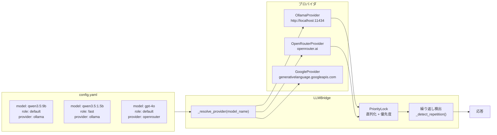

# モデルルーティング: LLMBridge

LLMBridge は複数の LLM プロバイダへのアクセスを抽象化し、モデル名に応じてルーティングする。



## プロバイダ一覧

| プロバイダタイプ | クラス | デフォルト URL |
|----------------|--------|---------------|
| ollama | OllamaProvider | http://localhost:11434 |
| openrouter | OpenRouterProvider | https://openrouter.ai/api/v1 |
| google | GoogleProvider | https://generativelanguage.googleapis.com/v1beta/openai |

### ProviderFactory Protocol

```python
class ProviderFactory(Protocol):
    def __init__(self, **kwargs): ...
    def __call__(self) -> LLMProvider: ...
```

各プロバイダクラスはこの Protocol に準拠。LLMBridge の `_PROVIDER_CLASSES` 辞書で管理。

## モデル解決

```python
# config.yaml の例
models:
  - name: qwen3.5:9b
    provider: ollama
    role: default
    num_ctx: 8192
    num_gpu: -1
  - name: qwen3.5:1.5b
    provider: ollama
    role: fast
    num_ctx: 4096

providers:
  ollama:
    base_url: http://localhost:11434
  openrouter:
    api_key: ${OPENROUTER_API_KEY}
```

### ルーティング

```python
def _resolve_provider(model_name):
    key = _model_map.get(model_name)  # model_name → "ollama|url|key"
    if key:
        return _providers[key]
    return first_provider  # フォールバック: 最初のプロバイダ
```

- `model_name` からプロバイダインスタンスを解決
- 同一 provider+url+api_key の組み合わせはキャッシュ（共有インスタンス）
- 未知の model_name → 最初のプロバイダにフォールバック

## マルチモデル構成の Plan 解決

```python
class ModelConfig:
    def get_model(self, role: str) -> str:
        for entry in self.models:
            if entry.role == role:
                return entry.name
        return self.models[0].name  # fallback

    def get_effective_temperature(self, role: str) -> float:
        entry = self._get_entry(role)
        return entry.temperature if entry and entry.temperature is not None else DEFAULT_TEMPERATURE
```

| role | 用途 | 例 |
|------|------|-----|
| default | 標準モデル（タスク応答、思考） | qwen3.5:9b |
| fast | 軽量モデル（abbreviated応答） | qwen3.5:1.5b |
| その他 | カスタム role | first model fallback |

## PriorityLock

同一プロバイダへの多重リクエストを優先度順に直列化するロック機構。

```python
class PriorityLock:
    async def __call__(self, priority: int = 0):
        # priority が高いほど先に実行される
        # 同一 priority は FIFO
        # LLM 生成中にユーザー入力が来た場合、
        # FlowExecutor が InterruptToken で中断
```

- priority=0: 通常応答（ユーザー応答）
- priority=1: バックグラウンド処理（silent 内省）
- `async with self._priority_lock(priority)` で使用

## chat メソッドの引数

```python
async def chat(
    messages: list[dict],
    model: str | None = None,       # モデル名 = None でデフォルト
    reasoning: bool | None = None,  # Ollama reasoning=thinking モード (None=ModelEntry設定)
    temperature: float = 0.7,
    max_tokens: int = 4096,
    tools: list[dict] | None = None,
    on_token: Callable | None = None,
    interrupt_token: InterruptToken | None = None,
    priority: int = 0,
    **kwargs,                        # num_ctx, num_gpu, penalty 等
) -> dict:
```

### ModelEntry から注入されるパラメータ

| config パラメータ | kwargs キー |
|------------------|-------------|
| num_ctx | num_ctx |
| num_gpu | num_gpu |
| presence_penalty | presence_penalty |
| frequency_penalty | frequency_penalty |
| repeat_penalty | repeat_penalty |
| reasoning | —（ChatOllama コンストラクタ + call kwarg 上書き） |

## 繰り返し検出

LLMBridge は生成テキストの異常な繰り返しを検出し、自動中断する。

```python
def _detect_repetition(text):
    target = text[-150:]  # 末尾150文字を検査

    # 2-20文字のパターンが4回以上連続繰り返し
    for match in re.finditer(r"(.{2,20}?)\1{3,}", target):
        if len(set(pattern)) > 1:  # 同一文字の繰り返しは除外
            return True

    # 同一文字が10回以上連続
    return bool(re.search(r"(.)\1{9,}", target))
```

検出時:
- ストリーミング中: `InterruptToken.cancel()` で即時中断
- 最終応答: `_trim_repetition()` で末尾を切り詰め + "[繰り返し検知により中断]" を追加

## モデルアンロード

```python
def unload_model(model_name):
    key = _model_map.get(model_name)
    if key:
        _providers[key].unload_model(model_name)
```

メモリ解放のため、不要なモデルをプロバイダからアンロード可能（主に Ollama 用）。

## 可用性確認

```python
def is_available():
    for provider in _providers.values():
        if not provider.is_available():
            logger.warning("Provider unavailable")
    return any(ok)
```

1つ以上のプロバイダが利用可能であれば True。
