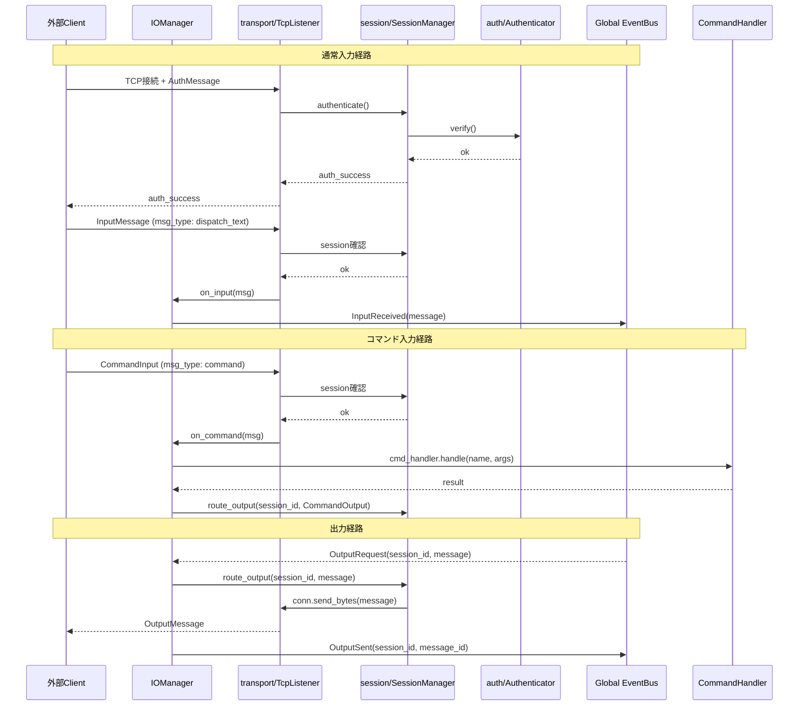

# Iris IO 層

> **注記**: 脳科学・神経科学の用語との対応付けは設計指針であり、厳密な解剖学的正確性を保証するものではありません。

**脳科学対応**: 視床（Thalamus）

## 責務

- 外部からの入力を TCP で受け付け、Global EventBus に publish する
- Global EventBus からの出力要求を TCP で外部に送出する
- セッション管理（接続単位の識別・状態管理）
- 認証（access_token 検証）
- コマンド入力の検出と処理（CommandInput → CommandHandler → CommandOutput）

## 構成

```
iris/io/
├── __init__.py
├── manager.py         IOManager
├── models.py          InputMessage, OutputMessage, CommandInput, CommandOutput
├── transport/
│   ├── __init__.py
│   └── tcp_listener.py   ← 通常入力とコマンドを別コールバックで分岐
├── session/
│   ├── __init__.py
│   └── manager.py     SessionManager
└── auth/
    ├── __init__.py
    └── authenticator.py
```

## IOManager

```python
class IOManager:
    """入出力中継。視床の役割: 感覚入力を適切な層に中継し、
    出力命令を運動系に伝える。

    subscribe: OutputRequest (global)
      → session_manager.route_output → transport で送出

    transport からの受信:
      → 通常入力: InputMessage → InputReceived を Global EventBus に publish
      → コマンド入力: CommandInput → CommandHandler で処理 → CommandOutput
    """

    def start(self) -> None
        # transport (TCP listener) 起動

    def stop(self) -> None
        # transport 停止

    def set_command_handler(self, handler) -> None
        # CommandHandler を注入
```



## models.py

```python
INPUT_MSG_TYPES = frozenset({"dispatch_text", "converse_text", "system"})  # command は分離
OUTPUT_STREAM_STATES = frozenset({"thinking", "speaking", "done", "interrupted"})

class ConnectionMode(Enum): INPUT_ONLY / OUTPUT_ONLY / BIDIRECTIONAL
class SessionState(Enum): ACTIVE / CLOSED
class SessionRole(Enum): CONVERSATION_INPUT / COMMAND_INPUT / CONVERSATION_OUTPUT / COMMAND_OUTPUT / LOG

class AuthMessage(BaseModel)
class ControlMessage(BaseModel)
class InputMessage(BaseModel)    # 通常入力（会話）
class CommandInput(BaseModel)     # システムコマンド入力
class OutputMessage(BaseModel)    # 通常出力（会話応答・ストリーム）
class CommandOutput(BaseModel)    # コマンド応答
class InterruptMessage(BaseModel)
class SessionInfo(BaseModel)
```

**準同期入力（converse_text）の扱い**: 入力種別の区別を IO 層で行わず、すべて `InputReceived` として Memory 層に送る。Memory/sensory/InputBuffer が断片的入力を統合する。`msg_type` はメタデータとして保持される。

## transport/

### TcpListener

```python
class TcpListener:
    """TCP 接続の待受とメッセージの送受信。
    1ポートで全接続を受け付け、認証・入力・出力を多重化する。
    msg_type に応じて on_input (通常) / on_command (コマンド) を振り分ける。
    """

    def __init__(self, session_manager, on_input, on_command, on_interrupt)
    def set_on_input(self, on_input: Callable[[InputMessage], None]) -> None
    def set_on_command(self, on_command: Callable[[CommandInput], None]) -> None
    def start(self, host: str, port: int) -> None
    def stop(self) -> None
```

## session/

### SessionManager

```python
class SessionManager:
    """セッションの確立・維持・破棄を管理する。
    接続ごとに SessionInfo を保持し、出力のルーティングを行う。
    """

    def authenticate(self, conn, msg: AuthMessage) -> ControlMessage
    def route_output(self, session_id: str, message: OutputMessage | CommandOutput) -> None
    def get_session_info(self, session_id: str) -> SessionInfo | None
    def get_session_mode(self, session_id: str) -> ConnectionMode | None
    def get_roles_summary(self) -> str
    def close_session(self, session_id: str) -> None
```

## auth/

### Authenticator

```python
class Authenticator:
    """access_token の検証。
    シンプルなトークンベース認証。
    """

    def authenticate(self, token: str | None, expected: str | None) -> bool
```

## Event I/O マッピング

| 方向 | 通信相手 | Event／型 | 説明 |
|------|----------|-----------|------|
| Inbound | TCP → IO | `InputReceived(msg)` via EventBus | テキスト入力（`dispatch_text`, `converse_text`, `system`） |
| Inbound | TCP → IO | `CommandInput` → CommandHandler | コマンド入力（`command`）、EventBus を経由せず直接処理 |
| Outbound | IO ← EventBus | `OutputRequest(session_id, msg)` | 出力要求 |
| Outbound | IO → EventBus | `OutputSent(session_id, msg_id)` | 出力完了通知 |
| Outbound | IO → TCP | `CommandOutput` | コマンド応答、EventBus を経由せず直接送出 |


