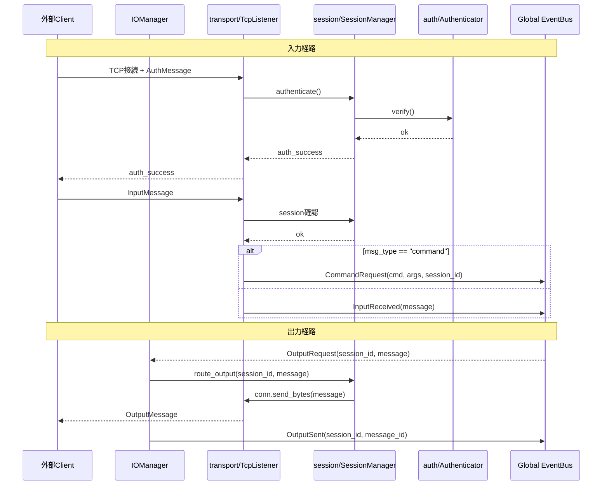

# Iris v2 IO 層

**脳科学対応**: 視床（Thalamus）

## 責務

- 外部からの入力を TCP で受け付け、Global EventBus に publish する
- Global EventBus からの出力要求を TCP で外部に送出する
- セッション管理（接続単位の識別・状態管理）
- 認証（access_token 検証）
- コマンド入力の検出（`/shutdown`, `/status` など）→ CommandRequest に変換

## 構成

```
iris/io/
├── __init__.py
├── manager.py         IOManager
├── models.py          InputMessage, OutputMessage など
├── transport/
│   ├── __init__.py
│   └── tcp_listener.py
├── session/
│   ├── __init__.py
│   └── manager.py     SessionManager
└── auth/
    ├── __init__.py
    └── authenticator.py
```

## IOManager

```python
class IOManager:
    """入出力中継。視床の役割: 感覚入力を適切な層に中継し、
    出力命令を運動系に伝える。

    subscribe: OutputRequest (global)
      → session_manager.route_output → transport で送出

    transport からの受信:
      → session_manager で認証・セッション確認
      → CommandRequest or InputReceived を Global EventBus に publish
    """

    def start(self) -> None
        # transport (TCP listener) 起動

    def stop(self) -> None
        # transport 停止

    def send_output(self, session_id: str, message: OutputMessage) -> None
        # subscribe: OutputRequest → 実際の送出
```



## models.py（v0.3 から継承）

```python
INPUT_MSG_TYPES = frozenset({"dispatch_text", "converse_text", "command", "system"})
OUTPUT_STREAM_STATES = frozenset({"thinking", "speaking", "done", "interrupted"})

class ConnectionMode(Enum): INPUT_ONLY / OUTPUT_ONLY / BIDIRECTIONAL
class SessionState(Enum): ACTIVE / CLOSED
class SessionRole(Enum): CONVERSATION_INPUT / COMMAND_INPUT / CONVERSATION_OUTPUT / COMMAND_OUTPUT / LOG

class AuthMessage(BaseModel)
class ControlMessage(BaseModel)
class InputMessage(BaseModel)
class InterruptMessage(BaseModel)
class OutputMessage(BaseModel)
class SessionInfo(BaseModel)
```

**準同期入力（converse_text）の扱い**: v2 では入力種別の区別を IO 層で行わず、すべて `InputReceived` として Memory 層に送る。Memory/sensory/InputBuffer が断片的入力を統合する。`msg_type` はメタデータとして保持される。

## transport/

### TcpListener

```python
class TcpListener:
    """TCP 接続の待受とメッセージの送受信。
    1ポートで全接続を受け付け、認証・入力・出力を多重化する。
    """

    def start(self, host: str, port: int) -> None
    def stop(self) -> None
    def send(self, session_id: str, message: OutputMessage) -> None
        # SessionManager 経由で対象セッションに送出
```

## session/

### SessionManager

```python
class SessionManager:
    """セッションの確立・維持・破棄を管理する。
    接続ごとに SessionInfo を保持し、出力のルーティングを行う。
    """

    def authenticate(self, conn, msg: AuthMessage) -> ControlMessage
    def route_output(self, session_id: str, message: OutputMessage) -> None
    def get_session_info(self, session_id: str) -> SessionInfo | None
    def get_session_mode(self, session_id: str) -> ConnectionMode | None
    def get_roles_summary(self) -> str
    def close_session(self, session_id: str) -> None
```

## auth/

### Authenticator

```python
class Authenticator:
    """access_token の検証。
    シンプルなトークンベース認証。
    """

    def authenticate(self, token: str | None, expected: str | None) -> bool
```

## Event I/O マッピング

| 方向 | 通信相手 | Event 種別 | 説明 |
|------|----------|-----------|------|
| Inbound | TCP → IO | `InputReceived(msg)` | テキスト入力（全種別） |
| Inbound | TCP → IO | `CommandRequest(cmd, args)` | コマンド入力（`/` 始まり） |
| Outbound | IO ← EventBus | `OutputRequest(session_id, msg)` | 出力要求 |
| Outbound | IO → EventBus | `OutputSent(session_id, msg_id)` | 出力完了通知 |

## v0.3 からの変更点

| v0.3 | v2 |
|------|----|
| kernel/io/models.py | io/models.py に移動（内容は継承） |
| kernel/io/tcp_listener.py | io/transport/tcp_listener.py に移動 |
| kernel/io/session_manager.py | io/session/manager.py に移動 |
| kernel/io/authenticator.py | io/auth/authenticator.py に移動 |
| kernel/io/input_buffer.py | memory/sensory/buffer.py に移動 |
| InputRouter (services/router.py) | 削除 → IOManager が代行（+ EventBus 経由） |
| msg_type による分岐 (dispatch/converse) | IO 層では行わない。Memory 層の sensory buffer に委譲 |
