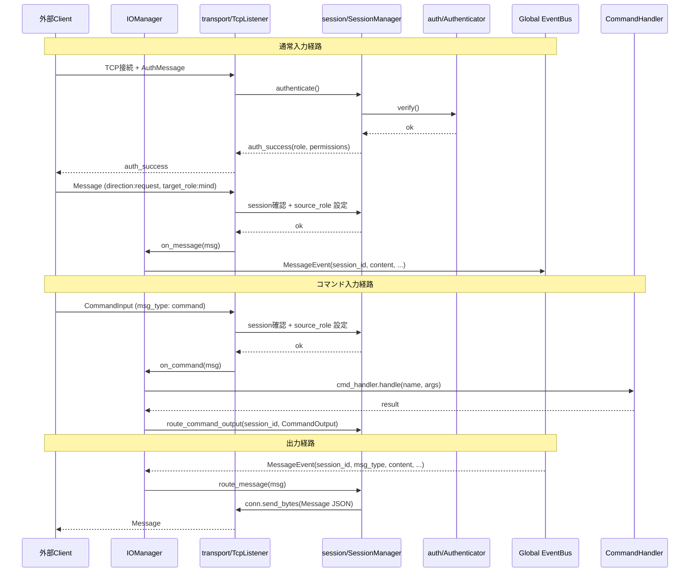

# Iris IO 層 (v2.0)

> **注記**: 脳科学・神経科学の用語との対応付けは設計指針であり、厳密な解剖学的正確性を保証するものではありません。

**脳科学対応**: 視床（Thalamus）

## 責務

- 外部からの入力を TCP で受け付け、Global EventBus に publish する
- Global EventBus からのメッセージイベントを TCP で外部に送出する
- セッション管理（接続単位の識別・権限管理）
- 認証（access_token 検証 + role/permission 付与）
- コマンド入力の検出と処理（CommandInput → CommandHandler → CommandOutput）→ EventBus を経由せず直接処理

## 構成

```
iris/io/
├── __init__.py
├── manager.py         IOManager
├── models.py          Message, CommandInput, CommandOutput, Permission, Direction
├── transport/
│   ├── __init__.py
│   └── tcp_listener.py   ← Message と CommandInput を別コールバックで分岐
├── session/
│   ├── __init__.py
│   └── manager.py     SessionManager
└── auth/
    ├── __init__.py
    └── authenticator.py
```

## IOManager

```python
class IOManager:
    """入出力中継。視床の役割: 感覚入力を適切な層に中継し、
    出力命令を運動系に伝える。

    subscribe: MessageEvent (global)
      → session_manager.route_message → transport で送出

    transport からの受信:
      → Message (target_role=mind): MessageEvent を Global EventBus に publish
      → Message (target_role!=mind): session_manager.route_message で直接ルーティング
      → CommandInput: CommandHandler で処理 → CommandOutput
    """

    def start(self) -> None
    def stop(self) -> None
    def set_command_handler(self, handler) -> None
```



## models.py

```python
class Permission(Enum):
    SEND_CHAT / RECEIVE_CHAT / SEND_COMMAND / RECEIVE_COMMAND
    RECEIVE_LOG / INTERRUPT / EXECUTE_ACTION

class Direction(Enum): REQUEST / RESPONSE / STREAM / EVENT
class SessionState(Enum): ACTIVE / CLOSED

class AuthMessage(BaseModel)      # access_token, role, permissions
class ControlMessage(BaseModel)   # auth_success/failure
class Message(BaseModel)          # 統一言語: source_role, target_role, direction, msg_type, content
class CommandInput(BaseModel)     # システムコマンド入力（fast-path）
class CommandOutput(BaseModel)    # コマンド応答（fast-path）
class SessionInfo(BaseModel)      # session_id, role, permissions, conn
```

**Message の方向制御**: `direction` フィールド (`request`/`response`/`stream`/`event`) でメッセージの意味を区別。`target_role` で配送先を指定（`*` = 全セッションにブロードキャスト）。

## transport/

### TcpListener

```python
class TcpListener:
    def __init__(self, session_manager, on_message, on_command)
    def set_on_message(self, on_message: Callable[[Message], None]) -> None
    def set_on_command(self, on_command: Callable[[CommandInput], None]) -> None
    def start(self, host: str, port: int) -> None
    def stop(self) -> None
```

`msg_type` に応じてディスパッチ:
- `auth` → 認証処理
- `ping` → pong 応答
- `command` → CommandInput として処理
- その他 → Message として処理（`source_role` は認証済みセッションの role で上書き）

## session/

### SessionManager

```python
class SessionManager:
    def authenticate(self, conn, msg: AuthMessage) -> ControlMessage
    def route_message(self, msg: Message) -> None
    def route_command_output(self, session_id: str, msg: CommandOutput) -> None
    def get_sessions_summary(self) -> str
    def get_session_info(self, session_id: str) -> SessionInfo | None
    def remove_session(self, session_id: str) -> None
```

**Permission ベースの出力フィルタリング**: `route_message` は `_MSG_PERMISSION_MAP` に基づき、宛先セッションの権限をチェックしてから配送する。

| msg_type | 必要な Permission |
|----------|-------------------|
| chat / proactive / system / ack / error | RECEIVE_CHAT |
| execute | EXECUTE_ACTION |
| execute_result | SEND_CHAT |
| interrupt | INTERRUPT |

## auth/

### Authenticator

```python
class Authenticator:
    def authenticate(self, msg: AuthMessage) -> tuple[bool, str | None]
```

## Event I/O マッピング (v2.0)

| 方向 | 通信相手 | Event／型 | 説明 |
|------|----------|-----------|------|
| Inbound | TCP → IO | `MessageEvent` via EventBus | Message 入力（`direction=request`, `target_role=mind`） |
| Inbound | TCP → IO | `CommandInput` → CommandHandler | コマンド入力、EventBus を経由せず直接処理 |
| Outbound | IO ← EventBus | `MessageEvent(session_id, msg_type, content)` | 出力要求（mind→client） |
| Outbound | IO → TCP | `CommandOutput` | コマンド応答、EventBus を経由せず直接送出 |
