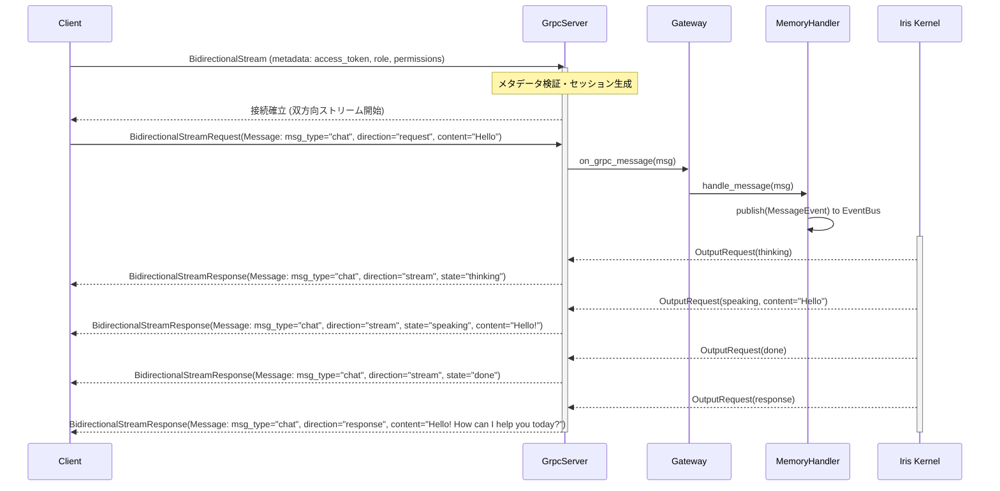
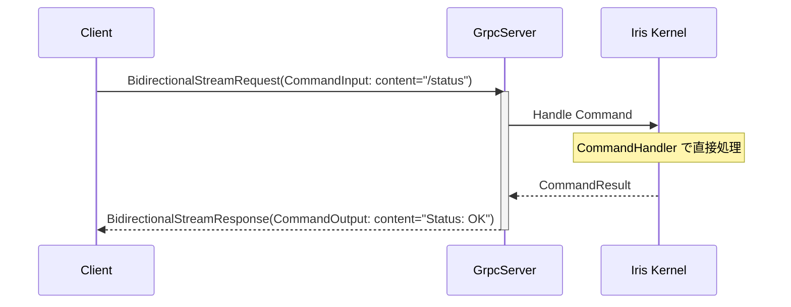
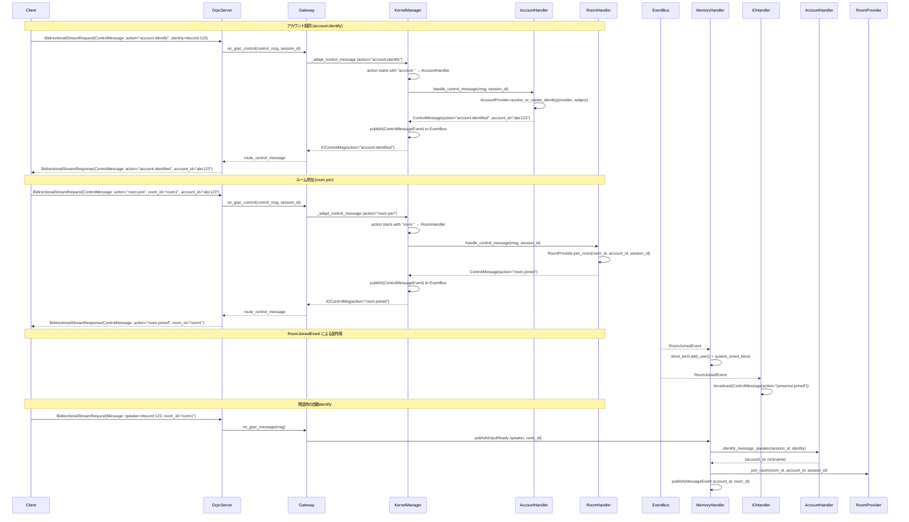

# Iris Mind 通信プロトコル仕様 v2.0 (gRPC 移行版)

## 1. 概要

Iris Mind は gRPC を介して外部プロセスと通信する。本ドキュメントは言語非依存のプロトコル仕様を定義する。

### 設計原則

- **スキーマ定義の明確化**: Protocol Buffers (proto3) による明示的な型定義
- **双方向ストリーミング**: 単一の持続的コネクション上での非同期双方向通信
- **メタデータ認証**: gRPC メタデータによるセキュリティとセッション初期化の統合
- **Role/Permission 分離**: 権限モデルを `role`（識別子）と `permissions`（権限セット）に分離

---

## 2. 通信方式

### 2.1 トランスポート

**gRPC over HTTP/2**

- ポート: `9876`（デフォルト）
- 同一マシン内プロセス間通信専用（デフォルト）
- 設定によりリモート接続可能（メタデータ内の `access_token` 必須）

### 2.2 セッション構成

1セッション = 1つの双方向ストリーミング RPC (`IrisService.BidirectionalStream`)。
接続開始時に送信される gRPC メタデータ（`access_token`, `role`, `permissions`）に基づいて認証が行われ、成功するとストリームが維持される。認証に失敗した場合は gRPC エラーコード（`UNAUTHENTICATED`）を返して即座に終了する。

**Session ID の扱い**:
- セッションID はサーバーが認証時に採番（16文字ランダム）し、ストリームに暗黙的に紐づく
- クライアントは `Message.session_id` / `CommandInput.session_id` を**空文字のまま送信してよい**。サーバーは自ストリームのセッションID で上書きする
- サーバーが送信する `Message.session_id` には常に正しいセッションID が格納される。クライアントは必要に応じて最初のメッセージから取得・保持する

**グループチャット識別**: 単一接続で複数ユーザーを扱う場合、各メッセージの `speaker` に発話者Identityを、`room_id` に会話ルームIDを設定する。Iris は `speaker` からAccountを自動解決し、応答にも同じ `room_id` を伝搬する。初回自動参加時は `room.join` が自動実行される。

### 2.3 Proto 定義 (`proto/iris/io/transport/grpc_service.proto`)

```protobuf
syntax = "proto3";

package iris.io.transport;

service IrisService {
  rpc BidirectionalStream (stream BidirectionalStreamRequest) returns (stream BidirectionalStreamResponse);
}

message Message {
  string id = 1;
  string correlation_id = 2;
  string session_id = 3;
  string source_role = 4;
  string target_role = 5;
  string direction = 6;
  string msg_type = 7;
  string content = 8;
  string content_type = 9;
  string state = 10;
  map<string, string> metadata = 11;
}

message CommandInput {
  string msg_type = 1;
  string id = 2;
  string session_id = 3;
  string source_role = 4;
  string content = 5;
}

message CommandOutput {
  string id = 1;
  string correlation_id = 2;
  string session_id = 3;
  string msg_type = 4;
  string content = 5;
  string state = 6;
}

message BidirectionalStreamRequest {
  oneof frame {
    Message message = 1;
    CommandInput command = 2;
  }
}

message BidirectionalStreamResponse {
  oneof frame {
    Message message = 1;
    CommandOutput command = 2;
  }
}
```

---

## 3. プロトコル概要

| 通信方向 | 種別 | 説明 |
|---------|------|------|
| Client → Server | `BidirectionalStreamRequest.message` | テキスト入力、制御、アクション結果 |
| Client → Server | `BidirectionalStreamRequest.message` (msg_type=voice_indicator) | 音声録音状態の制御信号（sensory/pending_input非保存、EventBus経由でProactive抑制） |
| Client → Server | `BidirectionalStreamRequest.command` | システムコマンド（`CommandInput` fast-path） |
| Client → Server | `BidirectionalStreamRequest.control` | アカウント制御プロトコル |
| Server → Client | `BidirectionalStreamResponse.message` | 応答、アクション要求、確認（`direction:stream`/`direction:response` で配送） |
| Server → Client | `BidirectionalStreamResponse.command` | コマンド応答（`CommandOutput` fast-path） |
| Server → Client | `BidirectionalStreamResponse.control` | アカウント制御応答・presence通知 |

---

## 4. データ型定義

### 4.1 Permission (メタデータで指定)

認証メタデータの `permissions` キーにコンマ区切りで指定する。

| 値 | 説明 |
|----|------|
| `send_chat` | テキスト入力を送信可能 |
| `receive_chat` | 応答を受信可能 |
| `send_command` | `/` コマンドを送信可能 |
| `receive_command` | コマンド結果を受信可能 |
| `receive_log` | ログ・デバッグ情報を受信可能 |
| `interrupt` | 生成中断を要求可能 |
| `execute_action` | アクション実行要求を受信可能 |
| `send_voice_indicator` | 音声録音状態を送信可能 |

### 4.2 Direction (`Message.direction`)

| 値 | 方向 | 説明 |
|----|------|------|
| `request` | Client→Server | クライアントからのリクエスト |
| `response` | Server→Client | サーバーからの単一応答（最終結果） |
| `stream` | Server→Client | ストリーミング中継（`state` と併用） |
| `event` | Server→Client | イベント通知（ブロードキャスト等） |

### 4.3 msg_type 定義 (`Message.msg_type`)

| msg_type | 通信方向 | 説明 |
|----------|---------|------|
| `chat` | 双方向 | テキスト会話メッセージ（`direction:stream` でストリーミング、`direction:response` で最終応答） |
| `system` | Client→Server | システム制御メッセージ |
| `interrupt` | Client→Server | 生成中断要求 |
| `execute` | Server→Client | アクション実行要求（tools使用時） |
| `execute_result` | Client→Server | アクション実行結果 |
| `proactive` | Server→Client | 自発発話（stream を経ず1メッセージで完了） |
| `ack` | Server→Client | 受信確認（`metadata.ack_required` 時） |
| `error` | Server→Client | エラー通知 |
| `voice_indicator` | Client→Server | 音声録音状態通知（制御信号）。`content` が `"true"` で録音開始、`"false"` で録音終了。`direction:event` で送信 |

### 4.6 Identity

グループチャットの発話者やアカウント操作対象を表す外部ID。

| フィールド | 型 | 説明 |
|-----------|-----|------|
| `provider` | string | 外部ID提供元。例: `discord`, `local` |
| `subject` | string | provider内の安定ID |
| `display_name` | string | provider側表示名 |
| `metadata` | map<string,string> | guild_id / channel_id等 |

### 4.7 ControlMessage (`BidirectionalStreamRequest.control` / `BidirectionalStreamResponse.control`)

アカウント制御プロトコル。通常の発話では `Message.speaker` から自動joinされるため、明示ControlMessageは任意。

| フィールド | 型 | 説明 |
|-----------|-----|------|
| `action` | string | アクション種別（下記参照） |
| `account_id` | string | Iris内部アカウントID |
| `room_id` | string | 会話ルームID。アカウント制御とpresenceの対象ルーム |
| `nickname` | string | 表示用ニックネーム |
| `text` | string | サーバーからの応答メッセージ（サーバー→クライアントのみ） |
| `identity` | Identity | 外部ID |
| `profile` | map<string,string> | 更新するプロフィール |
| `metadata` | map<string,string> | action固有メタデータ |

**action 定義**:

| action | 方向 | 説明 | 必須フィールド |
|--------|------|------|---------------|
| `account.identify` | C→S | identity解決/作成、アカウント情報返却（旧 `account.join`） | `identity.provider`, `identity.subject` |
| `account.profile` | C→S, S→C | 現セッションのアカウント情報取得（旧 `account.get`） | なし |
| `account.update` | C→S, S→C | ニックネーム・プロフィール更新 | `nickname` または `profile` |
| `account.link` | C→S, S→C | 外部ID追加紐付け（旧 `account.link_identity`） | `identity.provider`, `identity.subject` |
| `room.create` | C→S, S→C | ルーム作成 | `text` (ルーム名) |
| `room.list` | C→S, S→C | ルーム一覧取得 | なし |
| `room.info` | C→S, S→C | ルーム情報取得 | `room_id` |
| `room.join` | C→S, S→C | ルーム参加（identityからaccount作成も可） | `room_id`, (`account_id` or `identity`) |
| `room.leave` | C→S, S→C | ルーム退室 | `room_id`, (`account_id` or `identity`) |
| `room.update` | C→S, S→C | ルーム情報更新 | `room_id`, `text` (JSON) |
| `room.delete` | C→S, S→C | ルーム削除 | `room_id` |
| `room.members` | C→S, S→C | ルームメンバー一覧取得 | `room_id` |

**応答 (Server→Client)**:

| action | 説明 |
|--------|------|
| `account.identified` | identify完了応答 |
| `account.profile` | profile取得結果 |
| `account.updated` | update完了応答 |
| `account.linked` | link完了応答 |
| `room.created` | create完了応答 |
| `room.list` | list結果（`text` にJSON配列） |
| `room.info` | info結果（`text` にJSON） |
| `room.joined` | join完了応答 |
| `room.left` | leave完了応答 |
| `room.updated` | update完了応答 |
| `room.deleted` | delete完了応答 |
| `room.members` | members結果（`text` にJSON配列） |
| `account.error` / `room.error` | 制御エラー |

**自動発行**:
- ルーム入退室時、サーバーは `presence.joined` / `presence.left` を `ControlMessage` として配信する。
- セッション切断時、サーバーは同一セッション配下の全ルームから自動退室させ、各ルームに `presence.left` を配信する。

---

## 5. 接続シーケンス

### 5.1 通常フロー



### 5.2 コマンドフロー (Fast-Path)



### 5.3 アカウント制御フロー (ControlMessage)



---

## 6. 実装例

### 6.1 Python クライアント例

```python
import grpc
from iris.io.transport import grpc_service_pb2 as pb2
from iris.io.transport import grpc_service_pb2_grpc as pb2_grpc


def generate_messages(session_id: str):
    yield pb2.BidirectionalStreamRequest(
        message=pb2.Message(
            id="msg_001",
            msg_type="chat",
            session_id=session_id,
            direction="request",
            content="Hello Iris!",
        )
    )


def run():
    metadata = [
        ("access_token", "your_access_token"),
        ("role", "cli"),
        ("permissions", "send_chat,receive_chat,send_command,receive_command,send_voice_indicator"),
    ]

    with grpc.insecure_channel("localhost:9876") as channel:
        stub = pb2_grpc.IrisServiceStub(channel)
        responses = stub.BidirectionalStream(
            generate_messages(""), metadata=metadata
        )

        for response in responses:
            if response.HasField("message"):
                msg = response.message
                if msg.direction == "stream":
                    print(f"[{msg.state}] {msg.content}")
                elif msg.direction == "response":
                    print(f"Final Response: {msg.content}")
            elif response.HasField("command"):
                print(f"Command Result: {response.command.content}")


if __name__ == "__main__":
    run()
```

### 6.2 Rust クライアント例 (tonic)

```rust
use iris::io::transport::iris_service_client::IrisServiceClient;
use iris::io::transport::{
    bidirectional_stream_request, bidirectional_stream_response, Message,
};
use tonic::metadata::MetadataValue;
use tonic::Request;

pub mod iris {
    pub mod io {
        pub mod transport {
            tonic::include_proto!("iris.io.transport");
        }
    }
}

#[tokio::main]
async fn main() -> Result<(), Box<dyn std::error::Error>> {
    let channel = tonic::transport::Channel::from_static("http://127.0.0.1:9876")
        .connect()
        .await?;

    let token: MetadataValue<_> = "your_access_token".parse()?;
    let role: MetadataValue<_> = "cli".parse()?;
    let permissions: MetadataValue<_> =
        "send_chat,receive_chat,send_command,receive_command,send_voice_indicator".parse()?;

    let mut client = IrisServiceClient::with_interceptor(channel, move |mut req: Request<()>| {
        req.metadata_mut().insert("access_token", token.clone());
        req.metadata_mut().insert("role", role.clone());
        req.metadata_mut().insert("permissions", permissions.clone());
        Ok(req)
    });

    // session_id は空文字でOK（サーバーが自ストリームのセッションIDで上書き）
    let outbound = tokio_stream::iter(vec![
        iris::io::transport::BidirectionalStreamRequest {
            frame: Some(bidirectional_stream_request::Frame::Message(Message {
                id: "msg_001".to_string(),
                msg_type: "chat".to_string(),
                session_id: String::new(),
                direction: "request".to_string(),
                source_role: "cli".to_string(),
                target_role: "mind".to_string(),
                content: "Hello Iris!".to_string(),
                ..Default::default()
            })),
        },
    ]);

    let response = client.bidirectional_stream(outbound).await?;
    let mut inbound = response.into_inner();

    while let Some(frame) = inbound.message().await? {
        if let Some(f) = frame.frame {
            match f {
                bidirectional_stream_response::Frame::Message(msg) => {
                    println!("Received message: {}", msg.content);
                }
                bidirectional_stream_response::Frame::Command(cmd) => {
                    println!("Received command output: {}", cmd.content);
                }
            }
        }
    }

    Ok(())
}
```

---

## 7. エラーハンドリング

| 状況 | 動作 / エラーコード |
|------|------|
| 認証失敗 | gRPC ステータスコード `UNAUTHENTICATED` (16) を返して接続切断 |
| 不正なリクエスト引数 | gRPC ステータスコード `INVALID_ARGUMENT` (3) |
| 内部エラー | gRPC ステータスコード `INTERNAL` (13) |
| 権限不足 | BidirectionalStreamResponse 内で `error` メッセージを送信、または `PERMISSION_DENIED` (7) |
| 接続断 | サーバーは当該セッション情報を削除。同一セッションに紐づく全ルームから自動退室し、各ルームに `presence.left` を自動発行、自発発話の抑制を解除する |
