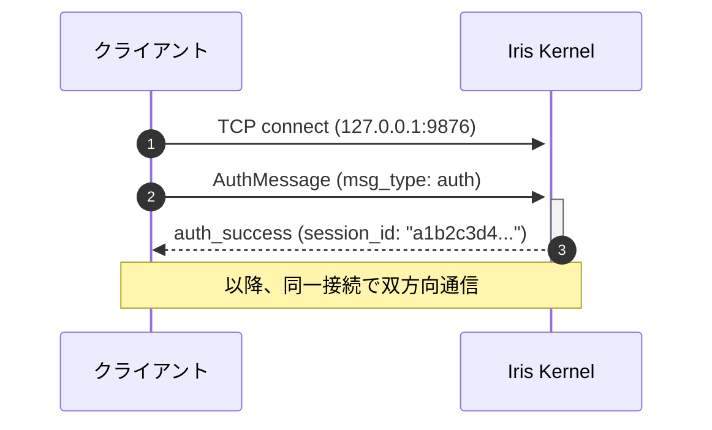
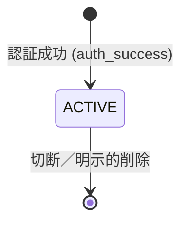
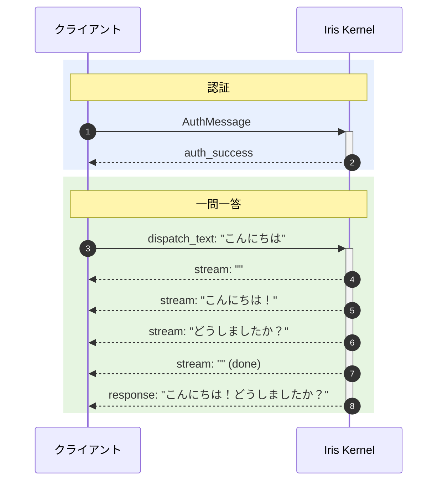
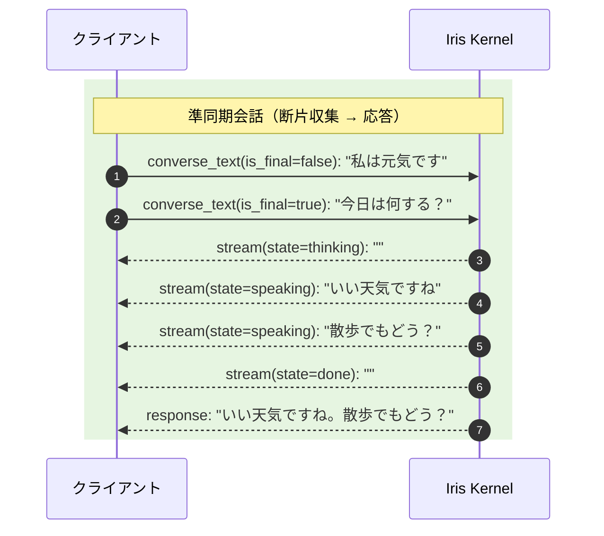
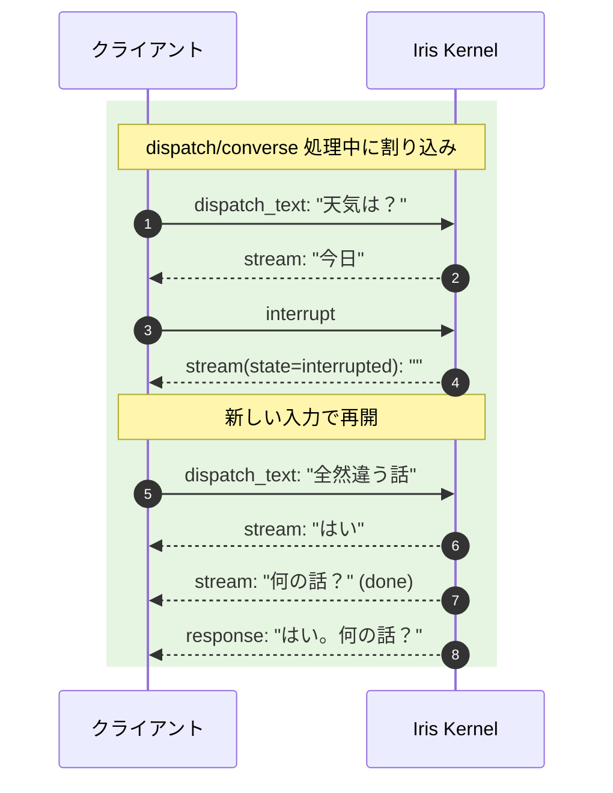

# Iris Kernel 通信プロトコル仕様 v5.0

## 1. 概要

Iris Kernel は TCP 経由で外部プロセスと通信する。このドキュメントは**言語非依存**のプロトコル仕様を定義する。任意のプログラミング言語から実装可能。

### 設計原則

- **言語非依存**: JSON + UTF-8 エンコーディング。特定言語のライブラリに依存しない
- **セッションベース**: 認証 → セッション確立 → 通信 の明確な段階
- **1ポート多重**: 認証・入力・出力すべてを単一のTCP接続で多重化
- **準同期モード**: 断片メッセージ・割り込み可能な会話フローをサポート

## 2. 通信方式

### 2.1 トランスポート

**TCP/IP** (`AF_INET`)

- アドレス: `127.0.0.1:9876`（デフォルト）
- 双方向通信可能
- 同一マシン内プロセス間通信専用（デフォルト）
- 設定によりリモート接続可能（その場合は `access_token` 必須）

### 2.2 セッション構成

1セッション = 1TCP接続。認証・入力・出力すべてを1本の接続で処理する。

### 2.3 ワイヤー形式（フレーミング）

全メッセージは以下の形式で送受信する:

```
[4バイト: ペイロード長 (big-endian)] [UTF-8 JSON ペイロード]
```

| 部品 | サイズ | エンコーディング |
|------|--------|-----------------|
| ペイロード長 | 4バイト (uint32, big-endian) | バイナリ |
| ペイロード | 可変 (0〜32MB) | UTF-8 JSON |

## 3. プロトコル概要（メッセージの方向性）

接続上の全メッセージは `msg_type` フィールドで種類を判別する。

| 方向 | msg_type 一覧 | 説明 |
|------|--------------|------|
| Client → Server | `auth` | 認証リクエスト |
| Server → Client | `auth_success`, `auth_failure`, `error` | 認証レスポンス |
| Client → Server | `dispatch_text` | 一問一答モード（従来の完全メッセージ） |
| Client → Server | `converse_text` | 準同期モード（断片可、is_final で制御） |
| Client → Server | `interrupt` | 現在の応答生成を中断 |
| Client → Server | `command`, `system` | コマンド・システムメッセージ |
| Client → Server | `ping` | ハートビート（任意。サーバーは `pong` で応答） |
| Server → Client | `pong` | ハートビート応答 |
| Server → Client | `response`, `stream`, `proactive`, `ack` | 出力メッセージ |

クライアントは認証成功後、**同一接続で**入力送信と出力受信を並行して行う。

## 4. 接続シーケンス

### 4.1 認証ハンドシェイク（v4.0 から変更なし）



### 4.2 接続モード（v4.0 から変更なし）

`AuthMessage.mode` で指定:

| モード | 説明 |
|--------|------|
| `bidirectional` | 入出力双方向（デフォルト） |
| `input_only` | 入力のみ。Kernelは出力を送信しない |
| `output_only` | 出力のみ。Kernelは入力を受け付けない |

### 4.3 セッション状態遷移（v4.0 から変更なし）



### 4.4 通信フロー: dispatch_text（一問一答モード）



### 4.5 通信フロー: converse_text（準同期モード）



### 4.6 通信フロー: 割り込み



## 5. メッセージ形式

### 5.1 AuthMessage（Client → Server）

認証リクエスト。TCP接続後に最初に送信するメッセージ。
v4.0 から変更なし。

| フィールド | 型 | 必須 | デフォルト | 説明 |
|-----------|-----|------|-----------|------|
| `msg_type` | string | 必須 | - | 常に `"auth"` |
| `mode` | string | 任意 | `"bidirectional"` | `"bidirectional"`, `"input_only"`, `"output_only"` |
| `access_token` | string | 条件付き | - | サーバー側で設定されている場合は必須 |
| `roles` | string[] | 任意 | 全role | クライアントが持つ機能の一覧 |
| `identity` | string | 任意 | `""` | クライアントの識別名 |
| `description` | string | 任意 | `""` | クライアントの説明 |

```json
{
  "msg_type": "auth",
  "mode": "bidirectional",
  "roles": ["conversation_input", "conversation_output"],
  "identity": "my-app-v2",
  "description": "Desktop client"
}
```

### 5.2 ControlMessage（Server → Client）

v4.0 から変更なし。

| フィールド | 型 | 必須 | 説明 |
|-----------|-----|------|------|
| `msg_type` | string | 必須 | `"auth_success"`, `"auth_failure"`, `"error"` |
| `session_id` | string | 条件付き | 成功時のみ。16文字のセッションID |
| `error_message` | string | 条件付き | 失敗時のみ。エラー理由 |

**成功**:
```json
{
  "msg_type": "auth_success",
  "session_id": "a1b2c3d4e5f6g7h8"
}
```

### 5.3 InputMessage（Client → Server）

外部クライアントから Kernel への入力メッセージ。
v5.0 では `msg_type` の値が変更・追加された。

| フィールド | 型 | 必須 | デフォルト | 説明 |
|-----------|-----|------|-----------|------|
| `msg_type` | string | 必須 | - | `"dispatch_text"`, `"converse_text"`, `"command"`, `"system"` |
| `id` | string | 任意 | 自動生成 | メッセージID (12文字) |
| `session_id` | string | 必須 | - | 認証で取得したセッションID |
| `source` | string | 必須 | - | 送信元識別子 (`"cli"`, `"web"`, etc.) |
| `content` | string | 必須 | - | メッセージ本文 |
| `content_type` | string | 任意 | `"text/plain"` | コンテンツタイプ |
| `is_final` | boolean | 任意 | `true` | converse_text 時のみ有効。断片の終端かどうか |
| `metadata` | object | 任意 | `{}` | 拡張メタデータ |

**一問一答**:
```json
{
  "msg_type": "dispatch_text",
  "session_id": "a1b2c3d4e5f6g7h8",
  "source": "cli",
  "content": "こんにちは"
}
```

**準同期（断片送信）**:
```json
{
  "msg_type": "converse_text",
  "session_id": "a1b2c3d4e5f6g7h8",
  "source": "cli",
  "content": "私は元気です",
  "is_final": false
}
```

**準同期（断片終了）**:
```json
{
  "msg_type": "converse_text",
  "session_id": "a1b2c3d4e5f6g7h8",
  "source": "cli",
  "content": "今日は何する？",
  "is_final": true
}
```

### 5.4 OutputMessage（Server → Client）

Kernel から外部クライアントへの出力メッセージ。
v5.0 では `state` フィールドが追加された。

| フィールド | 型 | 必須 | デフォルト | 説明 |
|-----------|-----|------|-----------|------|
| `msg_type` | string | 必須 | - | `"response"`, `"stream"`, `"proactive"`, `"ack"`, `"command"`, `"error"` |
| `id` | string | 任意 | 自動生成 | メッセージID (12文字) |
| `correlation_id` | string | 任意 | - | 対応する入力メッセージのID（dispatch/command時） |
| `content` | string | 必須 | - | メッセージ本文 |
| `content_type` | string | 任意 | `"text/plain"` | コンテンツタイプ |
| `state` | string | 任意 | - | `"thinking"`, `"speaking"`, `"done"`, `"interrupted"`（converse時） |
| `metadata` | object | 任意 | `{}` | 拡張メタデータ |

**dispatch_text 応答（従来のストリーム）**:
```json
{
  "msg_type": "stream",
  "correlation_id": "msg001",
  "content": "Hello"
}
```

**converse_text 応答（thinking → speaking → done）**:
```json
{
  "msg_type": "stream",
  "content": "",
  "state": "thinking"
}
```
```json
{
  "msg_type": "stream",
  "content": "こんにちは！",
  "state": "speaking"
}
```
```json
{
  "msg_type": "stream",
  "content": "",
  "state": "done"
}
```

**割り込み発生時**:
```json
{
  "msg_type": "stream",
  "content": "",
  "state": "interrupted"
}
```

**完全な応答（ストリーム終了後に1回送信）**:
```json
{
  "msg_type": "response",
  "content": "Hello! How can I help you?",
  "metadata": {
    "model": "qwen3.5:9b"
  }
}
```

### 5.5 InterruptMessage（Client → Server）【新設】

現在の応答生成を中断する。dispatch_text / converse_text 処理中に送信可能。

| フィールド | 型 | 必須 | 説明 |
|-----------|-----|------|------|
| `msg_type` | string | 必須 | 常に `"interrupt"` |
| `session_id` | string | 必須 | 中断対象のセッションID |

```json
{
  "msg_type": "interrupt",
  "session_id": "a1b2c3d4e5f6g7h8"
}
```

### 5.6 PingMessage / PongMessage（Client ↔ Server）

v4.0 から変更なし。

| 方向 | msg_type | 説明 |
|------|----------|------|
| Client → Server | `ping` | ハートビート要求 |
| Server → Client | `pong` | ハートビート応答 |

```json
{ "msg_type": "ping" }
{ "msg_type": "pong" }
```

## 6. 準同期モード詳細（converse_text）

### 6.1 断片バッファリング

converse_text で `is_final=false` のメッセージは Kernel 側でバッファリングされる。
以下のいずれかの条件でバッファがフラッシュされ、LLM による処理が開始される:

1. `is_final=true` のメッセージを受信
2. 最終断片から `input_timeout_ms`（デフォルト800ms）経過
3. バッファ最大断片数（デフォルト10）に到達

### 6.2 割り込み動作

- dispatch_text / converse_text 処理中に `interrupt` を受信 → 応答生成を即時中断
- converse_text 処理中に新しい converse_text を受信 → 暗黙的に割り込み、新たな断片としてバッファ
- 割り込み後は `stream(state=interrupted)` が出力される

### 6.3 出力 state 値

| state | 意味 | 発話エンジン連携 |
|-------|------|-----------------|
| `thinking` | LLM が応答を生成中 | 考え中アニメーション表示 |
| `speaking` | 応答テキストをストリーム中 | 音声合成開始 |
| `done` | 応答完了 | 発話終了 |
| `interrupted` | 割り込み発生 | 発話中断 |

## 7. コマンド一覧

v4.0 から変更なし。

| コマンド | 説明 |
|---------|------|
| `/status` | Kernel の状態確認 |
| `/shutdown` | グレースフルシャットダウン |
| `/sleep` | エージェント休止 |
| `/wakeup` | エージェント再開 |
| `/help` | コマンド一覧 |
| `/compact` | 会話履歴の圧縮 |

## 8. エラーハンドリング

v4.0 から変更なし。

## 9. 実装例（言語別）

### 9.1 Python — 準同期モード対応クライアント例

```python
import json
import socket
import struct
import time

class IrisQuasiClient:
    def __init__(self, host="127.0.0.1", port=9876):
        self._sock = socket.socket(socket.AF_INET, socket.SOCK_STREAM)
        self._sock.connect((host, port))
        self._buf = b""
        self._session_id = ""

    def _send_frame(self, obj):
        data = json.dumps(obj, ensure_ascii=False).encode("utf-8")
        self._sock.sendall(struct.pack("!I", len(data)) + data)

    def _recv_frame(self):
        while len(self._buf) < 4:
            self._buf += self._sock.recv(4096)
        size = struct.unpack("!I", self._buf[:4])[0]
        self._buf = self._buf[4:]
        while len(self._buf) < size:
            self._buf += self._sock.recv(4096)
        payload = self._buf[:size]
        self._buf = self._buf[size:]
        return json.loads(payload)

    def authenticate(self, token=""):
        msg = {"msg_type": "auth", "mode": "bidirectional"}
        if token: msg["access_token"] = token
        self._send_frame(msg)
        resp = self._recv_frame()
        if resp["msg_type"] != "auth_success":
            raise RuntimeError(f"Auth failed: {resp}")
        self._session_id = resp["session_id"]
        return self._session_id

    # ── 準同期（断片）送信 ──────────────────────────
    def send_fragment(self, text, is_final=False):
        self._send_frame({
            "msg_type": "converse_text",
            "session_id": self._session_id,
            "source": "cli",
            "content": text,
            "is_final": is_final,
        })

    # ── 一問一答送信 ─────────────────────────────
    def send_dispatch(self, text):
        self._send_frame({
            "msg_type": "dispatch_text",
            "session_id": self._session_id,
            "source": "cli",
            "content": text,
        })

    # ── 割り込み送信 ─────────────────────────────
    def send_interrupt(self):
        self._send_frame({
            "msg_type": "interrupt",
            "session_id": self._session_id,
        })

    # ── 出力受信（1メッセージ） ─────────────────────
    def recv_output(self):
        return self._recv_frame()

# ── 使用例（準同期会話） ──────────────────────────────
client = IrisQuasiClient()
client.authenticate()
client.send_fragment("私は元気です", is_final=False)
time.sleep(0.1)
client.send_fragment("今日は何する？", is_final=True)
while True:
    msg = client.recv_output()
    state = msg.get("state", "")
    if state == "thinking":
        print("[thinking...]", end="", flush=True)
    elif state == "speaking":
        print(msg["content"], end="", flush=True)
    elif state == "done":
        print()
        break
    elif msg["msg_type"] == "response":
        print(f"\n[complete] {msg['content']}")
        break
```
