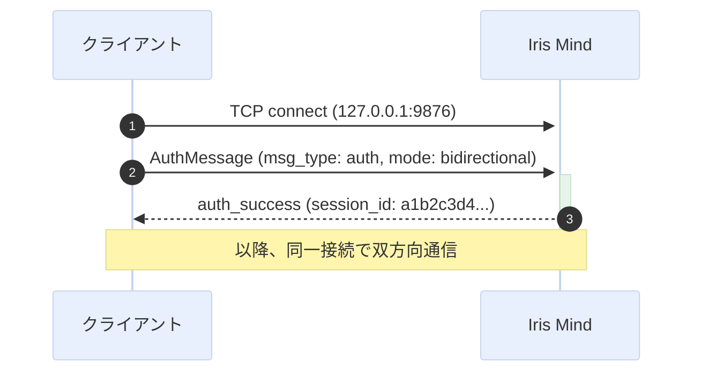
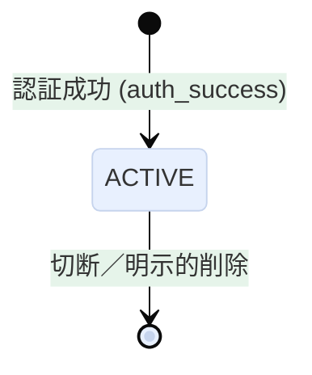
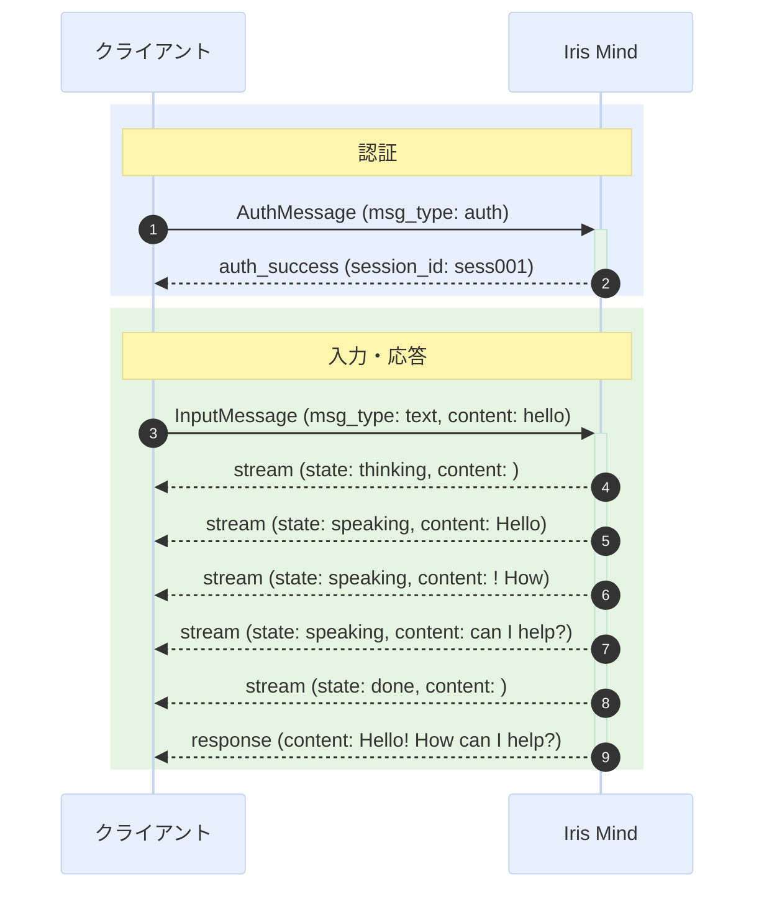

# Iris Mind 通信プロトコル仕様 v1.4

## 1. 概要

Iris Mind は TCP 経由で外部プロセスと通信する。このドキュメントは**言語非依存**のプロトコル仕様を定義する。任意のプログラミング言語から実装可能。

### 設計原則

- **言語非依存**: JSON + UTF-8 エンコーディング。特定言語のライブラリに依存しない
- **セッションベース**: 認証 → セッション確立 → 通信 の明確な段階
- **1ポート多重**: 認証・入力・出力すべてを単一のTCP接続で多重化

## 2. 通信方式

### 2.1 トランスポート

**TCP/IP** (`AF_INET`)

- アドレス: `127.0.0.1:9876`（デフォルト）
- 双方向通信可能
- 同一マシン内プロセス間通信専用（デフォルト）
- 設定によりリモート接続可能（その場合は `access_token` 必須）

### 2.2 セッション構成

1セッション = 1TCP接続。認証・入力・出力すべてを1本の接続で処理する。

### 2.3 ワイヤー形式（フレーミング）

全メッセージは以下の形式で送受信する:

```
[4バイト: ペイロード長 (big-endian)] [UTF-8 JSON ペイロード]
```

| 部品 | サイズ | エンコーディング |
|------|--------|-----------------|
| ペイロード長 | 4バイト (uint32, big-endian) | バイナリ |
| ペイロード | 可変 (0〜32MB) | UTF-8 JSON |

**例**: メッセージ `{"msg_type":"auth"}` のワイヤー表現:

```
00 00 00 18 7B 22 6D 73 67 5F 74 79 70 65 22 3A 22 61 75 74 68 22 7D
├── length=24 ──┤ ├── UTF-8 JSON (24 bytes) ──────────────────────────┤
```

## 3. プロトコル概要（メッセージの方向性）

接続上の全メッセージは `msg_type` フィールドで種類を判別する。

| 方向 | msg_type 一覧 | 説明 |
|------|--------------|------|
| Client → Server | `auth` | 認証リクエスト |
| Server → Client | `auth_success`, `auth_failure`, `error` | 認証レスポンス |
| Client → Server | `dispatch_text`, `converse_text`, `system` | ユーザー入力 |
| Client → Server | `command` | システムコマンド |
| Client → Server | `interrupt` | 生成中断要求 |
| Client → Server | `ping` | ハートビート（任意。サーバーは `pong` で応答） |
| Server → Client | `pong` | ハートビート応答 |
| Server → Client | `stream`, `response`, `proactive`, `ack` | 出力メッセージ |
| Server → Client | `command` | コマンド応答 |

クライアントは認証成功後、**同一接続で**入力送信と出力受信を並行して行う。

動作の詳細（応答パターン・自発発話・コマンド等）は [`client-guide.md`](./client-guide.md) を参照。

## 4. 接続シーケンス

### 4.1 認証ハンドシェイク



### 4.2 接続モード

`AuthMessage.mode` で指定:

| モード | 説明 |
|--------|------|
| `bidirectional` | 入出力双方向（デフォルト） |
| `input_only` | 入力のみ。Kernelは出力を送信しない |
| `output_only` | 出力のみ。Kernelは入力を受け付けない |

### 4.3 セッション状態遷移



セッションは認証成功後ただちに `ACTIVE` となり、切断または `remove_session` で `CLOSED` となる。

### 4.4 完全な通信フロー（テキスト入力〜応答受信）



**出力ストリームの終端判定**: `msg_type="stream"` で `state: "done"` が最終チャンクの合図。その後 `msg_type="response"` で完全な応答テキストが届く。詳細は [`client-guide.md`](./client-guide.md) を参照。

応答シーケンスの詳細は [`client-guide.md`](./client-guide.md) を参照。

## 5. メッセージ形式

### 5.1 AuthMessage（Client → Server）

認証リクエスト。TCP接続後に最初に送信するメッセージ。
クライアントは自身の役割（roles）を宣言する。

| フィールド | 型 | 必須 | デフォルト | 説明 |
|-----------|-----|------|-----------|------|
| `msg_type` | string | 必須 | - | 常に `"auth"` |
| `mode` | string | 任意 | `"bidirectional"` | `"bidirectional"`, `"input_only"`, `"output_only"` |
| `access_token` | string | 条件付き | - | サーバー側で設定されている場合は必須 |
| `roles` | string[] | 任意 | 全role | クライアントが持つ機能の一覧（[SessionRole](#sessionrole)参照） |
| `identity` | string | 任意 | `""` | クライアントの識別名（保存のみ、LLMには非表示） |
| `description` | string | 任意 | `""` | クライアントの説明（保存のみ、LLMには非表示） |

```json
{
  "msg_type": "auth",
  "mode": "bidirectional",
  "access_token": "my-secret-token",
  "roles": ["conversation_input", "conversation_output", "command_input", "command_output"],
  "identity": "my-app-v2",
  "description": "Desktop client on Windows"
}
```

### 5.2 ControlMessage（Server → Client）

認証レスポンス。Kernel から返される。

| フィールド | 型 | 必須 | 説明 |
|-----------|-----|------|------|
| `msg_type` | string | 必須 | `"auth_success"`, `"auth_failure"`, `"error"` |
| `session_id` | string | 条件付き | 成功時のみ。16文字のセッションID |
| `error_message` | string | 条件付き | 失敗時のみ。エラー理由 |

**成功**:
```json
{
  "msg_type": "auth_success",
  "session_id": "a1b2c3d4e5f6g7h8"
}
```

**失敗**:
```json
{
  "msg_type": "auth_failure",
  "error_message": "invalid access_token"
}
```

### 5.3 InputMessage（Client → Server）

外部クライアントから Kernel への入力メッセージ（通常の会話入力）。

| フィールド | 型 | 必須 | デフォルト | 説明 |
|-----------|-----|------|-----------|------|
| `msg_type` | string | 必須 | - | `"dispatch_text"`, `"converse_text"`, `"system"` |
| `id` | string | 任意 | 自動生成 | メッセージID (12文字) |
| `session_id` | string | 必須 | - | 認証で取得したセッションID |
| `source` | string | 必須 | - | 送信元識別子 (`"cli"`, `"web"`, etc.) |
| `content` | string | 必須 | - | メッセージ本文 |
| `content_type` | string | 任意 | `"text/plain"` | コンテンツタイプ |
| `is_final` | bool | 任意 | `true` | 最終チャンクかどうか（ストリーム入力用） |
| `metadata` | object | 任意 | `{}` | 拡張メタデータ |

**テキスト入力**:
```json
{
  "msg_type": "dispatch_text",
  "session_id": "a1b2c3d4e5f6g7h8",
  "source": "cli",
  "content": "こんにちは"
}
```

### 5.4 CommandInput（Client → Server）

システムコマンド入力。通常の会話入力とは別モデルとして扱われる。

| フィールド | 型 | 必須 | デフォルト | 説明 |
|-----------|-----|------|-----------|------|
| `msg_type` | string | 必須 | - | 常に `"command"` |
| `session_id` | string | 必須 | - | 認証で取得したセッションID |
| `source` | string | 任意 | `""` | 送信元識別子 |
| `content` | string | 必須 | - | スラッシュコマンド (`/status` 等) |

```json
{
  "msg_type": "command",
  "session_id": "a1b2c3d4e5f6g7h8",
  "source": "cli",
  "content": "/status"
}
```

### 5.5 OutputMessage（Server → Client）

Kernel から外部クライアントへの出力メッセージ（会話応答・ストリーム等）。
配送先は Kernel の `route_output()` パラメータで決定されるため、メッセージ本体に session_id は不要。

| フィールド | 型 | 必須 | デフォルト | 説明 |
|-----------|-----|------|-----------|------|
| `msg_type` | string | 必須 | - | `"stream"`, `"response"`, `"proactive"`, `"ack"`, `"error"` |
| `state` | string | 任意 | - | stream の状態: `"thinking"`, `"speaking"`, `"done"`, `"interrupted"` |
| `id` | string | 任意 | 自動生成 | メッセージID (12文字) |
| `correlation_id` | string | 任意 | - | 対応する入力メッセージのID（ACK応答時など） |
| `content` | string | 必須 | - | メッセージ本文 |
| `content_type` | string | 任意 | `"text/plain"` | コンテンツタイプ |
| `metadata` | object | 任意 | `{}` | 拡張メタデータ |

**応答シーケンス（通常）**: 下記の順序で複数メッセージが届く。

**思考開始通知** — Iris が考え始めた:
```json
{
  "msg_type": "stream",
  "state": "thinking",
  "content": ""
}
```

**ストリームトークン** — 生成途中のテキスト（0回以上）:
```json
{
  "msg_type": "stream",
  "state": "speaking",
  "content": "Hello"
}
```

**ストリーム終了** — `state: "done"` が終端:
```json
{
  "msg_type": "stream",
  "state": "done",
  "content": ""
}
```

**完全な応答（ストリーム終了後に1回送信）**:
```json
{
  "msg_type": "response",
  "content": "Hello! How can I help you?"
}
```

**短縮応答（abbreviated）** — stream なしで即座に response のみ:
```json
{
  "msg_type": "response",
  "content": "わかりました"
}
```

**自発発話（ユーザー入力なしでKernelが自発的に送信）**:
```json
{
  "msg_type": "proactive",
  "content": "そろそろ休憩しませんか？"
}
```

### 5.6 CommandOutput（Server → Client）

コマンド入力に対する応答。通常の出力メッセージとは別モデルとして扱われる。

| フィールド | 型 | 必須 | デフォルト | 説明 |
|-----------|-----|------|-----------|------|
| `msg_type` | string | 必須 | - | 常に `"command"` |
| `session_id` | string | 任意 | `""` | 対象セッションID |
| `id` | string | 任意 | 自動生成 | メッセージID (12文字) |
| `correlation_id` | string | 任意 | - | 対応するコマンド入力のID |
| `content` | string | 必須 | - | コマンド実行結果 |
| `state` | string | 任意 | - | 実行状態（`"ok"`, `"error"` 等） |

```json
{
  "msg_type": "command",
  "session_id": "a1b2c3d4e5f6g7h8",
  "content": "Status: IDLE, uptime: 1h 23m"
}
```

### 5.7 SessionRole

クライアントが認証時に宣言する役割。LLM はこの role に基づいて出力先を判断する。

| role | 説明 | 用途例 |
|------|------|--------|
| `conversation_input` | 対話入力を受け付ける | テキスト入力欄 |
| `command_input` | コマンド入力を受け付ける | CLI, コマンドパレット |
| `conversation_output` | 対話応答を表示する | メインチャット表示 |
| `command_output` | コマンド結果を表示する | コマンド結果ペイン |
| `log` | ログ・デバッグ情報を表示する | ログビューア, デバッグコンソール |

### 5.6 PingMessage / PongMessage（Client ↔ Server）

ハートビート。クライアントが任意のタイミングで送信し、サーバーが応答する。これによりサーバー側の `last_activity` が更新されるため、アイドルタイムアウト実装の下地として機能する。

| 方向 | msg_type | 説明 |
|------|----------|------|
| Client → Server | `ping` | ハートビート要求 |
| Server → Client | `pong` | ハートビート応答 |

サーバーは接続単位でセッションを識別するため、Ping/Pong メッセージに session_id は不要。

**Ping リクエスト**:
```json
{
  "msg_type": "ping"
}
```

**Pong 応答**:
```json
{
  "msg_type": "pong"
}
```

### 5.7 InterruptMessage（Client → Server）

生成中の応答を中断する。Kernel は指定された session_id の実行中の生成をキャンセルする。

| フィールド | 型 | 必須 | 説明 |
|-----------|-----|------|------|
| `msg_type` | string | 必須 | 常に `"interrupt"` |
| `session_id` | string | 必須 | 中断対象のセッションID |

```json
{
  "msg_type": "interrupt",
  "session_id": "a1b2c3d4e5f6g7h8"
}
```

Kernel は interrupt を受信すると該当セッションの生成を停止し、以降のストリーム出力を抑制する。

## 6. ACK メカニズム

入力メッセージに `metadata.ack_required: true` を設定すると、Kernel は `msg_type: "ack"` の OutputMessage を返す。
ACK メッセージの `correlation_id` には元のメッセージの `id` が設定される。

**ACK リクエスト（コマンド入力にも適用可）**:
```json
{
  "msg_type": "command",
  "session_id": "a1b2c3d4e5f6g7h8",
  "source": "cli",
  "content": "/shutdown"
}
```

ただし CommandInput には `metadata` フィールドがないため、ACK はコマンド入力に対しては適用されない。ACK 機構は InputMessage 専用。

**ACK 応答**:
```json
{
  "msg_type": "ack",
  "correlation_id": "msg003",
  "content": "ack:msg003"
}
```

## 7. コマンド一覧

`msg_type="command"` の CommandInput で送信すると、スラッシュコマンドとして解釈される。

| コマンド | 説明 | 応答の例 |
|---------|------|---------|
| `/status` | Kernel の状態確認 | `"Model: ollama (qwen3.5:9b)\nEmotion: v=0.30 a=0.20 d=0.50 (穏やか)"` |
| `/shutdown` | グレースフルシャットダウン | `"Shutting down..."` |
| `/help` | コマンド一覧 | `"Available commands: /status, /shutdown..."` |
| `/compact` | 会話履歴の圧縮 | `"Compacted: 240 chars summary, kept last 6 messages"` |
| `/memory recent [n]` | 直近のエピソード記憶を表示 | `"Recent 3 episodic memories:\n  1. [2026-05-18T10:00:00] hello"` |
| `/memory search <q>` | 意味記憶を検索 | `"Search results for 'hello':\n  [0.85] Hello! How can I help?"` |
| `/memory clear [type]` | 記憶をクリア（episodic/semantic/省略で両方） | `"Cleared all memory"` |
| `/emotion` | 現在の感情状態を表示 | `"Emotion: valence=0.30 arousal=0.20 dominance=0.50\nMood: 穏やか"` |
| `/sessions` | アクティブセッション一覧 | `"Active sessions:\n[conversation_input, conversation_output]"` |

応答は CommandOutput（`msg_type="command"`）として返される。

各コマンドの動作詳細は [`client-guide.md`](./client-guide.md) を参照。

## 8. エラーハンドリング

| 状況 | Kernel の動作 | クライアントの動作 |
|------|--------------|-------------------|
| 認証失敗 | `auth_failure` 送信後、接続切断 | エラー表示、再試行 |
| 無効な session_id | メッセージを無視、ログ出力 | 再接続 → 再認証 |
| 不正なメッセージ（JSONパース失敗等） | ログ出力、接続切断 | ログ出力、再接続 |
| 接続断（予期せず） | 該当スレッド終了、セッションクリーンアップ | 指数バックオフで再接続 |

## 9. 実装例（言語別）

### 9.1 最小クライアント（Python — 生ソケット版）

以下のコードはワイヤー形式に従った**リファレンス実装**。全言語の実装はこの構造を模倣すればよい。

```python
import json
import socket
import struct

class IrisClient:
    def __init__(self, host: str = "127.0.0.1", port: int = 9876):
        self._sock = socket.socket(socket.AF_INET, socket.SOCK_STREAM)
        self._sock.connect((host, port))
        self._buf = b""

    # ── フレーミング ──────────────────────────────────────
    def _send_frame(self, obj: dict) -> None:
        data = json.dumps(obj, ensure_ascii=False).encode("utf-8")
        self._sock.sendall(struct.pack("!I", len(data)) + data)

    def _recv_frame(self) -> dict:
        while len(self._buf) < 4:
            chunk = self._sock.recv(4096)
            if not chunk:
                raise ConnectionError("connection closed")
            self._buf += chunk
        size = struct.unpack("!I", self._buf[:4])[0]
        self._buf = self._buf[4:]
        while len(self._buf) < size:
            chunk = self._sock.recv(4096)
            if not chunk:
                raise ConnectionError("connection closed")
            self._buf += chunk
        payload = self._buf[:size]
        self._buf = self._buf[size:]
        return json.loads(payload.decode("utf-8"))

    # ── 認証 ──────────────────────────────────────────────
    def authenticate(self, access_token: str = "") -> str:
        msg = {"msg_type": "auth", "mode": "bidirectional"}
        if access_token:
            msg["access_token"] = access_token
        self._send_frame(msg)
        resp = self._recv_frame()
        if resp["msg_type"] != "auth_success":
            raise RuntimeError(f"Auth failed: {resp.get('error_message', 'unknown')}")
        self._session_id = resp["session_id"]
        return self._session_id

    # ── ハートビート ────────────────────────────────────────
    def ping(self) -> dict:
        self._send_frame({"msg_type": "ping"})
        return self._recv_frame()  # pong

    # ── 入力送信 ──────────────────────────────────────────
    def send_input(self, text: str, source: str = "cli", msg_type: str = "dispatch_text") -> None:
        self._send_frame({
            "msg_type": msg_type,
            "session_id": self._session_id,
            "source": source,
            "content": text,
        })

    # ── 出力受信（1メッセージ） ────────────────────────────
    def recv_output(self) -> dict:
        return self._recv_frame()

    # ── 出力受信（ストリーム完了までまとめて受信） ──────────
    def recv_response(self) -> list[dict]:
        messages = []
        while True:
            msg = self._recv_frame()
            messages.append(msg)
            if msg["msg_type"] == "response":
                break
        return messages

    def close(self) -> None:
        self._sock.close()

# ── 使用例 ────────────────────────────────────────────────
client = IrisClient()
session_id = client.authenticate()
client.send_input("hello")
for msg in client.recv_response():
    if msg["msg_type"] == "stream" and msg["content"]:
        print(msg["content"], end="")
    elif msg["msg_type"] == "response":
        print(f"\n[complete] {msg['content']}")
client.close()
```

### 9.2 Python — multiprocessing.connection 版

```python
from multiprocessing.connection import Client

conn = Client(("127.0.0.1", 9876), family="AF_INET")
conn.send_bytes(json.dumps({"msg_type": "auth"}).encode("utf-8"))
resp = json.loads(conn.recv_bytes().decode("utf-8"))
```

**注意**: `multiprocessing.connection` の内部フレーミング形式は標準ライブラリの実装詳細であり、他言語からの互換性は保証されない。他言語で実装する場合は **9.1 のワイヤー形式** に従うこと。

### 9.3 C# / .NET

```csharp
using System.Net.Sockets;
using System.Text;
using System.Text.Json;

using var client = new TcpClient("127.0.0.1", 9876);
var stream = client.GetStream();

byte[] Send(Dictionary<string, object> obj) {
    var json = JsonSerializer.Serialize(obj);
    var data = Encoding.UTF8.GetBytes(json);
    var len = BitConverter.GetBytes(data.Length); // big-endian
    if (BitConverter.IsLittleEndian) Array.Reverse(len);
    stream.Write(len);
    stream.Write(data);
}

byte[] buf = new byte[4];
stream.Read(buf, 0, 4);
if (BitConverter.IsLittleEndian) Array.Reverse(buf);
int size = BitConverter.ToInt32(buf);
// 読み捨て… 完全な実装は9.1の構造を参照
```

### 9.4 Rust

```rust
use std::io::{Read, Write};
use std::net::TcpStream;

let mut stream = TcpStream::connect("127.0.0.1:9876")?;
let data = br#"{"msg_type":"auth","mode":"bidirectional"}"#;
let len = (data.len() as u32).to_be_bytes();
stream.write_all(&len)?;
stream.write_all(data)?;
```

### 9.5 Node.js

```javascript
const net = require('net');

function createFrame(obj) {
    const data = Buffer.from(JSON.stringify(obj), 'utf-8');
    const header = Buffer.alloc(4);
    header.writeUInt32BE(data.length, 0);
    return Buffer.concat([header, data]);
}

const client = net.createConnection(9876, '127.0.0.1', () => {
    client.write(createFrame({ msg_type: 'auth', mode: 'bidirectional' }));
});
```

## 10. セキュリティ

- **認証**: `access_token` によるトークン検証をサポート。`config.yaml` の `session.access_token` または環境変数 `IRIS_ACCESS_TOKEN` で指定
- **ローカル限定**: デフォルトでは `127.0.0.1` にバインド。リモート接続を許可する場合は `access_token` 必須
- **TLS**: 現バージョンでは未対応（将来の拡張）
