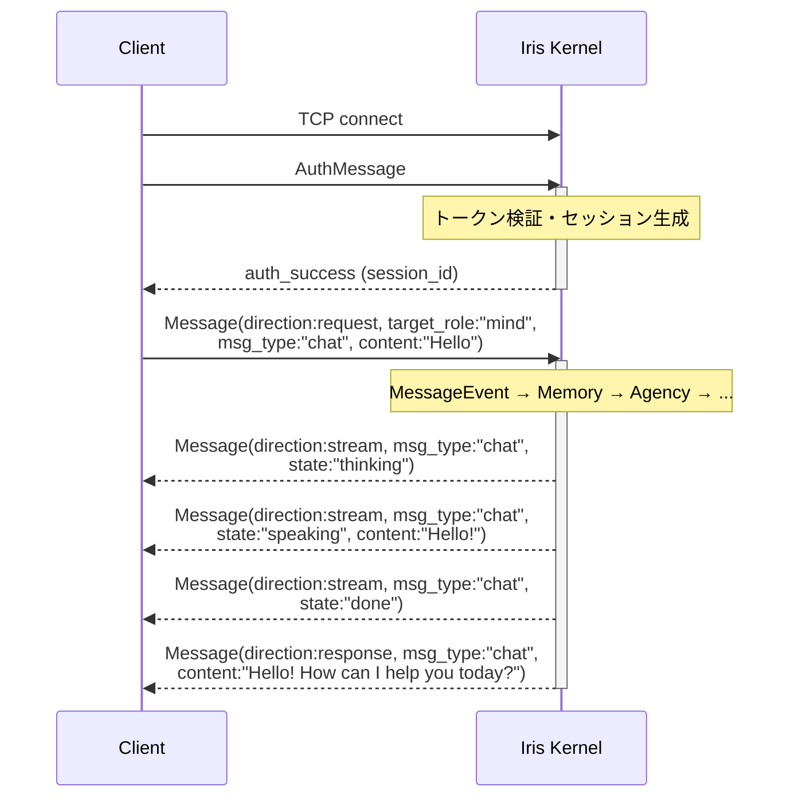
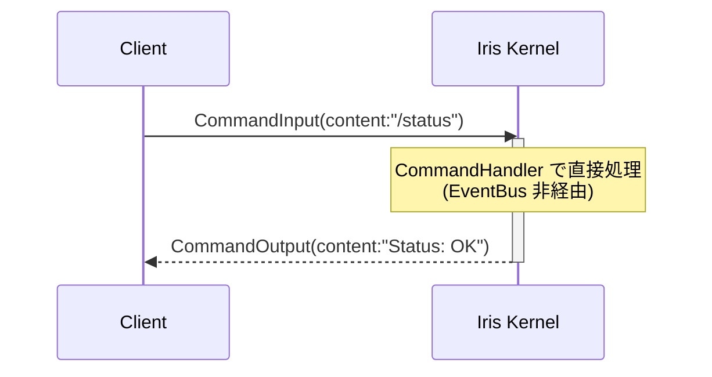
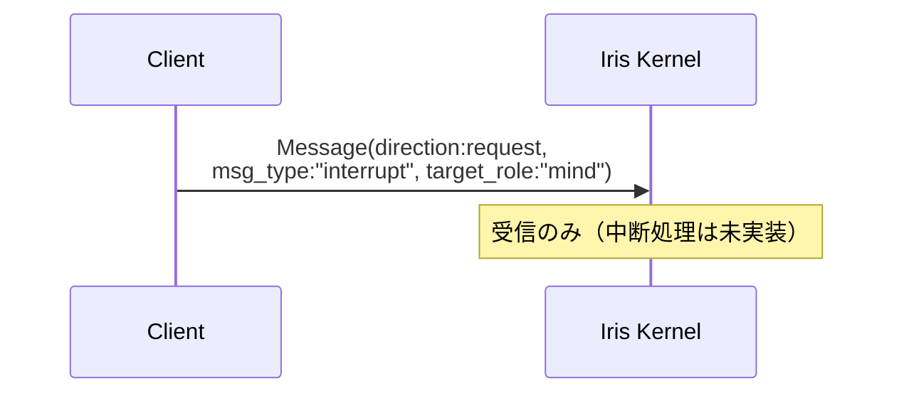
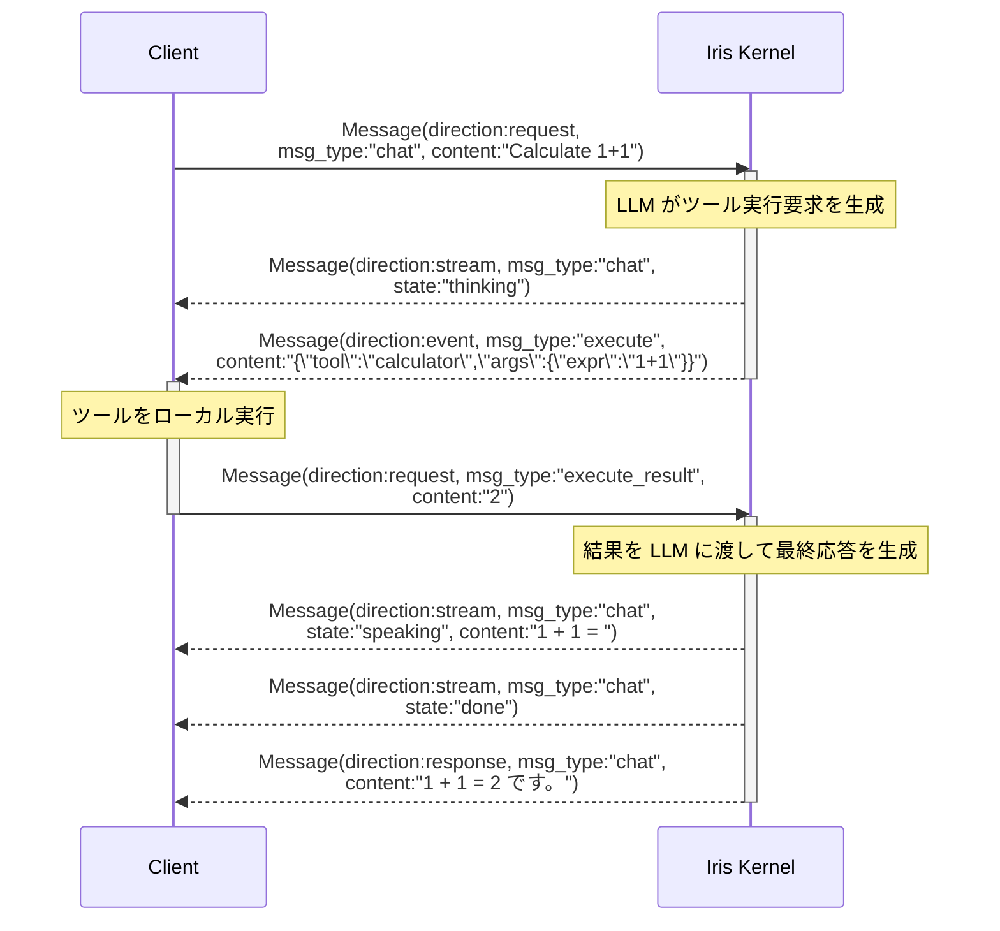

# Iris Mind 通信プロトコル仕様 v2.0

## 1. 概要

Iris Mind は TCP 経由で外部プロセスと通信する。本ドキュメントは**言語非依存**のプロトコル仕様を定義する。

### 設計原則

- **言語非依存**: JSON + UTF-8 エンコーディング
- **セッションベース**: 認証 → セッション確立 → 通信
- **1ポート多重**: 認証・入力・出力すべてを単一TCP接続で多重化
- **Role/Permission 分離**: 権限モデルを `role`（識別子）と `permissions`（権限セット）に分離

## 2. 通信方式

### 2.1 トランスポート

**TCP/IP** (`AF_INET`)

- アドレス: `127.0.0.1:9876`（デフォルト）
- 同一マシン内プロセス間通信専用（デフォルト）
- 設定によりリモート接続可能（`access_token` 必須）

### 2.2 セッション構成

1セッション = 1TCP接続。認証・入力・出力すべてを1本の接続で処理する。

### 2.3 ワイヤー形式（フレーミング）

```
[4バイト: ペイロード長 (big-endian)] [UTF-8 JSON ペイロード]
```

| 部品 | サイズ | エンコーディング |
|------|--------|-----------------|
| ペイロード長 | 4バイト (uint32, big-endian) | バイナリ |
| ペイロード | 可変 (0〜32MB) | UTF-8 JSON |

## 3. プロトコル概要

| 通信方向 | 種別 | 説明 |
|---------|------|------|
| Client → Server | `auth` | 認証リクエスト |
| Server → Client | `auth_success`, `auth_failure`, `error` | 認証レスポンス |
| Client → Server | `Message` (`chat`, `system`, `interrupt`, `execute_result`) | テキスト入力、制御、アクション結果 |
| Client → Server | `command`（*1） | システムコマンド（`CommandInput` fast-path） |
| Client → Server | `ping`（*1） | ハートビート |
| Server → Client | `Message` (`chat`, `execute`, `ack`, `error`) | 応答、アクション要求、確認（`direction:stream`/`direction:response` で配送） |
| Server → Client | `command`（*1） | コマンド応答（`CommandOutput` fast-path） |
| Server → Client | `pong`（*1） | ハートビート応答 |

> *1 `command`/`ping`/`pong` は **Message モデルではなく専用モデル（§5.7-§5.9）** で処理される Fast-Path。`msg_type` 定義（§5.3）の対象外。

## 4. v1.x からの非互換変更

| 変更 | v1.x | v2.0 |
|------|------|------|
| メッセージモデル | `InputMessage`, `OutputMessage`, `InterruptMessage` の3種 | 統一 `Message` モデル |
| 権限 | `SessionRole`（機能別 Enum） | `Permission`（個別権限 Enum）+ `role`（文字列識別子） |
| モード | `ConnectionMode`（INPUT_ONLY/OUTPUT_ONLY/BIDIRECTIONAL） | 削除（Permission で代替） |
| 入力 | `dispatch_text`, `converse_text`, `system` | `chat`, `system` に統合 |
| 出力 | `response`, `proactive`, `stream`, `ack` | すべて `Message` として統一 |
| 中断 | `InterruptMessage`（専用モデル） | `Message(msg_type:"interrupt")` |
| プロアクティブ | `RECEIVE_PROACTIVE` | 削除（`RECEIVE_CHAT` に統合） |
| 認証 | `mode`, `roles` | `role`, `permissions` |

## 5. データ型定義

### 5.1 Permission

| 値 | 説明 |
|----|------|
| `send_chat` | テキスト入力を送信可能 |
| `receive_chat` | 応答を受信可能 |
| `send_command` | `/` コマンドを送信可能 |
| `receive_command` | コマンド結果を受信可能 |
| `receive_log` | ログ・デバッグ情報を受信可能 |
| `interrupt` | 生成中断を要求可能 |
| `execute_action` | アクション実行要求を受信可能 |

### 5.2 Direction

| 値 | 方向 | 説明 |
|----|------|------|
| `request` | Client→Server | クライアントからのリクエスト |
| `response` | Server→Client | サーバーからの単一応答（最終結果） |
| `stream` | Server→Client | ストリーミング中継（`state` と併用） |
| `event` | Server→Client | イベント通知（ブロードキャスト等） |

### 5.3 msg_type 定義

| msg_type | 通信方向 | 説明 |
|----------|---------|------|
| `chat` | 双方向 | テキスト会話メッセージ（`direction:stream` でストリーミング、`direction:response` で最終応答） |
| `system` | Client→Server | システム制御メッセージ |
| `interrupt` | Client→Server | 生成中断要求 |
| `execute` | Server→Client | アクション実行要求（tools使用時） |
| `execute_result` | Client→Server | アクション実行結果 |
| `ack` | Server→Client | 受信確認（`metadata.ack_required` 時） |
| `error` | Server→Client | エラー通知 |

> ※ `command` / `ping` / `pong` は Message の msg_type ではなく専用モデル（§5.7-§5.9）。§3 参照。

### 5.4 Message（統一言語モデル）

```json
{
  "id": "a1b2c3d4e5f6",
  "msg_type": "chat",
  "session_id": "a1b2c3d4e5f6g7h8",
  "direction": "request",
  "source_role": "cli",
  "target_role": "mind",
  "content": "Hello Iris",
  "content_type": "text/plain",
  "state": null,
  "correlation_id": null,
  "metadata": {}
}
```

| フィールド | 型 | 必須 | デフォルト | 説明 |
|-----------|-----|------|-----------|------|
| `id` | string | 任意 | サーバー採番 (12桁hex) | メッセージ識別子（クライアント指定可、ACK連鎖に使用） |
| `msg_type` | string | 必須 | - | メッセージ種別（§5.3参照） |
| `session_id` | string | 認証後必須 | `""` | セッション識別子（認証後の全メッセージで必須） |
| `direction` | string | 必須 | - | メッセージの方向（§5.2参照） |
| `source_role` | string | 任意（サーバー側で上書き） | `""` | 送信元の role。サーバーは信頼された値で上書きする |
| `target_role` | string | 任意 | `"*"` | 送信先の role（`"*"` は全セッション） |
| `content` | string | 必須 | - | メッセージ本文（空文字可） |
| `content_type` | string | 任意 | `"text/plain"` | コンテンツタイプ（将来の拡張用） |
| `state` | string | 任意 | null | ストリーム状態。`direction:stream` 時のみ有効（`thinking`/`speaking`/`done`/`interrupted`） |
| `correlation_id` | string | 任意 | null | 応答連鎖の識別子。元メッセージの `id` を設定 |
| `metadata` | object | 任意 | `{}` | 拡張メタデータ（§5.4.1 既知キー参照） |

#### 5.4.1 既知の metadata キー

| キー | 型 | 説明 |
|------|-----|------|
| `ack_required` | bool | `true` の場合、サーバーは受信確認として `ack` メッセージを返す |

#### 5.4.2 StreamState

`direction:stream` 時の `state` フィールド値。

| 値 | 説明 |
|----|------|
| `thinking` | サーバーが処理中（思考開始） |
| `speaking` | ストリーミング出力中（`content` に差分テキスト） |
| `done` | ストリーミング完了（最終応答は別途 `direction:response` で配送） |
| `interrupted` | ストリーミングが中断された |

> `done` を受信したクライアントは、後続の `direction:response` メッセージを待つ。

### 5.5 AuthMessage（Client → Server）

```json
{
  "msg_type": "auth",
  "access_token": "",
  "role": "cli",
  "permissions": ["send_chat", "receive_chat"],
  "identity": "my-client",
  "description": "My custom client"
}
```

| フィールド | 型 | 必須 | デフォルト | 説明 |
|-----------|-----|------|-----------|------|
| `msg_type` | string | 必須 | `"auth"` | 固定値 |
| `access_token` | string | 条件付き | null | トークン認証が設定されている場合は必須 |
| `role` | string | 任意 | `"external"` | クライアントの識別名（ルーティングに使用） |
| `permissions` | Permission[] | 任意 | `[]` | クライアントに付与する権限リスト（空の場合は全権限拒否状態） |
| `identity` | string | 任意 | `""` | クライアントの識別情報 |
| `description` | string | 任意 | `""` | 接続の説明 |

### 5.6 ControlMessage（Server → Client）

```json
{
  "msg_type": "auth_success",
  "session_id": "a1b2c3d4e5f6g7h8"
}
```

```json
{
  "msg_type": "auth_failure",
  "error_message": "invalid access_token"
}
```

| フィールド | 型 | 必須 | 説明 |
|-----------|-----|------|------|
| `msg_type` | string | 必須 | `auth_success` / `auth_failure` / `error` |
| `session_id` | string | success時 | 割り当てられたセッションID |
| `error_message` | string | failure時 | エラー詳細 |

### 5.7 CommandInput（Client → Server）

```json
{
  "msg_type": "command",
  "session_id": "a1b2c3d4e5f6g7h8",
  "source_role": "cli",
  "content": "/help"
}
```

| フィールド | 型 | 必須 | デフォルト | 説明 |
|-----------|-----|------|-----------|------|
| `msg_type` | string | 必須 | `"command"` | 固定値 |
| `session_id` | string | 必須 | - | 認証後に取得 |
| `source_role` | string | 任意 | `""` | 送信元 role（サーバー側で上書き） |
| `id` | string | 任意 | サーバー採番 (12桁hex) | メッセージ識別子 |
| `content` | string | 必須 | - | `/` で始まるコマンド文字列 |

### 5.8 CommandOutput（Server → Client）

```json
{
  "msg_type": "command",
  "session_id": "a1b2c3d4e5f6g7h8",
  "content": "Available commands: /help, /status, ..."
}
```

| フィールド | 型 | 必須 | デフォルト | 説明 |
|-----------|-----|------|-----------|------|
| `msg_type` | string | 必須 | `"command"` | 固定値（§5.3 の msg_type とは別体系の Fast-Path） |
| `id` | string | 任意 | サーバー採番 (12桁hex) | メッセージ識別子 |
| `correlation_id` | string | 任意 | null | 入力の CommandInput.id に対応 |
| `session_id` | string | 必須 | - | 応答先セッション |
| `state` | string | 任意 | null | コマンド実行状態 |
| `content` | string | 必須 | - | コマンド実行結果 |

### 5.9 Ping / Pong

```json
{"msg_type": "ping"}
{"msg_type": "pong"}
```

## 6. 接続シーケンス

### 6.1 通常フロー



### 6.2 コマンドフロー（Fast-Path）



コマンドは Message ではなく `CommandInput`/`CommandOutput` という専用モデルで処理される。EventBus を経由しない Fast-Path。

### 6.3 中断フロー



`msg_type: "interrupt"` の Message で生成中断を要求する。サーバーは受信確認後、生成中の応答を中断する（現状は受信のみで中断処理は未実装）。

### 6.4 ツール実行フロー



`execute` / `execute_result` は外部ツール実行のための連携プロトコル。サーバーが `direction:event, msg_type:"execute"` でツール実行要求を送信し、クライアントが `direction:request, msg_type:"execute_result"` で結果を返す。

> **注**: 現在のサーバー実装ではツール実行はローカルで完結するため、本フローはクライアント拡張用のプロトコル定義として提供される。

## 7. 権限モデル

### 7.1 Permission チェック

セッション認証時に宣言された `permissions` に基づき、サーバーはメッセージ配送をフィルタリングする。

| msg_type | 通信方向 | 必要な Permission |
|---------|---------|-------------------|
| `chat` | 双方向 | 送信: `send_chat` / 受信: `receive_chat` |
| `system` | Client→Server | `send_chat` |
| `execute` | Server→Client | `execute_action` |
| `execute_result` | Client→Server | `execute_action` |
| `ack` | Server→Client | `receive_chat` |
| `error` | Server→Client | `receive_chat` |
| `interrupt` | Client→Server | `interrupt` |

**配送ルール**:
- ブロードキャスト（`target_role:"*"`）または role 指定ルーティング時は、上記 Permission でフィルタリングする
- `session_id` 指定の直接配送時は Permission チェックをスキップする（サーバーが送信先を限定しているため）
- クライアントからの入力は、認証時に宣言された `permissions` に基づき受付前にチェックする（§5.5）

### 7.2 Role ベースルーティング

`Message.target_role` で配送先を指定:
- `"*"` で全アクティブセッションにブロードキャスト
- 特定の role 名（例: `"cli"`）で該当 role の全セッションに配送
- `session_id` が指定された場合は当該セッションに直接配送（最優先）

`target_role` に `"mind"` 以外を指定した場合、クライアント間でメッセージを直接中継可能（multi-client 運用時）。`source_role` はサーバー側で認証時の role に上書きされるため、送信元の偽装はできない。

**`direction:event` について**: `event` 方向はサーバー→クライアントのイベント通知に使用する（ブロードキャスト、ツール実行要求等）。現在は `execute`（§6.4）で使用。通常の応答は `stream`/`response` を使用し、`event` は受動的通知用。

## 8. 実装例

### 8.1 Python（同期 socket）

```python
import json
import socket
import struct

def send_msg(sock: socket.socket, data: dict) -> None:
    payload = json.dumps(data, ensure_ascii=False).encode("utf-8")
    sock.sendall(struct.pack("!I", len(payload)) + payload)

def recv_msg(sock: socket.socket) -> dict:
    raw_len = sock.recv(4)
    length = struct.unpack("!I", raw_len)[0]
    payload = b""
    while len(payload) < length:
        chunk = sock.recv(length - len(payload))
        if not chunk:
            raise ConnectionError("Connection closed")
        payload += chunk
    return json.loads(payload.decode("utf-8"))

# 接続例
sock = socket.socket(socket.AF_INET, socket.SOCK_STREAM)
sock.connect(("127.0.0.1", 9876))

# 認証
send_msg(sock, {
    "msg_type": "auth",
    "role": "cli",
    "permissions": ["send_chat", "receive_chat"],
})
resp = recv_msg(sock)
assert resp["msg_type"] == "auth_success"
session_id = resp["session_id"]

# メッセージ送信（id は任意、未指定時サーバー採番）
send_msg(sock, {
    "id": "my_msg_001",
    "msg_type": "chat",
    "session_id": session_id,
    "direction": "request",
    "source_role": "cli",
    "target_role": "mind",
    "content": "Hello Iris!",
})

# 応答受信
while True:
    msg = recv_msg(sock)
    if msg.get("direction") == "response" and msg.get("msg_type") == "chat":
        print(f"Iris: {msg['content']}")
        break
    elif msg.get("direction") == "stream" and msg.get("state") == "thinking":
        print("Iris is thinking...")
    elif msg.get("direction") == "stream" and msg.get("state") == "speaking":
        print(f"Iris: {msg.get('content', '')}", end="", flush=True)
    elif msg.get("direction") == "stream" and msg.get("state") == "done":
        print()  # ストリーム完了、最終応答を待つ
```

### 8.2 Python（コマンド送信）

```python
send_msg(sock, {
    "msg_type": "command",
    "session_id": session_id,
    "source_role": "cli",
    "content": "/status",
})
resp = recv_msg(sock)
print(resp["content"])
```

### 8.3 Rust

```rust
use std::io::{Read, Write};
use std::net::TcpStream;
use serde_json::json;

fn send_msg(stream: &mut TcpStream, data: &serde_json::Value) {
    let payload = serde_json::to_string(data).unwrap();
    let len = payload.len() as u32;
    stream.write_all(&len.to_be_bytes()).unwrap();
    stream.write_all(payload.as_bytes()).unwrap();
}

fn recv_msg(stream: &mut TcpStream) -> serde_json::Value {
    let mut len_buf = [0u8; 4];
    stream.read_exact(&mut len_buf).unwrap();
    let len = u32::from_be_bytes(len_buf) as usize;
    let mut buf = vec![0u8; len];
    stream.read_exact(&mut buf).unwrap();
    serde_json::from_slice(&buf).unwrap()
}

fn main() {
    let mut stream = TcpStream::connect("127.0.0.1:9876").unwrap();

    // 認証
    send_msg(&mut stream, &json!({
        "msg_type": "auth",
        "role": "cli",
        "permissions": ["send_chat", "receive_chat"],
    }));
    let resp = recv_msg(&mut stream);
    let session_id = resp["session_id"].as_str().unwrap();

    // メッセージ送信
    send_msg(&mut stream, &json!({
        "msg_type": "chat",
        "session_id": session_id,
        "direction": "request",
        "source_role": "cli",
        "target_role": "mind",
        "content": "Hello Iris!",
    }));

    // 応答受信
    loop {
        let msg = recv_msg(&mut stream);
        if msg["direction"] == "response" && msg["msg_type"] == "chat" {
            println!("Iris: {}", msg["content"].as_str().unwrap_or(""));
            break;
        } else if msg["direction"] == "stream" && msg["state"] == "thinking" {
            // サーバーが思考中
        } else if msg["direction"] == "stream" && msg["state"] == "speaking" {
            print!("{}", msg["content"].as_str().unwrap_or(""));
            std::io::stdout().flush().unwrap();
        } else if msg["direction"] == "stream" && msg["state"] == "done" {
            println!(); // ストリーム完了、最終応答を待つ
        }
    }
}
```

## 9. エラーハンドリング

| 状況 | 動作 |
|------|------|
| 認証失敗 | Server は `auth_failure` を送信後、直ちにTCP接続を切断（クライアントは再接続可能） |
| 認証前のメッセージ受信 | Server は警告ログ出力してメッセージを無視 |
| 不正な JSON | Server は接続を切断 |
| 接続断 | Server はセッション情報を削除 |
| 不明な msg_type | Server は通常の Message として処理するが、Limbic/Memory 層でフィルタされ静かに破棄される |
| 不明な direction | Server は警告ログを出力してメッセージを無視 |
| `direction:event` を Client→Server で受信 | Server は警告ログを出力してメッセージを無視（event は Server→Client 専用） |
| session_id なしの Message | Server は警告ログを出力してメッセージを無視 |
| 権限不足 | Server は `error` メッセージを返す |
| ペイロードサイズ超過 (>32MB) | 未チェック（将来の実装課題） |
