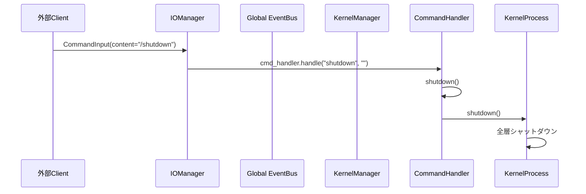

# Iris Kernel 層

> **注記**: 脳科学・神経科学の用語との対応付けは設計指針であり、厳密な解剖学的正確性を保証するものではありません。

**脳科学対応**: 脳幹（Brainstem）

## 責務

- プロセスライフサイクル管理（起動・停止）
- シグナルハンドリング（SIGINT, SIGTERM）
- **プラグインシステム管理**: PluginManager による全層の構築・依存注入・ライフサイクル管理
- **外部コマンド処理**: `/shutdown` など、脳に直接作用する外部刺激の処理
- **TimerTick 生成**: 定期鼓動を Global EventBus に publish（全層の時間ベース処理トリガー）
- **状態診断**: SystemDiagnostics による各層の状態集約

## 構成

```
iris/kernel/
├── __init__.py
├── manager.py         PluginManager（DI + 全Plugin指揮 + 状態集約）
├── process.py         KernelProcess（起動・停止, TimerTick発行）
├── supervisor.py      Supervisor（シグナル管理）
├── config.py          KernelConfig
├── capture_formatter.py   デバッグ出力整形
├── debug_capture.py       DebugCapture（キャプチャ管理）
├── diagnostics.py         SystemDiagnostics（状態診断）
├── logging.py             Logging設定
├── plugin/                # プラグインシステム
│   ├── manifest.py
│   ├── protocol.py
│   ├── lifecycle.py
│   ├── service_container.py
│   ├── kernel_state.py
│   ├── hook_points.py
│   ├── hooks.py
│   └── loader.py
└── commands/
    ├── __init__.py
    └── handler.py     CommandHandler
```
iris/kernel/
├── __init__.py
├── manager.py         KernelManager
├── process.py         KernelProcess
├── supervisor.py      Supervisor
├── factory.py         KernelFactory（DI）
└── commands/
    ├── __init__.py
    └── handler.py     CommandHandler
```

## KernelManager

```python
class KernelManager:
    """全体の状態管理とヘルスモニタリング。
    各層の Manager は自己状態を StateChange イベントで通知する。
    """

    # subscribe: StateChange (全層から)
    #   → 全体状態を集約・保持

    @property
    def global_state(self) -> str
        # 全層の状態を総合した全体状態を返す

    @property
    def layer_states(self) -> dict[str, str]
        # 層ごとの状態マップ

    def is_idle(self) -> bool
        # 全層がアイドルか

    def shutdown_requested(self) -> bool
```

## KernelProcess

```python
class KernelProcess:
    """プロセスの起動と停止を管理する。"""

    def __init__(self, config: Config)
        # PluginManager で全層を構築

    def start(self) -> None
        # 1. PluginManager.discover_and_build_all() で全Pluginを構築
        # 2. PluginManager.start_all() で全Pluginを起動
        # 3. TimerTick スレッド開始

    def shutdown(self) -> None
        # 1. TimerTick 停止
        # 2. PluginManager.stop_all() で全Pluginを停止
        # 3. リソース解放

    @property
    def shutdown_requested(self) -> bool
```

## Supervisor

```python
class Supervisor:
    """シグナル管理と管理コンソール。"""

    def run(self) -> None
    def start(self) -> None
        # KernelProcess 起動 + シグナルハンドラ登録

    def wait(self) -> None
        # 管理コンソール（stdin）ループ

    def shutdown(self) -> None
        # KernelProcess 停止

    # シグナル: SIGINT / SIGTERM → shutdown
    # 管理コンソール: /status, /help, /shutdown
```

## CommandHandler

**脳科学対応**: 外部刺激（脳への直接命令）。通常の入力経路とは別の bypass 経路。

```python
# iris/kernel/commands/handler.py

class CommandHandler:
    """IOManager から直接呼び出されるコマンド処理。
    通常の感覚入力（InputReceived via EventBus）とは別経路。
    """

    def handle(self, name: str, args: str) -> str
        # /status        → 設定・感情状態表示
        # /shutdown      → KernelProcess.shutdown
        # /help          → コマンド一覧
        # /compact       → AgencyManager.compact_context
        # /memory recent → MemoryManager.retrieve("episodic")
        # /memory search → MemoryManager.search("semantic")
        # /memory clear  → MemoryManager.clear()
        # /emotion       → LimbicManager.get_emotion_report()
        # /sessions      → SessionManager.get_sessions_summary()
```



## TimerTick

```python
# KernelProcess 内部
def _timer_loop(self) -> None:
    while self._running:
        self._event_bus.publish(TimerTick(timestamp=now))
        time.sleep(self._config.check_interval_sec)
```

**購読層**: Memory, Agency（将来の自発発話トリガー）

## PluginManager

```python
class PluginManager:
    """全Pluginの指揮・DI・状態集約。
    discover_and_build_all() で全Pluginを発見・構築し、
    start_all() / stop_all() でライフサイクルを管理する。
    """

    def discover_and_build_all(self) -> None
        # 1. 全Pluginを自動発見（discover_sub_plugins）
        # 2. 依存関係をトポロジカルソート
        # 3. 各Pluginの init(manager) をphase順に実行
        # 4. 各Pluginの provides をServiceContainerに登録

    def start_all(self) -> None
        # 全Pluginの start(manager) をphase順に実行

    def stop_all(self) -> None
        # 全Pluginの stop(manager) を逆順に実行
```
