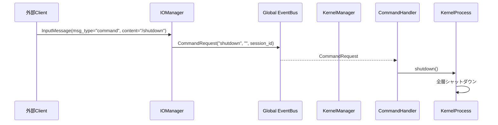

# Iris Kernel 層

> **注記**: 脳科学・神経科学の用語との対応付けは設計指針であり、厳密な解剖学的正確性を保証するものではありません。

**脳科学対応**: 脳幹 + 視床下部

## 責務

- プロセスライフサイクル管理（起動・停止）
- シグナルハンドリング（SIGINT, SIGTERM）
- **全体状態の集約**: 各層の Manager から通知される状態を一元管理
- **外部コマンド処理**: `/shutdown` など、脳に直接作用する外部刺激の処理
- **TimerTick 生成**: 定期鼓動を Global EventBus に publish（全層の時間ベース処理トリガー）
- **DI コンテナ**: 全層のインスタンス生成（KernelFactory）

## 構成

```
iris/kernel/
├── __init__.py
├── manager.py         KernelManager
├── process.py         KernelProcess
├── supervisor.py      Supervisor
├── factory.py         KernelFactory（DI）
└── commands/
    ├── __init__.py
    └── handler.py     CommandHandler
```

## KernelManager

```python
class KernelManager:
    """全体の状態管理とヘルスモニタリング。
    各層の Manager は自己状態を StateChange イベントで通知する。
    """

    # subscribe: StateChange (全層から)
    #   → 全体状態を集約・保持

    @property
    def global_state(self) -> str
        # 全層の状態を総合した全体状態を返す

    @property
    def layer_states(self) -> dict[str, str]
        # 層ごとの状態マップ

    def is_idle(self) -> bool
        # 全層がアイドルか

    def shutdown_requested(self) -> bool
```

## KernelProcess

```python
class KernelProcess:
    """プロセスの起動と停止を管理する。"""

    def __init__(self, config: Config)
        # KernelFactory で全層を構築

    def start(self) -> None
        # 1. Factory.build(config) → KernelContext
        # 2. KernelManager を起動
        # 3. IOManager を起動（TCPリスナー開始）
        # 4. 全層の Manager を EventBus に接続
        # 5. TimerTick スレッド開始

    def shutdown(self) -> None
        # 1. TimerTick 停止
        # 2. IOManager 停止（TCPリスナー停止）
        # 3. 各層にシャットダウン通知
        # 4. リソース解放

    @property
    def shutdown_requested(self) -> bool
```

## Supervisor

```python
class Supervisor:
    """シグナル管理と管理コンソール。"""

    def run(self) -> None
    def start(self) -> None
        # KernelProcess 起動 + シグナルハンドラ登録

    def wait(self) -> None
        # 管理コンソール（stdin）ループ

    def shutdown(self) -> None
        # KernelProcess 停止

    # シグナル: SIGINT / SIGTERM → shutdown
    # 管理コンソール: /status, /help, /shutdown
```

## CommandHandler

**脳科学対応**: 外部刺激（脳への直接命令）。通常の入力経路とは別の bypass 経路。

```python
# iris/kernel/commands/handler.py

class CommandHandler:
    """Global EventBus から CommandRequest を受け取り、対応する処理を実行する。
    通常の感覚入力（InputReceived）とは別経路。
    """

    def handle(self, command: str, args: str, session_id: str) -> str
        # /status   → KernelManager.state
        # /shutdown → KernelProcess.shutdown
        # /help     → コマンド一覧
        # /compact  → MemoryManager に委譲 (EventBus)

    # subscribe: CommandRequest (global)
```



## TimerTick

```python
# KernelProcess 内部
def _timer_loop(self) -> None:
    while self._running:
        self._event_bus.publish(TimerTick(timestamp=now))
        time.sleep(self._config.check_interval_sec)
```

**購読層**: Memory（海馬の定期整理）, Agency（将来の自発発話トリガー）

## KernelFactory

```python
class KernelFactory:
    """全層のインスタンス生成と依存注入。
    DI コンテナとして機能し、各層の Manager を EventBus に接続する。
    """

    @staticmethod
    def build(config: Config) -> KernelContext
        # 1. EventBus 生成
        # 2. MemoryManager + plugins 生成
        # 3. PlanningManager + ExecutionManager 生成
        # 4. AgencyManager 生成（global↔internal 接続）
        # 5. IOManager + transport/session/auth 生成
        # 6. KernelManager 生成
        # 7. CommandHandler 生成
        # 8. EventBus subscribe 設定
        # 9. KernelContext として返す

@dataclass
class KernelContext:
    event_bus: EventBus
    kernel: KernelManager
    io: IOManager
    memory: MemoryManager
    agency: AgencyManager
    cmd_handler: CommandHandler
    shutdown_requested: bool = False
```


