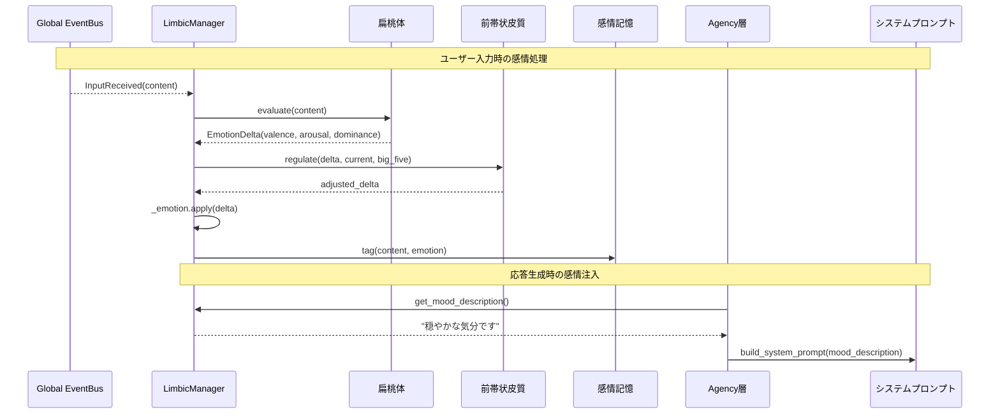
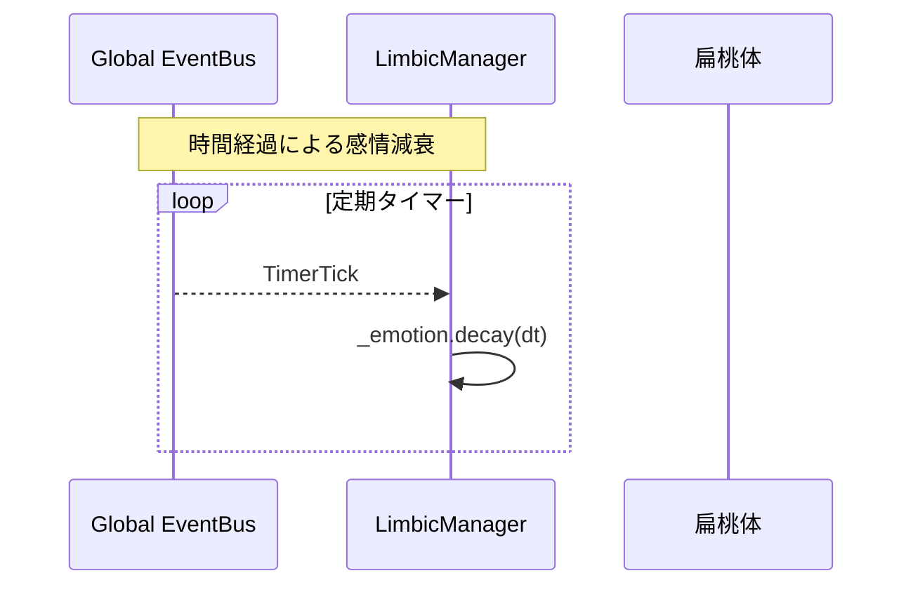

# Iris Limbic 層（大脳辺縁系）

> **注記**: 脳科学・神経科学の用語との対応付けは設計指針であり、厳密な解剖学的正確性を保証するものではありません。

**脳科学対応**: 大脳辺縁系 — 扁桃体・前帯状皮質・島皮質

## 責務

- 入力の感情評価（この入力は喜ばしいか？脅威か？）
- 感情状態の動的維持（PAD 3次元モデルによる表現）
- 感情の自然減衰（時間経過による感情の薄れ）
- 感情制御・葛藤調整（感情をそのまま表出するか抑制するか）
- 記憶への感情タグ付け（感情を伴った記憶の強調・検索）
- 感情状態のテキスト表現生成（システムプロンプトへの注入用）

## 脳部位マッピング

| 部位 | ファイル | 機能 |
|------|----------|------|
| **扁桃体（Amygdala）** | `amygdala.py` | 入力テキストの感情価を評価。キーワード+ONNX MiniLM埋め込みのハイブリッド。conflict（葛藤度）も出力。stateful適応で繰り返し刺激に慣れる。 |
| **前帯状皮質（ACC）** | `acc.py` | 感情制御。扁桃体からの感情シグナルと行動計画（PFC由来）の間の葛藤を検出し、抑制信号を調整。メタ認知的再評価（efficacy履歴）+ 慣れの性格変調あり。 |
| **島皮質（Insula）** | `manager.py` に統合 | 内部状態の認識。現在の感情状態を言語化し、「今どんな気分か」の説明文を生成。自己認識的な感情表現。不確実性に応じて粒度可変。 |
| **扁桃体-海馬相互作用** | `emotional_memory.py` | EpisodicStore のエントリに感情タグ（valence, arousal, dominance）を付与。感情強度の高い記憶を検索・強調。気分一致効果・想起誘発効果あり。 |

## 感情状態モデル

### PAD (Pleasure-Arousal-Dominance) 3次元

| 次元 | 範囲 | 説明 |
|------|------|------|
| **Valence (Pleasure)** | -1.0 ~ 1.0 | 快-不快。ポジティブ/ネガティブの方向。 |
| **Arousal** | 0.0 ~ 1.0 | 覚醒度。興奮/鎮静の強度。 |
| **Dominance** | 0.0 ~ 1.0 | 支配性。制御感/無力感。 |

```python
@dataclass
class EmotionState:
    valence: float = 0.0       # -1.0 (不快) 〜 1.0 (快)
    arousal: float = 0.0       # 0.0 (鎮静) 〜 1.0 (興奮)
    dominance: float = 0.5     # 0.0 (無力) 〜 1.0 (支配)
    valence_uncertainty: float = 0.0  # 量子認知拡張: 各軸の不確実性 0.0〜1.0
    arousal_uncertainty: float = 0.0
    dominance_uncertainty: float = 0.0
    updated_at: float          # 最終更新時刻（field(default_factory=time.time)）

    overall_uncertainty: float  # computed: 3軸平均の不確実性

    def decay(self, dt: float | None = None) -> None  # 指数減衰（不確実性も減衰）
    def apply(self, delta: EmotionDelta, intensity: float = 1.0) -> None  # conflict→uncertainty反映
    def to_dict(self) -> dict[str, float]
```

### 基本感情へのマッピング

PAD 座標は以下の基本感情に大別できる:

| 感情 | Valence | Arousal | Dominance |
|------|---------|---------|-----------|
| 喜び | +0.8 | +0.6 | +0.5 |
| 悲しみ | -0.7 | -0.4 | -0.3 |
| 怒り | -0.5 | +0.8 | +0.7 |
| 恐れ | -0.6 | +0.7 | -0.6 |
| 驚き | 0.0 | +0.8 | -0.2 |
| 信頼 | +0.7 | -0.1 | +0.4 |
| 期待 | +0.4 | +0.6 | +0.2 |
| 平静 | +0.3 | -0.6 | +0.1 |

### 基本感情辞書 (BASIC_EMOTIONS)

`EmotionDelta` のプリセットとして `iris/limbic/models.py` に定義:

| 感情 | Valence | Arousal | Dominance |
|------|---------|---------|-----------|
| joy | +0.8 | +0.6 | +0.5 |
| sadness | -0.7 | -0.4 | -0.3 |
| anger | -0.5 | +0.8 | +0.7 |
| fear | -0.6 | +0.7 | -0.6 |
| surprise | 0.0 | +0.8 | -0.2 |
| trust | +0.7 | -0.1 | +0.4 |
| anticipation | +0.4 | +0.6 | +0.2 |
| calmness | +0.3 | -0.6 | +0.1 |

### DriveState（動機づけモデル）

PSI理論に基づく欲求（動機）モデル。時間経過で自然蓄積し、行動で解消される。

```python
@dataclass
class DriveState:
    curiosity: float      # 情報探索欲求（検索等で低下）
    social_need: float    # 対話欲求（発話で低下）
    maintenance: float    # 記憶整理欲求（Reflexionで低下）
    updated_at: float

    def accumulate(self, dt: float | None = None) -> None   # 時間蓄積
    def satisfy(self, need_type: str, amount: float) -> None # 行動充足
    def get_dominant_needs(self) -> list[tuple[str, float]]  # 欲求順位
```

`LimbicManager` は `DriveState` を保持し、`apply_limbic_modulation()` 経由で
`InhibitionController` にムード変調を適用する。`PlanningManager` の自発発話スコアリングにも利用される。

### 減衰モデル (Decay)

感情は時間経過とともに中立状態へ自然減衰する。

```
EmotionState(t) = EmotionState(0) · exp(-λ · Δt)
```

- λ (decay factor): 次元ごとに異なる。Arousal は早く減衰、Valence は比較的持続。
- モード別減速率:
  - 通常: λ_valence=0.05, λ_arousal=0.1, λ_dominance=0.03 (per minute)
  - 睡眠中: λ を 1/10 に低減（感情の持続）

## コンポーネント詳細設計

### LimbicManager

```python
class LimbicManager:
    """大脳辺縁系全体の統括。
    EventBus から InputReceived を購読し、感情評価・制御・タグ付けを
    オーケストレーションする。
    """

    # === 購読イベント ===
    # subscribe: InputReceived  → amygdala.evaluate() → 感情更新
    # subscribe: TimerTick      → decay()

    def __init__(self, amygdala: Amygdala, acc: AnteriorCingulateCortex,
                 emotional_memory: EmotionalMemory, event_bus: EventBus):
        ...

    def current_emotion(self) -> EmotionState
        """現在の感情状態を返す（減衰適用済み）。"""

    def build_mood_description(self) -> str
        """島皮質相当: 現在の感情状態から自然言語での気分説明を生成。
        例: 「穏やかな気分です」「少しイライラしています」"""

    def tag_recent_memory(self, conversation: list[dict]) -> None
        """直近の会話エピソードに感情タグを付与。"""

    def on_input_received(self, event: InputReceived) -> None
        """入力受信時の感情評価。"""
        emotion = self.amygdala.evaluate(event.content)
        self._emotion = self.acc.regulate(emotion, self._emotion, self._big_five)
```

### EmotionDelta

```python
@dataclass
class EmotionDelta:
    """扁桃体が出力する感情変化量。"""
    valence: float = 0.0
    arousal: float = 0.0
    dominance: float = 0.0
    conflict: float = 0.0  # 葛藤度 0.0〜1.0（量子認知: 重ね合わせの指標）

    def scale(self, factor: float) -> EmotionDelta
```

### Amygdala

```python
class Amygdala:
    """扁桃体: 入力テキストの感情評価。
    キーワード + ONNX MiniLM埋め込みのハイブリッド評価。
    状態維持: 累積キーワード数に応じた慣れ（stateful適応）。
    """

    def assess(self, text: str) -> EmotionDelta
        """テキストを分析し、感情変化量+葛藤度を返す。

        実装戦略:
        Phase 1: キーワードベース（高速、軽量）
        Phase 2: ONNX MiniLM埋め込み（セマンティック、低速）
        両者を信号エネルギー比でハイブリッド統合。
        """
        # キーワード評価（常時実行）
        keyword_delta = self._keyword_assess(text)

        # 埋め込み評価（初回のみ遅延初期化）
        embedding_delta = self._embedding_scorer.score(text)

        # 信号エネルギー比でブレンド
        kw_w = kw_energy / (kw_energy + emb_energy + 0.01)
        emb_w = 1.0 - kw_w
        return EmotionDelta(valence=kw*0.8 + emb*0.2, ...)

    def _keyword_assess(self, text: str) -> EmotionDelta
        """キーワード辞書による感情価推定 + 扁桃体stateful適応。"""
        # ポジティブ語彙: ありがとう、嬉しい、楽しい、素晴らしい ...
        # ネガティブ語彙: 残念、つまらない、ひどい、悲しい ...
        # 葛藤度(conflict) = 2*min(pos, neg)/max(total, 1)
        # stateful適応: cumulative_keywords > 10 から最大60%減衰

    def classify_emotion(self, text: str) -> str | None
        """assess() → BASIC_EMOTIONSの最近傍（コサイン×ユークリッドハイブリッド距離）。"""

    def contagion(self, text: str) -> EmotionDelta
        """感情伝染: ユーザの感情を15%ミラーリング（ACC bypass推奨）。"""
```

### AnteriorCingulateCortex

```python
class AnteriorCingulateCortex:
    """前帯状皮質: 感情制御・葛藤調整。
    扁桃体からの感情シグナルと現在の状況の間に葛藤がある場合、
    抑制信号を調整する。Big Five の Neuroticism が高いほど
    感情反応が強調される。

    メタ認知的再評価: 過去の調整効率履歴から強いdeltaを追加抑制。
    慣れ: 刺激の繰り返しで制御強度が低下（habituation_rate）。
    慣れ率は Neuroticism で変調（高N→慣れが遅い）。
    """

    def modulate(self, delta: EmotionDelta, current: EmotionState,
                 big_five: dict[str, float] | None = None) -> EmotionDelta
        """感情変化量を調整する。

        制御則:
        - Neuroticism 高 → ネガティブな delta を増幅
        - Agreeableness 高 → ポジティブな delta を増幅
        - 現在の arousal が high → delta を抑制（過剰反応防止）
        - 現在の valence が極端 → delta を減衰
        - efficacy履歴が低い→強いdeltaを余分に抑制（メタ認知的再評価）
        - encounter_count > 10→habituation rateで制御緩和
        """
```

### EmotionalMemory

```python
class EmotionalMemory:
    """扁桃体-海馬相互作用: 記憶への感情タグ付け。
    EpisodicStore のエントリに感情タグを付与し、
    感情強度に基づく記憶検索・強調を可能にする。

    気分一致効果: 現在のvalence符号と記憶のvalenceが一致→スコア1.2倍。
    """

    def encode(self, content: str, emotion: EmotionState) -> None
        """感情タグを付けてエピソード+意味記憶に永続化。
        強度 = |valence| * arousal。0.15超のみ保存。"""

    def retrieve_by_affect(self, target: EmotionState, max_results: int = 5) -> list[dict]
        """感情類似度で記憶を検索。
        距離: コサイン×ユークリッドハイブリッド距離。
        気分一致バイアス: 符号一致→スコア1.2倍。
        想起誘発効果: 検索結果の平均valenceが現在の感情にv*0.05波及。
        """

    def get_recent_tags(self, n: int = 5) -> list[EmotionTag]
        """直近の感情タグを強度降順で返す。"""
```

---

## 最近の機能拡張

| 拡張 | 追加バージョン | ファイル | 概要 |
|------|-------------|---------|------|
| コサイン類似度 | 2026-05 | binder.py, evaluator.py | PAD距離にコサイン方向一致度を乗算 |
| 量子認知(不確実性) | 2026-05 | models.py, mood.py, manager.py | 不確実性フィールド+干渉項+文脈依存崩壊 |
| 感情慣性+性格変調 | 2026-05 | manager.py | inertiaのNeuroticism/Conscientiousness変調 |
| ACC慣れ率変調 | 2026-05 | regulator.py | habituation_rateのNeuroticism変調 |
| 扁桃体stateful適応 | 2026-05 | evaluator.py | 累積キーワード慣れ |
| 応答スタイル粒度 | 2026-05 | mood.py | 低不確実性→自己開示、高→中和 |
| ONNX埋め込み扁桃体 | 2026-05 | evaluator.py | キーワード+埋め込みハイブリッド |
| 感情伝染 | 2026-05 | evaluator.py, manager.py | ユーザ感情15%ミラーリング |
| 想起誘発感情 | 2026-05 | manager.py | 記憶検索のvalence波及効果 |
| 感情ラベリング | 2026-05 | manager.py | 感情語明示→反応抑制(0.85x) |
| 感情→PEM更新 | 2026-05 | manager.py | |valence|>0.75で性格更新 |
| 欲求-感情-性格連携 | 2026-05 | models.py, manager.py | Drive蓄積×BigFive→感情影響 |

## イベントフロー





## 既存層との統合

### LimbicManager → inhibition（InhibitionController）

`InhibitionController.apply_limbic_modulation()` が感情状態から抑制変調を計算する:

```python
# agency/inhibition/controller.py
class InhibitionController:
    def apply_limbic_modulation(self, emotion: EmotionState) -> None
        # valence < -0.3 → negative_mood_score 増加（抑制）
        # arousal > 0.6  → negative_mood_score 減少（活性）
        # dominance < 0.3 → negative_mood_score 増加（抑制）
        # → 結果を _state.negative_mood_score に反映
```

### LimbicManager → Personality（システムプロンプト）

```python
# システムプロンプトに動的に注入される感情説明
# system_prompt.md に「## 現在の気分」セクションを追加（予定）
```

### EmotionalMemory → EpisodicStore

EpisodicStore のエントリ形式に `emotion` フィールドを追加:

```json
{
  "summary": "ユーザーが新しい機能を提案した",
  "emotion": {"valence": 0.6, "arousal": 0.5, "dominance": 0.3},
  "timestamp": "2026-05-18T10:00:00"
}
```

### LimbicManager → ProactiveScoring

ProactiveScoring の mood 因子を LimbicManager の感情状態から算出:

```python
# agency/planning/decisions/scoring.py 内での利用イメージ
def _compute_mood_score(self, limbic: LimbicManager | None) -> float:
    if not limbic:
        return 1.0
    e = limbic.current_emotion()
    # valence 高 + arousal 高 → 自発的になりやすい
    return max(0.0, (e.valence + 1.0) / 2.0 * e.arousal)
```

## Big Five 性格特性モデル

`iris/limbic/big_five.py` で管理（大脳辺縁系が性格特性を管理）。

```python
@dataclass
class BigFiveProfile:
    openness: float          # 0-100 開放性
    conscientiousness: float # 0-100 誠実性
    extraversion: float      # 0-100 外向性
    agreeableness: float     # 0-100 協調性
    neuroticism: float       # 0-100 神経症的傾向

    evolution_history: list[dict]  # 変更履歴
```

### Personality Evolution (PEM)

```
p_new = λ · p_old + (1-λ) · p_turn
```

- `p_old`: 現在のスコア
- `p_turn`: Reflexion が推定した会話内発現性格
- `λ`: 更新率（0.95 程度、緩やかに変化）

閾値超の変化が発生した場合、「性格変化イベント」として
EpisodicStore に記録し、システムプロンプトに反映する。

## 永続化

| ファイル | 内容 |
|----------|------|
| `.iris/data/emotion_state.json` | 現在の感情状態スナップショット（任意） |
| `.iris/data/big_five.json` | Big Five スコアと進化履歴 |
