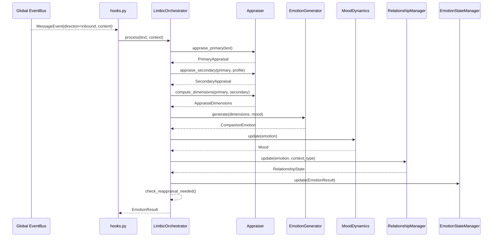

# Iris Limbic 層

> **注記**: 脳科学・神経科学の用語との対応付けは設計指針であり、厳密な解剖学的正確性を保証するものではありません。

**脳科学対応**: 大脳辺縁系（扁桃体・帯状回・海馬傍回）

## 責務

- Appraisal（認知的評価）: Lazarus 2段階理論に基づくイベントの意味づけ
- 感情生成: Appraisal次元 → Plutchik 8基本感情への変換
- Mood dynamics: 会話の累積影響による slow-moving baseline、時間減衰
- 関係性管理: Bowlby attachment theory に基づく3段階関係性構築
- Reappraisal: 強いネガティブ感情時の認知的再評価提案

## Manager 定義

```python
class LimbicOrchestrator:
    """Appraisal → Emotion → Relationship パイプライン統合。
    hooks.py が MessageEvent (direction=inbound) を購読し、process() を呼び出す。
    """

    def process(
        self,
        text: str,
        context: dict[str, Any] | None = None,
        user_profile: dict[str, Any] | None = None,
    ) -> EmotionResult:
        # 1. Appraiser.appraise_primary(text, ctx)
        # 2. Appraiser.appraise_secondary(primary, profile)
        # 3. Appraiser.compute_dimensions(primary, secondary)
        # 4. EmotionGenerator.generate(dimensions, mood)
        # 5. MoodDynamics.update(emotion)
        # 6. RelationshipManager.update(emotion, context_type, profile)
        # 7. EmotionStateManager.update(result)
```

## 処理フロー



## コンポーネント詳細

### appraiser.py — 2段階Appraisal

```python
class Appraiser:
    """Lazarus 2段階評価 (Primary + Secondary) + CAPE 6次元"""

    def appraise_primary(self, text: str, context: dict | None = None) -> PrimaryAppraisal
    def appraise_secondary(self, primary: PrimaryAppraisal, user_profile: dict | None = None) -> SecondaryAppraisal
    def compute_dimensions(self, primary: PrimaryAppraisal, secondary: SecondaryAppraisal) -> AppraisalDimensions
    def detect_word_emotions(self, text: str) -> dict[str, float]
    def detect_context_type(self, text: str) -> str | None
```

**PrimaryAppraisal** — イベントの個人的意味づけ:

| 次元 | 範囲 | 意味 |
|------|------|------|
| novelty | 0.0–1.0 | 新規性（新話題=0.8, 話題変更=0.6, 継続=0.3） |
| pleasantness | -1.0–1.0 | 快不快（キーワード検出でスコア） |
| goal_relevance | 0.0–1.0 | 目標関連性（文脈パターンから判定） |
| agency | 0.0–1.0 | 自己主体性 |
| coping_potential | 0.0–1.0 | 対処可能性（trust × familiarity から算出） |

**SecondaryAppraisal** — 自己の対処能力評価:

| 次元 | 範囲 | 意味 |
|------|------|------|
| accountability | 0.0–1.0 | 責任帰属（trust + familiarity） |
| control | 0.0–1.0 | 統制可能性（coping_potential + trust） |
| controllability | 0.0–1.0 | 可制御性（coping_potential + familiarity） |
| social_norms | 0.0–1.0 | 社会的規範一致度 |

**CAPE 6 次元**（`AppraisalDimensions`）:

| 次元 | 算出元 |
|------|---------|
| unpleasantness | max(0, -primary.pleasantness) |
| control | secondary.control |
| responsibility | secondary.accountability |
| certainty | 1.0 - primary.novelty |
| effort | 1.0 - primary.coping_potential |
| attention | primary.goal_relevance |

**感情キーワード辞書**: 日本語 8 感情（joy/sadness/anticipation/surprise/anger/fear/disgust/trust）のキーワードリスト。`detect_word_emotions()` が正規表現マッチでスコアリング。

**文脈パターン**: self_disclosure / support_seeking / positive_feedback / negative_feedback の4種。`detect_context_type()` が正規表現で最マッチを返す。

### generator.py — Emotion 生成

```python
class EmotionGenerator:
    """AppraisalDimensions → Plutchik 8基本感情への変換"""

    def generate(self, appraisal: AppraisalDimensions, mood: Mood | None = None) -> CompanionEmotion
```

- 6次元 × 8感情の重み行列で各感情スコアを算出
- 最高スコアを primary、次点を secondary とする
- VAD座標は Plutchik 既定値に mood を 30% 混入

### mood.py — Mood Dynamics

```python
class MoodDynamics:
    """slow-moving baseline: 会話による感情の累積影響と時間減衰"""
```

- 半減期 600秒（10分）の指数減衰
- 新しい感情が発生するたびに `update(emotion)` でバイアス更新
- 時間経過でベースライン (VAD=全て0) に復帰

### relationship.py — 関係性管理

```python
class RelationshipManager:
    """Bowlby attachment theory ベースの関係性管理"""
```

**3段階関係性**:

| 段階 | trust 閾値 | 特徴 |
|------|-----------|------|
| ACQUAINTANCE | 0.1–0.3 | 初期接触、探索的 |
| FAMILIAR | 0.3–0.7 | 信頼形成、自己開示の開始 |
| BONDED | 0.7–1.0 | 強い愛着、安定的関係 |

**感情 → 関係性影響マップ**:

| 感情 | trust 影響 | familiarity 影響 |
|------|-----------|-----------------|
| JOY | +0.02 | +0.03 |
| TRUST | +0.04 | +0.02 |
| ANGER | -0.03 | -0.01 |
| DISGUST | -0.04 | -0.02 |

**Bowlby Attachment Styles**: SECURE / ANXIOUS / AVOIDANT / DISORGANIZED（ユーザープロフィールから設定可能）

### state.py — 状態管理

```python
class EmotionStateManager:
    """Limbic system の統合状態管理"""
```

- 最新 `EmotionResult` の保持
- 履歴（最大50件）のリングバッファ
- `get_emotion_for_prompt()` で LLM プロンプト用データを提供

### orchestrator.py — パイプライン統合

```python
class LimbicOrchestrator:
    """全コンポーネントの統合"""
```

Reappraisal 判定条件:
- anger/fear/disgust かつ intensity > 0.6
- または unpleasantness > 0.7 かつ control < 0.3

### hooks.py — EventBus 統合

- `MessageEvent`（`direction=inbound`）を購読
- 例外発生時は `logger.exception` で捕捉、EventBus 全体に影響しない

## Plugin 定義

- **カテゴリ**: `LAYER`
- **フェーズ**: `LAYER`（phase=20、memory と agency の間）
- **依存関係**: `{EventBus}`
- **提供**: `LimbicOrchestrator`
- **state**: `get_state()` → 最新の emotion / mood / relationship を返す

## 関連モデル

```python
# iris/limbic/models.py

@dataclass
class PrimaryAppraisal:
    novelty: float = 0.0
    pleasantness: float = 0.0
    goal_relevance: float = 0.0
    agency: float = 0.0
    coping_potential: float = 0.0

@dataclass
class SecondaryAppraisal:
    accountability: float = 0.0
    control: float = 0.0
    controllability: float = 0.0
    social_norms: float = 0.0

@dataclass
class AppraisalDimensions:
    unpleasantness: float = 0.0
    control: float = 0.0
    responsibility: float = 0.0
    certainty: float = 0.0
    effort: float = 0.0
    attention: float = 0.0

class PlutchikEmotion(Enum):
    JOY / SADNESS / ANTICIPATION / SURPRISE / ANGER / FEAR / DISGUST / TRUST

class RelationshipLevel(IntEnum):
    ACQUAINTANCE = 0 / FAMILIAR = 1 / BONDED = 2

class AttachmentStyle(Enum):
    SECURE / ANXIOUS / AVOIDANT / DISORGANIZED

@dataclass
class CompanionEmotion:
    primary: PlutchikEmotion
    intensity: float
    valence: float
    arousal: float
    dominance: float
    secondary: PlutchikEmotion | None
    secondary_intensity: float

@dataclass
class Mood:
    valence: float = 0.0
    arousal: float = 0.0
    dominance: float = 0.0
    last_updated: float = 0.0

@dataclass
class RelationshipState:
    level: RelationshipLevel
    trust: float
    familiarity: float
    attachment_style: AttachmentStyle
    interaction_count: int
    disclosure_depth: float

@dataclass
class EmotionResult:
    appraisal: AppraisalDimensions
    emotion: CompanionEmotion
    mood: Mood
    relationship: RelationshipState
    reappraisal_needed: bool
    reappraisal_suggestion: str
```

## VAD 座標

各 Plutchik 基本感情の Valence/Arousal/Dominance マッピング:

| 感情 | V | A | D |
|------|---|---|---|
| JOY | 0.8 | 0.6 | 0.6 |
| SADNESS | -0.6 | -0.4 | -0.3 |
| ANTICIPATION | 0.4 | 0.7 | 0.3 |
| SURPRISE | 0.2 | 0.9 | -0.2 |
| ANGER | -0.7 | 0.8 | 0.5 |
| FEAR | -0.7 | 0.8 | -0.6 |
| DISGUST | -0.6 | 0.3 | 0.1 |
| TRUST | 0.5 | 0.2 | 0.3 |

既存の `memory.manager.search_emotional()`（`_pad_distance`）と互換性あり。

## 設計指針

### 一貫性優先の原則

AIコンパニオン（Neuro-sama等）の研究において、ユーザーが最も重視するのは「人間らしさ」ではなく「一貫性 (consistency)」である。
感情シミュレーションはその一貫性を支える「色付け」であり、目的ではない。真の目的は Bowlby attachment theory に基づく関係性 (relationship) の構築である。

- Neuro-sama研究 (2509.10427): 「authenticity is reconstructed around systemic reliability」
- ユーザー調査: 72%が技術プロジェクトと認識しつつ、70%が virtual friend として関係性を構築
- 感情は関係性への「手段」、attachment形成が「目的」

本実装ではこの設計原則に基づき、感情生成よりも関係性管理を主軸に置いている。

## 研究参照

### 採用した理論と論文

| 理論 | 出典 | 実装箇所 |
|------|------|---------|
| Lazarus 2段階Appraisal | Lazarus, R.S. (1991). *Emotion and Adaptation*. Oxford University Press. | `appraiser.py` |
| Plutchik 8基本感情 | Plutchik, R. (2001). *The Nature of Emotions*. American Scientist. | `models.py` (PlutchikEmotion) |
| CAPE 6次元 Appraisal | CAT-BEAR framework, CAPE/NAAACL 2025 | `models.py` (AppraisalDimensions) |
| VAD (Valence-Arousal-Dominance) | Mehrabian, A. (1995). *Framework for a comprehensive description of emotions.* | `models.py` (PLUTCHIK_VAD) |
| Bowlby Attachment Theory | Bowlby, J. (1969). *Attachment and Loss*. | `relationship.py` |
| 3段階関係性モデル | Skjuve, M. et al. (2021). *Social Penetration Theory in HAI.* | `relationship.py` |
| HAIA 3段階モデル | Frontiers in Psychology (2026). *Human-AI Interaction Attachment.* | `relationship.py` |
| 時間減衰 Mood | Cognitiv Architecture, Blaniel 8-stage pipeline | `mood.py` |
| Reappraisal | Third-Person Appraisal Agent, EMNLP 2025 | `orchestrator.py` |
| WRIME日本語感情データセット | Kajiwara, T. et al. (2021). *WRIME: Emotional Intensity Estimation for Japanese.* NAACL. | `appraiser.py` (キーワード辞書) |

### 関連研究

- **AI-RP Framework** (arXiv 2601): 関係性は layered psychological processes で形成。communication → attachment → companionship
- **EHARS** (2025): attachment anxiety/avoidance が human-AI relationships を形づくる
- **Neural Steering** (2512): relationship-seeking AI は hedonic appeal 低下するが attachment markers 増加
- **Self-disclosure研究** (2505): 「gradual self-disclosure significantly enhances perceived social intimacy」
- **EmoLLM** (2025): Appraisal Reasoning Graph — Contextual Facts → User Needs → Appraisal → Emotion → Response Strategy
- **CoRE benchmark** (2025): LLMs が人間と整合した appraisal 構造を持つことを確認
- **Blaniel**: 8段階パイプライン — Event → Appraisal (OCC) → Emotion (Plutchik) → Decay → Behavior → Response → LLM → Memory
- **Designed Relationality** (Springer 2026): 5段階 (Novelty → Disclosure → Feedback → Rhythm → Attachment)

## TODO / 将来の精度向上

現在の実装はルールベースを採用している。以下の置き換えで精度向上が可能。

| 現在 | 将来 | 優先度 | 備考 |
|------|------|--------|------|
| キーワードマッチ (日本語辞書) | MiniLM/BERT 感情分類モデル | 高 | WRIMEファインチューン済み: `koshin2001/Japanese-to-emotions` (LINE DistilBERT, 68.7M params), `MuneK/bert-large-japanese-v2-finetuned-wrime` (0.3B, F1=0.612), `deberta-emotion-predictor` (pip install, DeBERTa, F1=0.662) |
| ルールベースAppraisal次元 | LLMによるAppraisal (EmoLLM方式) | 中 | Event → Appraisal Reasoning Graph で次元推定 |
| trust単一軸の関係性遷移 | 多因子動的モデル | 低 | Personality+感情+文脈の複合影響 |
| Reappraisal条件判定のみ | 強化学習ベースReappraisal | 低 | Third-Person Appraisal Agent (EMNLP 2025) |
| Coping戦略未実装 | Problem/Emotion-focused Coping | 低 | Lazarus の coping 理論 |
| VAD固定値+mood混入 | ニューラル回帰によるVAD予測 | 低 | WRIMEデータセットで学習可能 |
| ユーザー別関係性 | Per-user RelationshipManager | 高 | 現在は単一 `_state` で全ユーザーが共有。`dict[str, RelationshipManager]` 化が必要 |
| 話者認識Appraisal | 話者IDに応じたAppraisal変調 | 高 | 親しいユーザーと見知らぬユーザーで同一発言でもappraisalが異なるべき |
| グループ感情集約 (GroupState) | 参加者ごとの感情を集約した「場の空気」 | 中 | グループ全体のvalence平均、緊張度。Quan et al. (IEEE 2023) の感情伝播モデル |

## グループチャット対応

### 現状

現在の limbic 層は 1対1（dyadic）対話のみを前提としている。グループチャットで複数ユーザーが存在する場合、以下の問題がある：

| 問題 | 詳細 |
|------|------|
| 関係性が全ユーザーで共有 | `RelationshipManager._state` が1インスタンス。ユーザーAの対話で形成した信頼がユーザーBにも適用される |
| 話者認識の欠如 | `orchestrator.process()` は `user_id` を受け取るが全く利用しない。誰が話したかで感情応答が変わらない |
| Mood のみグローバルで正しい | AI自身の「機嫌」は全ユーザーとの対話累積で決まるため、これは意図通り |

### 研究根拠

- **SA-LLM** (Sun et al., 2025): speaker-attributed input encoding がマルチパーティ対話生成の核心。話者ロールの暗黙的学習がSOTA
- **Relational AI** (Claggett et al., CHI 2025): 参加者ごとに異なる social distance に応じた LLM instruction が必要。「マルチパーティでは参加者間の社会的距離が介入効果を規定する」
- **Multi-Party Chat** (Wei et al., Meta 2023): pairwise-trained モデルが欠く2スキル — (1) いつ話すかの判断、(2) 複数キャラクターに基づいた一貫発話
- **Quan et al.** (IEEE 2023): マルチパーティ会話では感情のダイナミクスが参加者間で伝播
- **Grassi et al.** (2025): グループ全体の望ましいダイナミクス達成のための会話フロー制御

### TODO

| 項目 | 優先度 | 内容 |
|------|--------|------|
| Per-user RelationshipManager | **P0** | `__init__` で `_relationships: dict[str, RelationshipManager]` を保持。`process()` で `user_id` により振り分け |
| `RelationshipState` に `user_id` 追加 | **P0** | 状態の永続化・デバッグ用に紐付け |
| 話者認識Appraisal | **P1** | `Appraiser.appraise_primary()` に `speaker_relationship: RelationshipState` を渡し、同一キーワードでも話者の関係性段階に応じて pleasantness/coping_potential を変調 |
| `EmotionStateManager` の履歴に話者分離 | **P1** | 履歴エントリに `user_id` を追加。`get_emotion_for_prompt()` で現在話者の関係性文脈を付加 |
| GroupState — 「場の空気」 | **P2** | 新規 `GroupState` モデル。全参加者の最新感情から集約（valence平均、最大arousal、感情多様性）。Reappraisal 判定に group affect も考慮 |
| 発話タイミング制御 | **P2** | `LimbicOrchestrator.should_respond(user_id, group_state)` の提供。IO層がこれを使って group chat 内での発話判断。Wei et al. (2023) の「いつ話すか」問題に対応 |
| ユーザー間関係性 (Social Distance Matrix) | **P3** | Bowlby attachment の拡張。AIが観測したユーザー間の対話パターンから social distance を推定し、AIの応答戦略に反映。Claggett et al. (CHI 2025) 準拠 |
