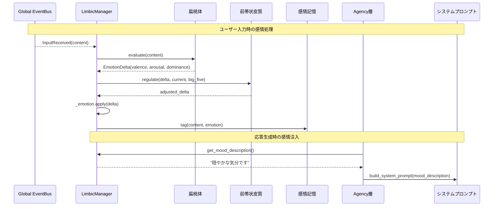
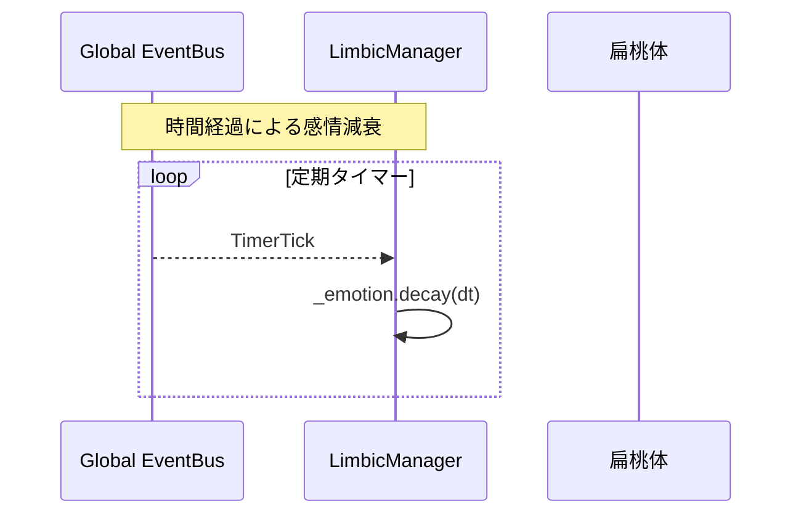

# Iris Limbic 層（大脳辺縁系）

> **注記**: 脳科学・神経科学の用語との対応付けは設計指針であり、厳密な解剖学的正確性を保証するものではありません。

**脳科学対応**: 大脳辺縁系 — 扁桃体・前帯状皮質・島皮質

## 責務

- 入力の感情評価（この入力は喜ばしいか？脅威か？）
- 感情状態の動的維持（PAD 3次元モデルによる表現）
- 感情の自然減衰（時間経過による感情の薄れ）
- 感情制御・葛藤調整（感情をそのまま表出するか抑制するか）
- 記憶への感情タグ付け（感情を伴った記憶の強調・検索）
- 感情状態のテキスト表現生成（システムプロンプトへの注入用）

## 脳部位マッピング

| 部位 | ファイル | 機能 |
|------|----------|------|
| **扁桃体（Amygdala）** | `amygdala.py` | 入力テキストの感情価を評価。ポジティブ/ネガティブ/覚醒度を判定し、EmotionState を更新。扁桃体は恐怖・報酬・社会的刺激の評価の中核。 |
| **前帯状皮質（ACC）** | `acc.py` | 感情制御。扁桃体からの感情シグナルと行動計画（PFC由来）の間の葛藤を検出し、抑制信号を調整。感情の過剰表出を防ぐ。 |
| **島皮質（Insula）** | `manager.py` に統合 | 内部状態の認識。現在の感情状態を言語化し、「今どんな気分か」の説明文を生成。自己認識的な感情表現。 |
| **扁桃体-海馬相互作用** | `emotional_memory.py` | EpisodicStore のエントリに感情タグ（valence, arousal, dominance）を付与。感情強度の高い記憶を検索・強調。 |

## 感情状態モデル

### PAD (Pleasure-Arousal-Dominance) 3次元

| 次元 | 範囲 | 説明 |
|------|------|------|
| **Valence (Pleasure)** | -1.0 ~ 1.0 | 快-不快。ポジティブ/ネガティブの方向。 |
| **Arousal** | 0.0 ~ 1.0 | 覚醒度。興奮/鎮静の強度。 |
| **Dominance** | 0.0 ~ 1.0 | 支配性。制御感/無力感。 |

```python
@dataclass
class EmotionState:
    valence: float      # -1.0 (不快) 〜 1.0 (快)
    arousal: float      # 0.0 (鎮静) 〜 1.0 (興奮)
    dominance: float    # 0.0 (無力) 〜 1.0 (支配)

    # 内部変数（減衰用）
    updated_at: float   # 最終更新時刻
```

### 基本感情へのマッピング

PAD 座標は以下の基本感情に大別できる:

| 感情 | Valence | Arousal | Dominance |
|------|---------|---------|-----------|
| 喜び | +0.8 | +0.6 | +0.5 |
| 悲しみ | -0.7 | -0.4 | -0.3 |
| 怒り | -0.5 | +0.8 | +0.7 |
| 恐れ | -0.6 | +0.7 | -0.6 |
| 驚き | 0.0 | +0.8 | -0.2 |
| 信頼 | +0.7 | -0.1 | +0.4 |
| 期待 | +0.4 | +0.6 | +0.2 |
| 平静 | +0.3 | -0.6 | +0.1 |

### 減衰モデル (Decay)

感情は時間経過とともに中立状態へ自然減衰する。

```
EmotionState(t) = EmotionState(0) · exp(-λ · Δt)
```

- λ (decay factor): 次元ごとに異なる。Arousal は早く減衰、Valence は比較的持続。
- モード別減速率:
  - 通常: λ_valence=0.05, λ_arousal=0.1, λ_dominance=0.03 (per minute)
  - 睡眠中: λ を 1/10 に低減（感情の持続）

## コンポーネント詳細設計

### LimbicManager

```python
class LimbicManager:
    """大脳辺縁系全体の統括。
    EventBus から InputReceived を購読し、感情評価・制御・タグ付けを
    オーケストレーションする。
    """

    # === 購読イベント ===
    # subscribe: InputReceived  → amygdala.evaluate() → 感情更新
    # subscribe: TimerTick      → decay()

    def __init__(self, amygdala: Amygdala, acc: AnteriorCingulateCortex,
                 emotional_memory: EmotionalMemory, event_bus: EventBus):
        ...

    def current_emotion(self) -> EmotionState
        """現在の感情状態を返す（減衰適用済み）。"""

    def build_mood_description(self) -> str
        """島皮質相当: 現在の感情状態から自然言語での気分説明を生成。
        例: 「穏やかな気分です」「少しイライラしています」"""

    def tag_recent_memory(self, conversation: list[dict]) -> None
        """直近の会話エピソードに感情タグを付与。"""

    def on_input_received(self, event: InputReceived) -> None
        """入力受信時の感情評価。"""
        emotion = self.amygdala.evaluate(event.content)
        self._emotion = self.acc.regulate(emotion, self._emotion, self._big_five)
```

### Amygdala

```python
class Amygdala:
    """扁桃体: 入力テキストの感情評価。
    入力の感情価（valence）・覚醒度（arousal）・支配性（dominance）を推定する。
    """

    def evaluate(self, text: str) -> EmotionDelta
        """テキストを分析し、感情変化量を返す。

        実装戦略:
        Phase 1: キーワードベース（高速、軽量）
        Phase 2: LLM アシスト（高精度、遅延許容時）
        """
        # ポジティブ/ネガティブキーワードのマッチング
        # 感嘆符・疑問符・長さなどから覚醒度推定
        # 能動態/受動態から支配性推定

    def _keyword_valence(self, text: str) -> float
        """キーワード辞書による感情価推定。"""
        # ポジティブ語彙: ありがとう、嬉しい、楽しい、素晴らしい ...
        # ネガティブ語彙: 残念、つまらない、ひどい、悲しい ...
```

### AnteriorCingulateCortex

```python
class AnteriorCingulateCortex:
    """前帯状皮質: 感情制御・葛藤調整。
    扁桃体からの感情シグナルと現在の状況の間に葛藤がある場合、
    抑制信号を調整する。Big Five の Neuroticism が高いほど
    感情反応が強調される。
    """

    def regulate(self, delta: EmotionDelta, current: EmotionState,
                 big_five: BigFiveProfile | None) -> EmotionDelta
        """感情変化量を調整する。

        制御則:
        - Neuroticism 高 → ネガティブな delta を増幅
        - Agreeableness 高 → ポジティブな delta を増幅
        - 現在の arousal が high → delta を抑制（過剰反応防止）
        """
```

### EmotionalMemory

```python
class EmotionalMemory:
    """扁桃体-海馬相互作用: 記憶への感情タグ付け。
    EpisodicStore のエントリに感情タグを付与し、
    感情強度に基づく記憶検索・強調を可能にする。
    """

    def tag(self, entry_id: str, emotion: EmotionState) -> None
        """エピソード記憶エントリに感情タグを付与。"""

    def search_by_emotion(self, query_emotion: EmotionState,
                          threshold: float = 0.5) -> list[dict]
        """感情類似度で記憶を検索。
        例: 「悲しかった記憶を思い出して」
        """

    def emotionally_salient(self, entries: list[dict],
                            top_n: int = 3) -> list[dict]
        """感情強度（|valence| * arousal）が高いエントリを優先。
        強い感情を伴った記憶ほど想起されやすい。
        """
```

## イベントフロー





## 既存層との統合

### LimbicManager → Agency（InhibitionController）

`limbic/acc.py` が基底核の抑制制御を感情で変調する:

```python
# agency/execution/inhibition.py 内での利用イメージ
class InhibitionController:
    def evaluate(self, now: float, limbic: LimbicManager | None) -> GateVerdict:
        if limbic:
            emotion = limbic.current_emotion()
            self.apply_limbic_modulation(emotion)
        ...
```

### LimbicManager → Personality（システムプロンプト）

```python
# システムプロンプトに動的に注入される感情説明
# personality_default.md に「## 現在の気分」セクションを追加（予定）
```

### EmotionalMemory → EpisodicStore

EpisodicStore のエントリ形式に `emotion` フィールドを追加:

```json
{
  "summary": "ユーザーが新しい機能を提案した",
  "emotion": {"valence": 0.6, "arousal": 0.5, "dominance": 0.3},
  "timestamp": "2026-05-18T10:00:00"
}
```

### LimbicManager → ProactiveScoring

ProactiveScoring の mood 因子を LimbicManager の感情状態から算出:

```python
# agency/planning/scoring.py 内での利用イメージ
def _compute_mood_score(self, limbic: LimbicManager | None) -> float:
    if not limbic:
        return 1.0
    e = limbic.current_emotion()
    # valence 高 + arousal 高 → 自発的になりやすい
    return max(0.0, (e.valence + 1.0) / 2.0 * e.arousal)
```

## Big Five 性格特性モデル

`iris/memory/personality/big_five.py` で管理（感情処理とは分離）。

```python
@dataclass
class BigFiveProfile:
    openness: float          # 0-100 開放性
    conscientiousness: float # 0-100 誠実性
    extraversion: float      # 0-100 外向性
    agreeableness: float     # 0-100 協調性
    neuroticism: float       # 0-100 神経症的傾向

    evolution_history: list[dict]  # 変更履歴
```

### Personality Evolution (PEM)

```
p_new = λ · p_old + (1-λ) · p_turn
```

- `p_old`: 現在のスコア
- `p_turn`: Reflexion が推定した会話内発現性格
- `λ`: 更新率（0.95 程度、緩やかに変化）

閾値超の変化が発生した場合、「性格変化イベント」として
EpisodicStore に記録し、システムプロンプトに反映する。

## 永続化

| ファイル | 内容 |
|----------|------|
| `.iris/data/emotion_state.json` | 現在の感情状態スナップショット（任意） |
| `.iris/data/big_five.json` | Big Five スコアと進化履歴 |
