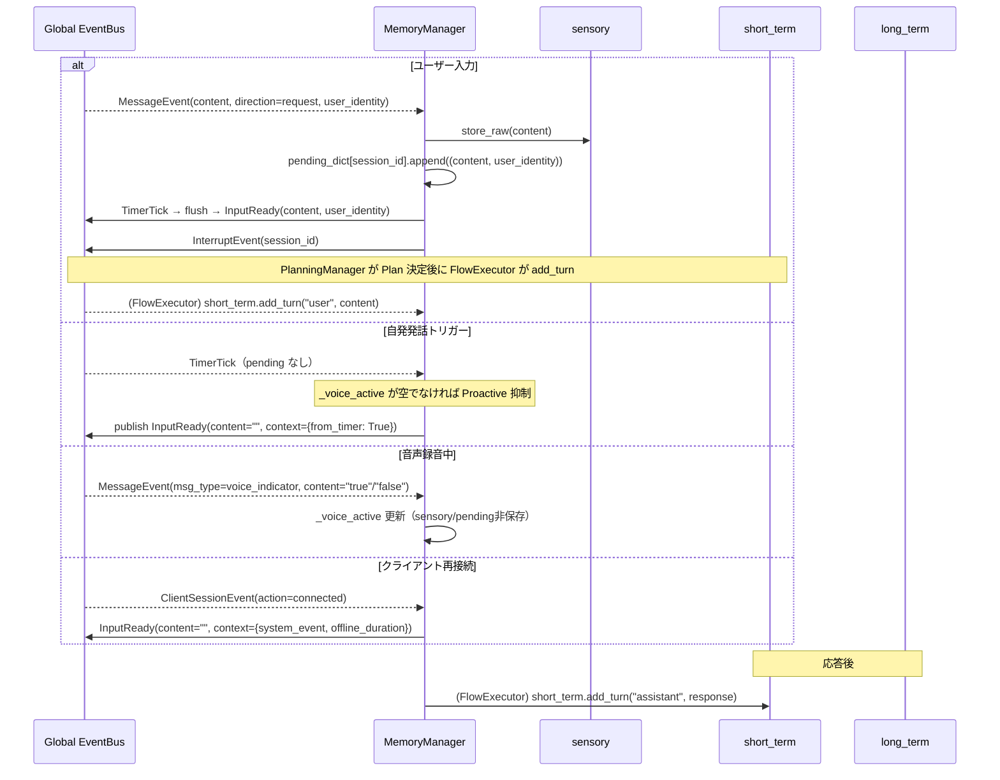

# Iris Memory 層

**脳科学対応**: 感覚野 + 皮質記憶系（3層構造）

## 責務

- 感覚バッファリング（断片的入力の一時保持と統合） — 感覚記憶
- ワーキングメモリ（ターン・話題・エンティティの保持） — 短期記憶
- エピソード記憶の保存と検索（JSONL）
- 意味記憶の保存と検索（ChromaDB + BM25 ハイブリッド）
- 全層からのクエリ受付

## Manager 定義

```python
class MemoryManager:
    """EventBus と接続し、3層の記憶を orchestrate するディスパッチャ。
    公開 I/F は汎用的な store / retrieve / search / clear に統一。
    """

    # === EventBus subscribers ===
    # subscribe: InputReceived → sensory.store_raw() + pending dict
    # subscribe: TimerTick     → pending pop → InputReady / proactive InputReady(from_timer=True)

    # === 公開 I/F（汎用） ===
    def store(self, stream: str, data: Any) -> None
    def retrieve(self, stream: str, **filters) -> list[dict]
    def search(self, query: str, stream: str | None = None, **kwargs) -> list[dict]
    def clear(self, stream: str | None = None) -> None

    # === 後方互換 API ===
    def get_user_preferences(self) -> list[dict]
    def get_recent(self, n: int = 3) -> list[dict]
    def add_episodic(self, content: str, kind: str = "") -> None
    def add_semantic(self, content: str, tags: list[str] | None = None) -> None
    def add_semantic_by_type(self, entry_type: str, content: str, tags: list[str] | None = None) -> None
    def search_semantic(self, query: str, max_results: int = 3) -> list[dict]
```

### MemoryStream 一覧

| stream | 対応機構 | データ例 |
|--------|----------|----------|
| `"sensory"` | SensoryMemoryManager | 断片的入力、生入力のコピー |
| `"short_term"` | ShortTermMemoryManager | ターン（user/assistant）、話題、エンティティ |
| `"episodic"` | LongTermMemoryManager → EpisodicStore | 会話セッション要約 |
| `"semantic"` | LongTermMemoryManager → SemanticStore | 教訓・好み・特性 |

## 3層構造

### sensory/ — 感覚記憶

`sensory/manager.py` + `sensory/readiness.py`（ReadinessEvaluator）

```python
class SensoryMemoryManager:
    """生の入力を処理前に一時保持する。
    2系統: 断片入力（add_fragment / timeout / flush）と確定入力（store_raw）。
    脳科学対応: 感覚野 (sensory cortex)。"""
    def add_fragment(self, content: str, is_final: bool) -> None
    def flush(self) -> None
    def store_raw(self, content: str) -> None          # メインパイプライン用
    def retrieve(self) -> dict[str, str]                # {raw, fragment, raw_timestamp}
    def cancel(self) -> None
    def close(self) -> None
    def set_flush_callback(self, callback) -> None
    def set_readiness_evaluator(self, evaluator) -> None
    @property
    def has_pending_raw(self) -> bool
    @property
    def last_raw_input(self) -> str
```

`store_raw()` は `MemoryManager._on_input_received()` から呼ばれる。確定した入力を保持し、ProactiveScoringの sensory 因子として利用される。

### short_term/ — 短期記憶（ワーキングメモリ）

```python
class ShortTermMemoryManager:
    """現在処理中の会話内容（ターン・話題・参照エンティティ）を保持。
    長期記憶への転送（consolidation）を担う。
    脳科学対応: 前頭前野 (PFC) のワーキングメモリ。"""
    def add_turn(self, role: str, content: str, user_identity: str = "") -> None
    def search(self, query: str, max_results: int = 5) -> list[dict]
    def search_entities(self, entity_name: str) -> list[dict]
    def render_context(self, max_chars: int = 600, query: str | None = None) -> str
    def get_recent_turns(self, n: int = 4) -> list[dict]
    def get_unconsolidated_turns(self) -> list[dict]
    def mark_consolidated(self, up_to_index: int | None = None) -> None
    def should_consolidate(self) -> bool
    def clear(self) -> None
    @property
    def current_topics(self) -> list[str]
    @property
    def turn_count(self) -> int
```

**add_turn のタイミング**:
- `FlowExecutor._on_plan()` Plan決定後、LLM呼出直前に `add_turn("user", content, user_identity)`
- LLM応答受信直後に `add_turn("assistant", response_text, user_identity)`
- `user_identity` は `Plan.user_identity` から伝搬される。グループチャット時は発話者の識別子、それ以外は空文字
- Planning段階では short_term に最新ターンは存在しない（Planの `content` フィールド経由でアクセスする）

**render_context(query=None)**:
- `query` なし: 現在の話題 + 参照エンティティのみ（生ターンは含まない → messagesと重複回避）
- `query` あり: queryに関連するターンを優先表示 + 話題 + エンティティ（PlanningManagerのcontext_hint構築時に利用）

**search**: キーワード重複スコアリングによる関連ターン検索。
**search_entities**: エンティティ名（URL, ファイルパス, `#tag`, `@mention`, 引用, CamelCase）で該当ターン逆引き。

### long_term/ — 長期記憶

```python
class LongTermMemoryManager:
    """エピソード記憶 (EpisodicStore) + 意味記憶 (SemanticStore) を統合管理。
    脳科学対応: 大脳皮質連合野。"""
    def store_episodic(self, data: Any, kind: str = "") -> None
    def get_episodic_recent(self, n: int = 5) -> list[dict]
    def clear_episodic(self) -> None
    def store_semantic(self, data: Any) -> None
    def search_semantic(self, query: str, max_results: int = 3) -> list[dict]
    def clear_semantic(self) -> None
    def search_vector(self, query: str, max_results: int = 3) -> list[dict]
```

### long_term/stores.py — EpisodicStore + SemanticStore + AgentsMdStore

```python
class EpisodicStore:
    """エピソード記憶。JSONL 永続化、上限30エントリ。"""
    def add(self, summary: str, metadata: dict | None = None) -> None
    def get_recent(self, n: int = 5) -> list[dict]
    def clear(self) -> None

class SemanticStore:
    """意味記憶。JSONL 永続化 + ChromaDB + BM25 ハイブリッド検索。
    上限100エントリ。統合スコア = vector * 0.6 + bm25 * 0.4"""
    def add(self, entry: dict) -> None
    def search(self, query: str, max_results: int = 3) -> list[dict]
    def clear(self) -> None
    def sync(self) -> None

class AgentsMdStore:
    """構造記憶。.iris/config/iris_profile.md の読み書き（上限2KB）。"""
    def load(self) -> str
    def update(self, new_content: str) -> None

```

### goal_store.py — 長期目標管理

```python
class LongTermGoal(BaseModel):
    """エージェントの持続的な目標。
    description + weight (0.0~1.0) + タイムスタンプ。decay() で減衰可能。"""

class GoalStore:
    """LongTermGoal をインメモリ管理。永続化は MemoryManager 経由で定期的にダンプ/ロード。
    目標は時間経過で weight が減衰し、閾値未満で忘却される。"""
    def add_goal(self, description: str, weight: float = 1.0) -> str
    def remove_goal(self, goal_id: str) -> bool
    def get_goals(self) -> list[LongTermGoal]
    def get_active_goals(self, threshold: float = 0.3) -> list[LongTermGoal]
    def decay_goals(self, decay_rate: float, remove_threshold: float = 0.1) -> None
    def save(self, filepath: str) -> None
    def load(self, filepath: str) -> None
```

### long_term/vector_store.py — ベクトル検索

```python
class VectorStore:
    """ChromaDB ベースのベクトルストア + BM25 ハイブリッド検索。
    ONNXMiniLM_L6_V2 埋め込み、cosine類似度。
    統合スコア = vector * 0.6 + bm25 * 0.4"""
    def add(self, entry: dict) -> None
    def update(self, entry: dict) -> None
    def delete(self, eid: str) -> None
    def search(self, query: str, max_results: int = 3, min_score: float = 0.2) -> list[dict]
    def clear(self) -> None
    def count(self) -> int
```

SemanticStore が内部で VectorStore を利用する。

## データフロー



## EventBus 購読

| イベント | ハンドラ | 処理 |
|----------|----------|------|
| `MessageEvent` | `_on_message_event` | sensory.store_raw + pending保存（direction=request / event, msg_type=chat / system）。msg_type=voice_indicator は制御信号として別処理（sensory/pending非保存、_voice_active 更新） |
| `TimerTick` | `_on_timer_tick` | pending pop → InputReady + InterruptEvent または proactive InputReady |
| `ClientSessionEvent` | `_on_client_session_event` | 再接続時に escalation InputReady を発行 |

MemoryManager は **Completed イベントを購読しない**。
ContextWindow 圧縮は LLMContextWindowManager（iris/llm/context.py の `LLMContextWindowManager`）が担当する。

### publish するイベント

| イベント | タイミング | フィールド |
|----------|-----------|-----------|
| `InputReady` | 入力確定時 / TimerTick / 再接続時 | content, session_id, user_identity, context |
| `InterruptEvent` | 入力確定時 | session_id |

