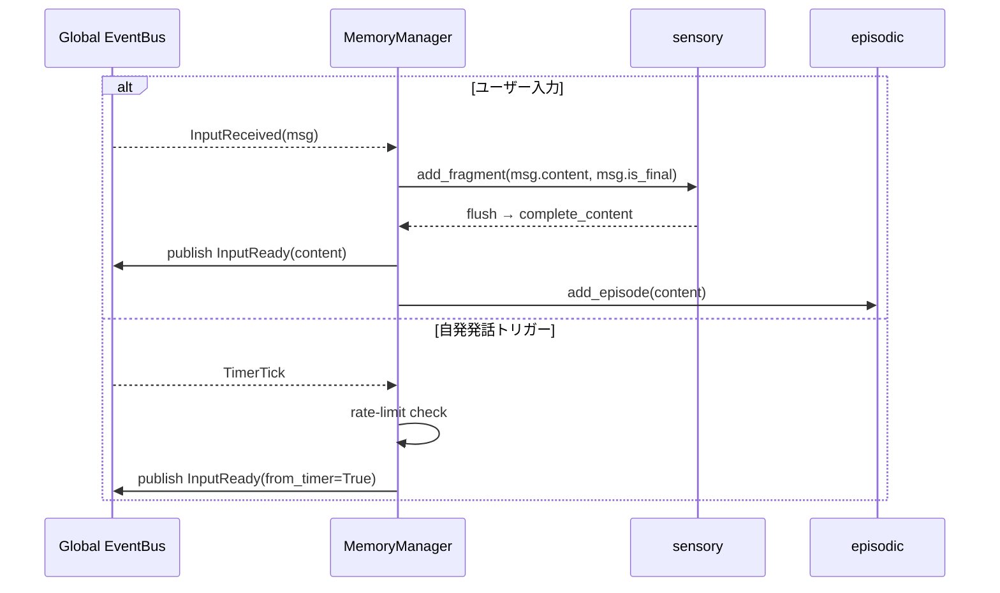

# Iris Memory 層

**脳科学対応**: 感覚野 + 海馬 + 皮質記憶系

## 責務

- 感覚バッファリング（断片的入力の一時保持と統合）
- エピソード記憶の保存と検索
- 意味記憶の保存と検索（ChromaDB + BM25 ハイブリッド）
- **海馬による記憶整理**: エピソード完了後に Reflexion（自己反省）を実行し、意味記憶へ統合
- 全層からのクエリ受付

## Manager 定義

```python
class MemoryManager:
    """EventBus と接続し、記憶 plugin を orchestrate する。
    自ら記憶を持たず、各 plugin に委譲する。
    公開 I/F は汎用的な store / retrieve / search に統一。
    """

    # === EventBus subscribers ===
    # subscribe: InputReceived → sensory.buffer → (on flush) publish InputReady
    # subscribe: TimerTick     → rate-limit check → publish InputReady(from_timer=True)

    # === 公開 I/F（汎用） ===

    def store(self, stream: MemoryStream, data: dict) -> None
        """任意の stream にデータを書き込む。"""
        # stream に応じて対応 plugin に委譲

    def retrieve(self, stream: MemoryStream, **filters) -> list[dict]
        """任意の stream からデータを取得する。"""

    def search(self, query: str, stream: MemoryStream | None = None, **kwargs) -> list[dict]
        """cross-stream 検索。"""

    def search_emotional(self, emotion: dict, max_results: int = 5) -> list[dict]
        """感情状態に近い記憶を PAD 距離×強度でランク付け (Phase 3)。"""

    def get_user_preferences(self) -> list[dict]
        """ユーザーの好み・関心事を意味記憶から検索 (Phase 2)。"""

    def get_recent(self, n: int = 5) -> list[dict]
        """直近 n 件のエピソード記憶を返す。"""

    def get_status(self) -> dict
        """デバッグ用ステータス。"""

    def clear(self, stream: MemoryStream | None = None) -> None
        """stream 指定があればその stream をクリア。"""
```

`MemoryStream` は以下のいずれかのリテラル:

| stream | 対応 plugin | データ例 |
|--------|-------------|----------|
| `"sensory"` | sensory/InputBuffer | 断片的入力フラグメント |
| `"episodic"` | episodic/EpisodicStore | 会話ターン |
| `"semantic"` | semantic/SemanticStore | 教訓・好み・特性 |
| `"vector"` | vector/VectorStore | 埋め込みベクトル |

## Plugin 構成

### sensory/

```python
class InputBuffer:
    """断片的な入力を一時保持し、完全な発話として統合する。
    脳科学での感覚記憶（echoic memory）に相当。
    """
    def add_fragment(self, content: str, is_final: bool) -> None
    def flush(self) -> str           # バッファ内容を結合して返す
    def cancel(self) -> None         # バッファをクリア
    def set_flush_callback(self, cb: Callable) -> None
```

### episodic/

```python
class EpisodicStore:
    """エピソード記憶。JSONL 永続化、上限30エントリ。
    ワーキングメモリ／作業記憶に相当。
    """
    def add(self, summary: str) -> None
    def get_recent(self, n: int = 5) -> list[str]
    def get_all(self) -> list[dict]
    def clear(self) -> None
```

### semantic/

```python
class SemanticStore:
    """意味記憶。JSONL 永続化 + ChromaDB + BM25 ハイブリッド検索。
    長期記憶／意味記憶に相当。
    """
    def add(self, entry: dict) -> None
    def search(self, query: str, max_results: int = 3) -> list[dict]
    def clear(self) -> None
```

### hippocampal/

```python
class Reflexion:
    """海馬による記憶整理。
    完了した会話を分析し、話し方・性格・教訓・好みを抽出 → 意味記憶へ格納。
    quick_reflect は big_five_estimate フィールドを含む dict を返す (Phase 2)。
    """
    def reflect(self, conversation_history: list[dict]) -> dict
    def quick_reflect(self, conversation_slice: list[dict]) -> dict

class HippocampalManager:
    """Reflexion のスケジューリングと結果の永続化。
    ExecutionManager 発話後カウンタに応じて quick_reflect を実行。
    BigFiveProfile.update_from_estimate() を呼び、性格を動的進化させる (Phase 2)。
    """
    def maybe_run(self, messages: list[dict], counter: int) -> int
    def run_session(self, messages: list[dict]) -> None
```

### Big Five 性格プロファイル

`iris/memory/personality/big_five.py` (Phase 2) — 安定した性格特性（Big Five OCEAN 0-100）を管理。

```python
class BigFiveProfile:
    """OCEAN 5因子 + PEM (Personality Evolution Mechanism) による動的進化。
    .iris/data/big_five.json に永続化。
    """
    def get_scores(self) -> dict[str, float]       # OCEAN 各因子スコア
    def update_from_estimate(self, estimate: dict) -> dict | None  # PEM: p_new = λ·p_old + (1-λ)·p_turn
    def get_summary(self) -> str                    # システムプロンプト注入用
```

PEM 式: `p_new = λ · p_old + (1-λ) · p_turn` (λ=0.95)。`HippocampalManager` が Reflexion の `big_five_estimate` 結果を渡す。閾値超の変化は EpisodicStore に記録され、ACC の Neuroticism/Agreeableness/Extraversion 変調に利用される。`LimbicManager` は BigFiveProvider Protocol 経由でスコアを取得し、ACC 変調に使用する。

注意: ContextManager は会話履歴圧縮の工学的ユーティリティとして
`iris/llm/context_window.py` に移動した。脳科学マッピング対象外。

### personality/

**脳科学対応**: 前頭前野・連合野 — 人格は記憶の蓄積から形成される。
`iris/memory/personality/` に配置されている。

```python
class Personality:
    """システムプロンプト構築。記憶層から特性・話し方・ユーザー好みを取得し、
    LLM に注入するシステムプロンプトを組み立てる。
    人格は記憶の一部 — Reflexion が抽出した特性が人格を更新する。
    """
    def build_system_prompt(self, agents_md_content, speech_style, personality_traits,
                            user_preferences, governance_principles, session_roles) -> str

class PersonaData:
    """人格データの動的管理。JSON 永続化。"""

class PersonaProfile:
    """話し方・性格特性のプロファイル。Reflexion の結果を元に更新される。"""
    def get_speech_style(self) -> str
    def get_traits(self) -> str
    def update_from_reflection(self, result: dict) -> None
```

### 感情タグ付け (扁桃体-海馬相互作用)

`iris/limbic/emotional_memory.py` (Phase 3) — EpisodicStore/SemanticStore のエントリに PAD 感情タグを付与。

```python
class EmotionalMemory:
    """感情強度が閾値を超えた入力を EpisodicStore/SemanticStore に自動永続化。
    感情タグ (valence/arousal/dominance/intensity) を metadata として付与。
    """
    def tag(self, content: str, emotion: EmotionState) -> None      # 感情タグ付与 (intensity > 0.15 のみ保存)
    def search_by_emotion(self, target: EmotionState, max_results: int = 5) -> list[dict]
    def get_recent_tags(self, n: int = 3) -> list[dict]
```

`MemoryManager.search_emotional()` は感情タグ付きエントリを強度/類似度でフィルタする。
`LimbicManager` が EventBus の `InputReceived` を購読し、入力評価後に自動タグ付けを行う。

### vector/

```python
class VectorStore:
    """ChromaDB ベースのベクトルストア。
    ONNXMiniLM_L6_V2 埋め込み、cosine類似度。
    SemanticStore から内部利用される。
    """
    def add(self, entry: dict) -> None
    def search(self, query: str, max_results: int = 3) -> list[dict]
    def clear(self) -> None
```

## Event フロー



## MemoryManager が購読する EventBus イベント

| イベント | ハンドラ | 処理 |
|----------|----------|------|
| `InputReceived` | `_on_input_received` | sensory buffer → flush → InputReady |
| `TimerTick` | `_on_timer_tick` | rate-limit check → InputReady(from_timer=True) |

MemoryManager は **Completed イベントを購読しない**。
Reflexion は ExecutionManager が応答後に直接 HippocampalManager.maybe_run() を呼ぶ。
ContextWindow 圧縮は LLMContextWindowManager（iris/llm/context_window.py）が担当する。
