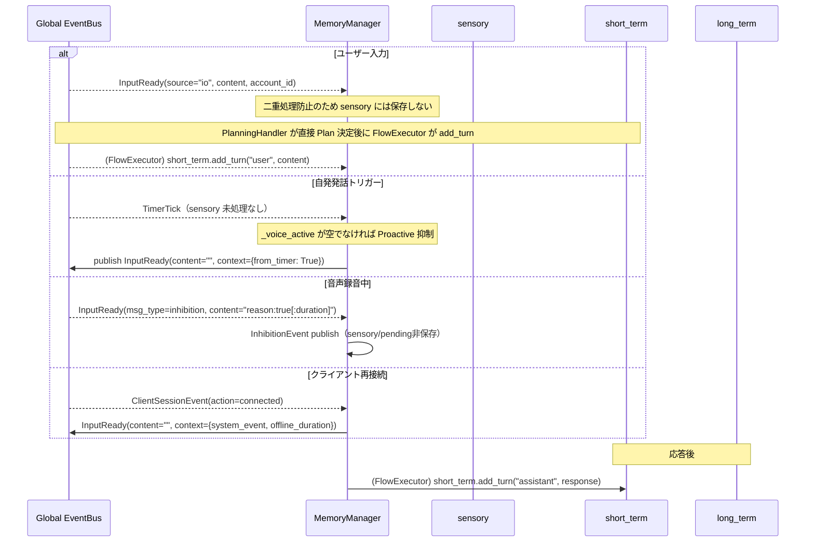
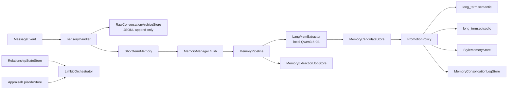

# Iris Memory 層

**脳科学対応**: 感覚野 + 皮質記憶系（3層構造）

## 責務

- 感覚バッファリング（断片的入力の一時保持と統合） — 感覚記憶
- ワーキングメモリ（ターン・話題・エンティティの保持） — 短期記憶
- エピソード記憶の保存と検索（JSONL）
- 意味記憶の保存と検索（ChromaDB + BM25 ハイブリッド）
- 全層からのクエリ受付

## Manager 定義

```python
class MemoryManager:
    """EventBus と接続し、3層の記憶を orchestrate するディスパッチャ。
    公開 I/F は汎用的な store / retrieve / search / clear に統一。
    """

    # === EventBus subscribers ===
    # subscribe: InputReady(source=memory) → sensory.take_raw() からの再送受信
    # subscribe: TimerTick → sensory.take_raw() → InputReady(source=memory) / proactive InputReady(from_timer=True)

    # === 公開 I/F（汎用） ===
    def store(self, stream: str, data: Any) -> None
    def retrieve(self, stream: str, **filters) -> list[dict]
    def search(self, query: str, stream: str | None = None, **kwargs) -> list[dict]
    def clear(self, stream: str | None = None) -> None

    # === 後方互換 API ===
    def get_user_preferences(self) -> list[dict]
    def get_recent(self, n: int = 3) -> list[dict]
    def add_episodic(self, content: str, kind: str = "") -> None
    def add_semantic(self, content: str, tags: list[str] | None = None) -> None
    def add_semantic_by_type(self, entry_type: str, content: str, tags: list[str] | None = None) -> None
    def search_semantic(self, query: str, max_results: int = 3) -> list[dict]
```

### MemoryStream 一覧

| stream | 対応機構 | データ例 |
|--------|----------|----------|
| `"sensory"` | SensoryMemoryManager | 断片的入力、生入力のコピー |
| `"short_term"` | ShortTermMemoryManager | ターン（user/assistant）、話題、エンティティ |
| `"episodic"` | LongTermMemoryManager → EpisodicStore | 会話セッション要約 |
| `"semantic"` | LongTermMemoryManager → SemanticStore | 教訓・好み・特性 |

## 3層構造

### sensory/ — 感覚記憶

`sensory/manager.py` + `sensory/readiness.py`（ReadinessEvaluator）

```python
class SensoryMemoryManager:
    """生の入力を処理前に一時保持する。
    2系統: 断片入力（add_fragment / timeout / flush）と確定入力（store_raw）。
    脳科学対応: 感覚野 (sensory cortex)。"""
    def add_fragment(self, content: str, is_final: bool) -> None
    def flush(self) -> None
    def store_raw(self, content: str) -> None          # メインパイプライン用
    def retrieve(self) -> dict[str, str]                # {raw, fragment, raw_timestamp}
    def cancel(self) -> None
    def close(self) -> None
    def set_flush_callback(self, callback) -> None
    def set_readiness_evaluator(self, evaluator) -> None
    @property
    def has_pending_raw(self) -> bool
```

`store_raw()` は `MemoryManager._on_input_received()` から呼ばれる。確定した入力を保持し、ProactiveScoringの sensory 因子として利用される。
`raw_timestamp` は `store_raw()` 実行時に記録され、`retrieve()` で同じ値を返す。

### short_term/ — 短期記憶（ワーキングメモリ）

```python
class ShortTermMemoryManager:
    """現在処理中の会話内容（ターン・話題・参照エンティティ）を保持。
    長期記憶への転送（consolidation）を担う。
    脳科学対応: 前頭前野 (PFC) のワーキングメモリ。
    内部モデル: ShortTermTurn / ShortTermSearchResult / ShortTermScope / ActiveUser
    （全て @dataclass(slots=True)）"""
    def add_turn(self, role: str, content: str, account_id: str = "") -> None
    def search(self, query: str, max_results: int = 5) -> list[ShortTermSearchResult]
    def search_entities(self, entity_name: str) -> list[ShortTermSearchResult]
    def render_context(self, max_chars: int = 600, query: str | None = None) -> str
    def get_recent_turns(self, n: int = 4) -> list[ShortTermTurn]
    def get_unconsolidated_turns(self) -> list[ShortTermTurn]
    def mark_consolidated(self, up_to_index: int | None = None) -> None
    def should_consolidate(self) -> bool
    def clear(self) -> None
    @property
    def current_topics(self) -> list[str]
    @property
    def turn_count(self) -> int
```

**add_turn のタイミング**:
    - `FlowExecutor._on_plan()` Plan決定後、LLM呼出直前に `add_turn("user", content, account_id)`
- LLM応答受信直後に `add_turn("assistant", response_text, account_id)`
- `account_id` は `Plan.account_id` から伝搬される。グループチャット時は発話者の識別子、それ以外は空文字
- Planning段階では short_term に最新ターンは存在しない（Planの `content` フィールド経由でアクセスする）

**render_context(query=None)**:
- `query` なし: 現在の話題 + 参照エンティティのみ（生ターンは含まない → messagesと重複回避）
- `query` あり: queryに関連するターンを優先表示 + 話題 + エンティティ（PlanningManagerのcontext_hint構築時に利用）

**search**: キーワード重複スコアリングによる関連ターン検索。
**search_entities**: エンティティ名（URL, ファイルパス, `#tag`, `@mention`, 引用, CamelCase）で該当ターン逆引き。

### long_term/ — 長期記憶

```python
class LongTermMemoryManager:
    """エピソード記憶 (EpisodicStore) + 意味記憶 (SemanticStore) を統合管理。
    脳科学対応: 大脳皮質連合野。"""
    def store_episodic(self, data: Any, kind: str = "") -> None
    def get_episodic_recent(self, n: int = 5) -> list[dict]
    def clear_episodic(self) -> None
    def store_semantic(self, data: Any) -> None
    def search_semantic(self, query: str, max_results: int = 3) -> list[dict]
    def clear_semantic(self) -> None
    def search_vector(self, query: str, max_results: int = 3) -> list[dict]
```

### long_term/stores.py — EpisodicStore + SemanticStore + AgentsMdStore

```python
class EpisodicStore:
    """エピソード記憶。JSONL 永続化、上限30エントリ。
    内部モデル: EpisodicEntry (@dataclass(slots=True))"""
    def add(self, summary: str, metadata: dict | None = None) -> EpisodicEntry | None
    def get_recent(self, n: int = 5) -> list[dict]
    def get_recent_entries(self, n: int = 5, room_id: str = "", account_id: str = "") -> list[EpisodicEntry]
    def list_by_scope(self, scope: EpisodicScope) -> list[dict]
    def list_all_entries(self) -> list[EpisodicEntry]
    def clear(self) -> None

class SemanticStore:
    """意味記憶。JSONL 永続化 + ChromaDB + BM25 ハイブリッド検索。
    上限100エントリ。統合スコア = vector * 0.6 + bm25 * 0.4
    内部モデル: SemanticEntry (@dataclass(slots=True))"""
    def add(self, entry: dict) -> SemanticEntry | None
    def search(self, query: str, max_results: int = 3) -> list[dict]
    def search_entries(self, query: str, max_results: int = 3) -> list[SemanticEntry]
    def clear(self) -> None
    def sync(self) -> None

class AgentsMdStore:
    """構造記憶。.iris/config/iris_profile.md の読み書き（上限2KB）。"""
    def load(self) -> str
    def update(self, new_content: str) -> None

```


### long_term/vector_store.py — ベクトル検索

```python
class VectorStore:
    """ChromaDB ベースのベクトルストア + BM25 ハイブリッド検索。
    ONNXMiniLM_L6_V2 埋め込み、cosine類似度。
    統合スコア = vector * 0.6 + bm25 * 0.4"""
    def add(self, entry: dict) -> None
    def update(self, entry: dict) -> None
    def delete(self, eid: str) -> None
    def search(self, query: str, max_results: int = 3, min_score: float = 0.2) -> list[dict]
    def clear(self) -> None
    def count(self) -> int
```

SemanticStore が内部で VectorStore を利用する。

## データフロー


```mermaid
sequenceDiagram
    participant EB as Global EventBus
    participant MGR as MemoryManager
    participant SEN as sensory
    participant STM as short_term
    participant LTM as long_term

    alt ユーザー入力
        EB-->>MGR: InputReady(source="io", content, account_id)
        Note over MGR: 二重処理防止のため sensory には保存しない
        Note over EB,STM: PlanningHandler が直接 Plan 決定後に FlowExecutor が add_turn
        EB-->>MGR: (FlowExecutor) short_term.add_turn("user", content)
    else 自発発話トリガー
        EB-->>MGR: TimerTick（sensory 未処理なし）
        Note over MGR: _voice_active が空でなければ Proactive 抑制
        MGR->>EB: publish InputReady(content="", context={from_timer: True})
    else 音声録音中
        EB-->>MGR: InputReady(msg_type=inhibition, content="reason:true[:duration]")
        MGR->>MGR: InhibitionEvent publish（sensory/pending非保存）
    else クライアント再接続
        EB-->>MGR: ClientSessionEvent(action=connected)
        MGR->>EB: InputReady(content="", context={system_event, offline_duration})
    end

    Note over STM,LTM: 応答後
    MGR->>STM: (FlowExecutor) short_term.add_turn("assistant", response)
```

## EventBus 購読

| イベント | ハンドラ | 処理 |
|----------|----------|------|
| `InputReady` | `_on_input_ready` | source="io" の入力 → 二重処理防止のため sensory には保存しない（PlanningHandler が直接処理） |
| `MessageEvent` | `_on_message_event` | pending保存（direction=request / event, msg_type=chat / system）。msg_type=inhibition は制御信号として別処理 |
| `TimerTick` | `_on_timer_tick` | sensory.take_raw() → 未処理入力があれば InterruptEvent + InputReady(source="memory")。なければ proactive InputReady |
| `ClientSessionEvent` | `_on_client_session_event` | 再接続時に escalation InputReady を発行 |

MemoryManager は **Completed イベントを購読しない**。
ContextWindow 圧縮は LLMContextWindowManager（iris/llm/context.py の `LLMContextWindowManager`）が担当する。

### publish するイベント

| イベント | タイミング | フィールド |
|----------|-----------|------------|
| `InputReady` | 入力確定時 / TimerTick / 再接続時 | content, session_id, account_id, context |
| `InterruptEvent` | 入力確定時 | session_id |

## LangMem ベースの長期記憶抽出 (ローカル LLM)

`iris/memory/langmem/` はローカル LLM (Qwen3.5-9B + Ollama) を使い、LangMem を「候補抽出エンジン」としてのみ用いるパイプライン。**最終的な記憶の確定・保存・関係性更新は必ず Iris 側ロジックが行う。**

### 設計原則

- LangMem は SoT (Source of Truth) ではない。`MemoryCandidateStore` を経由する中間層である。
- ローカル LLM は fallible 前提。スキーマは小さく・enum 中心・confidence と evidence を必須にする。
- 抽出は **flush / idle / background** 経路でのみ起動する。チャット応答ホットパスからは外す。
- チャットフローは抽出失敗で壊れない。失敗は job を `failed` にするだけで例外を伝播しない。
- Persona ファイル (`iris_profile.md`) は **自動変更しない**。変更は `PersonaPatchCandidateStore` に必ず候補として保存し、`PersonaPatchPolicy.apply_approved()` 経由でのみ適用する。

### データフロー


```mermaid
flowchart LR
    ME[MessageEvent] --> ASensory[sensory.handler]
    ASensory --> RAW[RawConversationArchiveStore<br/>JSONL append-only]
    ASensory --> STM[ShortTermMemory]
    STM --> FLUSH[MemoryManager.flush]
    FLUSH --> PIPE[MemoryPipeline]
    PIPE --> LJ[LangMemExtractor<br/>local Qwen3.5-9B]
    LJ --> CAND[MemoryCandidateStore]
    CAND --> PROM[PromotionPolicy]
    PROM --> SEM[long_term.semantic]
    PROM --> EPI[long_term.episodic]
    PROM --> STY[StyleMemoryStore]
    PROM --> LOG[MemoryConsolidationLogStore]
    PIPE --> JOB[MemoryExtractionJobStore]
    REL[RelationshipStateStore] --> LIM[LimbicOrchestrator]
    APP[AppraisalEpisodeStore] --> LIM
```

### パス別スキーマ (small focused passes)

| pass_type | target_store | スキーマ |
|-----------|--------------|---------|
| semantic | semantic | `UserPreferenceMemory` (category / content / evidence / confidence / scope) |
| episodic | episodic | `EpisodicInteractionMemory` (situation / user_intent / assistant_action / result / lesson / confidence) |
| style | style | `StyleMemory` (kind: tone_preference / successful_pattern / running_gag / avoidance_rule / chaos_preference / conversation_strategy) |
| relationship | relationship | `RelationshipMemoryCandidate` (signal / evidence / suggested_delta / confidence) |
| appraisal | appraisal | `AppraisalMemoryCandidate` (dimension / estimated_delta / reason / confidence) |
| persona_patch | persona_patch | `PersonaPatchMemoryCandidate` (target_file / proposed_patch / reason / evidence / confidence) |

### Promotion ルール (PromotionPolicy)

- `confidence >= auto_promote_min_confidence` (default 0.75) のみ昇格
- evidence 必須、content 空・短すぎ・危険ワード (`住所/電話/メール/パスワード/SSN/マイナンバー`) は拒否
- `avoidance` カテゴリは confidence 0.85 必須
- relationship / appraisal の delta は保守的範囲 (例: -0.1〜0.1) にクランプ
- target_store 未実装 (`needs_review`)、job 失敗 (`failed`) は promotion log に書く
- **重複検出**: 同じ `payload_hash` (target_store + 正規化 payload + scope 由来の SHA256) を持つ候補は pending 中は新規追加されない。`PromotionPolicy` も `seen_hashes` で再実行時の重複昇格を防ぐ。
- **persona_patch**: `confidence >= 0.9` を満たす提案は `PersonaPatchCandidateStore` に `pending` として記録され、`PersonaPatchPolicy.apply_approved()` を経由しなければファイルへ反映されない。confidence が低い提案は `low_confidence: True` メタデータを付与した pending として保存される。
- **Handler ディスパッチ**: 旧 `style_hooks` は廃止し、`RelationshipPromotionHandler` / `AppraisalPromotionHandler` / `PersonaPatchPromotionHandler` / `StylePromotionHandler` を `PromotionPolicy` に登録する。各 Handler は target_store 固有の保守的ロジック (クランプ / confidence scale / 負方向係数) を内包する。

### ローカルモデルとの接続

`LLMBridge.get_chat_model_for_role("memory")` が `BaseChatModel` (ChatOllama) を返し、それを `langmem.create_thread_extractor` に直接渡す。クラウド推論は使われない。`config.yaml` で `models[0].roles: [default, memory]` として同じ Qwen3.5-9B を参照する。

### Style memory のプロンプト統合

`Personality.build_system_prompt(style_hints=...)` が `## 動的スタイル記憶` セクションを追加する。`MemoryPipeline` の直後にレンダリングされ、最大 4 件 / 800 文字でプロンプトへ注入される。

### テスト戦略

- すべての抽出器 / ストアはローカル Ollama を必要としない
- `tests.fakes.llm.FakeChatModelForLangMem` + `make_fake_thread_extractor` で LangMem の `Runnable` をスタブ化
- 抽出器→候補→promotion→最終記憶の経路はユニットテストで網羅
- 失敗系 (LLM 例外、ジョブ失敗、空 records、corrupt JSONL) もテストする
- **評価ハーネス** (`tests/memory/langmem/test_extractor_evaluation.py`): explicit preference / 1 度きりジョーク / dislike→avoidance / sensitive 拒否 / relationship delta 上限 / 日本語保持 / 空会話 / 弱い根拠 / persona_patch の高 confidence 経路と低 confidence 経路 / 全パスの target_store 振り分けをスナップショット化。
- **Scheduler** (`tests/memory/langmem/test_scheduler.py`): イベントループ未起動時の fallback / 同一 scope の重複抑制 / 別 scope の並列実行 / メインループをブロックしない / 例外捕捉 / 統計 / 完了後の再スケジュール / 実 `MemoryPipeline` との統合。
- **Handlers** (`tests/memory/langmem/test_handlers.py`): RelationshipPromotionHandler の正方向 / 負方向 / 単候補上限 / confidence < 0.6 skip / familiarity field / PromotionPolicy 経由のルーティング、AppraisalPromotionHandler の episode 記録 / 極端 delta のクランプ / source_record_ids 永続化。
- **Dedup** (`tests/memory/langmem/test_dedup.py` + `test_dedup_store.py`): `compute_payload_signature` のキー順非依存 / trim 吸収 / volatile 無視、`compute_candidate_hash` の target_store / account_id / room_id 差分検出、`MemoryCandidateStore` の pending 重複抑制・スコープ別共存。
- **Style Index** (`tests/memory/procedural/test_style.py`): `StyleMemoryIndex` Protocol 互換性、`MetadataFilterStyleIndex` の挙動、`StyleMemoryStore.search()` のインデックス有無での挙動切替。

### 非同期スケジューラ (MemoryPipelineScheduler)

`MemoryManager.flush()` の中で ``run_full_cycle()`` を呼ぶと、LangMem は LLM 推論を 6〜8 件並列で走らせるため同期パスで 1 秒以上ブロックしてしまう。これを避けるため ``MemoryPipelineScheduler`` (``iris/memory/langmem/scheduler.py``) を導入した。

- ``schedule_full_cycle(account_id, room_id)`` を呼ぶと、同一 (account_id, room_id) で重複スケジュールを抑止しつつ asyncio task として ``asyncio.to_thread`` でバックグラウンド実行される。
- 実行中イベントループが無い (Flask 経由や CLI からの同期呼び出し) 場合は None が返り、MemoryManager は同期 ``run_full_cycle()`` にフォールバックする。
- 失敗してもメイン会話フローを止めない (stats に記録)。
- ``SchedulerStats`` で ``total_scheduled / total_deduplicated / total_failed / last_error`` を確認できる。

### Style Memory インデックス抽象

``StyleMemoryStore.search()`` は ``StyleMemoryIndex`` Protocol を介して実装を差し替え可能。デフォルト実装 ``MetadataFilterStyleIndex`` は現在のメタデータフィルタと同じ挙動 (全件スキャン O(N))。ベクトル検索が必要になった場合は別実装を ``StyleMemoryStore.set_index()`` で注入できる。

### 設定 (config.yaml)

```yaml
memory:
  langmem:
    enabled: false       # デフォルト無効。明示で有効化する
    model_role: memory
    batch_min_turns: 6
    batch_max_chars: 8000
    temperature: 0.1
    max_tokens: 1024
    enable_updates: false
    enable_deletes: false
    auto_promote_min_confidence: 0.75
    max_retry_count: 2
    style_max_in_prompt: 4
```

### データ種類の区別 (重要)

| 種類 | 場所 | 用途 |
|------|------|------|
| Raw Archive | `iris/memory/archive/` (JSONL) | 永続ログ・再抽出・障害解析用。意味記憶ではない |
| Memory Candidate | `iris/memory/langmem/stores.py` (JSONL) | LangMem 出力の**中間**。最終記憶ではない |
| Semantic / Episodic | `iris/memory/long_term/stores.py` (JSONL+Chroma) | 昇格後の意味・エピソード記憶 |
| Relationship Snapshot | `iris/limbic/stores/relationship_store.py` | Limbic 計算結果の永続化。LangMem は触らない |
| Appraisal Episode | `iris/limbic/stores/appraisal_store.py` | limbic 1 ターン履歴。LangMem は触らない |
| Style Memory | `iris/memory/procedural/` | 応答スタイルを継続最適化。プロンプトに注入 |
| Persona Patch | `iris/memory/procedural/persona_patch_store.py` | persona ファイルへの変更案。**自動適用禁止** |
