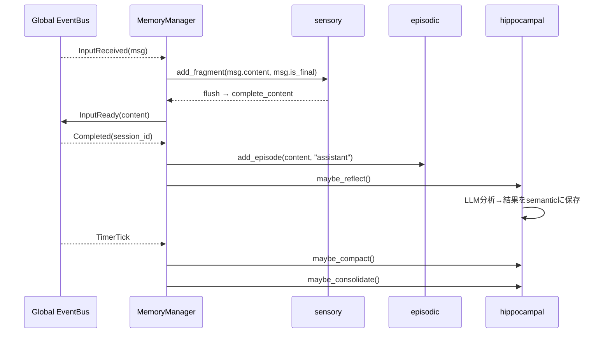

# Iris v2 Memory 層

**脳科学対応**: 感覚野 + 海馬 + 皮質記憶系

## 責務

- 感覚バッファリング（断片的入力の一時保持と統合）
- エピソード記憶の保存と検索
- 意味記憶の保存と検索（ChromaDB + BM25 ハイブリッド）
- **海馬による記憶整理**: エピソード完了後に Reflexion（自己反省）を実行し、意味記憶へ統合
- **海馬による圧縮**: 会話履歴のトークン数超過時の自動要約（ContextManager）
- 全層からのクエリ受付

## Manager 定義

```python
class MemoryManager:
    """EventBus と接続し、記憶 plugin を orchestrate する。
    自ら記憶を持たず、各 plugin に委譲する。
    公開 I/F は汎用的な store / retrieve / search に統一し、
    個別用途は plugin 内部の責務とする。
    """

    # === EventBus subscribers ===
    # subscribe: InputReceived → sensory.buffer → (on flush) publish InputReady
    # subscribe: Completed      → episodic.store → hippocampal.maybe_reflect()
    # subscribe: TimerTick      → hippocampal.maybe_compact()
    #                          → hippocampal.maybe_consolidate()

    # === 公開 I/F（汎用） ===

    def store(self, stream: MemoryStream, data: dict) -> None
        """任意の stream にデータを書き込む。
        stream は plugin 名でルーティングされる。
        例: "episodic", "semantic", "sensory"
        """
        # stream に応じて対応 plugin に委譲

    def retrieve(self, stream: MemoryStream, **filters) -> list[dict]
        """任意の stream からデータを取得する。
        filters は plugin ごとに解釈が異なる。
        例: retrieve("episodic", n=5) → 直近5件
            retrieve("sensory")        → 現在のバッファ内容
        """

    def search(self, query: str, stream: MemoryStream | None = None, **kwargs) -> list[dict]
        """cross-stream 検索。
        stream 指定がない場合は全 stream から検索する。
        例: search("ユーザーの好み") → semantic + episodic から検索
            search("好み", stream="semantic", max_results=3)
        """

    def clear(self, stream: MemoryStream | None = None) -> None
        """stream 指定があればその stream をクリア。
        指定がなければ全 memory をクリア。
        """

    # 用途に応じて随時メソッド追加可能。
    # ただし検索性が下がらないよう、追加は各 plugin の責務が
    # Manager I/F に漏れ出したタイミングに限定する。
```

`MemoryStream` は以下のいずれかのリテラル:

| stream | 対応 plugin | データ例 |
|--------|-------------|----------|
| `"sensory"` | sensory/InputBuffer | 断片的入力フラグメント |
| `"episodic"` | episodic/EpisodicStore | 会話ターン |
| `"semantic"` | semantic/SemanticStore | 教訓・好み・特性 |
| `"vector"` | vector/VectorStore | 埋め込みベクトル |

## Plugin 構成

### sensory/

```python
class InputBuffer:
    """断片的な入力を一時保持し、完全な発話として統合する。
    脳科学での感覚記憶（echoic memory）に相当。
    """
    def add_fragment(self, content: str, is_final: bool) -> None
    def flush(self) -> str           # バッファ内容を結合して返す
    def cancel(self) -> None         # バッファをクリア
    def set_flush_callback(self, cb: Callable) -> None
```

### episodic/

```python
class EpisodicStore:
    """エピソード記憶。JSONL 永続化、上限30エントリ。
    ワーキングメモリ／作業記憶に相当。
    """
    def add(self, summary: str) -> None
    def get_recent(self, n: int = 5) -> list[str]
    def get_all(self) -> list[dict]
    def clear(self) -> None
```

### semantic/

```python
class SemanticStore:
    """意味記憶。JSONL 永続化 + ChromaDB + BM25 ハイブリッド検索。
    長期記憶／意味記憶に相当。
    """
    def add(self, entry: dict) -> None
    def search(self, query: str, max_results: int = 3) -> list[dict]
    def clear(self) -> None
```

### hippocampal/

```python
class Reflexion:
    """海馬による記憶整理。
    完了した会話を分析し、教訓・好み・改善点を抽出 → 意味記憶へ格納。
    """
    def reflect(self, conversation_history: list[dict]) -> dict
    def quick_reflect(self, conversation_slice: list[dict]) -> dict

class ReflexionManager:
    """Reflexion のスケジューリングと結果の永続化。
    TimerTick / Completed をトリガーに、適切なタイミングで reflexion を実行する。
    """
    def maybe_run(self, messages: list[dict], counter: int) -> int
    def run_session(self, messages: list[dict]) -> None

class ContextManager:
    """会話履歴のトークン数超過時の自動要約（海馬の圧縮機能）。
    会話が context_window を超えた場合、古い部分を要約 ## Session Summary として保持。
    """
    def check_and_summarize(self, messages: list[dict], context_window: int) -> None
    def force_summarize(self, messages: list[dict]) -> None
    def build_compact_messages(self, messages: list[dict]) -> list[dict]
    def clear(self) -> None
```

### vector/

```python
class VectorStore:
    """ChromaDB ベースのベクトルストア。
    ONNXMiniLM_L6_V2 埋め込み、cosine類似度。
    SemanticStore から内部利用される。
    """
    def add(self, entry: dict) -> None
    def search(self, query: str, max_results: int = 3) -> list[dict]
    def clear(self) -> None
```

## Event フロー



## MemoryManager が購読する EventBus イベント

| イベント | ハンドラ | 処理 |
|----------|----------|------|
| `InputReceived` | `_on_input_received` | sensory buffer → flush → InputReady |
| `Completed` | `_on_completed` | episodic store → hippocampal maybe_reflect |
| `TimerTick` | `_on_timer` | hippocampal maybe_compact / maybe_consolidate |
